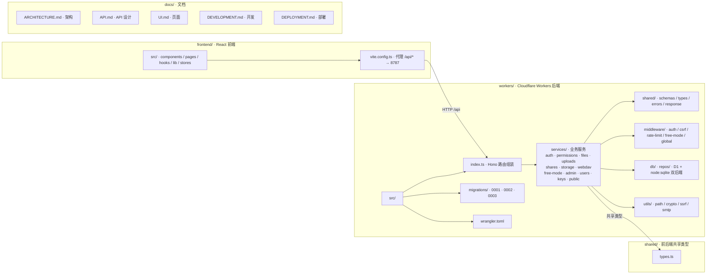

# Picumet — Agent Working Agreement

> 本文件面向在本仓库内执行任务的自动化代理/协作者：提供项目上下文、目录导航、以及"必须通过"的质量门槛与安全约束。
>
> 约定：子目录允许放置自己的 `AGENTS.md` 覆盖/补充本文件（就近优先）。

## Project Overview（项目概述）

**Picumet** 是一个多云对象存储管理平台，提供统一的文件管理界面和细粒度权限控制。支持 Cloudflare R2（Phase 1）、AWS S3 和 Oracle Cloud（Phase 3）。

- **Frontend**：React + Vite + TypeScript + shadcn-ui（位于 `frontend/`）
- **Backend**：Cloudflare Workers + Hono 框架（位于 `workers/`）
- **Database**：Cloudflare D1（SQLite）
- **Storage**：Cloudflare R2（主要）、AWS S3、Oracle Cloud（后续）
- **Run mode**：前后端分离；前端开发服务器通过 Vite 代理转发 `/api/*` 到 Workers

## Architecture / Project Map（架构/文件结构）



> 项目入口：[README](README_CN.md)、[系统架构](docs/ARCHITECTURE_CN.md)、[API](docs/API_CN.md)、[页面](docs/UI_CN.md)、[开发](docs/DEVELOPMENT_CN.md)、[部署](docs/DEPLOYMENT_CN.md)、[进度](docs/PROGRESS.md)。
>
> **强制规则**：执行任何代码、迁移、测试、发布或文档变更前，必须阅读并遵守本工作协议。质量门槛、安全约束、性能基线、迁移治理和提交规范均属于本工作协议的一部分。

---

## Architecture Principles（架构原则）

**按业务领域拆分，而非技术层次**（完整设计见 [docs/ARCHITECTURE_CN.md](docs/ARCHITECTURE_CN.md)）。

- 后端业务代码按领域组织在 `workers/src/services/<domain>/`，每个服务自包含：`handlers.ts`（业务逻辑/路由）、`schemas.ts`（Zod 校验）、`types.ts`（类型）、`<domain>.ts`（领域逻辑）、`README.md`（服务文档）。
- `workers/src/index.ts` 只做路由与中间件装配，不承载业务。
- 跨领域基础设施是薄层，不承载业务：`middleware/`（auth/csrf/rate-limit/global）、`db/repos/`（数据访问）、`utils/`（path/crypto/ssrf/smtp）、`shared/`（公共契约）。
- 依赖规则：所有服务依赖 **Permissions Service**（权限判定）与 **Storage Service**（存储抽象）；**Auth Service** 独立；避免循环依赖。
- 前端同样按业务域组织：`pages/` 每路由一页，页面内子功能内聚到 `components/files/`（预览/属性/上传/文件图标）与 `components/layout/`；`components/ui/` 仅放可复用 UI 原语，`lib/`、`stores/` 为共享层。页面不得按交互流程堆成技术性单体（如把导航/选择/批量/上传/预览/属性逻辑全塞进一个页面组件）。
- 新增功能：先判定归属业务域 → 在该域内扩展；禁止新建跨域散落的 `routes/`、`providers/`、`handlers.ts` 等按技术层次堆叠的目录。

---

## Technology Stack（技术栈）

### Frontend

| 技术 | 版本要求 | 用途 |
|------|---------|------|
| React | 18.x | UI 框架 |
| TypeScript | 5.x | 类型安全 |
| Vite | 5.x | 构建工具 |
| shadcn-ui | latest | UI 组件库（基于 Radix UI + Tailwind CSS）|
| Tailwind CSS | 3.x | 样式框架 |
| React Router | 6.x | 路由管理 |
| Zustand / React Context | - | 状态管理 |
| React Query | 5.x | 数据获取与缓存 |

### Backend

| 技术 | 版本要求 | 用途 |
|------|---------|------|
| Cloudflare Workers | - | Serverless 运行时 |
| Hono | 4.x | Web 框架 |
| TypeScript | 5.x | 类型安全 |
| jose | latest | JWT 生成与验证 |
| bcryptjs | latest | 密码哈希 |
| @aws-sdk/client-s3 | 3.x | S3 兼容 API（R2/S3/Oracle） |
| zod | 3.x | 请求验证 |

### Database & Storage

| 技术 | 用途 |
|------|------|
| Cloudflare D1 | SQLite 数据库（元数据存储）|
| Cloudflare KV | 速率限制、会话缓存 |
| Cloudflare R2 | 主要对象存储（Phase 1）|
| AWS S3 | 对象存储（Phase 3）|
| Oracle Cloud Storage | 对象存储（Phase 3）|

### DevOps

| 技术 | 用途 |
|------|------|
| Wrangler CLI | Cloudflare 本地开发与部署 |
| GitHub Actions | CI/CD 自动部署 |
| Cloudflare Pages | 前端静态托管 |

---

## Development Guidelines（开发规范）

### Code Quality（代码质量）

**TypeScript 严格模式**：
- 所有代码必须启用 TypeScript strict mode
- 禁止使用 `any` 类型（除非有明确注释说明原因）
- 必须为所有函数提供明确的返回类型

**命名规范**：
- 文件名：kebab-case（`user-service.ts`）
- 组件名：PascalCase（`FileExplorer.tsx`）
- 函数/变量：camelCase（`checkPermission`）
- 常量：UPPER_SNAKE_CASE（`MAX_FILE_SIZE`）
- 类型/接口：PascalCase（`FileMetadata`）

**导入顺序**：
```typescript
// 1. Node/外部库
import { Hono } from 'hono';
import { z } from 'zod';

// 2. Cloudflare 绑定
import type { Env } from './types';

// 3. 项目内部
import { checkPermission } from './services/permission';
import { FileService } from './services/file-service';

// 4. 类型导入
import type { Principal } from '../shared/types';
```

### Testing Requirements（测试要求）

**必须测试的模块**：
1. **权限判定算法**（`checkPermission`）
   - 覆盖所有真值表场景
   - 测试路径段边界（`/users/alice` vs `/users/alice2`）
   - 测试规则排序优先级

2. **文件操作状态机**
   - 上传流程（单文件、分片）
   - 移动/重命名流程（Saga 模式）
   - 删除流程（硬删除 + 异步清理）

3. **配额管理**
   - 原子性更新测试
   - 配额超限拒绝测试

4. **安全功能**
   - XSS/CSRF 防护
   - 速率限制
   - JWT 验证

**测试工具**：
- Vitest（单元测试）
- Miniflare（Workers 本地测试环境）
- Playwright（E2E 测试，可选）

**测试覆盖率目标**：
- 核心业务逻辑：>80%
- 工具函数：>90%
- UI 组件：>60%（关键交互必测）

### Security Constraints（安全约束）

**认证与授权**：
- JWT 存储在 HttpOnly Cookie，禁止存储在 localStorage
- 所有 API 路由默认需要认证（除 `/auth/*` 和公开路由）
- 管理员操作必须通过 `adminMiddleware` 验证

**输入验证**：
- 所有用户输入必须通过 Zod schema 验证
- 文件路径必须规范化（防止路径遍历）
- 文件名禁止包含：`/`, `\`, `..`, `<`, `>`, `|`, `:`, `"`, `?`, `*`

**CORS 配置**：
```typescript
// 仅允许前端域名
cors({
  origin: ['https://yourdomain.com', 'http://localhost:5173'],
  credentials: true,
  allowMethods: ['GET', 'POST', 'PATCH', 'DELETE'],
  allowHeaders: ['Content-Type'],
})
```

**速率限制**：
- 登录/注册：5 次/分钟/IP
- 上传：10 次/分钟/用户
- API 通用：100 次/分钟/用户

**XSS 防护**：
- CSP Header（Content-Security-Policy）
- DOMPurify 清理用户生成内容
- 禁止 `dangerouslySetInnerHTML`（除非有明确安全审查）

**CSRF 防护**：
- Cookie 设置 `SameSite=Lax`
- 敏感操作需要二次确认

### Performance Baselines（性能基线）

**API 响应时间**：
- 文件列表：<200ms（P50）、<500ms（P95）
- 文件上传初始化：<100ms
- 权限检查：<50ms
- 下载代理：<100ms（不含对象存储传输）

**前端性能**：
- 首次内容绘制（FCP）：<1.5s
- 最大内容绘制（LCP）：<2.5s
- 累计布局偏移（CLS）：<0.1
- 交互时间（TTI）：<3.5s

**数据库查询**：
- 单表查询：<10ms
- 关联查询：<50ms
- 带索引查询必须使用 EXPLAIN QUERY PLAN 验证

### Migration Governance（迁移治理）

**数据库迁移规则**：
1. 迁移文件命名：`NNNN_description.sql`（例如：`0001_initial.sql`）
2. 每个迁移必须包含：
   - 升级脚本（CREATE/ALTER）
   - 降级脚本（DROP/ROLLBACK，注释形式）
3. 禁止在迁移中直接删除数据（必须先标记废弃）
4. 添加索引必须包含性能测试结果

**迁移执行流程**：
```bash
# 本地测试
wrangler d1 execute picumet-db --local --file=migrations/0002_add_index.sql

# 预发布环境
wrangler d1 execute picumet-db --file=migrations/0002_add_index.sql

# 生产环境（需要人工审核）
wrangler d1 execute picumet-db --file=migrations/0002_add_index.sql --remote
```

### Commit Convention（提交规范）

**格式**：`<type>(<scope>): <subject>`

**类型（type）**：
- `feat`: 新功能
- `fix`: Bug 修复
- `docs`: 文档变更
- `style`: 代码格式（不影响逻辑）
- `refactor`: 重构
- `perf`: 性能优化
- `test`: 测试相关
- `chore`: 构建/工具配置

**作用域（scope）**：
- `auth`: 认证系统
- `permission`: 权限系统
- `storage`: 存储提供商
- `upload`: 上传流程
- `download`: 下载流程
- `ui`: 前端 UI
- `api`: 后端 API
- `db`: 数据库

**约定式英文提交信息（Conventional Commits）**：
- **必须使用多个 `-m` 编写详细提交说明**
- 说明内容使用**无序列表**逐条描述变更点、影响范围与验证结果
- **禁止掺入其他格式内容**（如段落文本、有序列表、代码块等）

**示例**：
```bash
git commit \
  -m "feat(upload): add multipart upload support for large files" \
  -m "- Implement chunked upload with resumable sessions in upload-service.ts" \
  -m "- Add upload_sessions table migration (0003_add_upload_sessions.sql)" \
  -m "- Update frontend UploadModal to show chunk progress" \
  -m "- Verify with npm run test and manual 500MB file upload"

git commit \
  -m "fix(permission): correct path boundary check for /users/alice vs /users/alice2" \
  -m "- Replace startsWith with path segment boundary check in isPathWithinBoundary" \
  -m "- Add test cases for adjacent path collision prevention" \
  -m "- Update permission.test.ts with 8 new boundary test scenarios" \
  -m "- Verify with npm run test (permission suite passes 15/15)"

git commit \
  -m "docs(readme): update deployment instructions for Cloudflare Pages" \
  -m "- Add wrangler.toml configuration examples" \
  -m "- Document GitHub Actions deployment workflow" \
  -m "- Update environment variables section with D1/R2 bindings"
```

---

## Quality Gates（质量门槛）

### 代码合并前检查清单

**功能完整性**：
- [ ] 功能按照 [docs/ARCHITECTURE_CN.md](docs/ARCHITECTURE_CN.md) 与 [docs/PROGRESS.md](docs/PROGRESS.md) 记录的范围实现
- [ ] 需求在 [docs/PROGRESS.md](docs/PROGRESS.md) 中标记为 Done 或 In progress
- [ ] 所有边界情况已处理（空路径、特殊字符、超大文件等）

**代码质量**：
- [ ] TypeScript 无编译错误（`tsc --noEmit`）
- [ ] ESLint 无警告（`npm run lint`）
- [ ] 代码通过 Prettier 格式化
- [ ] 无 `console.log` 调试语句（除非有明确注释）

**测试覆盖**：
- [ ] 单元测试通过（`npm run test`）
- [ ] 关键路径有集成测试
- [ ] 权限相关变更必须有权限测试

**安全检查**：
- [ ] 无硬编码密钥/密码
- [ ] 用户输入已验证
- [ ] 权限检查已实施
- [ ] SQL 查询使用参数化（防止注入）

**性能验证**：
- [ ] 数据库查询使用索引（用 EXPLAIN 验证）
- [ ] 大文件上传使用分片
- [ ] API 响应时间符合基线

**文档更新**：
- [ ] README 已更新（如有 API 变更）
- [ ] docs/ 已同步（如有架构变更）
- [ ] 代码注释清晰（复杂逻辑必须注释）

---

## Development Workflow（开发工作流）

### Local Development（本地开发）

**环境准备**：
```bash
# 1. 安装依赖
cd frontend && npm install
cd ../workers && npm install

# 2. 配置环境变量
cp workers/.dev.vars.example workers/.dev.vars
# 编辑 .dev.vars 填写 R2 凭据

# 3. 初始化数据库
cd workers
wrangler d1 execute picumet-db --local --file=migrations/0001_initial.sql
```

**启动开发服务器**：
```bash
# Terminal 1: Workers API（端口 8787）
cd workers
npm run dev  # wrangler dev

# Terminal 2: 前端（端口 5173，代理 /api/* 到 8787）
cd frontend
npm run dev  # vite
```

**访问地址**：
- 前端：http://localhost:5173
- API：http://localhost:8787
- D1 Console：`wrangler d1 execute picumet-db --local --command "SELECT * FROM users"`

### Testing Workflow（测试工作流）

**运行测试**：
```bash
# 前端测试
cd frontend && npm run test

# Workers 测试
cd workers && npm run test

# E2E 测试（可选）
npm run test:e2e
```

**权限测试示例**：
```typescript
// workers/tests/permission.test.ts
import { describe, it, expect } from 'vitest';
import { checkPermission } from '../src/services/permission';

describe('Permission System', () => {
  it('should deny /users/alice access to /users/alice2', () => {
    const principal = { role: 'user', id: 'alice', defaultPath: '/users/alice' };
    const mount = { mountPath: '/', id: 'default' };
    
    const result = checkPermission(
      principal,
      mount,
      '/users/alice2/file.txt',
      'read'
    );
    
    expect(result).toBe('deny');
  });
  
  it('should allow admin to access any path', () => {
    const principal = { role: 'admin', id: 'admin-1' };
    const mount = { mountPath: '/', id: 'default' };
    
    const result = checkPermission(
      principal,
      mount,
      '/users/alice/private.txt',
      'delete'
    );
    
    expect(result).toBe('allow');
  });
});
```

### Deployment Workflow（部署工作流）

**部署到 Cloudflare**：
```bash
# 1. 构建前端
cd frontend
npm run build
# 输出: dist/

# 2. 部署 Workers
cd workers
wrangler deploy
# 输出: Worker URL

# 3. 部署前端到 Pages
# 通过 GitHub Actions 自动触发
# 或手动: wrangler pages deploy frontend/dist
```

**GitHub Actions 自动部署**：
- Push 到 `main` 分支触发部署
- 部署前自动运行测试和类型检查
- 失败时自动回滚

---

## Common Pitfalls（常见坑点）

### 权限系统

❌ **错误**：使用 `startsWith` 判断路径
```typescript
// 这会导致 /users/alice 可以访问 /users/alice2
if (path.startsWith(boundary)) return true;
```

✅ **正确**：使用路径段判断
```typescript
function isPathWithinBoundary(path: string, boundary: string): boolean {
  if (boundary === '/') return true;
  if (path === boundary) return true;
  return path.startsWith(boundary + '/'); // 确保路径段边界
}
```

### 文件删除

❌ **错误**：先删除对象存储，再删除元数据
```typescript
// 如果删除元数据失败，对象已丢失但元数据仍存在
await provider.deleteObject(objectKey);
await db.deleteFile(fileId);
```

✅ **正确**：先删除元数据，再异步清理对象
```typescript
// 元数据删除失败则事务回滚，对象保留
await db.transaction(async (tx) => {
  await tx.deleteFile(fileId);
  await tx.updateQuota(ownerId, -size);
});
// 对象删除失败不影响用户操作，后台对账清理
await enqueueObjectDeletion(objectKey);
```

### 配额更新

❌ **错误**：非原子性更新
```typescript
const quota = await db.getQuota(userId);
await db.updateQuota(userId, quota.used + fileSize);
```

✅ **正确**：使用数据库原子操作
```typescript
await db.query(`
  UPDATE user_quotas 
  SET used_storage = used_storage + ?
  WHERE user_id = ?
`, [fileSize, userId]);
```

### 路径规范化

❌ **错误**：未规范化路径
```typescript
// /users/../admin/secrets 可以绕过权限检查
const path = req.query.path;
```

✅ **正确**：始终规范化路径
```typescript
function normalizePath(path: string): string {
  return '/' + path.split('/').filter(Boolean).join('/');
}
const canonicalPath = normalizePath(req.query.path);
```

---

## Emergency Procedures（应急预案）

### 数据库迁移失败

1. **立即停止部署**：取消 GitHub Actions 工作流
2. **回滚迁移**：
   ```bash
   wrangler d1 execute picumet-db --file=migrations/NNNN_rollback.sql
   ```
3. **验证数据完整性**：检查关键表记录数
4. **修复迁移脚本后重新部署**

### 配额异常（负数或超限未拒绝）

1. **临时禁用上传**：在 `system_settings` 中设置维护模式
2. **运行配额对账脚本**：
   ```sql
   UPDATE user_quotas SET
     used_storage = (
       SELECT COALESCE(SUM(size), 0)
       FROM file_metadata
       WHERE owner_id = user_quotas.user_id
     ),
     used_files = (
       SELECT COUNT(*)
       FROM file_metadata
       WHERE owner_id = user_quotas.user_id
     );
   ```
3. **审查并发更新代码**

### 权限绕过漏洞

1. **立即热修复**：部署修复后的 `checkPermission` 函数
2. **审计访问日志**：
   ```sql
   SELECT * FROM access_logs
   WHERE action = 'read'
     AND created_at > ?
   ORDER BY created_at DESC;
   ```
3. **通知受影响用户**（如有数据泄露）

---

## Contact & Resources（联系与资源）

**文档**：
- [README（英文）](../README.md) / [README（中文）](../README_CN.md)
- [系统架构（中文）](docs/ARCHITECTURE_CN.md) — 服务化架构、服务明细、数据模型、安全设计
- [API 参考（中文）](docs/API_CN.md) — 认证方式、统一响应、全部端点
- [前端指南（中文）](docs/UI_CN.md) — 页面路由、布局、交互、响应式
- [开发指南（中文）](docs/DEVELOPMENT_CN.md) — 本地开发、测试、代码规范、常见坑点
- [部署指南（中文）](docs/DEPLOYMENT_CN.md) — Cloudflare 部署、CI、Secrets、成本
- [实施进度](docs/PROGRESS.md) — 需求范围、进度、审计闭环
- [Cloudflare Workers 文档](https://developers.cloudflare.com/workers/)
- [Hono 框架文档](https://hono.dev/)

**关键设计决策**：
- 为什么不使用回收站？避免软删除导致的数据不一致
- 为什么先删元数据？确保用户操作原子性，对象清理可后台重试
- 为什么使用路径段边界？防止 `/users/alice` 访问 `/users/alice2`
- 为什么只做 Cloudflare？统一部署栈，避免多云复杂性（AWS S3/Oracle 仅作为存储后端）

**变更历史**：
- 2026-08-18：初始版本，需求范围与设计决策来自产品评审
- 2026-08-18：服务化重构（Plan A），新增 docs/ 文档体系（架构/API/页面/开发/部署）
- 2026-08-19：文档整合至 README + docs/（中英双语、谷歌文档风格），移除 spec 类源文档引用，新增 docs/PROGRESS.md 记录进度
