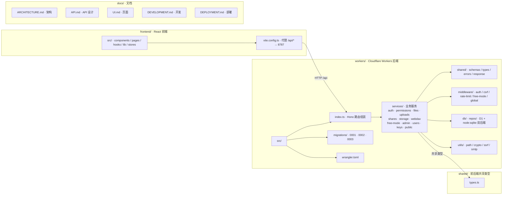

# Picumet — Agent Working Agreement

> 本文件面向在本仓库内执行任务的自动化代理/协作者：提供项目上下文、目录导航、以及"必须通过"的质量门槛与安全约束。
>
> 约定：子目录允许放置自己的 `AGENTS.md` 覆盖/补充本文件（就近优先）。

## Project Overview（项目概述）

**Picumet** 是一个多云对象存储管理平台，提供统一的文件管理界面和细粒度权限控制。支持 Cloudflare R2（Phase 1）、AWS S3 和 Oracle Cloud（Phase 3）。

- **Frontend**：React + Vite + TypeScript + shadcn-ui（位于 `frontend/`）
- **Backend**：Cloudflare Workers + Hono 框架（位于 `workers/`）
- **Database**：Cloudflare D1（SQLite）
- **Storage**：Cloudflare R2（主要）、AWS S3、Oracle Cloud（后续）
- **Run mode**：前后端分离；前端开发服务器通过 Vite 代理转发 `/api/*` 到 Workers

## Architecture / Project Map（架构/文件结构）



> 项目入口：[README](README_CN.md)、[系统架构](docs/ARCHITECTURE_CN.md)、[API](docs/API_CN.md)、[页面](docs/UI_CN.md)、[开发](docs/DEVELOPMENT_CN.md)、[部署](docs/DEPLOYMENT_CN.md)、[进度](docs/PROGRESS.md)。
>
> **强制规则**：执行任何代码、迁移、测试、发布或文档变更前，必须阅读并遵守本工作协议。质量门槛、安全约束、性能基线、迁移治理和提交规范均属于本工作协议的一部分。

---

## Architecture Principles（架构原则）

**按业务领域拆分，而非技术层次**（完整设计见 [docs/ARCHITECTURE_CN.md](docs/ARCHITECTURE_CN.md)）。

- 后端业务代码按领域组织在 `workers/src/services/<domain>/`，每个服务自包含：`handlers.ts`（业务逻辑/路由）、`schemas.ts`（Zod 校验）、`types.ts`（类型）、`<domain>.ts`（领域逻辑）、`README.md`（服务文档）。
- `workers/src/index.ts` 只做路由与中间件装配，不承载业务。
- 跨领域基础设施是薄层，不承载业务：`middleware/`（auth/csrf/rate-limit/global）、`db/repos/`（数据访问）、`utils/`（path/crypto/ssrf/smtp）、`shared/`（公共契约）。
- 依赖规则：所有服务依赖 **Permissions Service**（权限判定）与 **Storage Service**（存储抽象）；**Auth Service** 独立；避免循环依赖。
- 前端同样按业务域组织：`pages/` 每路由一页，页面内子功能内聚到 `components/files/`（预览/属性/上传/文件图标）与 `components/layout/`；`components/ui/` 仅放可复用 UI 原语，`lib/`、`stores/` 为共享层。页面不得按交互流程堆成技术性单体（如把导航/选择/批量/上传/预览/属性逻辑全塞进一个页面组件）。
- 新增功能：先判定归属业务域 → 在该域内扩展；禁止新建跨域散落的 `routes/`、`providers/`、`handlers.ts` 等按技术层次堆叠的目录。

---

## Technology Stack（技术栈）

### Frontend

| 技术 | 版本要求 | 用途 |
|------|---------|------|
| React | 18.x | UI 框架 |
| TypeScript | 5.x | 类型安全 |
| Vite | 5.x | 构建工具 |
| shadcn-ui | latest | UI 组件库（基于 Radix UI + Tailwind CSS）|
| Tailwind CSS | 3.x | 样式框架 |
| React Router | 6.x | 路由管理 |
| Zustand / React Context | - | 状态管理 |
| React Query | 5.x | 数据获取与缓存 |

### Backend

| 技术 | 版本要求 | 用途 |
|------|---------|------|
| Cloudflare Workers | - | Serverless 运行时 |
| Hono | 4.x | Web 框架 |
| TypeScript | 5.x | 类型安全 |
| jose | latest | JWT 生成与验证 |
| bcryptjs | latest | 密码哈希 |
| @aws-sdk/client-s3 | 3.x | S3 兼容 API（R2/S3/Oracle） |
| zod | 3.x | 请求验证 |

### Database & Storage

| 技术 | 用途 |
|------|------|
| Cloudflare D1 | SQLite 数据库（元数据存储）|
| Cloudflare KV | 速率限制、会话缓存 |
| Cloudflare R2 | 主要对象存储（Phase 1）|
| AWS S3 | 对象存储（Phase 3）|
| Oracle Cloud Storage | 对象存储（Phase 3）|

### DevOps

| 技术 | 用途 |
|------|------|
| Wrangler CLI | Cloudflare 本地开发与部署 |
| GitHub Actions | CI/CD 自动部署 |
| Cloudflare Pages | 前端静态托管 |

---

## Development Guidelines（开发规范）

### Code Quality（代码质量）

**TypeScript 严格模式**：
- 所有代码必须启用 TypeScript strict mode
- 禁止使用 `any` 类型（除非有明确注释说明原因）
- 必须为所有函数提供明确的返回类型

**命名规范**：
- 文件名：kebab-case（`user-service.ts`）
- 组件名：PascalCase（`FileExplorer.tsx`）
- 函数/变量：camelCase（`checkPermission`）
- 常量：UPPER_SNAKE_CASE（`MAX_FILE_SIZE`）
- 类型/接口：PascalCase（`FileMetadata`）

**导入顺序**：
```typescript
// 1. Node/外部库
import { Hono } from 'hono';
import { z } from 'zod';

// 2. Cloudflare 绑定
import type { Env } from './types';

// 3. 项目内部
import { checkPermission } from './services/permission';
import { FileService } from './services/file-service';

// 4. 类型导入
import type { Principal } from '../shared/types';
```

### Testing Requirements（测试要求）

**必须测试的模块**：
1. **权限判定算法**（`checkPermission`）
   - 覆盖所有真值表场景
   - 测试路径段边界（`/users/alice` vs `/users/alice2`）
   - 测试规则排序优先级

2. **文件操作状态机**
   - 上传流程（单文件、分片）
   - 移动/重命名流程（Saga 模式）
   - 删除流程（硬删除 + 异步清理）

3. **配额管理**
   - 原子性更新测试
   - 配额超限拒绝测试

4. **安全功能**
   - XSS/CSRF 防护
   - 速率限制
   - JWT 验证

**测试工具**：
- Vitest（单元测试）
- Miniflare（Workers 本地测试环境）
- Playwright（E2E 测试，可选）

**测试覆盖率目标**：
- 核心业务逻辑：>80%
- 工具函数：>90%
- UI 组件：>60%（关键交互必测）

### Security Constraints（安全约束）

**认证与授权**：
- JWT 存储在 HttpOnly Cookie，禁止存储在 localStorage
- 所有 API 路由默认需要认证（除 `/auth/*` 和公开路由）
- 管理员操作必须通过 `adminMiddleware` 验证

**输入验证**：
- 所有用户输入必须通过 Zod schema 验证
- 文件路径必须规范化（防止路径遍历）
- 文件名禁止包含：`/`, `\`, `..`, `<`, `>`, `|`, `:`, `"`, `?`, `*`

**CORS 配置**：
```typescript
// 仅允许前端域名
cors({
  origin: ['https://yourdomain.com', 'http://localhost:5173'],
  credentials: true,
  allowMethods: ['GET', 'POST', 'PATCH', 'DELETE'],
  allowHeaders: ['Content-Type'],
})
```

**速率限制**：
- 登录/注册：5 次/分钟/IP
- 上传：10 次/分钟/用户
- API 通用：100 次/分钟/用户

**XSS 防护**：
- CSP Header（Content-Security-Policy）
- DOMPurify 清理用户生成内容
- 禁止 `dangerouslySetInnerHTML`（除非有明确安全审查）

**CSRF 防护**：
- Cookie 设置 `SameSite=Lax`
- 敏感操作需要二次确认

### Performance Baselines（性能基线）

**API 响应时间**：
- 文件列表：<200ms（P50）、<500ms（P95）
- 文件上传初始化：<100ms
- 权限检查：<50ms
- 下载代理：<100ms（不含对象存储传输）

**前端性能**：
- 首次内容绘制（FCP）：<1.5s
- 最大内容绘制（LCP）：<2.5s
- 累计布局偏移（CLS）：<0.1
- 交互时间（TTI）：<3.5s

**数据库查询**：
- 单表查询：<10ms
- 关联查询：<50ms
- 带索引查询必须使用 EXPLAIN QUERY PLAN 验证

### Migration Governance（迁移治理）

**数据库迁移规则**：
1. 迁移文件命名：`NNNN_description.sql`（例如：`0001_initial.sql`）
2. 每个迁移必须包含：
   - 升级脚本（CREATE/ALTER）
   - 降级脚本（DROP/ROLLBACK，注释形式）
3. 禁止在迁移中直接删除数据（必须先标记废弃）
4. 添加索引必须包含性能测试结果

**迁移执行流程**：
```bash
# 本地测试
wrangler d1 execute picumet-db --local --file=migrations/0002_add_index.sql

# 预发布环境
wrangler d1 execute picumet-db --file=migrations/0002_add_index.sql

# 生产环境（需要人工审核）
wrangler d1 execute picumet-db --file=migrations/0002_add_index.sql --remote
```

### Commit Convention（提交规范）

**格式**：`<type>(<scope>): <subject>`

**类型（type）**：
- `feat`: 新功能
- `fix`: Bug 修复
- `docs`: 文档变更
- `style`: 代码格式（不影响逻辑）
- `refactor`: 重构
- `perf`: 性能优化
- `test`: 测试相关
- `chore`: 构建/工具配置

**作用域（scope）**：
- `auth`: 认证系统
- `permission`: 权限系统
- `storage`: 存储提供商
- `upload`: 上传流程
- `download`: 下载流程
- `ui`: 前端 UI
- `api`: 后端 API
- `db`: 数据库

**约定式英文提交信息（Conventional Commits）**：
- **必须使用多个 `-m` 编写详细提交说明**
- 说明内容使用**无序列表**逐条描述变更点、影响范围与验证结果
- **禁止掺入其他格式内容**（如段落文本、有序列表、代码块等）

**示例**：
```bash
git commit \
  -m "feat(upload): add multipart upload support for large files" \
  -m "- Implement chunked upload with resumable sessions in upload-service.ts" \
  -m "- Add upload_sessions table migration (0003_add_upload_sessions.sql)" \
  -m "- Update frontend UploadModal to show chunk progress" \
  -m "- Verify with npm run test and manual 500MB file upload"

git commit \
  -m "fix(permission): correct path boundary check for /users/alice vs /users/alice2" \
  -m "- Replace startsWith with path segment boundary check in isPathWithinBoundary" \
  -m "- Add test cases for adjacent path collision prevention" \
  -m "- Update permission.test.ts with 8 new boundary test scenarios" \
  -m "- Verify with npm run test (permission suite passes 15/15)"

git commit \
  -m "docs(readme): update deployment instructions for Cloudflare Pages" \
  -m "- Add wrangler.toml configuration examples" \
  -m "- Document GitHub Actions deployment workflow" \
  -m "- Update environment variables section with D1/R2 bindings"
```

---

## Quality Gates（质量门槛）

### 代码合并前检查清单

**功能完整性**：
- [ ] 功能按照 [docs/ARCHITECTURE_CN.md](docs/ARCHITECTURE_CN.md) 与 [docs/PROGRESS.md](docs/PROGRESS.md) 记录的范围实现
- [ ] 需求在 [docs/PROGRESS.md](docs/PROGRESS.md) 中标记为 Done 或 In progress
- [ ] 所有边界情况已处理（空路径、特殊字符、超大文件等）

**代码质量**：
- [ ] TypeScript 无编译错误（`tsc --noEmit`）
- [ ] ESLint 无警告（`npm run lint`）
- [ ] 代码通过 Prettier 格式化
- [ ] 无 `console.log` 调试语句（除非有明确注释）

**测试覆盖**：
- [ ] 单元测试通过（`npm run test`）
- [ ] **CI 等价检查本地全绿后才可推送**（对照 `.github/workflows/ci.yml`）：
  - frontend：`bun run typecheck` → `bun run test` → `bun run test:coverage`（覆盖率门禁 80/40/60/80，聚焦 `src/lib/escape.ts` + `src/pages/Register.tsx`）→ `bun run build`（`tsc -b && vite build`）
  - workers：`bun run typecheck` → `bun run test`
  - ⚠️ `bunx vitest run` 绿 ≠ CI 绿：覆盖率门禁不含在裸测试里（Register.tsx 的 `sendOtp` 曾因漏测导致门禁红）
- [ ] 关键路径有集成测试
- [ ] 权限相关变更必须有权限测试

**安全检查**：
- [ ] 无硬编码密钥/密码
- [ ] 用户输入已验证
- [ ] 权限检查已实施
- [ ] SQL 查询使用参数化（防止注入）

**性能验证**：
- [ ] 数据库查询使用索引（用 EXPLAIN 验证）
- [ ] 大文件上传使用分片
- [ ] API 响应时间符合基线

**文档更新**：
- [ ] README 已更新（如有 API 变更）
- [ ] docs/ 已同步（如有架构变更）
- [ ] 代码注释清晰（复杂逻辑必须注释）

---

## Development Workflow（开发工作流）

### Local Development（本地开发）

**环境准备**：
```bash
# 1. 安装依赖
cd frontend && npm install
cd ../workers && npm install

# 2. 配置环境变量
cp workers/.dev.vars.example workers/.dev.vars
# 编辑 .dev.vars 填写 R2 凭据

# 3. 初始化数据库
cd workers
wrangler d1 execute picumet-db --local --file=migrations/0001_initial.sql
```

**启动开发服务器**：
```bash
# Terminal 1: Workers API（端口 8787）
cd workers
npm run dev  # wrangler dev

# Terminal 2: 前端（端口 5173，代理 /api/* 到 8787）
cd frontend
npm run dev  # vite
```

**访问地址**：
- 前端：http://localhost:5173
- API：http://localhost:8787
- D1 Console：`wrangler d1 execute picumet-db --local --command "SELECT * FROM users"`

### Testing Workflow（测试工作流）

**运行测试**：
```bash
# 前端测试
cd frontend && npm run test

# Workers 测试
cd workers && npm run test

# E2E 测试（可选）
npm run test:e2e
```

**权限测试示例**：
```typescript
// workers/tests/permission.test.ts
import { describe, it, expect } from 'vitest';
import { checkPermission } from '../src/services/permission';

describe('Permission System', () => {
  it('should deny /users/alice access to /users/alice2', () => {
    const principal = { role: 'user', id: 'alice', defaultPath: '/users/alice' };
    const mount = { mountPath: '/', id: 'default' };
    
    const result = checkPermission(
      principal,
      mount,
      '/users/alice2/file.txt',
      'read'
    );
    
    expect(result).toBe('deny');
  });
  
  it('should allow admin to access any path', () => {
    const principal = { role: 'admin', id: 'admin-1' };
    const mount = { mountPath: '/', id: 'default' };
    
    const result = checkPermission(
      principal,
      mount,
      '/users/alice/private.txt',
      'delete'
    );
    
    expect(result).toBe('allow');
  });
});
```

### Deployment Workflow（部署工作流）

**部署到 Cloudflare**：
```bash
# 1. 构建前端
cd frontend
npm run build
# 输出: dist/

# 2. 部署 Workers
cd workers
wrangler deploy
# 输出: Worker URL

# 3. 部署前端到 Pages
# 通过 GitHub Actions 自动触发
# 或手动: wrangler pages deploy frontend/dist
```

**GitHub Actions 自动部署**：
- Push 到 `main` 分支触发部署
- 部署前自动运行测试和类型检查
- 失败时自动回滚

---

### 前端 UI 规则（强制）

> 详细的设计系统规则（按前端模块拆分、逐条对照现有代码核实）见 [docs/UI_CN.md](docs/UI_CN.md)「设计系统规则」一节。改 UI 前必读；改代码必须同步更新该文档。

- **玻璃拟态**：表面样式只消费 `--glass-alpha` / `--glass-blur` 三档门控（off/default/frosted），禁止硬编码模糊或透明度。
- **动画三档**：外观档位落 `<html data-motion>`（off/default/all），CSS 统一门停（`index.css`），组件零分支；入场动画用 `components/ui/reveal.tsx` 原语（`.reveal`/`.reveal-row` + `revealDelay`/`innerDelay` 两层节奏），卡片纵向间距 16px、双栏横向 24px；禁止逐项挂 JS 定时器。
- **卡中卡原则**：卡片内部尽量不再用卡片——卡内分区一律分隔线（`border-t pt-3` / 容器 `divide-y`），禁止在 `Card` 内嵌边框盒/子卡；详细规则见 docs/UI_CN.md「卡中卡原则」。
- **弹出菜单**：Dropdown / Select / 右键菜单必须 Portal 到 body 并复用 `DROPDOWN_MENU_CLASS` / `DROPDOWN_ITEM_CLASS`；禁止原生 `<select>`。
- **破坏性操作**：必须走 `ConfirmDialog` + success/error toast；禁止原生 `confirm()`。
- **文件项三态**：rest 玻璃表面、hover 压暗叠加、selected 主色调；文件页与分享页统一。
- **数据表**：表头表在滚动容器外（双表结构），禁止 sticky 磨砂表头（Chromium backdrop-filter 不采样 sticky 下方内容）；弹性列给 `minmax` 下限，窄容器横向滚动、表头单行并与表体同步平移。
- **落地页独立**：`components/landing/` 是一套独立视觉系统（`pages/Landing.tsx` 只装配）。**强调色跟随个性化设置**：`accentHsl()`（`stores/theme.ts`）把 accentColor 算成 `--primary` / `--primary-foreground` 内联到 `.landing` 根（默认 #D8632B），强调色一换主页全部跟随；**模糊/壁纸/动画档位仍不生效**，根元素实底铺满、不用任何 `glass-*` 类；`data-motion` 三档对 `.landing` 子树豁免，只尊重 `prefers-reduced-motion`。顶栏无站内导航（Logo size 40 + GitHub + 主题 + 语言 + 查看文档 + 登录/打开文件）；文档、部署指南与品牌链接指向 CelPlume 文档站与 celplume.hxcn.space（`primitives.tsx` 的 `docsUrl`/`BRAND_URL`）。模拟界面里的 UI 标签复用应用已有 i18n key，示例数据保持字面量。**代码块禁止横向滚动**（`whitespace-pre-wrap break-words` + `min-w-0`）；顶栏显示/隐藏用 `lp-hide-sm`（Tailwind hidden 会被 landing.css 的 display 盖掉，历史 bug：文档按钮双渲染）。详见 docs/UI_CN.md「落地页独立视觉系统」。
- **站点标识资源中转**：配置的 Logo/Favicon 经 `GET /api/public/site-asset/:kind?u=…`（`services/public/site-asset.ts`）中转——只中转**当前配置**的两个地址（其余 404，防开放代理）+ `validateEndpoint` 拒私网，边缘缓存 + `public, max-age=604800` 响应，外部图床不可缓存导致的整图重下就此消失；前端映射在 `stores/site.ts` 的 `siteAssetUrl`，设置 JSON 另存 localStorage 首帧套用。品牌位组件 `Logo` 必须传齐 `siteLogo`/`siteTitle`/`siteHeaderTitle`（登录、注册、重置密码、公开浏览、分享页、AppShell、落地页、自由模式）。
- **验收**：两种主题 × 三档模糊 × 有无壁纸逐界面截图核对（WCAG AA）；落地页另需横屏 + 竖屏 × 明暗 × 中英核对，且 `scrollWidth <= clientWidth`。

---

## i18n（国际化，强制）

- **所有用户可见文案**（标签、placeholder、title、aria-label、toast、ConfirmDialog、表头、空状态、校验错误、Badge）必须走 react-i18next `t()`；禁止在组件里硬编码中文/英文文案（注释除外）。
- 语言包：`frontend/src/lib/i18n/zh.ts` + `en.ts`，**新 key 必须两份同时添加**，缺一即显示裸 key。
- key 规范：camelCase、按页面/区域命名空间（`files.*`、`settings.*`、`admin.*`、`common.*`）；共享 UI 原语一律 `common.*`。
- ⚠️ `keySeparator` 为 `'.'`：**叶子 key 不能再向下嵌套**——`admin.storage` / `admin.files` / `admin.settings` 已是叶子字符串（导航标签在用），其下禁止再建子层级；相邻命名空间用 `admin.storageMounts.*` / `admin.storageProviders.*` / `admin.allFiles.*` 这类避开。
- 复用优先：写新 key 前先查语言包已有 key（`common.save/cancel/actions`、`files.name/size` 等大量现成）。
- 插值用 i18next 语法：译文 `'{{count}}s'`，调用 `t('key', { count })`；禁止 `.replace()` 手工拼接。
- 侧栏/导航的描述文案一句话内——长描述会在 flex 行里挤压图标（图标需 `shrink-0`）。
- 切换语言会改变文案宽度：滑动指示器等测量型组件必须响应语言变化（`useIndicator` 已观察 `characterData` + dep 含 `i18n.language`）。
- 后端枚举值（如 `s.status === 'active'`）直接渲染原值即可，不算硬编码文案。

---

## Common Pitfalls（常见坑点）

### 权限系统

❌ **错误**：使用 `startsWith` 判断路径
```typescript
// 这会导致 /users/alice 可以访问 /users/alice2
if (path.startsWith(boundary)) return true;
```

✅ **正确**：使用路径段判断
```typescript
function isPathWithinBoundary(path: string, boundary: string): boolean {
  if (boundary === '/') return true;
  if (path === boundary) return true;
  return path.startsWith(boundary + '/'); // 确保路径段边界
}
```

### 文件删除

❌ **错误**：先删除对象存储，再删除元数据
```typescript
// 如果删除元数据失败，对象已丢失但元数据仍存在
await provider.deleteObject(objectKey);
await db.deleteFile(fileId);
```

✅ **正确**：先删除元数据，再异步清理对象
```typescript
// 元数据删除失败则事务回滚，对象保留
await db.transaction(async (tx) => {
  await tx.deleteFile(fileId);
  await tx.updateQuota(ownerId, -size);
});
// 对象删除失败不影响用户操作，后台对账清理
await enqueueObjectDeletion(objectKey);
```

### 配额更新

❌ **错误**：非原子性更新
```typescript
const quota = await db.getQuota(userId);
await db.updateQuota(userId, quota.used + fileSize);
```

✅ **正确**：使用数据库原子操作
```typescript
await db.query(`
  UPDATE user_quotas 
  SET used_storage = used_storage + ?
  WHERE user_id = ?
`, [fileSize, userId]);
```

### 路径规范化

❌ **错误**：未规范化路径
```typescript
// /users/../admin/secrets 可以绕过权限检查
const path = req.query.path;
```

✅ **正确**：始终规范化路径
```typescript
function normalizePath(path: string): string {
  return '/' + path.split('/').filter(Boolean).join('/');
}
const canonicalPath = normalizePath(req.query.path);
```

### 表头磨砂（sticky + backdrop-filter）

❌ **错误**：把表头做成滚动容器内的 sticky 元素并指望 backdrop-filter 磨砂
```tsx
// Chromium 对 position: sticky 元素的 backdrop-filter 不采样其下滚动内容，
// 行从表头下穿过时锐利穿透，磨砂完全不生效（2026-09 实测回归过一次）
<table className="block w-full">
  <thead className="item-surface glass-blur block sticky top-0 z-10">…</thead>
  <tbody className="block">…</tbody>
</table>
```

✅ **正确**：双表结构——表头表放在滚动容器**外**（贴卡片玻璃，透明底），行表在 `overflow-y-auto` 容器内；横向滚动时表头随 `translateX(-scrollLeft)` 同步
```tsx
<Card className="flex min-h-0 flex-1 flex-col py-0 overflow-hidden">
  <div className="overflow-hidden [scrollbar-gutter:stable]">
    <table className="block w-full"><thead className="block">…</thead></table>
  </div>
  <div className="min-h-0 flex-1 overflow-y-auto [scrollbar-gutter:stable]"
       onScroll={(e) => { headerRef.current!.style.transform = `translateX(-${e.currentTarget.scrollLeft}px)`; }}>
    <table className="block w-full"><tbody className="block">…</tbody></table>
  </div>
</Card>
```

### 入场动画覆盖业务透明度

❌ **错误**：reveal keyframes 写显式终点 `to { opacity: 1 }` 且 `fill-mode: both`
```css
/* fill both 的动画值在级联中高于普通声明，to{opacity:1} 会把
   封禁行的 opacity-40、文件卡的 opacity-40 grayscale 永久钉成 1 —— 淡化失效 */
@keyframes reveal-row-in {
  from { opacity: 0; }
  to { opacity: 1; }
}
```

✅ **正确**：只写 `from`，终点隐式回落到元素自身计算值（普通元素 = 1，封禁 = 0.4，业务类变化跟随）
```css
@keyframes reveal-row-in {
  from { opacity: 0; }
}
```
给带业务透明度的元素接入入场动画前，先确认动画终点不会钉死它；同类陷阱适用于 grayscale/filter 等任何被 keyframes 覆写的属性。

---

## Emergency Procedures（应急预案）

### 数据库迁移失败

1. **立即停止部署**：取消 GitHub Actions 工作流
2. **回滚迁移**：
   ```bash
   wrangler d1 execute picumet-db --file=migrations/NNNN_rollback.sql
   ```
3. **验证数据完整性**：检查关键表记录数
4. **修复迁移脚本后重新部署**

### 配额异常（负数或超限未拒绝）

1. **临时禁用上传**：在 `system_settings` 中设置维护模式
2. **运行配额对账脚本**：
   ```sql
   UPDATE user_quotas SET
     used_storage = (
       SELECT COALESCE(SUM(size), 0)
       FROM file_metadata
       WHERE owner_id = user_quotas.user_id
     ),
     used_files = (
       SELECT COUNT(*)
       FROM file_metadata
       WHERE owner_id = user_quotas.user_id
     );
   ```
3. **审查并发更新代码**

### 权限绕过漏洞

1. **立即热修复**：部署修复后的 `checkPermission` 函数
2. **审计访问日志**：
   ```sql
   SELECT * FROM access_logs
   WHERE action = 'read'
     AND created_at > ?
   ORDER BY created_at DESC;
   ```
3. **通知受影响用户**（如有数据泄露）

---

## Contact & Resources（联系与资源）

**文档**：
- [README（英文）](../README.md) / [README（中文）](../README_CN.md)
- [系统架构（中文）](docs/ARCHITECTURE_CN.md) — 服务化架构、服务明细、数据模型、安全设计
- [API 参考（中文）](docs/API_CN.md) — 认证方式、统一响应、全部端点
- [前端指南（中文）](docs/UI_CN.md) — 页面路由、布局、交互、响应式
- [开发指南（中文）](docs/DEVELOPMENT_CN.md) — 本地开发、测试、代码规范、常见坑点
- [部署指南（中文）](docs/DEPLOYMENT_CN.md) — Cloudflare 部署、CI、Secrets、成本
- [实施进度](docs/PROGRESS.md) — 需求范围、进度、审计闭环
- [Cloudflare Workers 文档](https://developers.cloudflare.com/workers/)
- [Hono 框架文档](https://hono.dev/)

**关键设计决策**：
- 为什么不使用回收站？避免软删除导致的数据不一致
- 为什么先删元数据？确保用户操作原子性，对象清理可后台重试
- 为什么使用路径段边界？防止 `/users/alice` 访问 `/users/alice2`
- 为什么只做 Cloudflare？统一部署栈，避免多云复杂性（AWS S3/Oracle 仅作为存储后端）

**变更历史**：
- 2026-08-18：初始版本，需求范围与设计决策来自产品评审
- 2026-08-18：服务化重构（Plan A），新增 docs/ 文档体系（架构/API/页面/开发/部署）
- 2026-08-19：文档整合至 README + docs/（中英双语、谷歌文档风格），移除 spec 类源文档引用，新增 docs/PROGRESS.md 记录进度
- 2026-09-19：新增「前端 UI 规则」摘要并强制阅读 docs/UI_CN.md「设计系统规则」（按前端模块拆分、逐条对照现有代码核实）：玻璃三档门控、强调色运行时校准（移除深色提亮补偿）、弹出菜单 Portal 统一、Toast 复刻规范（堆叠/退场/路由清空）、ConfirmDialog 强制二次确认、文件项三态压暗法、拖拽多选整页触发面 + 页面禁选文本、滑块、文件树、骨架屏与滚动条约定
- 2026-09-23：前端 UI 规则摘要补「动画三档 + reveal 入场原语」「数据表双表表头（sticky 磨砂方案废弃）」两条；docs/UI_CN.md / UI.md 新增「入场动画体系」一节并修正表头规范（双表结构、横滚同步、列宽下限、表头单行），docs/ARCHITECTURE(_CN).md 补权限判定链第 7/8 步（桶级/挂载级角色矩阵）、矩阵仓库与趋势聚合，docs/API(_CN).md 补 `GET /api/admin/dashboard/trends`，docs/PROGRESS.md 记 §33 动画与表头批次；常见坑点新增「表头磨砂（sticky + backdrop-filter 失效）」「入场动画覆盖业务透明度（keyframes 禁写显式 to{opacity:1}）」两条
- 2026-09-24：泳道图备用占位行接入桶干线（琥珀分支 + 空心环区分真实挂载点行）；转角曲线改为「起点落干线正中、切线竖直、三次曲线缓出」且干线 z 层压在子曲线之上（拼接缝被干线盖住，无断口无生硬拐点），图例（在用桶/备用桶）随旧配色废弃删除；新增「卡中卡原则」——卡内分区一律分隔线（设置页直链挂载点/速率限制、仪表盘趋势卡三图已改），docs/UI_CN.md / UI.md 新增对应小节；系统设置站点标识拆分：新增 `site_header_title`（左上角标题，留空 = 顶栏只显示 Logo，独立于标签页标题），表单按标题在左、图标在右两行排布；Logo 组件高度固定、宽度随图片比例自适应（去固定容器宽，宽长 logo 不再被压成小方块）；修复 SMTP 发件地址为空时保存设置 400（`smtpFromEmail` 接受空串 = 清空，附 `admin-settings.test.ts` 回归）；docs/API(_CN).md 补 `siteHeaderTitle` 字段、`smtpFromEmail` 空串语义与公开设置示例，docs/PROGRESS.md 记本批次并刷新基线
- 2026-09-25：落地页重构为独立视觉系统（`components/landing/`，§34）：令牌在 `.landing` 根重定义，模糊/壁纸/动画档位不消费个性化外观（强调色跟随，见下），`data-motion` 三档对其子树豁免，只尊重 `prefers-reduced-motion`；区块按域拆到 `sections.tsx` / `mockups.tsx` / `Thumb.tsx` / `brands.tsx` / `share-qr.ts` / `primitives.tsx`；顶栏无站内导航（Logo size 40 + GitHub + 主题 + 语言 + 查看文档 + 登录/打开文件）；存储池五档写入策略 + 读路径容灾、十层权限判定、审计日志、审核队列、角色矩阵、五协议代码标签页、边缘地球与部署命令等区块全部为真实语义演示；文案逐条对照后端核实（直传不分片不可续传、无拖拽移动、限流仅认证与敏感写 fail-closed、S3 网关密钥可逆加密、`free_weighted` 未配容量视为不限）；代码块块内折行（`whitespace-pre-wrap break-words` + `min-w-0`），窄屏模拟窗 `max-md:w-full`，双色标题在半句处换行避免中文词内断行；`landing.*` 两份语言包重写并删除导航 key。强调色：项目默认强调色改为 `#D8632B`（预设常量 `ACCENT_PRESETS` 移入 `stores/theme.ts`，供个性化与落地页共用），落地页通过新增的 `accentHsl()`（原色 + YIQ 前景，不做浅色压暗循环）把强调色内联到 `.landing` 根，主页色族跟随强调色切换。站点标识资源中转：新增 `GET /api/public/site-asset/:kind`（`services/public/site-asset.ts`）——只中转当前配置的 site_logo/site_favicon 两个地址（其余 404，防开放代理），`validateEndpoint` 拒私网与非标端口，边缘缓存 + `public, max-age=604800` 响应（附 `site-asset.test.ts` 5 例）；外部图床地址不可缓存导致的每次刷新整图重下（实测 818 KB）就此消失；前端 `stores/site.ts` 把配置地址映射到中转端点并把设置 JSON 存 localStorage 首帧套用。入场动画：`reveal-in` / `reveal-row-in` 补 from-only blur（`--reveal-blur` 8px/6px，文件卡片视图/个性化设置/仪表盘/系统设置等全部 reveal 消费者生效），下拉/右键/Select 菜单容器在 `all` 档叠加 `dropdown-blur-in`。品牌位：登录/注册/重置密码/公开浏览/分享页的 `Logo` 统一接入站点 Logo（未配置回退 Picumet 图标）。落地页顶栏新增查看文档入口、hero 查看源码改查看文档、文档/部署/品牌链接指向 celplume.hxcn.space 文档站（`/docs` 路由本就不存在）、页脚版权改为 `© {year} 天空之翼 / CelPlume All Rights Reserved` 且品牌名带链接；`lp-hide-sm` 显示工具修复 Tailwind hidden 被 landing.css display 盖掉导致的文档按钮双渲染。前端 UI 规则摘要补「落地页独立」「站点标识资源中转」两条；docs/UI_CN.md / UI.md 新增「落地页独立视觉系统」「站点标识资源中转」小节并补入场模糊条目，docs/PROGRESS.md 记 §34 并刷新基线（workers 46 文件 / 452 例）
- 2026-09-26：代码审计修复批次（`docs/CODE_AUDIT_REPORT.md`，§35）：P0/P1/P2 全部落地，SEC-05（SMTP TLS）按决策暂缓。安全侧：跨挂载点文件夹移动改 422 + 清扫自愈存量孤儿子树（先修复再对账容量）；Provider 更新补 endpoint SSRF 校验；真实客户端 IP 统一 `workers/src/utils/ip.ts`（cf.connectingIp → CF-Connecting-IP → X-Real-IP → XFF 受控回退，全部调用点迁移）；分享文件级密码统一（分享令牌不再由分享密码推导 `passwordVerified`，新增 `POST /api/shares/:id/verify-file` cookie+KV 验证态，预览/网关按文件当前 accessPassword 复核）；AList 登录与全部 fs/* 统一 `api` 协议面；site-asset 重定向 manual 逐跳校验（≤3 跳）；生产环境非业务异常固定「服务器内部错误」（细节仅服务端日志）；SigV4 签名载荷 100 MiB 上限 + 已算哈希复用；`verify-password` 前置 download 权限（显式 conditions）；上传失败路径统一释放三层预留并标 `aborted`、清扫回收 verifying/failed、预留对账自愈；`publicDomain` 拒私网。设计侧：权限条件死代码删除（`getConditions`/`checkPasswordProtection`），规则创建面移除 requirePassword/password/allowedIps（存量行 fail-closed，引擎契约测试钉住）；分享创建与配额对账消除 N+1；S3 控制面 15s 超时；前端 apiFetch 默认 30s、上传暂停真实中止、代码预览 2 MiB 上限、预览 URL 缓存 10 分钟 TTL、文件页下载统一 apiFetch。契约侧：公告撤回接入后端（`GET /api/users/announcements/dismissed-ids`、`POST /api/users/announcements/:id/dismiss`）+ 横幅服务端同步；inviteCode/turnstileToken/TURNSTILE 全链路移除（YAGNI-03）；coverUrl/manualPosition 在 API 文档标注预留契约（YAGNI-04）；useFolderOptions/getProviderCfg/toFileListItem 二次导出删除。新增测试：`move-cross-mount`、`share-file-password`、`admin-provider-update`、`error-response`、`announcement-dismiss` 及 `upload-resume`/`alist`/`api-key-ip`/`s3gw`/`site-asset`/`share-password`/`permission` 增补。docs/API/ARCHITECTURE/DEVELOPMENT/DEPLOYMENT/UI（中英）与 docs/PROGRESS.md、docs/CODE_AUDIT_REPORT.md「修复状态」同步
- 2026-09-26：存储拓扑与访问控制专项审计修复批次（`docs/STORAGE_TOPOLOGY_AUDIT.md` / `docs/ACCESS_CONTROL_AUDIT.md`）：存储侧——挂载放置统一校验（同路径 400、嵌套 priority 不变量、父挂载数据遮蔽 409、平局稳定决胜）、挂载点目录行固定身份 `mountfolder:<mountId>`（不复用/不误删用户行）、Provider 删除事务内全引用检查 + 迁移 0006 外键 RESTRICT、池成员移除前检查与差异化 UPSERT（保留 quota_reserved）、挂载配置单事务、对账新增成员级预留重算；**合成根**（无 `/` 挂载时文件页/树、公开浏览、AList fs/list、WebDAV PROPFIND 聚合顶层挂载为虚拟目录，虚拟项 `vroot:` 全入口不可操作+前端门禁）；failover 候选桶逐桶复核两级矩阵（未传角色维持原行为）、`MAX_CANDIDATES`→20、对象 sha256 元数据与回退比对；去重收敛到同挂载（`blob_objects` 复合主键 (hash, mount_id)，迁移 0007）；MOVE 走完整权限上下文、S3 LIST 逐文件桶级过滤；目录删除按属主分组扣配额；删用户登记孤儿对象队列；`publicDomain` 池一致性校验 + 配置警示。访问控制侧——新用户 defaultPath 继承角色默认（PERM-01 方案 A）、列表/树统一 §4.4a、树逐目录复核、全仓前缀 LIKE 转义（`escapeLikePattern`）、分享创建权限基准改全路径、AList 直链补封禁门禁、晚绑定出口补挂载级矩阵、公开列表过滤封禁项、语义入文档。新增测试 10 文件（workers 61 文件/548 用例、前端 6 文件/38 用例全绿）；docs/ARCHITECTURE/DEPLOYMENT/DEVELOPMENT 与 PROGRESS 同步。
- 2026-09-26：全量代码与架构审计修复批次（`docs/FULL_AUDIT_REPORT_2026-09-26.md`）：P0/P1/P2 代码类修复全部落地。上传侧——前端消费 multipart `parts`（预签名逐片 PUT 收 ETag / Worker 分片端点带 CSRF，跨源预签名不再带 credentials），服务端完成按「服务端记录 → 客户端上报 → 桶 `ListParts`」取信，`upload-complete` 改条件 UPDATE 原子领取（`complete_claimed_at`，失败释放、崩溃 5 分钟可接管）。存储与移动——Provider 物理定位字段（bucket/endpoint/region/pathPrefix）有物理引用时 409；跨挂载移动同时预留目标挂载 `max_storage` 与成员容量并在提交事务内转已用（不足 413）；目标冲突文件行 + 目录行双检；blob 跨挂载移动与跨挂载文件夹移动同样 422；Move 统一「属主不变」（目标 user_space 按 `file.ownerId` 判定）；目录重命名在同一事务迁移整棵子树（前缀转义 + 嵌套挂载点拒绝），顺带修复文件改名 `path` 写成自身全路径的既有缺陷；`MountQuotaRepo.transferUsage` 死代码删除。生命周期——`blob_gc` 迁移 0008 升级为 `(hash, mount_id)` 复合键；过期分片会话清扫终止 Provider multipart upload（失败入 `multipart_abort` 队列，`cleanupMultipartAborts` 重试）；池成员移除检查补 `blob_objects`/`blob_gc`；挂载删除改为「无文件且无在途会话」条件 DELETE；直写/移动的成员预留登记 `quota_reservations` 台账，对账合并「会话 + 台账」两来源；flat 模式上传需要建祖先目录的路径 403。安全——分享验证按 IP+分享 5 次/分钟与 9 次失败冷却（`security-harden`）；AList `fs/get` 签名 24 小时 TTL；S3 `UNSIGNED-PAYLOAD` 强制 `Content-Length` ≤100 MiB（缺失 411）；注册 OTP 改 CSPRNG。审计日志分层（DESIGN-NEW-07）——迁移 0009 补 `(created_at,id)`/`(action,created_at,id)` 索引并删左前缀重复单列索引；管理列表显式列 + 游标分页（去 `COUNT`/`OFFSET`，响应 `nextCursor/hasMore`）；超保留期（`audit_retention_days`，默认 90 天）的整小时窗口导出 NDJSON.gz 到 R2 `AUDIT_BUCKET`（manifest + rollup 同批落库、校验后分批清理，未配置冷层只读不删），新增归档清单/下载端点（读取记 `audit_archive_read`），趋势合并热表 + rollup。前端——Tooltip Portal 化 + 视口翻转/夹紧 + 折行；日志页游标分页翻页。记录项：SEC-NEW-04（自由模式临时主体回收）、DESIGN-NEW-03（multipart 内容寻址边界，已入文档）、R-2（round-robin 计数器 KV 非原子）、DESIGN-NEW-05（不引入 Web Locks）。测试：workers 68 文件 / 583 用例、前端 7 文件 / 43 用例全绿；覆盖率门禁与构建通过；docs/API(_CN)、ARCHITECTURE(_CN)、DEPLOYMENT(_CN)、PROGRESS 同步。
