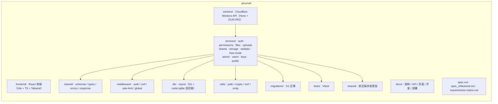

# Picumet — 多云对象存储管理平台

统一管理你的云端文件和图床：细粒度权限控制、分享链接、PicGo/PicList 接入，部署在 Cloudflare 边缘网络。

## 技术栈

- **前端**：React 18 + Vite + TypeScript + Tailwind CSS（shadcn 风格 UI）+ React Router 6 + TanStack Query 5 + Zustand + i18next（中/英）
- **后端**：Cloudflare Workers + Hono 4 + D1 (SQLite) + KV + R2
- **存储协议**：S3 兼容（R2 / AWS S3 / Oracle Cloud），本地开发走 R2 绑定
- **测试**：Vitest（权限真值表 57 / 文件状态机 / 配额 / 安全回归 / API 集成 / S3 预签名 / 故障注入，后端 122 项 + 前端 7 项）

## 快速开始（本地开发）

前置要求：Node 22+、bun 1.3+（本项目统一使用 bun 作为包管理器，`packageManager: bun@1.3.14`）。

```bash
# 1. 安装依赖
cd workers && bun install
cd ../frontend && bun install

# 2. 配置环境变量
cp workers/.dev.vars.example workers/.dev.vars

# 3. 终端 1：启动 Workers API（端口 8787，首次启动后执行迁移）
cd workers
bun run dev
# 在另一个终端执行迁移（首次）：
bunx wrangler d1 execute picumet-db --local --file=migrations/0001_initial.sql

# 4. 终端 2：启动前端（端口 5173，代理 /api → 8787）
cd frontend
bun run dev
```

访问：
- 前端：http://localhost:5173
- API：http://localhost:8787

内置账号（**仅开发种子**）：
- 管理员：`admin` / `admin123456`
- 演示用户：`demo` / `demo123456`
> 生产环境通过 `ADMIN_PASSWORD` 注入管理员密码（≥12 位强密码），无固定默认凭据（审计 H-02）。

## 测试

```bash
cd workers && bun run test            # 后端 127 项（权限真值表、上传状态机、配额、安全回归、API 集成、WebDAV、S3 预签名、故障注入）
cd workers && bun run typecheck       # 后端类型检查
cd frontend && bun run test           # 前端 7 项（XSS 转义、注册页交互）
cd frontend && bun run test:coverage  # 前端覆盖率门禁（安全关键模块 ≥80%）
cd frontend && bun run typecheck      # 前端类型检查
```

CI：`.github/workflows/ci.yml` 在 push/PR 到 main 时执行 bun install → typecheck → test → 构建/覆盖率门禁（不自动部署）。部署统一用 `wrangler deploy`（或 Cloudflare 侧自动部署）。

## 主要功能

- 认证：注册（`/register`）/ 登录（HttpOnly Cookie + JWT）/ 邮箱验证 / 密码找回（`/reset-password`）
- 权限：三级角色（admin/user/guest）+ 路径级 ACL（真值表按 spec 覆盖）+ 文件/路径密码保护
- 文件：列表（卡片/列表视图）、上传（单文件 + 分片 + 幂等 + 断点续传）、下载（网关代理 + 防伪造 HEAD 校验）、重命名、移动（Saga）、硬删除、批量操作、搜索、排序
- 预览：图片（缩放/旋转）、视频、音频、代码高亮（highlight.js 纯文本 + 预转义，安全）
- 分享：创建（密码/过期/次数限制）、公开页、二维码、复制多格式链接
- API 密钥：`pk_x.sk_y` 不透明令牌（仅存哈希）、IP 白名单、WebDAV Basic 认证、PicGo 自定义上传 `/api/upload`
- 管理员：仪表板、用户/配额管理、存储源（R2/S3/Oracle）、挂载点、权限规则、分享/文件/日志、系统设置与公告
- 自由模式：用户自带对象存储凭据的临时会话（凭据 AES-256-GCM 加密写入 KV + 短 TTL，无明文落盘）
- 安全：CSP、CSRF Token、速率限制（认证接口 fail-closed）、路径遍历防护、危险文件类型拦截、SSRF 端点校验、SQL 参数化、下载令牌原子消费

## 目录结构



## 文档

- [系统架构](docs/ARCHITECTURE.md) — 服务化架构、服务明细、数据模型、安全设计
- [API 设计](docs/API.md) — 认证方式、统一响应、全部端点
- [页面设计](docs/UI.md) — 页面路由、布局、交互
- [开发指南](docs/DEVELOPMENT.md) — 本地开发、测试、代码规范、常见坑点
- [部署指南](docs/DEPLOYMENT.md) — Cloudflare 部署、CI、Secrets、成本
- [技术规格](spec.md)
- [需求追踪矩阵](requirements-matrix.md)
