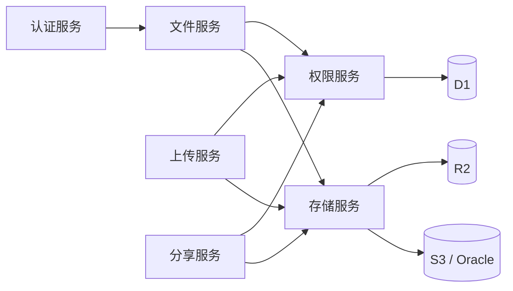

# Picumet 系统架构

> 服务化架构（Service-Oriented Architecture, Plan A）。
> 按业务领域拆分，而非技术层次。每个服务自包含：handlers + schemas + types + 领域逻辑 + 文档。
> 本文档由各服务 README 与源码整合而成；源码始终是最终事实。

## 架构总览

```mermaid
flowchart LR
    subgraph workers_src["workers/src/"]
        subgraph services["services/ · 核心业务服务"]
            direction TB
            AUTH["auth · 认证"]
            PERM["permissions · 权限判定"]
            FILES["files · 文件管理"]
            UPLOADS["uploads · 上传"]
            SHARES["shares · 分享"]
            STORAGE["storage · 存储抽象"]
            WEBDAV["webdav · WebDAV"]
            FREEMODE["free-mode · 自由模式"]
            ADMIN["admin · 管理"]
            USERS["users · 用户设置"]
            KEYS["keys · API 密钥"]
            PUBLIC["public · 公开"]
            CLEANUP["cleanup.ts · 定时任务"]
        end

        subgraph shared_["shared/ · 共享代码"]
            direction TB
            SCHEMAS["schemas.ts · 公共 Zod"]
            TYPES_["types.ts · 公共类型"]
            ERRORS["errors.ts · 统一错误"]
            RESPONSE["response.ts · 统一响应"]
        end

        subgraph middleware_["middleware/ · 中间件"]
            direction TB
            MWAUTH["auth.ts"]
            MWCSRF["csrf.ts"]
            MWRL["rate-limit.ts"]
            MWFM["free-mode.ts"]
            MWGLOBAL["global.ts"]
        end

        subgraph db_["db/ · 数据访问层"]
            direction TB
            REPOS["repos/ · users/storage/files/rules/system"]
            DBIDX["index.ts"]
        end

        subgraph utils_["utils/ · 工具"]
            direction TB
            UPATH["path.ts"]
            UCRYPTO["crypto.ts"]
            USSREF["ssrf.ts"]
            USMTP["smtp.ts"]
        end

        INDEX["index.ts · 路由组装"]
        SEED["seed.ts · 种子数据"]
    end

    INDEX --> services
    services --> shared_
    services --> middleware_
    services --> db_
    services --> utils_
    CLEANUP --> db_
```



## 服务间依赖关系



**依赖规则**:
- 所有服务依赖 **Permissions Service**（权限检查）
- 所有文件操作依赖 **Storage Service**（存储抽象）
- **Auth Service** 独立，仅被其他服务调用
- 避免循环依赖

## 服务标准结构

每个服务目录包含：

```
services/<service-name>/
├── handlers.ts         // API handlers（业务逻辑）
├── schemas.ts          // Zod 验证 schemas
├── types.ts            // TypeScript 类型定义
├── <domain>.ts         // 领域特定逻辑
└── README.md           // 服务文档
```

**类型安全**：所有 API 输入通过 Zod 验证（`@hono/zod-validator` 或 `safeParse`）。

---

## 服务明细

### Auth Service（认证服务）

**职责范围**：用户注册、登录、登出、JWT 令牌生成与验证、会话管理、邮箱验证、密码重置。

**目录结构**：
```
services/auth/
├── handlers.ts    // 登录、注册、登出 handlers
├── schemas.ts     // RegisterSchema / LoginSchema
└── types.ts       // JwtPayload、请求类型
```

**API**：

| 方法 | 路径 | 说明 |
|---|---|---|
| POST | `/api/auth/register` | 注册 |
| POST | `/api/auth/login` | 登录（Set-Cookie HttpOnly JWT） |
| POST | `/api/auth/logout` | 登出 |
| GET | `/api/auth/me` | 当前用户信息 |
| GET | `/api/auth/csrf-token` | 获取 CSRF Token |
| GET | `/api/auth/verify-email` `/api/auth/verify` | 邮箱验证（别名） |
| POST | `/api/auth/forgot-password` | 找回密码 |
| POST | `/api/auth/reset-password` | 重置密码 |

**依赖**：`middleware/auth.ts`（getDb/getClientIp）、`middleware/rate-limit.ts`、`middleware/csrf.ts`、`utils/crypto.ts`（JWT/bcrypt）、`utils/smtp.ts`、`db`（UserRepo/QuotaRepo/SettingsRepo/LogRepo）。

### Permissions Service（权限服务）

**职责范围**：核心权限判定算法（`checkPermission`）、路径规则查询与匹配、主体（Principal）构造、权限校验。

**目录结构**：
```
services/permissions/
├── check.ts       // ⭐ 核心权限判定算法 + 规则排序 + 规则加载
├── principal.ts   // 从 Hono Context 构造 Principal、requirePermission/can
└── types.ts       // 权限相关类型
```

**核心算法优先级**：
1. 管理员特权
2. 挂载边界检查
3. 用户根路径限制
4. API 密钥权限范围（交集语义：密钥配置权限 ∩ 路径规则权限）
5. 路径规则（主体特异度 > 路径特异度 > 显式优先级 > effect）
6. 文件所有者权限回退
7. 默认拒绝

**关键安全边界**：
- `isPathWithinBoundary`：路径段判断而非 `startsWith`，防止 `/users/alice` 访问 `/users/alice2`
- API 密钥无规则 → 拒绝（无默认放行）

**依赖**：`utils/path.ts`（isPathWithinBoundary/normalizePath/pathMatches）、`db`（RuleRepo）、`shared/errors.ts`。

### Files Service（文件管理服务）

**职责范围**：文件/文件夹列表、创建文件夹、文件详情、元数据更新（重命名）、删除、移动（Saga）、批量操作、密码验证、下载链接。

**目录结构**：
```
services/files/
├── handlers.ts    // 列表、文件夹、详情、更新、密码验证、下载链接
├── operations.ts  // 删除、移动、批量操作、任务状态
├── move.ts        // 移动 Saga（复制→校验→原子切换→异步清理源）
├── schemas.ts     // Update/CreateFolder/Move/Batch/VerifyPassword
└── types.ts
```

**移动 Saga（审计 H-4）**：`moveWithSaga`：校验权限/冲突/循环 → 建任务 → 复制+校验 → 原子切换元数据 → 异步清理源对象。主文件 API 与 WebDAV MOVE 统一走此服务。

**依赖**：`permissions/principal.ts`（requirePermission）、`storage/providers.ts`（getProvider）、`shares/tokens.ts`（下载令牌）、`db`（FileRepo/MountRepo/ProviderRepo/LogRepo/JobRepo）。

### Uploads Service（上传服务）

**职责范围**：上传会话管理、单文件直传、分片上传、Worker 代理上传、配额预留/释放、完成校验（HEAD 防伪造）、幂等性保证。兼容 PicGo/PicList 上传。

**目录结构**：
```
services/uploads/
├── handlers.ts    // 上传会话、代理上传、分片、完成、中止
├── compat.ts      // PicGo 兼容上传（Bearer API Key / multipart）
├── schemas.ts     // InitUploadSchema
└── types.ts
```

**状态机**：
- 单文件：`pending → uploading → verifying → completed`（含 failed/expired/aborted）
- 分片：`pending → uploading → parts_uploaded → completing → completed`

**依赖**：`permissions/principal.ts`、`storage/providers.ts`、`db`（SessionRepo/QuotaRepo/FileRepo/MountRepo/ReconciliationRepo）、`utils/path.ts`、`utils/crypto.ts`。

### Shares Service（分享服务）

**职责范围**：分享链接创建/列表/撤销、公开访问、密码验证、下载令牌（D1 原子消费）、分享访问日志、下载网关。

**目录结构**：
```
services/shares/
├── handlers.ts    // 创建、列表、公开信息、下载、预览、撤销
├── gateway.ts     // /api/gateway/download/:token 流式代理
├── tokens.ts      // 下载令牌（D1 原子消费）
├── schemas.ts     // CreateShareSchema
└── types.ts
```

**下载令牌（审计：D1 原子消费）**：`consumeDownloadToken` 用 `DELETE ... RETURNING` 单条原子消费，一次性令牌不可被并发重复使用。

**依赖**：`permissions/principal.ts`、`storage/providers.ts`、`db`（ShareRepo/FileRepo/MountRepo/ProviderRepo/LogRepo）、`utils/crypto.ts`（bcrypt/random）。

### Storage Service（存储服务）

**职责范围**：存储提供商抽象层（R2 绑定 / S3 协议）、对象操作（HEAD/GET/PUT/DELETE/COPY/List）、分片上传、预签名 URL、连通性测试、多 Provider 切换。

**目录结构**：
```
services/storage/
├── providers.ts   // Provider 工厂（getProvider/getProviderForMount）
├── r2.ts          // R2BindingProvider（基于 env.R2 绑定）
├── s3.ts          // S3Provider（R2 S3 API / AWS S3 / Oracle）
└── types.ts       // StorageProviderInterface 抽象接口
```

**Provider 选择**：
- `type=r2` 且无 endpoint → `R2BindingProvider`（本地/生产 R2 绑定）
- 其余 → `S3Provider`（S3 协议客户端）

**依赖**：`db`（ProviderRepo/MountRepo）、`utils/crypto.ts`（decryptSecret）。

### WebDAV Service（WebDAV 服务）

**职责范围**：WebDAV 协议实现（兼容 PicGo/PicList）：PROPFIND、GET/HEAD、PUT、DELETE、MKCOL、MOVE、OPTIONS。Basic 认证（API 密钥）。

**目录结构**：
```
services/webdav/
├── handlers.ts    // WebDAV 方法 handlers
└── types.ts       // WebDAVResource / PropfindRequest
```

**安全要点（审计 H-3/H-4）**：
- 全部方法接入 `permissions/principal.ts` 统一路径级权限服务（PROPFIND read / PUT write / DELETE delete）
- MOVE 复用 `files/move.ts` 移动 Saga，不直接改 file_metadata
- 写目标必须位于密钥上传根目录内（`assertWithinUploadRoot`）
- XML href 统一转义（`escapeXml`，防注入/破坏 XML）
- Basic 认证：`base64(keyId:secret)`

**依赖**：`middleware/auth.ts`（apiKeyAuthMiddleware）、`permissions/principal.ts`、`storage/providers.ts`、`files/move.ts`、`utils/path.ts`、`utils/crypto.ts`。

### Free-Mode Service（自由模式服务）

**职责范围**：用户自带对象存储凭据的临时会话（凭据加密写入 KV，短 TTL 自动清理）、文件列表、上传、删除、退出。

**目录结构**：
```
services/free-mode/
├── handlers.ts    // init/files/upload/object/logout
├── schemas.ts     // FreeModeInitSchema
└── types.ts
```

**安全要点（审计 H-1/H-2/M-1/M-2）**：
- 中间件 `middleware/free-mode.ts`：Origin + Sec-Fetch-Site 跨站防护、会话级 CSRF、IP+用户双层 fail-closed 限流
- 路径/文件名边界校验（拒绝 `..`/`~`/控制字符/反斜杠，`isPathWithinBoundary`）
- endpoint SSRF 校验（`validateEndpoint`）
- 凭据 AES-GCM 加密后写入 KV，不返回 auth_token（仅 fm_token sid）

**依赖**：`middleware/free-mode.ts`、`storage/providers.ts`（S3Provider）、`utils/crypto.ts`、`utils/ssrf.ts`、`utils/path.ts`。

### Admin Service（管理服务）

**职责范围**：仪表板/统计、用户管理、全局分享、全部文件、访问日志、系统设置、公告、存储提供商、挂载点、权限规则。

**目录结构**：
```
services/admin/
├── handlers.ts          // 仪表板、用户、分享、文件、日志、设置、公告
├── storage.ts           // 存储提供商、挂载点、权限规则
├── schemas.ts           // UserUpdate/Settings/Announcement
├── storage-schemas.ts   // Provider/Mount/Rule
└── types.ts
```

**依赖**：`db`（UserRepo/ShareRepo/LogRepo/SettingsRepo/AnnouncementRepo/ProviderRepo/MountRepo/RuleRepo）、`storage/providers.ts`、`utils/ssrf.ts`（validateEndpoint）。

### Users Service（用户设置服务）

**职责范围**：个人资料、外观偏好、默认路径、修改密码。

**目录结构**：
```
services/users/
├── handlers.ts    // /me/settings GET/PUT、/me/password PUT
├── schemas.ts     // ProfileSchema / PasswordSchema
└── types.ts
```

**依赖**：`db`（UserRepo/QuotaRepo）、`utils/crypto.ts`（verify/hashPassword）。

### Keys Service（API 密钥服务）

**职责范围**：API 密钥创建（仅显示一次）、列表、撤销、权限规则查询。

**目录结构**：
```
services/keys/
├── handlers.ts    // POST/GET/DELETE /api/keys、GET /api/keys/rules
├── schemas.ts     // CreateKeySchema
└── types.ts
```

**安全要点（审计 M-3）**：
- `uploadPath` 规范化（拒绝 `..`/`~` 逃逸），作为密钥上传根边界
- 密钥 token 仅创建时显示一次；落库存 `sha256Hex` 哈希

**依赖**：`db`（ApiKeyRepo/RuleRepo）、`utils/crypto.ts`、`utils/path.ts`。

### Public Service（公开服务）

**职责范围**：站点设置、公告、健康检查（无需认证）。

**目录结构**：
```
services/public/
├── handlers.ts    // GET /api/public/settings、/announcements、/health
└── types.ts
```

**依赖**：`db`（SettingsRepo/AnnouncementRepo）。

### Cleanup（定时任务）

**职责范围**：过期配额释放、移动源对象清理、过期分享标记、配额对账。

- `releaseExpiredReservations`：释放过期上传会话的配额预留
- `cleanupOldObjects`：清理移动后遗留的源对象（source_cleanup_pending）
- `expireDueShares`：标记过期分享
- `reconcileQuotas`：配额对账（纠正 used_storage / used_files）

---

## 共享基础设施

### shared/schemas.ts

公共 Zod schemas：

```typescript
export const PathSchema = z.string().regex(/^\//).max(2048);
export const FileNameSchema = z.string().min(1).max(255).regex(/^[^<>:"|?*\x00-\x1F]+$/);
export const PaginationSchema = z.object({ page: z.coerce.number().int().min(1).default(1), limit: z.coerce.number().int().min(1).max(1000).default(100) });
export const UUIDSchema = z.string().uuid();
export const PasswordSchema = z.string().min(1).max(128);
```

### shared/errors.ts

```typescript
export class ApiError extends Error {
  constructor(public statusCode: number, public code: string, public message: string, public details?: unknown)
  static badRequest / unauthorized / forbidden / notFound / conflict / tooManyRequests / internal
}
```

### shared/response.ts

```typescript
export function ok<T>(c, data, message?, status = 200)  // { success: true, data, message?, timestamp }
export function fail(c, err)                             // { success: false, error: { code, message, details? }, timestamp }
```

---

## 数据模型

核心表：`users`、`mounts`、`providers`（storage_providers）、`file_metadata`、`path_rules`、`upload_sessions`、`share_links`、`api_keys`、`user_quotas`、`access_logs`、`operation_jobs`、`orphan_objects`、`system_settings`、`announcements`。

完整 Schema 见 `spec.md`「数据模型」章节与 `workers/migrations/`（`0001` 初始、`0002` 分片/下载令牌、`0003` 挂载隔离 + 会话撤销）。

## 安全设计要点

- **JWT** 存 HttpOnly Cookie（`SameSite=Strict`），禁止 localStorage
- **会话撤销**（审计 H-05）：`users.session_version` 写入 JWT；登出、改密、重置密码、管理员禁用账户时递增，旧 JWT 立即失效
- **挂载隔离**（审计 H-01）：`path_rules.mount_id` 绑定规则到挂载点（NULL = 全局）；权限查询按挂载过滤，同路径不同挂载规则互不影响
- **初始凭据**（审计 H-02）：生产 `ADMIN_PASSWORD` 必填（≥12 位强密码），未配置 fail-closed 不创建管理员；无硬编码默认凭据
- **CSRF**：写操作需 `X-CSRF-Token`（KV 校验）；API Key 认证豁免
- **限流**：KV 固定窗口（best-effort，审计 M-01），认证/敏感写接口 fail-closed
- **路径遍历**：`normalizePath` + `isPathWithinBoundary`（路径段判断）
- **SSRF**：`validateEndpoint`（scheme/端口白名单 + IPv4/IPv6 私网保留段）；部署需 egress 白名单配合（审计 M-04）
- **对象投毒**：完成上传强制 HEAD 校验（ETag + Size）
- **XSS**：文件名严格校验、React 自动转义、highlight.js 预转义
- **SQL 注入**：全参数化查询
- **下载令牌**：D1 原子消费（一次性）
- **分享下载计数**（审计 H-04）：签发下载令牌不计数，仅在网关消费令牌时计数一次；超限 410
- **分享密码**（审计 M-02）：POST `/api/shares/:id/verify` 种短期授权 cookie，密码不入 URL
- **大文件内存**（审计 H-03）：compat/WebDAV/自由模式流式转发请求体，消除整包入内存
- **初始化**（审计 M-06）：`/api/public/health/live` + `/ready` 就绪探针；生产未初始化业务 API 返回 503
- **CSP**：`script-src 'self' https://challenges.cloudflare.com`（无 unsafe-inline）

## 相关文档

- [API 设计](API.md)
- [页面设计](UI.md)
- [开发指南](DEVELOPMENT.md)
- [部署指南](DEPLOYMENT.md)
- [技术规格（完整版）](../spec.md)
- [需求追踪矩阵](../requirements-matrix.md)
