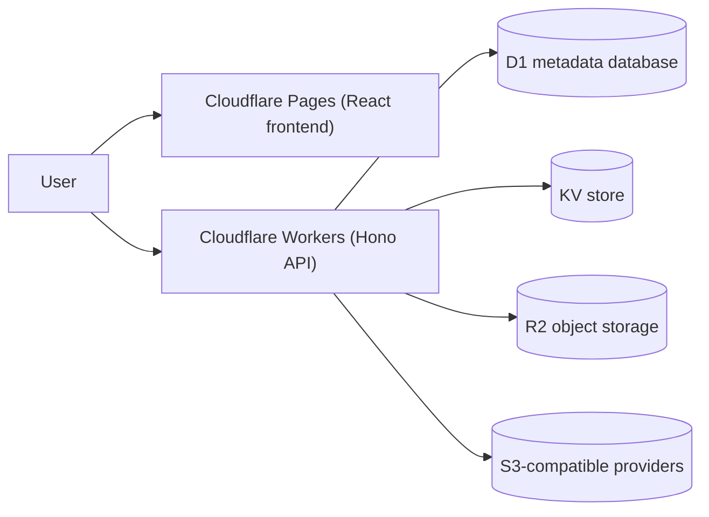
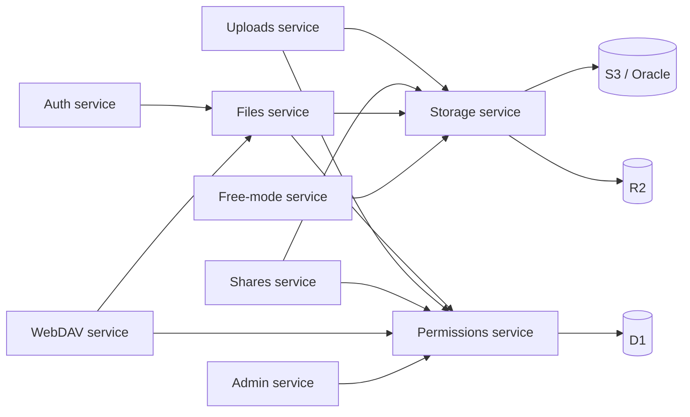

<div align="center">


# Picumet architecture

**Multi-cloud object storage with fine-grained access control**

English | [中文](ARCHITECTURE_CN.md)

</div>

## Overview

Picumet is a multi-cloud object storage management platform that runs entirely on Cloudflare. A React single-page application served by Cloudflare Pages talks to a Hono API on Cloudflare Workers. The API stores relational metadata in D1, caches short-lived state in KV, and keeps objects in R2 or any S3-compatible provider such as AWS S3 or Oracle Cloud.

The backend follows a service-oriented layout: code is split by business domain, not by technical layer. Each service owns its handlers, validation schemas, types, and domain logic. A central permissions service evaluates every request against path rules, and a storage service hides object operations behind one interface. This design keeps cross-service edges explicit and avoids cyclic dependencies.

This document covers the component topology, service dependencies, key design decisions, the data model, provider support, and the security model. The source code in `workers/src/` and `frontend/src/` remains the authoritative reference.

## Before you begin

- Familiarity with Cloudflare Workers, D1, KV, and R2 bindings.
- Basic understanding of the S3 protocol and presigned URLs.
- Working knowledge of TypeScript, React, and the Hono framework.

## Architecture diagram



The service dependency graph shows how business domains relate:



## Architecture components

| Component | Purpose |
| :--- | :--- |
| Cloudflare Pages | Serves the React single-page application and its static assets. |
| Cloudflare Workers | Hosts the Hono API that implements all business logic. |
| D1 | Stores relational metadata: users, mounts, files, rules, sessions, shares, quotas, and logs. |
| KV | Caches short-lived state: CSRF tokens, rate-limit counters, and free-mode credential sessions. |
| R2 | Stores objects for the primary provider through the Workers binding. |
| S3-compatible providers | Stores objects for AWS S3 and Oracle Cloud through the S3 protocol. |
| Hono + Zod | Provides the HTTP framework and runtime validation for every API request. |
| React + TanStack Query | Renders the UI and manages server state, caching, and mutations. |
| `services/` | Business-domain modules: auth, permissions, files, uploads, shares, storage, webdav, and more. |
| `middleware/` | Cross-cutting concerns: authentication, CSRF, rate limiting, security headers, and the free-mode guard. |
| `db/` | Data access layer with a unified `Db` interface over D1 and `node:sqlite`. |
| `shared/` | Common types, Zod schemas, errors, and the uniform response envelope. |
| `utils/` | Path, crypto, SSRF, SMTP, and base64 helpers. |

## Service dependencies

The dependency graph above follows three rules:

- Every service that touches file data depends on the Permissions service.
- Every service that touches object bytes depends on the Storage service.
- The Auth service is a leaf: other services call it, and it depends on no other service.

The layout avoids cyclic dependencies. `index.ts` only assembles routes and middleware; it contains no business logic. Public routes mount before the catch-all path server, which serves file objects at `GET /*`.

## Design decisions

| Decision | Chosen | Alternative | Reason |
| :--- | :--- | :--- | :--- |
| Code organization | Service-oriented by business domain | Layered by technical tier | Each domain stays self-contained and testable; cross-domain edges stay explicit and cyclic dependencies stay impossible. |
| Compute platform | Cloudflare Workers + Pages | Other edge runtimes or self-hosted servers | The Workers bindings (D1, R2, KV) remove operational overhead; the free tier fits the target scale; a single runtime avoids building a portable platform layer. |
| Database backend | D1 in production, `node:sqlite` in tests | External PostgreSQL or Supabase | D1 gives zero-config relational storage with low latency; the `Db` abstraction lets the test suite run on `node:sqlite` without network access. |
| Delete order | Delete metadata first, then objects | Delete object and metadata together | Metadata deletion happens in one atomic D1 transaction; object deletion runs best-effort after commit and records failures as orphan objects for reconciliation. |
| Recycle bin | None: hard delete with confirmation | Trash or quarantine with a retention period | S3-compatible providers lack a portable trash; a recycle bin would need tombstone logic and deferred reclamation for little benefit at this scale. |
| Path boundary | Segment-based boundary check | String prefix match | `isPathWithinBoundary` requires the boundary plus `/`, which prevents prefix attacks such as `/users/alice2` matching `/users/alice`. |
| Storage protocol | One S3-protocol credential model | Native SDK per provider | R2, AWS S3, and Oracle all speak S3, so one model covers them; rejecting non-S3 providers (OSS, COS) avoids parallel driver maintenance. |
| Download authorization | One-time tokens consumed atomically in D1 | Long-lived signed URLs | `DELETE ... RETURNING` consumes each token exactly once, so concurrent requests cannot reuse it; counting at the gateway gives exact download numbers. |

## Service details

Every service directory follows the same shape: `handlers.ts` for API handlers, `schemas.ts` for Zod validation, `types.ts` for TypeScript types, and optional domain files. All API input passes through Zod validation.

### Auth service

**Responsibilities**: user registration, login, logout, JWT issuance and verification, session management, email verification, and password reset.

```
services/auth/
├── handlers.ts    // login, register, logout handlers
├── schemas.ts     // RegisterSchema, LoginSchema
└── types.ts       // JwtPayload and request types
```

| Method | Path | Description |
| :--- | :--- | :--- |
| POST | `/api/auth/register` | Creates a user account. |
| POST | `/api/auth/login` | Authenticates the user and sets an HttpOnly JWT cookie. |
| POST | `/api/auth/logout` | Clears the session. |
| GET | `/api/auth/me` | Returns the current user. |
| GET | `/api/auth/csrf-token` | Issues a CSRF token. |
| GET | `/api/auth/verify-email`, `/api/auth/verify` | Verifies an email address (aliases). |
| POST | `/api/auth/forgot-password` | Starts password recovery. |
| POST | `/api/auth/reset-password` | Resets the password. |

Dependencies**: `middleware/auth.ts`, `middleware/rate-limit.ts`, `middleware/csrf.ts`, `utils/crypto.ts`, `utils/smtp.ts`, and the user, quota, settings, and log repositories.

### Permissions service

**Responsibilities**: the core `checkPermission` algorithm, path-rule query and matching, principal construction, and permission enforcement.

```
services/permissions/
├── check.ts       // core algorithm, rule ordering, rule loading
├── principal.ts   // builds Principal from the Hono context, requirePermission, can
└── types.ts       // permission types
```

The evaluation order runs from highest to lowest priority:

1. Admin override.
2. Mount boundary check.
3. User root-path limit. Reads and downloads of files with `users` / `public` visibility are exempt from the `defaultPath` boundary; write operations are never exempt.
4. API-key permission scope, applied as the intersection of key permissions and rule permissions.
5. Path rules. Visibility-derived rules (reads and downloads of `users` / `public` files) flow through the same sort pipeline as stored rules; origin priority is `admin` > `user` > `system`, then subject specificity, path specificity, explicit priority, and effect.
6. Owner-permission fallback.
7. Default deny.

**Role default permissions (the user permission model).** `role_defaults.permissions` holds each role's default permission list (a five-item matrix: `read` / `write` / `update` / `delete` / `download`; **`share` is not part of it** — the `can_share` capability bit controls sharing, so one concern is never configured in two places). Built-in role seeds: `admin` and `user` = all five plus `capabilities=['can_share']`, `guest` = `download` only. **User-level override**: `users.permissions` (NULL = follow the role), with precedence `users.permissions` → `role_defaults.permissions` → the constant table `DEFAULT_ROLE_PERMISSIONS`. `getPrincipal` loads the effective list into `Principal.defaultPermissions`, which the own-space fallback in the decision order allows through (`share` actions keep their existing allow semantics inside the own space). Admin "Default user settings" edits the matrix, capability bits, alias, and default path/quota, and **saving a role default overrides the individual settings of every member of that role** (including `users.permissions`). A role also has an **alias** (`role_defaults.alias`, such as "Administrator"), and rule subjects accept that alias in addition to the role name (`loadPrincipalRules` resolves it to the role and merges it into the candidate set).

**Guest visibility (per file).** `file_metadata.guest_visibility` is `NULL` / `none` / `download` / `view`; when unset it follows the role default, so **guests can only download by default**. On evaluation `syntheticGuestRule` synthesizes the file's guest visibility into one allow rule and merges it into the candidate set: `download` allows downloads, `view` allows viewing (list/preview) plus downloads, and `none` allows nothing. The "Default user permissions" section of the file properties panel is its only configuration entry point.

Two security boundaries matter:

- `isPathWithinBoundary` compares path segments rather than using `startsWith`.
- An API key with no matching rule receives a deny; the system never defaults to allow.
- Visibility only relaxes reads and downloads: it touches no write decision or path boundary, and `deny` rules always override synthesized rules.
- Guest visibility likewise only relaxes reads and downloads, and it **never crosses a mount boundary**; share links (`/api/shares/*`) are semantically independent and unaffected by guest visibility.

**Dependencies**: `utils/path.ts`, the rule repository, and `shared/errors.ts`.

### Files service

**Responsibilities**: file and folder listing, folder creation, file details, metadata updates (rename), delete, move (Saga), batch operations, password verification, download links, copy links in multiple formats, and public path serving at `GET /*`.

```
services/files/
├── handlers.ts    // list, folder, detail, update, password verify, download link, copy links
├── operations.ts  // delete, move, batch operations, job status
├── move.ts        // move Saga (copy, verify, atomic switch, async source cleanup)
├── path-serve.ts  // public path serving at {origin}{virtual path}
├── schemas.ts     // Update, CreateFolder, Move, Batch, VerifyPassword
└── types.ts
```

Copy links: `GET /api/files/:id/copy-links` returns `formats: { direct, html, markdown, bbcode }`. The `direct` value defaults to `{origin}{virtual path}`, a public direct link that `path-serve.ts` serves. Pass `?signed=true&expiresIn={seconds}` to request a provider presigned URL, with the gateway token as the fallback.

Public path serving: `GET /*` streams an object by its virtual path. A public mount serves directly without login; a private mount requires an authenticated user with download permission; a password-protected file returns `403`.

Move Saga: `moveWithSaga` validates permissions, conflicts, and cycles, creates a job, copies and verifies the object, switches the metadata atomically, and cleans up the source asynchronously. The main file API and WebDAV `MOVE` share this path.

Visibility and review: files carry three visibility tiers — `private` (owner and admins), `users` (any signed-in user can read and download), and `public` (enters the anonymous public gallery once review passes). Setting `public` requires the owner to hold the `can_publish` capability, otherwise the file enters the `pending` review queue; setting it on a folder cascades to all entries inside. File-domain permission checks consistently use the file's full path (`filePermPath`) so user-authored full-path rules match, while parent-folder rules still apply through pattern inheritance.

**File ban (§N).** `file_metadata.banned` is set by admins through `PUT /api/admin/files/:id/ban`; `assertNotBanned` in `services/files/ban.ts` hooks into every content outlet (file download, `path-serve.ts` direct serving, share download/preview, and the download gateway) and throws `429 FILE_BANNED` on a hit. A ban **does not block deletion** — owners and admins can still delete a banned file, and the delete flow performs no ban check. The user side is presentation-only (a translucent ghost with the menu reduced to delete); the real enforcement lives on the server.

**Dependencies**: `permissions/principal.ts`, `storage/providers.ts`, `shares/tokens.ts`, and the file, mount, provider, log, and job repositories.

### Uploads service

**Responsibilities**: upload session management, single-file direct upload, multipart upload, Worker-proxied upload, quota reservation and release, completion verification (a HEAD check against spoofing), and idempotency. The service stays compatible with PicGo and PicList.

```
services/uploads/
├── handlers.ts    // session, proxy upload, multipart, complete, abort
├── compat.ts      // PicGo-compatible upload (Bearer API key / multipart)
├── schemas.ts     // InitUploadSchema
└── types.ts
```

State machines:

- Single file: `pending → uploading → verifying → completed`, with `failed`, `expired`, and `aborted` as terminal states.
- Multipart: `pending → uploading → parts_uploaded → completing → completed`.

**Dependencies**: `permissions/principal.ts`, `storage/providers.ts`, the session, quota, file, mount, and reconciliation repositories, `utils/path.ts`, and `utils/crypto.ts`.

### Shares service

**Responsibilities**: share link creation, listing, and revocation; public access; password verification; download tokens consumed atomically in D1; share access logs; and the download gateway.

```
services/shares/
├── handlers.ts    // create, list, public info, download, preview, revoke
├── gateway.ts     // /api/gateway/download/:token streaming proxy
├── tokens.ts      // download tokens (atomic D1 consumption)
├── schemas.ts     // CreateShareSchema
└── types.ts
```

**Password retrievability.** Creating a share writes the password to both `password_hash` (for verification) and `password_cipher` (an AES-GCM ciphertext with an `enc:` prefix, using the same encryption as stored provider credentials); **only the creator's own list endpoint** `GET /api/shares` decrypts and returns the plaintext `password` — public endpoints (details/directory/download/preview) never hand out the plaintext or the ciphertext. When the ciphertext is missing or decryption fails, the field disappears and the endpoint does not error. Password-protected shares also accept a direct `?password=<plaintext>` entry (equivalent to verified; a wrong password returns 401).

Download tokens: `consumeDownloadToken` uses `DELETE ... RETURNING` for a single atomic consumption, so concurrent requests cannot reuse a one-time token.

**Dependencies**: `permissions/principal.ts`, `storage/providers.ts`, the share, file, mount, provider, and log repositories, and `utils/crypto.ts`.

### Storage service

**Responsibilities**: the storage-provider abstraction (R2 binding or S3 protocol), object operations (HEAD, GET, PUT, DELETE, COPY, List), multipart upload, presigned URLs, connectivity tests, and switching across providers.

```
services/storage/
├── providers.ts   // provider factory (getProvider, getProviderForMount)
├── r2.ts          // R2BindingProvider based on the env.R2 binding
├── s3.ts          // S3Provider (R2 S3 API, AWS S3, Oracle)
├── errors.ts      // ProviderError classification (not-found / auth / throttled / other)
├── range.ts       // Range request parsing and S3 Range header construction
├── serve.ts       // serveObject unified object egress (200/206/416/502)
└── types.ts       // StorageProviderInterface
```

Provider selection:

- A provider with `type=r2` and no endpoint uses `R2BindingProvider` (the local or production R2 binding).
- Everything else uses `S3Provider`, an S3-protocol client.

The storage layer also normalizes cross-provider details: object egress goes through `serveObject`, which owns Range handling (`206` on hit, `416` on invalid ranges, upstream failures classified via `ProviderError` as `502`); batch deletes follow the S3 convention of at most 1000 objects per batch, surfacing each failure in the `Errors` container as a `ProviderError` so callers can fall back to per-object deletes; copies above 5 GB (the move Saga's large-file path) use `UploadPartCopy` to copy in parts; and listing with a `Delimiter` aggregates common prefixes into virtual directories.

**Content-hash addressing (§F).** All writes go through `services/storage/content.ts` plus `services/files/write.ts`, and writes place object bodies under their content SHA-256 (`<prefix>/picumet:blob/<h2>/<hash>`; the namespace segment contains `:`, which no user virtual key can contain), shared across files with equal content:

- Write strategy: when the S3 gateway has already verified the whole payload (SigV4) the hash is known — an existing index hit skips the object write entirely, otherwise the content key is written directly. Streaming writes (WebDAV, compat uploads, AList, Worker-proxied sessions) use a staging key plus an inline hash: delete the staging object on a hit, otherwise copy it to the content key and delete it.
- File rows keep `object_key` as the unique virtual key and add `physical_key` + `blob_hash`; reads, deletes and moves resolve `physicalObjectKey(file)`, so rename and move are metadata-only operations that never copy objects.
- Reference release happens inside the same SQL batch as the row delete/rewrite (`NOT EXISTS (SELECT 1 FROM file_metadata WHERE blob_hash = ?)` — no refcount column, no read-modify-write race); the last reference enqueues the object in `blob_gc`, where a scheduled task deletes it after a grace period, re-checking references and retrying on failure.
- Multipart upload sessions stay path-keyed (`blob_hash` NULL): parts go straight to the provider, so their objects remain exclusive and the cleanup removes them directly.
- Quotas keep counting logical sizes (each file counts its own size), so capacity gates stay conservative.

**Read-path failover (§G).** Object reads go through `serveFileObject` / `getFileObject` in `services/storage/failover.ts`. When the bucket recorded for a file cannot return the object (404) or the upstream fails (502 / `ProviderError`), the read falls through to the other pool members of the same mount in order — KV location hint → the file's recorded provider → remaining members by weight — capped at four candidates, with an 8-second limit per attempt so an unreachable bucket cannot stall the request. A replica hit stores `serve:loc:<fileId>` (provider id plus a physical-key fingerprint, 1-hour TTL) so later reads prefer that bucket; rewriting the file invalidates the hint through the fingerprint. Cross-bucket **copy** is not part of this layer: replicating objects into secondary buckets belongs to the future Go backend. The admin surface plans a per-mount "automatic cross-bucket sync" switch that is only selectable in a Go-backend environment — the current Node/Workers backend does not implement the capability (control rendered disabled); pooling (§E) and read failover (§G) work without it.

**Mount points are directories (§H).** Every non-root mount keeps a folder row inside its **parent mount's namespace** (`id = 'mountfolder:<mountId>'`, `path` = the mount's own absolute path — the same convention folder creation uses, `name` = last path segment, `object_key` = `folder:<absolute path>`, `custom_title` = mount display name), so the file page, share picker, public browser, WebDAV and AList all see it without implementing mount synthesis. Three idempotent self-healing call sites (directory listing, admin mounts page, scheduled task) plus admin create/update/delete keep the row in sync; `isMountPointFile` / `containsMountPointFile` reject renaming, moving or deleting a mount-point row or a parent directory that contains one (409).

> Field note: the row first stored `path` = the parent directory, but folder rows store their **own absolute path**. The file tree therefore treated the mount folder as a root and expanded the same level forever, freezing `/files`. Fixed in code and repaired for existing rows by migration section 20 (`UPDATE ... SET path = substr(object_key, 8) WHERE type='folder' AND object_key LIKE 'folder:/%' AND path <> substr(object_key, 8)`); `mount-folders.test.ts` asserts the convention.

**Failover candidates are buckets only.** Read fallback candidates always come from `mount_providers` → `storage_providers` (independent buckets); folders — mount-point folders or user folders such as a "backup" directory — are never candidates, and §G plans cross-bucket replication bucket by bucket. A folder-level copy is not DR: replicas inside the same bucket share its failure domain.

**Dependencies**: the provider and mount repositories and `utils/crypto.ts` for secret decryption.

### WebDAV service

**Responsibilities**: the WebDAV protocol for PicGo and PicList compatibility, including PROPFIND, GET/HEAD, PUT, DELETE, MKCOL, MOVE, and OPTIONS, with Basic authentication using API keys.

```
services/webdav/
├── handlers.ts    // WebDAV method handlers
└── types.ts       // WebDAVResource, PropfindRequest
```

Security notes:

- Every method runs through `permissions/principal.ts` for path-level authorization (PROPFIND read, PUT write, DELETE delete).
- `MOVE` reuses the `files/move.ts` Saga instead of editing `file_metadata` directly.
- Write targets must stay inside the key's upload root (`assertWithinUploadRoot`).
- XML hrefs pass through `escapeXml` to prevent injection and malformed XML.
- Basic auth uses `base64(keyId:secret)`.

**Dependencies**: `middleware/auth.ts` (API key auth), `permissions/principal.ts`, `storage/providers.ts`, `files/move.ts`, `utils/path.ts`, and `utils/crypto.ts`.

### Free-mode service

**Responsibilities**: temporary sessions with user-supplied object-storage credentials, file listing, upload, delete, and logout. The service encrypts credentials, writes them to KV with a short TTL, and cleans them up automatically.

```
services/free-mode/
├── handlers.ts    // init, files, upload, object, logout
├── schemas.ts     // FreeModeInitSchema
└── types.ts
```

Security notes:

- `middleware/free-mode.ts` enforces cross-site protections (Origin and Sec-Fetch-Site), session-level CSRF, and fail-closed IP-plus-user rate limiting.
- Path and file-name checks reject `..`, `~`, control characters, and backslashes.
- `validateEndpoint` runs SSRF checks on the supplied endpoint.
- Credentials use AES-GCM encryption in KV; the API never returns `auth_token`, only the `fm_token` session id.

**Dependencies**: `middleware/free-mode.ts`, `storage/providers.ts`, `utils/crypto.ts`, `utils/ssrf.ts`, and `utils/path.ts`.

### Admin service

**Responsibilities**: dashboard and statistics, user management (capability bits plus per-user permission overrides), global shares (with the settings-dialog data), all files (filters, storage locations, bans), public review, access logs, system settings, announcements, storage providers, mount points (with capacity), and permission rules.

```
services/admin/
├── handlers.ts          // dashboard, users, shares, files (list/review/ban), logs, settings, announcements
├── storage.ts           // storage providers, mount points (capacityBytes), permission rules
├── schemas.ts           // UserUpdate, Settings, Announcement, FileBan
├── storage-schemas.ts   // Provider, Mount, Rule
└── types.ts
```

The dashboard and statistics endpoints (`GET /api/admin/dashboard`, `/stats`) aggregate in `db/repos/dashboard.ts`: top-level `stats` (role counts, file count, used space, bucket count, active mounts, capacity total) plus per-mount `mounts` rows (primary bucket / standby pool members / usage / file count), built from 8 aggregate queries assembled in memory — N+1 queries are forbidden. The all-files list enriches mount, bucket, and hash the same way with batched per-page `IN` queries.

**Dependencies**: the user, share, log, settings, announcement, provider, mount, and rule repositories, `storage/providers.ts`, and `utils/ssrf.ts`.

### Users service

**Responsibilities**: profile, appearance preferences, default path, password change, and user-authored access rules.

```
services/users/
├── handlers.ts    // /me/settings GET/PUT, /me/password PUT
├── rules.ts       // /api/users/rules create, list, revoke
├── rule-guard.ts  // gates for user-created rules (can_grant, target existence, permission surface)
├── schemas.ts     // ProfileSchema, PasswordSchema
└── types.ts
```

**Dependencies**: the user and quota repositories and `utils/crypto.ts`.

### Keys service

**Responsibilities**: API key creation (the secret shows once), listing, revocation, and permission-rule queries.

```
services/keys/
├── handlers.ts    // POST/GET/DELETE /api/keys, GET /api/keys/rules
├── schemas.ts     // CreateKeySchema
└── types.ts
```

Security notes:

- `uploadPath` normalization rejects `..` and `~` escapes and uses the result as the key's upload root boundary.
- The key token displays once at creation; the store keeps a `sha256Hex` hash.

**Dependencies**: the API key and rule repositories, `utils/crypto.ts`, and `utils/path.ts`.

### Public service

**Responsibilities**: site settings, announcements, health checks, and the public gallery without authentication.

```
services/public/
├── handlers.ts    // GET /api/public/settings, /announcements, /health
├── gallery.ts     // /api/gallery anonymous listing, download links, password verification
└── types.ts
```

The gallery returns only files with `visibility=public` and review status `approved`, filtering directly on visibility without consulting path permission rules; downloads reuse the share download tokens and gateway (atomic D1 consumption) instead of opening a second authorization surface.

**Dependencies**: the settings and announcement repositories.

### Cleanup tasks

**Responsibilities**: expired quota release, move-source cleanup, expired share marking, and quota reconciliation, run by a scheduled task.

- `releaseExpiredReservations` releases quota reservations held by expired upload sessions.
- `cleanupOldObjects` deletes source objects left by moves (`source_cleanup_pending` flag).
- `expireDueShares` marks shares as expired.
- `reconcileQuotas` corrects the `used_storage` and `used_files` counters.
- `runScheduledTasks` runs all four tasks and returns a per-task count.

**Dependencies**: the session, share, file, mount, provider, and quota repositories and `storage/providers.ts`.

## Shared infrastructure

Cross-service code lives in four places:

- `shared/schemas.ts` provides common Zod schemas: `PathSchema`, `FileNameSchema`, `PaginationSchema`, `UUIDSchema`, and `PasswordSchema`.
- `shared/types.ts` defines `Principal`, `Mount`, `FileMetadata`, `Conditions`, the `Env` runtime bindings, and the Hono context variables.
- `shared/errors.ts` defines `ApiError` with static constructors: `badRequest`, `unauthorized`, `forbidden`, `notFound`, `conflict`, `tooManyRequests`, and `internal`.
- `shared/response.ts` provides the `ok` and `error` helpers that shape the `{ success, data | error, timestamp }` envelope.

The middleware layer handles cross-cutting concerns:

| Middleware | Purpose |
| :--- | :--- |
| `middleware/auth.ts` | `authMiddleware`, `optionalAuthMiddleware`, `apiKeyAuthMiddleware`, and `adminMiddleware`; also exposes `getDb` and `getClientIp`. |
| `middleware/csrf.ts` | Validates the CSRF token for cookie-authenticated write operations. |
| `middleware/rate-limit.ts` | KV fixed-window rate limiting: global limits per IP (`rate_limit_requests_per_minute`, 50 requests per minute by default) and per signed-in user (×2); auth endpoints get their own 5 per minute per IP; free mode adds 60 per session / 120 per user per minute. Production only, best-effort (KV has no atomic increment). |
| `middleware/concurrency.ts` | Transfer concurrency limiting: every upload channel and the download gateway cap in-flight requests per user (per IP when signed out) at `max_concurrent_transfers` (default 4, 0 = unlimited) and answer `429 CONCURRENCY_LIMIT_EXCEEDED` beyond it; in-flight slots live in `transfer_slots` (D1 serializes the writes, so the count is trustworthy) and `finally` frees them when the response finishes (errors included), with anything older than 30 minutes treated as a leak. |
| `middleware/download-limit.ts` | Download rate limiting: counts only download-type requests (download gateway, share download/preview, file download links, public-directory direct links) per user (per IP when signed out) per minute (`rate_limit_downloads_per_minute`, default 120, 0 = unlimited) and answers 429 beyond it; mounted on the protected API, the share API, the gateway, and the public directory, and narrowed by path inside the middleware; skipped outside production and fail-open on storage errors. |
| `middleware/free-mode.ts` | Enforces free-mode cross-site, CSRF, and rate-limit guards. |
| `middleware/global.ts` | Initializes the request context, CORS, and security headers. |

The `db/` directory is the single data-access layer. The `Db` class wraps either a D1 backend (production on Workers) or a `node:sqlite` backend (local tests), so business code does not know which one runs. Domain repositories live under `db/repos/`: users, quotas, providers, mounts, files, sessions, jobs, rules, API keys, shares, logs, settings, announcements, dashboard, blobs, role defaults, and reconciliation.

The `utils/` directory holds `path.ts` (normalization, boundary checks, pattern matching), `crypto.ts` (JWT, bcrypt, AES-GCM), `ssrf.ts` (endpoint validation), `smtp.ts`, and `base64.ts`.

## Data model

D1 stores the following core tables:

| Table | Purpose |
| :--- | :--- |
| `users` | User accounts, roles, status, default path, locale preferences, and capability bits. |
| `user_quotas` | Used and reserved storage, file counts, and limits. |
| `storage_providers` | S3-protocol provider configuration with encrypted credentials. |
| `mounts` | Maps a provider to a virtual path with sorting preferences, a write quota (`max_storage`), a storage pool strategy (`pool_strategy`), and a display capacity (`capacity_bytes`, NULL = unset). |
| `file_metadata` | Files and folders: virtual object key, physical key (§F content addressing), content hash, path, size, etag, owner, visibility, review status, **guest visibility (`guest_visibility`: NULL/none/download/view)**, **ban flag (`banned`, §N)**, and custom attributes. |
| `blob_objects` | Content-addressed object index: content hash → provider and physical key (one object shared by equal content). |
| `blob_gc` | Content-object collection queue: enqueued when the last reference disappears, deleted by a scheduled task after a grace period, retried on failure. |
| `upload_sessions` | Tracks upload progress, parts, and reserved quota. |
| `operation_jobs` | Asynchronous move, copy, and delete jobs. |
| `path_rules` | Permission rules scoped to a mount, with origin (admin/user/system) and creator. |
| `api_keys` | API keys with permissions, protocols, and upload root. |
| `shares` | Share links with password, expiry, and access limits; `file_id` is the first item (keeping single-file semantics). |
| `share_items` | Share items: the 1..50 items of one share (files/folders mixed) and their order, cascading on share or file deletion. |
| `transfer_slots` | Transfer concurrency slots (in-flight request counts, 30-minute leak threshold). |
| `role_defaults` | Role defaults: default path/quota/status/capability bits/alias plus the **role default permissions** (`permissions`; built-in admin/user with all six, guest with `download` only). |
| `download_tokens` | One-time download tokens consumed atomically. |
| `access_logs` | Audit log of upload, download, delete, share, and verify actions. |
| `system_settings` | Key-value site settings. |
| `announcements` | Site announcements and per-user dismissal records, plus the display-policy columns (§27): `display_mode` (`always`/`daily`/`interval`/`until`/`duration`/`once`), `interval_seconds`, and `kind` (`banner`/`toast`). |
| `reconciliation_reports` | Reports from object-to-database reconciliation. |
| `orphan_objects` | Objects whose deletion failed, pending retry. |

Migrations live in `workers/migrations/`:

- `0001_initial.sql` is the single migration file: the base schema plus dated sections appended over time (multipart parts and download tokens, mount isolation and session version, SMTP/OTP, provider type unification, the user model, storage pool §E, content-hash addressing §F, announcement display policies §27, and so on). Earlier migrations merged into this file; new changes append a section and never rewrite existing ones, so existing databases only re-apply the missing sections.

## Glossary

| Term | Definition |
| :--- | :--- |
| Principal | The entity that performs an action: a user, a role, or an API key. |
| Mount | Maps a storage provider to a virtual path such as `/` or `/backup`. |
| Provider | A storage provider such as R2, AWS S3, or Oracle Cloud. |
| Path Rule | A permission policy for a specific path pattern, scoped to a mount. |
| Object Key | The actual storage path of an object inside the provider bucket. |
| Content Key | The physical key of a §F content-addressed object, derived from its content SHA-256; equal content shares one object. |
| Physical Key | The provider key a file row actually points at: the content key for content-addressed rows, the virtual object key for multipart/legacy rows. |
| Canonical Path | The normalized virtual path after standardization. |
| Upload Session | Tracks upload state and the reserved quota for one upload. |
| Quota Reserved | Storage locked at upload start to guarantee the quota fits. |
| Idempotency Key | A client-generated identifier that prevents duplicate operations. |
| Download Token | A short-lived token that authorizes one download. |
| Share Link | A short link that exposes a file to public or password-protected access. |

## Provider capability matrix

Supported providers:

| Provider | Status | Protocol | Notes |
| :--- | :--- | :--- | :--- |
| Cloudflare R2 | Supported | S3 | Free tier of 10 GB per month plus 1 million class-A operations; no egress fees. |
| AWS S3 | Supported | S3 | Standard S3 protocol. |
| Oracle Cloud | Supported | S3 | S3-compatible API; custom domains need a CDN such as CloudFront. |
| Alibaba Cloud OSS | Not supported | OSS | Protocol incompatible. |
| Tencent Cloud COS | Not supported | COS | Protocol incompatible. |

Capability matrix:

| Capability | R2 | S3 | Oracle |
| :--- | :--- | :--- | :--- |
| List objects | Yes | Yes | Yes |
| Head object | Yes | Yes | Yes |
| Get object | Yes | Yes | Yes |
| Range get | Yes | Yes | Yes |
| Put object | Yes | Yes | Yes |
| Multipart upload | Yes | Yes | Yes |
| Abort multipart | Yes | Yes | Yes |
| Copy object | Yes | Yes | Yes |
| Delete object | Yes | Yes | Yes |
| Presigned URL | Yes | Yes | Yes |
| Public URL | Yes | Yes | Yes |
| Custom domain | Yes | Yes | Yes (via CDN) |
| Checksum (MD5) | Yes | Yes | Yes |

Credential model: all providers share one S3-protocol configuration instead of a per-provider discriminated union. The config holds `type`, `name`, `endpoint`, `region`, `bucket`, `accessKeyId`, and `secretAccessKey`, plus optional `publicDomain` and `pathPrefix` (`upload_domain` no longer exists). The store encrypts credentials with AES-GCM and decrypts them only when the provider client needs them. `type` keeps two values, `r2` and `s3`: an `r2` provider with an empty `endpoint` uses the Workers R2 binding directly; anything with a non-empty `endpoint` (including the former Oracle, folded into `s3`) goes through the S3-protocol client. `endpoint`, `accessKeyId`, and `secretAccessKey` must arrive together or stay empty together.

## Security design

The security model applies defense in depth across the request lifecycle:

- **Authentication**: JWT lives in an HttpOnly cookie with `SameSite=Strict`; the client never stores it in `localStorage`.
- **Session revocation**: `users.session_version` feeds into the JWT. Logout, password change, password reset, and admin account disabling bump the version, which invalidates older JWTs immediately.
- **Mount isolation**: `path_rules.mount_id` scopes each rule to a mount (`NULL` means global); permission queries filter by mount so identical paths on different mounts never interfere.
- **Initial credentials**: production requires an `ADMIN_PASSWORD` of at least 12 characters; without it, the system fails closed and creates no admin. No hardcoded default credentials exist.
- **CSRF**: write operations require an `X-CSRF-Token` verified against KV; API-key authentication bypasses this check.
- **Rate limiting**: KV fixed-window counters with fail-closed behavior on authentication and sensitive write endpoints.
- **Path traversal**: `normalizePath` plus `isPathWithinBoundary` compare path segments.
- **SSRF**: `validateEndpoint` enforces scheme and port allowlists and blocks private IPv4/IPv6 ranges; deployment should pair it with an egress allowlist.
- **Object poisoning**: completing an upload forces a HEAD check that verifies ETag and size.
- **XSS**: strict file-name validation, React auto-escaping, and pre-escaped highlighting for code previews.
- **SQL injection**: every query uses parameterized statements.
- **Download tokens**: D1 consumes each token atomically, so concurrent requests cannot reuse a one-time token.
- **Share download counting**: issuing a token does not count; the gateway counts once when it consumes the token and returns `410` over the limit.
- **Share passwords**: `POST /api/shares/:id/verify` sets a short-lived authorization cookie; the password never appears in a URL.
- **Visibility and review**: files carry three visibility tiers `private` / `users` / `public`; `public` requires review approval to enter the anonymous gallery, and users without the `can_publish` capability enter `pending`. Visibility only relaxes `read` / `download`; write decisions and path boundaries are never relaxed.
- **Owner binding**: the gateway, WebDAV, and compatibility channels filter files by owner; non-owners get a stealth `404` that does not reveal existence.
- **Large-file memory**: PicGo-compatible upload, WebDAV, and free-mode paths stream request bodies instead of buffering them.
- **Readiness**: `/api/public/health/live` and `/ready` probes gate the API; before initialization, business endpoints return `503`.
- **CSP**: `script-src 'self' https://challenges.cloudflare.com` with no `unsafe-inline`.

## What's next

- [API design](API.md) for endpoint and error details.
- [UI design](UI.md) for the frontend pages and components.
- [Development guide](DEVELOPMENT.md) for local setup and testing.
- [Deployment guide](DEPLOYMENT.md) for Workers and Pages deployment.
- [Project overview](../README.md) for the feature set and roadmap.
- [Progress tracker](PROGRESS.md) for the current implementation status.
