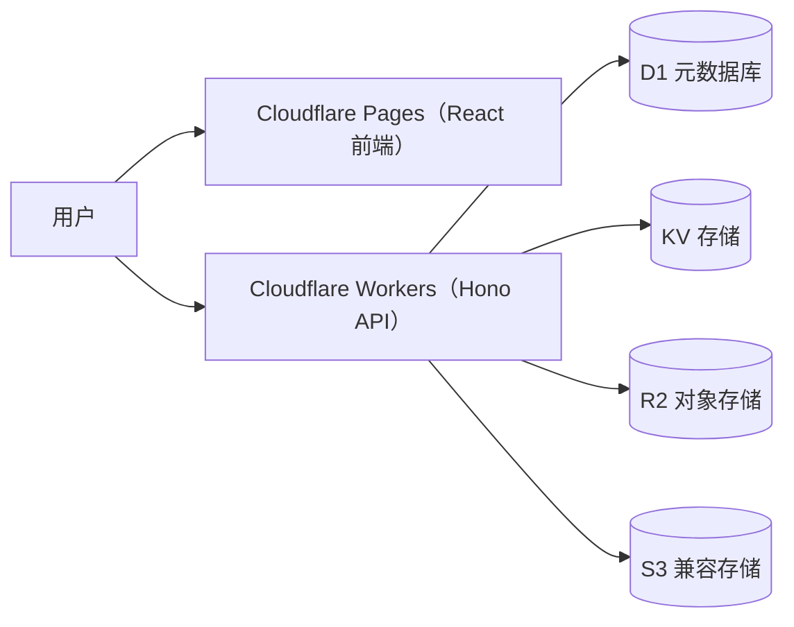
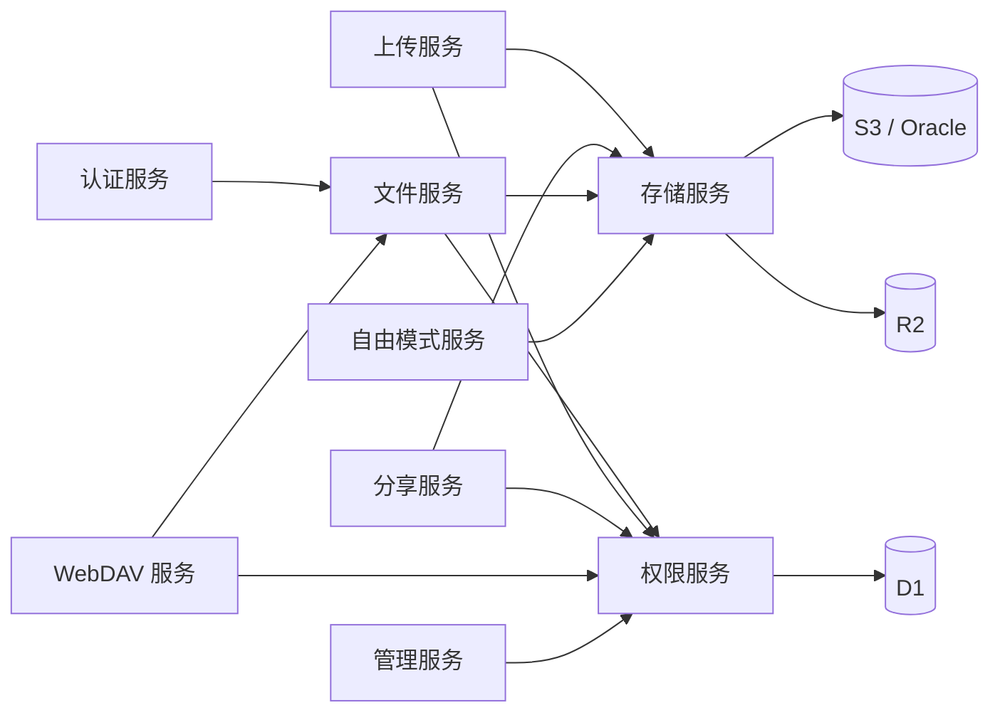

<div align="center">


# Picumet 系统架构

**多云对象存储管理平台**

[English](ARCHITECTURE.md) | 中文

</div>

## 概述

Picumet 是一个多云对象存储管理平台，全部运行在 Cloudflare 上。前端是 React 单页应用，由 Cloudflare Pages 托管；后端是跑在 Cloudflare Workers 上的 Hono API。API 把关系型元数据存在 D1 里，把短生命周期状态放在 KV 里，对象本身存放在 R2 或任何兼容 S3 协议的对象存储上，比如 AWS S3、Oracle Cloud。

后端按业务领域拆分，而不是按技术层次组织代码。每个服务自包含，自己带着 handlers、校验 schema、类型定义和领域逻辑。集中式的权限服务负责对每个请求做路径规则判定，存储服务把对象操作统一收在一层接口后面。这样跨服务的边界清晰，也不会出现循环依赖。

本文介绍组件拓扑、服务间依赖、关键设计决策、数据模型、存储提供商支持和安全设计。代码以 `workers/src/` 和 `frontend/src/` 为准。

## 开始之前

- 了解 Cloudflare Workers、D1、KV、R2 绑定。
- 了解 S3 协议和预签名 URL 的基本概念。
- 熟悉 TypeScript、React 和 Hono 框架。

## 架构图



服务间的依赖关系如下：



## 架构组件

| 组件 | 作用 |
| :--- | :--- |
| Cloudflare Pages | 托管 React 单页应用和静态资源。 |
| Cloudflare Workers | 承载实现全部业务逻辑的 Hono API。 |
| D1 | 存关系型元数据：用户、挂载点、文件、规则、会话、分享、配额和日志。 |
| KV | 缓存短期状态：CSRF 令牌、限流计数、自由模式的凭据会话。 |
| R2 | 通过 Workers 绑定存放主提供商的对象。 |
| S3 兼容提供商 | 通过 S3 协议存放 AWS S3 和 Oracle Cloud 的对象。 |
| Hono + Zod | 提供 HTTP 框架，并对每个 API 请求做运行时校验。 |
| React + TanStack Query | 渲染界面，管理服务端状态、缓存和变更。 |
| `services/` | 业务领域模块：认证、权限、文件、上传、分享、存储、WebDAV 等。 |
| `middleware/` | 横切关注点：认证、CSRF、限流、安全响应头、自由模式守卫。 |
| `db/` | 数据访问层，通过统一的 `Db` 接口同时覆盖 D1 和 `node:sqlite`。 |
| `shared/` | 公共类型、Zod schema、错误定义和统一响应格式。 |
| `utils/` | 路径、加密、SSRF、SMTP、Base64 等工具函数。 |

## 服务间依赖

上图遵循三条规则：

- 凡是碰文件数据的服务，都依赖权限服务。
- 凡是碰对象字节的服务，都依赖存储服务。
- 认证服务是叶子节点：只有别的服务调用它，它不依赖任何其他服务。

整体结构不允许循环依赖。`index.ts` 只做路由和中间件的装配，不写业务逻辑。公开路由先注册，兜底的路由文件服务最后注册，负责在 `GET /*` 上直出文件对象。

## 设计决策

| 决策 | 选择 | 备选方案 | 理由 |
| :--- | :--- | :--- | :--- |
| 代码组织 | 按业务领域划分服务 | 按技术层次分层 | 每个领域自包含、可单独测试；跨服务边界明确，循环依赖不会出现。 |
| 运行平台 | 只用 Cloudflare Workers + Pages | 其他边缘运行时或自建服务器 | D1、R2、KV 绑定免去运维成本，免费额度够用；单一运行时不用再写一层可移植的平台抽象。 |
| 数据库后端 | 生产用 D1，测试用 `node:sqlite` | 外部 PostgreSQL 或 Supabase | D1 零配置、延迟低；`Db` 抽象让测试套件在本地 `node:sqlite` 上运行，不依赖网络。 |
| 删除顺序 | 先删元数据，再删对象 | 对象和元数据一起删 | 元数据删除是一个 D1 原子事务，快且可靠；对象删除慢且可能失败，放在事务提交后尽力执行，失败就记成孤儿对象等对账清理。 |
| 回收站 | 不做：硬删除，前端二次确认 | 带保留期的回收站或隔离区 | S3 兼容存储没有统一的回收站语义，做回收站要额外维护墓碑和延迟清理，对当前规模收益不大。 |
| 路径边界 | 路径段级边界判断 | 字符串前缀匹配 | `isPathWithinBoundary` 要求边界后紧跟 `/`，防止 `/users/alice2` 匹配到 `/users/alice` 这类前缀攻击。 |
| 存储协议 | 统一一套 S3 协议凭据模型 | 每个厂商写原生 SDK | R2、AWS S3、Oracle 都讲 S3 协议，一套模型全覆盖；拒绝非 S3 协议（OSS、COS），省去维护多套驱动。 |
| 下载授权 | D1 原子消费的一次性令牌 | 长期有效的签名 URL | `DELETE ... RETURNING` 保证令牌只被消费一次，并发请求也复用不了；在网关处计数，下载次数准确。 |

## 服务明细

每个服务目录结构一致：`handlers.ts` 放 API handlers，`schemas.ts` 放 Zod 校验，`types.ts` 放 TypeScript 类型，领域逻辑视需要单独成文件。所有 API 入参都经过 Zod 校验。

### 认证服务

**职责**：用户注册、登录、登出，JWT 签发与验证，会话管理，邮箱验证，密码重置。

```
services/auth/
├── handlers.ts    // 登录、注册、登出 handlers
├── schemas.ts     // RegisterSchema、LoginSchema
└── types.ts       // JwtPayload 与请求类型
```

| 方法 | 路径 | 说明 |
| :--- | :--- | :--- |
| POST | `/api/auth/register` | 创建账号。 |
| POST | `/api/auth/login` | 认证并写入 HttpOnly JWT Cookie。 |
| POST | `/api/auth/logout` | 清除会话。 |
| GET | `/api/auth/me` | 返回当前用户信息。 |
| GET | `/api/auth/csrf-token` | 签发 CSRF 令牌。 |
| GET | `/api/auth/verify-email`、`/api/auth/verify` | 邮箱验证（别名）。 |
| POST | `/api/auth/forgot-password` | 发起找回密码。 |
| POST | `/api/auth/reset-password` | 重置密码。 |

**依赖**：`middleware/auth.ts`、`middleware/rate-limit.ts`、`middleware/csrf.ts`、`utils/crypto.ts`、`utils/smtp.ts`，以及用户、配额、设置、日志等仓库。

### 权限服务

**职责**：核心权限判定算法 `checkPermission`，路径规则查询与匹配，主体（Principal）构造，权限校验。

```
services/permissions/
├── check.ts       // 核心算法、规则排序、规则加载
├── principal.ts   // 从 Hono 上下文构造 Principal，requirePermission、can
└── types.ts       // 权限相关类型
```

判定顺序从高到低：

1. 管理员特权。
2. 挂载边界检查。
3. 用户根路径限制。对 `users` / `public` 可见性文件的 `read` / `download` 豁免 `defaultPath` 边界；写入类操作永不豁免。
4. API 密钥权限范围，取密钥权限与规则权限的交集。
5. 路径规则。可见性合成规则（`users` / `public` 的读和下载）与存量规则走同一条排序管线；来源（origin）优先级 `admin` > `user` > `system`，同来源内再按主体特异度、路径特异度、显式优先级、effect 排序。
6. 文件所有者权限回退。
7. 默认拒绝。

两个关键安全边界：

- `isPathWithinBoundary` 按路径段比较，不用 `startsWith`。
- API 密钥没有匹配规则时直接拒绝，系统不会默认放行。
- 可见性只放宽读和下载：所有写入类判定和路径边界不受可见性影响，deny 规则始终压制合成规则。

**依赖**：`utils/path.ts`、规则仓库、`shared/errors.ts`。

### 文件服务

**职责**：文件/文件夹列表、创建文件夹、文件详情、元数据更新（重命名）、删除、移动（Saga）、批量操作、密码验证、下载链接、多格式复制链接，以及 `GET /*` 公开路径直服。

```
services/files/
├── handlers.ts    // 列表、文件夹、详情、更新、密码验证、下载链接、复制链接
├── operations.ts  // 删除、移动、批量操作、任务状态
├── move.ts        // 移动 Saga（复制→校验→原子切换→异步清理源）
├── path-serve.ts  // 公开路径直服（{origin}{虚拟路径}）
├── schemas.ts     // Update、CreateFolder、Move、Batch、VerifyPassword
└── types.ts
```

复制链接：`GET /api/files/:id/copy-links` 返回 `formats: { direct, html, markdown, bbcode }`。`direct` 默认就是 `{origin}{虚拟路径}` 公开直链，由 `path-serve.ts` 直服；带 `?signed=true&expiresIn={秒}` 时改为提供商预签名 URL，拿不到预签名就回退网关令牌。

公开路径直服：`GET /*` 按虚拟路径流式返回对象。公开挂载无需登录直接可读；私有挂载需要已登录且有下载权限的用户；带密码的文件直接返回 `403`。

移动 Saga：`moveWithSaga` 先校验权限、冲突和循环，建任务，复制并校验对象，再原子切换元数据，最后异步清理源对象。主文件 API 和 WebDAV 的 `MOVE` 走同一条路径。

可见性与审核：文件有三级可见性——`private`（属主和管理员）、`users`（全站登录用户可读/下载）、`public`（审核通过后进匿名公开空间）。设为 `public` 需要属主具备 `can_publish` 能力位，否则进入 `pending` 审核队列；对文件夹设置会级联到其下所有条目。文件域的权限检查统一用文件全路径（`filePermPath`），保证用户按全路径创建的规则能命中；父目录规则仍通过模式匹配继承。

**依赖**：`permissions/principal.ts`、`storage/providers.ts`、`shares/tokens.ts`，以及文件、挂载、提供商、日志、任务等仓库。

### 上传服务

**职责**：上传会话管理、单文件直传、分片上传、Worker 代理上传、配额预留/释放、完成校验（HEAD 防伪造）、幂等保证。兼容 PicGo、PicList。

```
services/uploads/
├── handlers.ts    // 会话、代理上传、分片、完成、中止
├── compat.ts      // PicGo 兼容上传（Bearer API Key / multipart）
├── schemas.ts     // InitUploadSchema
└── types.ts
```

状态机：

- 单文件：`pending → uploading → verifying → completed`，终态含 `failed`、`expired`、`aborted`。
- 分片：`pending → uploading → parts_uploaded → completing → completed`。

**依赖**：`permissions/principal.ts`、`storage/providers.ts`、会话/配额/文件/挂载/对账仓库、`utils/path.ts`、`utils/crypto.ts`。

### 分享服务

**职责**：分享链接创建、列表、撤销，公开访问，密码验证，D1 原子消费的下载令牌，分享访问日志，下载网关。

```
services/shares/
├── handlers.ts    // 创建、列表、公开信息、下载、预览、撤销
├── gateway.ts     // /api/gateway/download/:token 流式代理
├── tokens.ts      // 下载令牌（D1 原子消费）
├── schemas.ts     // CreateShareSchema
└── types.ts
```

下载令牌：`consumeDownloadToken` 用 `DELETE ... RETURNING` 做单次原子消费，一次性令牌在并发下也无法重复使用。

**依赖**：`permissions/principal.ts`、`storage/providers.ts`、分享/文件/挂载/提供商/日志仓库、`utils/crypto.ts`。

### 存储服务

**职责**：存储提供商抽象（R2 绑定 / S3 协议），对象操作（HEAD、GET、PUT、DELETE、COPY、List），分片上传，预签名 URL，连通性测试，多提供商切换。

```
services/storage/
├── providers.ts   // 提供商工厂（getProvider、getProviderForMount）
├── r2.ts          // R2BindingProvider，基于 env.R2 绑定
├── s3.ts          // S3Provider（R2 S3 API / AWS S3 / Oracle）
├── errors.ts      // ProviderError 分类（not-found / auth / throttled / other）
├── range.ts       // Range 请求解析与 S3 Range 头构造
├── serve.ts       // serveObject 统一对象出站（200/206/416/502）
└── types.ts       // StorageProviderInterface 抽象接口
```

提供商选择：

- `type=r2` 且未配置 endpoint 的走 `R2BindingProvider`（本地或生产 R2 绑定）。
- 其余一律走 `S3Provider`，即 S3 协议客户端。

存储层统一处理跨提供商细节：对象出站统一走 `serveObject`，整体负责 Range 请求（命中返回 `206`，范围无效返回 `416`，上游失败按 `ProviderError` 分类返回 `502`）；批量删除按 S3 约定每批最多 1000 个对象，`Errors` 容器里的失败逐条上抛为 `ProviderError`，调用层回退为逐个删除；超过 5 GB 的复制（移动 Saga 的大文件路径）用 `UploadPartCopy` 分片复制；列表传 `Delimiter` 时把公共前缀聚合成虚拟目录。

**依赖**：提供商、挂载仓库，`utils/crypto.ts` 负责解密密钥。

### WebDAV 服务

**职责**：WebDAV 协议，兼容 PicGo、PicList：PROPFIND、GET/HEAD、PUT、DELETE、MKCOL、MOVE、OPTIONS。Basic 认证用 API 密钥。

```
services/webdav/
├── handlers.ts    // WebDAV 方法 handlers
└── types.ts       // WebDAVResource、PropfindRequest
```

安全要点：

- 每个方法都走 `permissions/principal.ts` 做路径级授权（PROPFIND 读、PUT 写、DELETE 删）。
- `MOVE` 复用 `files/move.ts` 的移动 Saga，不直接改 `file_metadata`。
- 写入目标必须落在密钥的上传根目录内（`assertWithinUploadRoot`）。
- XML href 统一经过 `escapeXml` 转义，防止注入和破坏 XML。
- Basic 认证格式为 `base64(keyId:secret)`。

**依赖**：`middleware/auth.ts`（API 密钥认证）、`permissions/principal.ts`、`storage/providers.ts`、`files/move.ts`、`utils/path.ts`、`utils/crypto.ts`。

### 自由模式服务

**职责**：用户自带对象存储凭据的临时会话（凭据加密写入 KV，短 TTL 自动清理）、文件列表、上传、删除、退出。

```
services/free-mode/
├── handlers.ts    // init、files、upload、object、logout
├── schemas.ts     // FreeModeInitSchema
└── types.ts
```

安全要点：

- `middleware/free-mode.ts` 做跨站防护（Origin + Sec-Fetch-Site）、会话级 CSRF、IP + 用户双层 fail-closed 限流。
- 路径和文件名校验拒绝 `..`、`~`、控制字符和反斜杠。
- `validateEndpoint` 对 endpoint 做 SSRF 校验。
- 凭据 AES-GCM 加密后写入 KV，接口不返回 `auth_token`，只给 `fm_token` 会话 ID。

**依赖**：`middleware/free-mode.ts`、`storage/providers.ts`、`utils/crypto.ts`、`utils/ssrf.ts`、`utils/path.ts`。

### 管理服务

**职责**：仪表板和统计、用户管理（含能力位）、全局分享、全部文件与公开审核、访问日志、系统设置、公告、存储提供商、挂载点、权限规则。

```
services/admin/
├── handlers.ts          // 仪表板、用户、分享、文件、日志、设置、公告
├── storage.ts           // 存储提供商、挂载点、权限规则
├── schemas.ts           // UserUpdate、Settings、Announcement
├── storage-schemas.ts   // Provider、Mount、Rule
└── types.ts
```

**依赖**：用户、分享、日志、设置、公告、提供商、挂载、规则等仓库，`storage/providers.ts`，`utils/ssrf.ts`。

### 用户设置服务

**职责**：个人资料、外观偏好、默认路径、修改密码，以及用户级访问规则。

```
services/users/
├── handlers.ts    // /me/settings GET/PUT、/me/password PUT
├── rules.ts       // /api/users/rules 创建、列出、撤销
├── rule-guard.ts  // 用户自建规则前置校验（can_grant、目标存在、权限面）
├── schemas.ts     // ProfileSchema、PasswordSchema
└── types.ts
```

**依赖**：用户、配额仓库，`utils/crypto.ts`。

### API 密钥服务

**职责**：API 密钥创建（密钥只显示一次）、列表、撤销、权限规则查询。

```
services/keys/
├── handlers.ts    // POST/GET/DELETE /api/keys、GET /api/keys/rules
├── schemas.ts     // CreateKeySchema
└── types.ts
```

安全要点：

- `uploadPath` 规范化后作为密钥上传根边界，拒绝 `..`、`~` 逃逸。
- 密钥 token 只在创建时显示一次，库里存的是 `sha256Hex` 哈希。

**依赖**：API 密钥、规则仓库，`utils/crypto.ts`、`utils/path.ts`。

### 公开服务

**职责**：站点设置、公告、健康检查、公开空间 gallery，无需认证。

```
services/public/
├── handlers.ts    // GET /api/public/settings、/announcements、/health
├── gallery.ts     // /api/gallery 匿名列表、下载链接、密码验证
└── types.ts
```

公开空间只返回 `visibility=public` 且审核状态 `approved` 的文件，直接按可见性过滤，不经过路径权限规则；下载复用分享下载令牌与网关（D1 原子消费），不另开鉴权面。

**依赖**：设置、公告仓库。

### 定时清理任务

**职责**：过期配额释放、移动源对象清理、过期分享标记、配额对账，由定时任务统一触发。

- `releaseExpiredReservations` 释放过期上传会话占用的配额预留。
- `cleanupOldObjects` 清理移动后遗留的源对象（`source_cleanup_pending` 标记）。
- `expireDueShares` 把到期的分享标记为过期。
- `reconcileQuotas` 纠正 `used_storage` 和 `used_files` 计数。
- `runScheduledTasks` 一次跑完四个任务，返回各自的处理数量。

**依赖**：会话、分享、文件、挂载、提供商、配额仓库，`storage/providers.ts`。

## 共享基础设施

跨服务的代码集中在四个地方：

- `shared/schemas.ts` 提供公共 Zod schema：`PathSchema`、`FileNameSchema`、`PaginationSchema`、`UUIDSchema`、`PasswordSchema`。
- `shared/types.ts` 定义 `Principal`、`Mount`、`FileMetadata`、`Conditions`、`Env` 运行时绑定和 Hono 上下文变量。
- `shared/errors.ts` 定义 `ApiError`，带 `badRequest`、`unauthorized`、`forbidden`、`notFound`、`conflict`、`tooManyRequests`、`internal` 等静态构造。
- `shared/response.ts` 提供 `ok` 和 `error`，统一成 `{ success, data | error, timestamp }` 响应格式。

中间件层处理横切关注点：

| 中间件 | 作用 |
| :--- | :--- |
| `middleware/auth.ts` | `authMiddleware`、`optionalAuthMiddleware`、`apiKeyAuthMiddleware`、`adminMiddleware`，并暴露 `getDb`、`getClientIp`。 |
| `middleware/csrf.ts` | 对 Cookie 认证的写操作校验 CSRF 令牌。 |
| `middleware/rate-limit.ts` | KV 固定窗口限流。 |
| `middleware/free-mode.ts` | 自由模式的跨站、CSRF、限流守卫。 |
| `middleware/global.ts` | 初始化请求上下文、CORS、安全响应头。 |

`db/` 是唯一的数据访问层。`Db` 类要么包 D1 后端（生产环境 Workers），要么包 `node:sqlite` 后端（本地测试），业务代码不感知用的是哪个。领域仓库在 `db/repos/` 下：用户、配额、提供商、挂载、文件、会话、任务、规则、API 密钥、分享、日志、设置、公告、对账。

`utils/` 下有 `path.ts`（规范化、边界判断、模式匹配）、`crypto.ts`（JWT、bcrypt、AES-GCM）、`ssrf.ts`（endpoint 校验）、`smtp.ts`、`base64.ts`。

## 数据模型

D1 里存以下核心表：

| 表 | 作用 |
| :--- | :--- |
| `users` | 账号、角色、状态、默认路径、语言偏好、能力位。 |
| `user_quotas` | 已用和预留的存储、文件数、上限。 |
| `storage_providers` | S3 协议提供商配置，凭据加密存储。 |
| `mounts` | 把提供商映射到虚拟路径，带排序偏好。 |
| `file_metadata` | 文件和文件夹：对象键、路径、大小、etag、属主、可见性、审核状态、自定义属性。 |
| `upload_sessions` | 记录上传进度、分片和预留配额。 |
| `operation_jobs` | 异步的移动、复制、删除任务。 |
| `path_rules` | 挂在挂载点上的权限规则，带来源（admin/user/system）与创建者。 |
| `api_keys` | API 密钥，含权限、协议和上传根目录。 |
| `shares` | 分享链接，含密码、过期时间和访问限制。 |
| `download_tokens` | 一次性下载令牌，原子消费。 |
| `access_logs` | 上传、下载、删除、分享、密码验证等操作日志。 |
| `system_settings` | 键值形式的站点设置。 |
| `announcements` | 站点公告，以及每用户关闭记录。 |
| `reconciliation_reports` | 对象与数据库对账产生的报告。 |
| `orphan_objects` | 删除失败的对象，等待重试。 |

迁移脚本在 `workers/migrations/` 下：

- `0001_initial.sql` 建基础表结构。
- `0002_add_parts_and_download_tokens.sql` 加分片字段和 `download_tokens` 表。
- `0003_mount_id_and_session_version.sql` 加挂载隔离和会话撤销字段。
- `0004_smtp_and_otp.sql` 加 SMTP 和一次性密码（OTP）邮箱验证。
- `0005_provider_type_unify.sql` 提供商类型收敛为 `r2`/`s3`（oracle 折叠为 s3），移除 `upload_domain` 字段。
- `0006_user_model.sql` 加文件可见性与审核状态（含索引）、规则来源与创建者、用户能力位（存量回填 `["can_share"]`）。

## 术语表

| 术语 | 定义 |
| :--- | :--- |
| Principal（主体） | 执行操作的实体：用户、角色或 API 密钥。 |
| Mount（挂载点） | 把存储提供商映射到虚拟路径，如 `/` 或 `/backup`。 |
| Provider（提供商） | 存储提供商，如 R2、AWS S3、Oracle Cloud。 |
| Path Rule（路径规则） | 针对特定路径模式的权限策略，挂在挂载点上。 |
| Object Key（对象键） | 对象在提供商存储桶里的实际存储路径。 |
| Canonical Path（规范化路径） | 标准化处理后的虚拟路径。 |
| Upload Session（上传会话） | 记录一次上传的状态和预留配额。 |
| Quota Reserved（预留配额） | 上传开始时锁定的存储空间，保证配额够用。 |
| Idempotency Key（幂等键） | 客户端生成的标识，防止重复操作。 |
| Download Token（下载令牌） | 短期有效的授权令牌，一次下载一个。 |
| Share Link（分享链接） | 让文件通过公开或密码访问的短链接。 |

## 存储提供商能力矩阵

支持的提供商：

| 提供商 | 状态 | 协议 | 说明 |
| :--- | :--- | :--- | :--- |
| Cloudflare R2 | 支持 | S3 | 免费额度每月 10GB 加 100 万次 A 类操作，无出站流量费。 |
| AWS S3 | 支持 | S3 | 标准 S3 协议。 |
| Oracle Cloud | 支持 | S3 | 兼容 S3 API；自定义域名需配合 CloudFront 等 CDN。 |
| 阿里云 OSS | 不支持 | OSS | 协议不兼容。 |
| 腾讯云 COS | 不支持 | COS | 协议不兼容。 |

能力矩阵：

| 能力 | R2 | S3 | Oracle |
| :--- | :--- | :--- | :--- |
| List Objects | 支持 | 支持 | 支持 |
| Head Object | 支持 | 支持 | 支持 |
| Get Object | 支持 | 支持 | 支持 |
| Range Get | 支持 | 支持 | 支持 |
| Put Object | 支持 | 支持 | 支持 |
| Multipart Upload | 支持 | 支持 | 支持 |
| Abort Multipart | 支持 | 支持 | 支持 |
| Copy Object | 支持 | 支持 | 支持 |
| Delete Object | 支持 | 支持 | 支持 |
| 预签名 URL | 支持 | 支持 | 支持 |
| 公开 URL | 支持 | 支持 | 支持 |
| 自定义域名 | 支持 | 支持 | 支持（需 CDN） |
| Checksum（MD5） | 支持 | 支持 | 支持 |

凭据模型：所有提供商共用一套 S3 协议配置，不做按提供商的 discriminated union。配置包含 `type`、`name`、`endpoint`、`region`、`bucket`、`accessKeyId`、`secretAccessKey`，可选 `publicDomain`、`pathPrefix`（`upload_domain` 已移除）。凭据用 AES-GCM 加密存储，只有构建提供商客户端时才解密。`type` 只保留 `r2` 和 `s3` 两个值：`endpoint` 为空的 `r2` 直接用 Workers 的 R2 绑定；`endpoint` 非空（含原 Oracle，已折叠为 `s3`）走 S3 协议客户端。`endpoint`、`accessKeyId`、`secretAccessKey` 三个字段必须同填或同空。

## 安全设计要点

安全模型在请求链路的每一层都做了纵深防御：

- **认证**：JWT 放在 HttpOnly Cookie 里，`SameSite=Strict`，客户端不写 `localStorage`。
- **会话撤销**：`users.session_version` 写入 JWT。登出、改密、重置密码、管理员禁用账号都会递增版本号，旧 JWT 立即失效。
- **挂载隔离**：`path_rules.mount_id` 把规则绑定到挂载点（`NULL` 表示全局）；权限查询按挂载过滤，同路径不同挂载的规则互不影响。
- **初始凭据**：生产环境必填 `ADMIN_PASSWORD`（至少 12 位强密码），未配置就 fail-closed 不创建管理员，没有硬编码默认凭据。
- **CSRF**：写操作要求 `X-CSRF-Token`，在 KV 里校验；API 密钥认证可绕过。
- **限流**：KV 固定窗口计数，认证和敏感写接口 fail-closed。
- **路径遍历**：`normalizePath` 加 `isPathWithinBoundary`，按路径段判断。
- **SSRF**：`validateEndpoint` 做 scheme、端口白名单，并拦截私网 IPv4/IPv6 段；部署时建议配合 egress 白名单。
- **对象投毒**：完成上传时强制 HEAD 校验，核对 ETag 和大小。
- **XSS**：文件名严格校验、React 自动转义、代码预览用 highlight.js 预转义。
- **SQL 注入**：全部使用参数化查询。
- **下载令牌**：D1 原子消费，一次性令牌不可复用。
- **分享下载计数**：签发令牌不计数，网关消费令牌时才计一次，超限返回 `410`。
- **分享密码**：`POST /api/shares/:id/verify` 种短期授权 Cookie，密码不进 URL。
- **可见性与审核**：文件三级可见性 `private` / `users` / `public`；`public` 须审核通过才进匿名 gallery，未具备 `can_publish` 能力的用户设 `public` 进入 `pending`。可见性只放宽 `read` / `download`，写入类判定与路径边界永不放宽。
- **属主绑定**：网关、WebDAV 与兼容通道按属主过滤文件，非属主一律 `404` 隐身，不泄露文件存在性。
- **大文件内存**：PicGo 兼容上传、WebDAV、自由模式都流式转发请求体，不整包进内存。
- **就绪探针**：`/api/public/health/live` 和 `/ready` 做探针；生产未初始化时业务接口返回 `503`。
- **CSP**：`script-src 'self' https://challenges.cloudflare.com`，不含 `unsafe-inline`。

## 相关文档

- [API 设计](API_CN.md) 查看接口和错误码细节。
- [页面设计](UI_CN.md) 查看前端页面和组件。
- [开发指南](DEVELOPMENT_CN.md) 查看本地环境和测试。
- [部署指南](DEPLOYMENT_CN.md) 查看 Workers 和 Pages 部署。
- [项目概览](../README_CN.md) 查看功能清单和路线图。
- [进度跟踪](PROGRESS.md) 查看当前实现状态。
