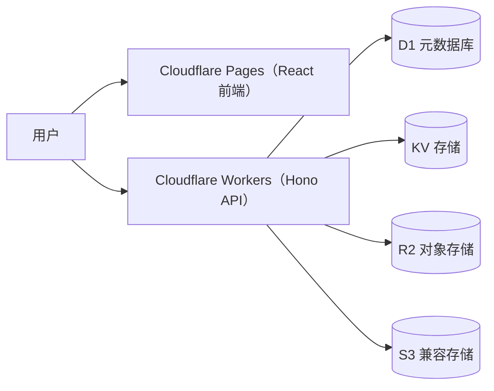
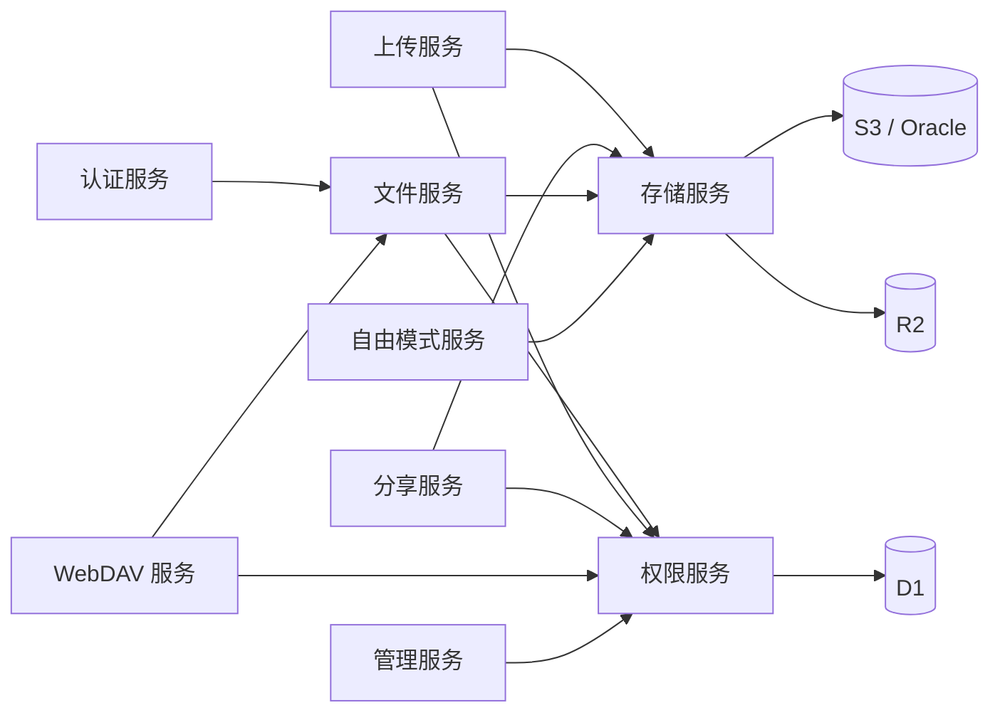

<div align="center">


# Picumet 系统架构

**多云对象存储管理平台**

[English](ARCHITECTURE.md) | 中文

</div>

## 概述

Picumet 是一个多云对象存储管理平台，全部运行在 Cloudflare 上。前端是 React 单页应用，由 Cloudflare Pages 托管；后端是跑在 Cloudflare Workers 上的 Hono API。API 把关系型元数据存在 D1 里，把短生命周期状态放在 KV 里，对象本身存放在 R2 或任何兼容 S3 协议的对象存储上，比如 AWS S3、Oracle Cloud。

后端按业务领域拆分，而不是按技术层次组织代码。每个服务自包含，自己带着 handlers、校验 schema、类型定义和领域逻辑。集中式的权限服务负责对每个请求做路径规则判定，存储服务把对象操作统一收在一层接口后面。这样跨服务的边界清晰，也不会出现循环依赖。

本文介绍组件拓扑、服务间依赖、关键设计决策、数据模型、存储提供商支持和安全设计。代码以 `workers/src/` 和 `frontend/src/` 为准。

## 开始之前

- 了解 Cloudflare Workers、D1、KV、R2 绑定。
- 了解 S3 协议和预签名 URL 的基本概念。
- 熟悉 TypeScript、React 和 Hono 框架。

## 架构图



服务间的依赖关系如下：



## 架构组件

| 组件 | 作用 |
| :--- | :--- |
| Cloudflare Pages | 托管 React 单页应用和静态资源。 |
| Cloudflare Workers | 承载实现全部业务逻辑的 Hono API。 |
| D1 | 存关系型元数据：用户、挂载点、文件、规则、会话、分享、配额和日志。 |
| KV | 缓存短期状态：CSRF 令牌、限流计数、自由模式的凭据会话。 |
| R2 | 通过 Workers 绑定存放主提供商的对象。 |
| S3 兼容提供商 | 通过 S3 协议存放 AWS S3 和 Oracle Cloud 的对象。 |
| Hono + Zod | 提供 HTTP 框架，并对每个 API 请求做运行时校验。 |
| React + TanStack Query | 渲染界面，管理服务端状态、缓存和变更。 |
| `services/` | 业务领域模块：认证、权限、文件、上传、分享、存储、WebDAV 等。 |
| `middleware/` | 横切关注点：认证、CSRF、限流、安全响应头、自由模式守卫。 |
| `db/` | 数据访问层，通过统一的 `Db` 接口同时覆盖 D1 和 `node:sqlite`。 |
| `shared/` | 公共类型、Zod schema、错误定义和统一响应格式。 |
| `utils/` | 路径、加密、SSRF、SMTP、Base64 等工具函数。 |

## 服务间依赖

上图遵循三条规则：

- 凡是碰文件数据的服务，都依赖权限服务。
- 凡是碰对象字节的服务，都依赖存储服务。
- 认证服务是叶子节点：只有别的服务调用它，它不依赖任何其他服务。

整体结构不允许循环依赖。`index.ts` 只做路由和中间件的装配，不写业务逻辑。公开路由先注册，兜底的路由文件服务最后注册，负责在 `GET /*` 上直出文件对象。

## 设计决策

| 决策 | 选择 | 备选方案 | 理由 |
| :--- | :--- | :--- | :--- |
| 代码组织 | 按业务领域划分服务 | 按技术层次分层 | 每个领域自包含、可单独测试；跨服务边界明确，循环依赖不会出现。 |
| 运行平台 | 只用 Cloudflare Workers + Pages | 其他边缘运行时或自建服务器 | D1、R2、KV 绑定免去运维成本，免费额度够用；单一运行时不用再写一层可移植的平台抽象。 |
| 数据库后端 | 生产用 D1，测试用 `node:sqlite` | 外部 PostgreSQL 或 Supabase | D1 零配置、延迟低；`Db` 抽象让测试套件在本地 `node:sqlite` 上运行，不依赖网络。 |
| 删除顺序 | 先删元数据，再删对象 | 对象和元数据一起删 | 元数据删除是一个 D1 原子事务，快且可靠；对象删除慢且可能失败，放在事务提交后尽力执行，失败就记成孤儿对象等对账清理。 |
| 回收站 | 不做：硬删除，前端二次确认 | 带保留期的回收站或隔离区 | S3 兼容存储没有统一的回收站语义，做回收站要额外维护墓碑和延迟清理，对当前规模收益不大。 |
| 路径边界 | 路径段级边界判断 | 字符串前缀匹配 | `isPathWithinBoundary` 要求边界后紧跟 `/`，防止 `/users/alice2` 匹配到 `/users/alice` 这类前缀攻击。 |
| 存储协议 | 统一一套 S3 协议凭据模型 | 每个厂商写原生 SDK | R2、AWS S3、Oracle 都讲 S3 协议，一套模型全覆盖；拒绝非 S3 协议（OSS、COS），省去维护多套驱动。 |
| 下载授权 | D1 原子消费的一次性令牌 | 长期有效的签名 URL | `DELETE ... RETURNING` 保证令牌只被消费一次，并发请求也复用不了；在网关处计数，下载次数准确。 |

## 服务明细

每个服务目录结构一致：`handlers.ts` 放 API handlers，`schemas.ts` 放 Zod 校验，`types.ts` 放 TypeScript 类型，领域逻辑视需要单独成文件。所有 API 入参都经过 Zod 校验。每个服务还带一份 `README.md` 记录职责与契约（admin、auth、files、free-mode、keys、permissions、public、shares、storage、uploads、users、webdav 共 12 个；`alist/`、`s3gw/` 与单文件 `cleanup.ts` 尚未补）。

### 认证服务

**职责**：用户注册、登录、登出，JWT 签发与验证，会话管理，邮箱验证，密码重置。

```
services/auth/
├── handlers.ts    // 登录、注册、登出 handlers
├── schemas.ts     // RegisterSchema、LoginSchema
└── types.ts       // JwtPayload 与请求类型
```

| 方法 | 路径 | 说明 |
| :--- | :--- | :--- |
| POST | `/api/auth/register` | 创建账号。 |
| POST | `/api/auth/login` | 认证并写入 HttpOnly JWT Cookie。 |
| POST | `/api/auth/logout` | 清除会话。 |
| GET | `/api/auth/me` | 返回当前用户信息。 |
| GET | `/api/auth/csrf-token` | 签发 CSRF 令牌。 |
| GET | `/api/auth/verify-email`、`/api/auth/verify` | 邮箱验证（别名）。 |
| POST | `/api/auth/forgot-password` | 发起找回密码。 |
| POST | `/api/auth/reset-password` | 重置密码。 |

**依赖**：`middleware/auth.ts`、`middleware/rate-limit.ts`、`middleware/csrf.ts`、`utils/crypto.ts`、`utils/smtp.ts`，以及用户、配额、设置、日志等仓库。

### 权限服务

**职责**：核心权限判定算法 `checkPermission`，路径规则查询与匹配，主体（Principal）构造，权限校验。

```
services/permissions/
├── check.ts       // 核心算法、规则排序、规则加载
├── principal.ts   // 从 Hono 上下文构造 Principal，requirePermission、can
└── types.ts       // 权限相关类型
```

判定顺序从高到低：

1. 管理员特权。
2. 挂载边界检查。
3. 用户根路径限制。对 `users` / `public` 可见性文件的 `read` / `download` 豁免 `defaultPath` 边界；写入类操作永不豁免。
4. API 密钥权限范围，取密钥权限与规则权限的交集。
5. 路径规则。可见性合成规则（`users` / `public` 的读和下载）与存量规则走同一条排序管线；来源（origin）优先级 `admin` > `user` > `system`，同来源内再按主体特异度、路径特异度、显式优先级、effect 排序。
6. 文件所有者权限回退。
7. **桶级默认角色权限矩阵（§31）**：封闭集合，限定「文件实际落桶」的 provider——该 (挂载点, 落桶, 角色) 有条目时，未列出的动作直接拒绝；无条目不介入。写路径在放置的候选成员循环里判定，候选桶矩阵不允许该动作即跳过候选（等价「放不下」）。
8. **挂载点级默认角色权限矩阵（§28）**：比桶级更泛的封闭集合，`mount_role_permissions(mount_id, role)`；同样「有条目即封闭」。
9. 用户默认路径权限（角色默认权限矩阵）。
10. 默认拒绝。

两层矩阵与落桶 `providerId` 由 `principal.ts` 按请求查库并缓存后传入 `checkPermission`——引擎内部不查库，热路径零额外查询；不传 `providerId` 时与既有行为完全一致。

**角色默认权限（用户权限模型）**：`role_defaults.permissions` 是角色的默认权限清单（`read` / `write` / `update` / `delete` / `download` 五项矩阵；**`share` 不在其中**——分享开关是能力位 `can_share`，避免同一件事两处设置）。内置角色种子：`admin` 与 `user` = 全部五项 + `capabilities=['can_share']`，`guest` = 仅 `download`。**用户级覆盖**：`users.permissions`（NULL = 跟随角色）；优先级 `users.permissions` → `role_defaults.permissions` → 常量表 `DEFAULT_ROLE_PERMISSIONS`。`getPrincipal` 把生效清单装到 `Principal.defaultPermissions`；判定流程里「自有空间回退（用户默认路径权限）」按它放行（`share` 动作在自有空间内沿用既有放行语义）。管理端「默认用户设置」可编辑矩阵、能力位、别名与默认路径/配额，**保存角色默认会覆盖该角色全部成员的个别设置**（含 `users.permissions`）。角色另有**别名**（`role_defaults.alias`，如「管理员」），规则主体除角色名外也接受该别名（`loadPrincipalRules` 解析为角色后并入候选）。

**游客可见性（文件级）**：`file_metadata.guest_visibility` 为 `NULL` / `none` / `download` / `view`，未设置时跟随角色默认——即**游客默认只能下载**。判定时由 `syntheticGuestRule` 把文件的游客可见性合成一条 allow 规则并入候选集：`download` 放行下载，`view` 放行查看（列表/预览）与下载，`none` 不放行任何操作。文件属性面板的「用户权限默认设置」是它的唯一配置入口。

**密码保护（文件级）**：密码保护只有文件级。带密码的文件在所有内容出口返回 `403 PASSWORD_REQUIRED`，直到其访问密码经 `POST /api/files/{id}/verify-password` 验证——该端点要求对文件具备 `download` 权限（与获取下载链接同一道闸门），校验通过后签发带 `passwordVerified` 标记的网关令牌。规则条件字段（`requirePassword`、`passwordHash`、IP 条件）已不再接受创建入参；引擎对仍带条件的存量规则保持 fail-closed——这类规则一律拒绝请求，唯一显式传入 conditions 的生产调用方是文件密码验证流程（传入真实客户端 IP 与 `passwordVerified: true`）。

两个关键安全边界：

- `isPathWithinBoundary` 按路径段比较，不用 `startsWith`。
- API 密钥没有匹配规则时直接拒绝，系统不会默认放行。
- 可见性只放宽读和下载：所有写入类判定和路径边界不受可见性影响，deny 规则始终压制合成规则。
- 游客可见性同样只放宽读与下载，并且**不越过挂载边界**；分享链接（`/api/shares/*`）语义独立，不受游客可见性影响。

**依赖**：`utils/path.ts`、规则仓库、`shared/errors.ts`。

### 文件服务

**职责**：文件/文件夹列表、创建文件夹、文件详情、元数据更新（重命名）、删除、移动（Saga）、批量操作、密码验证、下载链接、多格式复制链接，以及 `GET /*` 公开路径直服。

```
services/files/
├── handlers.ts    // 列表、文件夹、详情、更新、密码验证、下载链接、复制链接
├── operations.ts  // 删除、移动、批量操作、任务状态
├── move.ts        // 移动 Saga（复制→校验→原子切换→异步清理源）
├── path-serve.ts  // 公开路径直服（{origin}{虚拟路径}）
├── schemas.ts     // Update、CreateFolder、Move、Batch、VerifyPassword
└── types.ts
```

复制链接：`GET /api/files/:id/copy-links` 返回 `formats: { direct, html, markdown, bbcode }`。`direct` 默认就是 `{origin}{虚拟路径}` 公开直链，由 `path-serve.ts` 直服；带 `?signed=true&expiresIn={秒}` 时改为提供商预签名 URL，拿不到预签名就回退网关令牌。

公开路径直服：`GET /*` 按虚拟路径流式返回对象。公开挂载无需登录直接可读；私有挂载需要已登录且有下载权限的用户；带密码的文件直接返回 `403`。

移动 Saga：`moveWithSaga` 先校验权限、冲突和循环，建任务，复制并校验对象，再原子切换元数据，最后异步清理源对象。主文件 API 和 WebDAV 的 `MOVE` 走同一条路径。任务状态机：`operation_jobs.state_data.phase` 依次为 `init → copying → verifying → committing`，`progress` 对应 0 → 70 → 90 → 100；`GET /api/files/jobs/:jobId` 对外只返回 `id` / `type` / `status` / `progress` / `errorMessage` / `createdAt` / `completedAt`，phase 属服务端内部状态。

可见性与审核：文件有三级可见性——`private`（属主和管理员）、`users`（全站登录用户可读/下载）、`public`（审核通过后进匿名公开空间）。设为 `public` 需要属主具备 `can_publish` 能力位，否则进入 `pending` 审核队列；对文件夹设置会级联到其下所有条目。文件域的权限检查统一用文件全路径（`filePermPath`），保证用户按全路径创建的规则能命中；父目录规则仍通过模式匹配继承。

**文件封禁（§N）**：`file_metadata.banned` 由管理员经 `PUT /api/admin/files/:id/ban` 设置；`services/files/ban.ts` 的 `assertNotBanned` 接入全部内容出口（文件下载、`path-serve.ts` 直服、分享下载/预览、下载网关），命中即抛 `429 FILE_BANNED`。封禁**不拦截删除**——属主与管理员仍可删除被封禁文件；删除流程不做封禁检查。用户侧仅是展示层幽灵态（半透明 + 菜单仅剩删除），真正的拦截在服务端。

**依赖**：`permissions/principal.ts`、`storage/providers.ts`、`shares/tokens.ts`，以及文件、挂载、提供商、日志、任务等仓库。

### 上传服务

**职责**：上传会话管理、单文件直传、分片上传、Worker 代理上传、配额预留/释放、完成校验（HEAD 防伪造）、幂等保证。兼容 PicGo、PicList。

```
services/uploads/
├── handlers.ts    // 会话、代理上传、分片、完成、中止
├── compat.ts      // PicGo 兼容上传（Bearer API Key / multipart）
├── schemas.ts     // InitUploadSchema
└── types.ts
```

状态机：

- 单文件：`pending → uploading → verifying → completed`，终态含 `failed`、`expired`、`aborted`。
- 分片：`pending → uploading → parts_uploaded → completing → completed`。

**依赖**：`permissions/principal.ts`、`storage/providers.ts`、会话/配额/文件/挂载/对账仓库、`utils/path.ts`、`utils/crypto.ts`。

### 分享服务

**职责**：分享链接创建、列表、撤销，公开访问，密码验证，D1 原子消费的下载令牌，分享访问日志，下载网关。

```
services/shares/
├── handlers.ts    // 创建、列表、公开信息、下载、预览、撤销
├── gateway.ts     // /api/gateway/download/:token 流式代理
├── tokens.ts      // 下载令牌（D1 原子消费）
├── schemas.ts     // CreateShareSchema
└── types.ts
```

**密码可回看**：创建分享时密码同时写 `password_hash`（校验用）与 `password_cipher`（AES-GCM 密文，`enc:` 前缀，与存储凭据同一套加密）；**只有创建者自己的列表接口** `GET /api/shares` 会解密返回 `password` 明文，公开接口（详情/目录/下载/预览）一律不下发明文或密文。密文缺失或解密失败时该字段省略，接口不报错。带密码的分享支持 `?password=<明文>` 直进（等价于已验证，错误 401）。

下载令牌：`consumeDownloadToken` 用 `DELETE ... RETURNING` 做单次原子消费，一次性令牌在并发下也无法重复使用。

**访问模式判定**：`decideAccessMode` 只有两类结果——provider 能给出公网直链**且文件无密码**时返回 `public_cdn`，其余一律 `private_gateway`（Workers 网关代理）。调用点：复制链接（`files/handlers.ts`）、公开路径直服（`files/path-serve.ts`）、AList 直链（`alist/handlers.ts`）。

**依赖**：`permissions/principal.ts`、`storage/providers.ts`、分享/文件/挂载/提供商/日志仓库、`utils/crypto.ts`。

### 存储服务

**职责**：存储提供商抽象（R2 绑定 / S3 协议），对象操作（HEAD、GET、PUT、DELETE、COPY、List），分片上传，预签名 URL，连通性测试，多提供商切换。

```
services/storage/
├── providers.ts   // 提供商工厂（getProvider、getProviderForMount）
├── r2.ts          // R2BindingProvider，基于 env.R2 绑定
├── s3.ts          // S3Provider（R2 S3 API / AWS S3 / Oracle）
├── errors.ts      // ProviderError 分类（not-found / auth / throttled / other）
├── range.ts       // Range 请求解析与 S3 Range 头构造
├── serve.ts       // serveObject 统一对象出站（200/206/416/502）
└── types.ts       // StorageProviderInterface 抽象接口
```

提供商选择：

- `type=r2` 且未配置 endpoint 的走 `R2BindingProvider`（本地或生产 R2 绑定）。
- 其余一律走 `S3Provider`，即 S3 协议客户端。

存储层统一处理跨提供商细节：对象出站统一走 `serveObject`，整体负责 Range 请求（命中返回 `206`，范围无效返回 `416`，上游失败按 `ProviderError` 分类返回 `502`）；批量删除按 S3 约定每批最多 1000 个对象，`Errors` 容器里的失败逐条上抛为 `ProviderError`，调用层回退为逐个删除；超过 5 GB 的复制（移动 Saga 的大文件路径）用 `UploadPartCopy` 分片复制；列表传 `Delimiter` 时把公共前缀聚合成虚拟目录。

**内容哈希寻址（§F）**：写入统一走 `services/storage/content.ts` 与 `services/files/write.ts`，物理对象按内容 SHA-256 命名（`<prefix>/picumet:blob/<h2>/<hash>`，命名空间带 `:` 前缀段，与用户虚拟路径键不可能冲突），同内容在文件之间共享：

- 写入策略：S3 网关整包校验（SigV4）时哈希已知——库内已有内容则完全跳过落对象，否则直写内容键；流式写入（WebDAV/兼容上传/AList/Worker 代理）走暂存键 + 流式哈希，去重命中删除暂存，未命中复制到内容键后删除暂存。
- 文件行同时保存虚拟对象键 `object_key`（唯一标识/占用判定）与物理键 `physical_key` + 内容哈希 `blob_hash`；读/删/移动按物理键定位，因此重命名与移动是纯元数据操作、不再复制对象。
- 引用释放：删除/覆盖写在**同一批 SQL** 内用 `NOT EXISTS (SELECT 1 FROM file_metadata WHERE blob_hash = ?)` 判定最后一个引用，归零则把对象写入 `blob_gc` 回收队列；定时任务带保护期删除，删除前复查引用，失败累加 `attempts` 重试。
- 分片上传（上传会话 multipart）不经内容寻址：分片直传存储商，物理键仍为虚拟路径键（`blob_hash` 为空），删除按独占对象处理。
- 配额仍按逻辑大小计算（每个文件各计其 size），容量闸门保持保守语义。

**读路径容灾（§G）**：对象读取统一走 `services/storage/failover.ts` 的 `serveFileObject` / `getFileObject`。文件在库内记录的落桶取不到对象（404）或上游故障（502/`ProviderError`）时，按「KV 命中提示 → 文件落桶 → 其余池成员（weight 降序）」依次轮询同一挂载点的其他桶（上限 4 个候选）；每次尝试有 8 秒上限，主桶连接悬挂不会拖死读请求。三项加固：**熔断**——上游故障的桶写 `pool:down:<providerId>`（45 秒 TTL），本轮排到候选末尾（仍保留一次兜底尝试 = 恢复探测），命中即清标记；**对象缺失不熔断**（数据状态而非桶健康）；**回退内容校验**——非记录桶命中后按元数据 `size` 复核（记录侧未记大小或上游未回报大小时放行），不符视作未命中（宁可 404 也不给旧/坏内容），etag 因跨后端语义不同不参与判定。在副桶命中后写入 `serve:loc:<fileId>`（值含提供方 id 与物理键指纹，10 分钟 TTL、命中即续期），后续请求直接优先访问该桶；文件被改写后指纹不匹配提示自动失效，记录桶重新供数时主动清除提示。**镜像豁免**：旧对象清理与内容对象回收只对「文件落桶」/索引登记的 provider 发删除，池内其余成员（副桶/镜像，由外部同步通道维护）永不是删除目标。跨桶「复制」不在此层——把对象真正写进副桶由未来的 Go 后端负责。 管理员界面计划提供每挂载点的「自动跨桶同步」开关——仅在 Go 后端环境可勾选，当前 Node/Workers 后端不支持该能力（界面禁用态），池化（§E）与读容灾（§G）不依赖它即可工作。

**挂载点皆目录（§H）**：非根挂载点在**父挂载点命名空间**内维护一行 folder 记录（`id = 'mountfolder:<mountId>'`、`path` = **自身全路径**（与 `services/files/handlers.ts` 创建文件夹的约定一致）、`name` = 挂载路径末段、`object_key = 'folder:<绝对路径>'`、`custom_title` = 挂载显示名），因此文件页、分享选择器、公开目录、WebDAV、AList 等所有「按路径列目录」的入口都能看到挂载点，无需各自做合成。三处自愈：列目录、管理端挂载页、定时任务（幂等）；管理端的挂载创建/改路径/删除会即时登记、迁移或清理该行。为保护挂载点，`isMountPointFile` / `containsMountPointFile` 会拒绝重命名/移动/删除挂载点目录行以及包含挂载点的父目录（409）。

> 踩坑记录：该行最初把 `path` 写成了**父目录**，而 folder 行的约定是 `path = 自身全路径`——文件树据此把挂载点目录当成根节点、反复展开同一层，导致进入 `/files` 卡死。已修正，并由迁移第 20 段修复存量行（`UPDATE ... SET path = substr(object_key, 8) WHERE type='folder' AND object_key LIKE 'folder:/%' AND path <> substr(object_key, 8)`），回归由 `mount-folders.test.ts` 覆盖。

**写入口模式与默认角色矩阵（§28）**：挂载点新增两项面向「公共上传区」的能力。`mounts.upload_mode` 约束写路径：`free`（默认，现状）、`user_space`（写路径强制落在 `<mountPath>/<用户名>`，该目录首次使用自动创建；用户名唯一故跨用户零冲突，用户改名后旧目录留在原处）、`flat`（挂载点内禁止新建文件夹，平铺上传；同名占用仍走既有 409「目标路径已被其他用户占用」，命名唯一性由 `object_key`（挂载内相对路径）保证，内容哈希只对物理对象去重）。`mount_role_permissions` 是挂载点 × 角色的默认权限矩阵（`role` ∈ admin/user/guest，动作词表 read/write/update/delete/download）：判定插在「文件所有者回退」之后、「角色默认权限」之前，条目存在即**封闭集合**（未列出即拒），无条目回落角色默认权限，`share` 不参与矩阵（分享是能力位 can_share），显式 `path_rules`（任何 origin）恒优先。约束统一落在 `files/write.ts` 的写入前置校验上，所以 `/api/upload`、兼容上传、WebDAV PUT/MKCOL、S3 网关、AList 的行为一致。

**拼好桶放置策略（§29）**：写路径选桶（`mounts.pool_strategy`）扩到五档：`least_used`（已用最小，评分 `(已用+1)/权重`）、`round_robin`、`hash`（**目录粘性**——对父目录路径哈希，同目录文件落同一桶，按前缀列举/定位连续；成员集不变则落桶确定）、`free_weighted`（`(成员容量−已用)×权重` 最大者；`mount_providers.capacity_bytes` 留空 = 不限且优先于任何有限余量；**全部成员满 → 413**，fail closed 不静默超容量写）、`ordered`（按 `mount_providers.sort_order` 升序取第一个未满成员，未配容量即不限 → 永远选它）。`weight` 与 `sort_order` 分工明确：前者是 `least_used`/`free_weighted` 的加权系数，后者是 `ordered` 的队列次序。五档都只影响新写入——读/删按 `file_metadata.provider_id` 定位，存量文件不迁移。管理端在挂载点表单里选择策略，并可为每个池成员配容量上限与上传顺序。

**池成员容量是硬上限（§30）**：成员容量不能用「当前是否已满」来判——判定式必须带上**本次待写大小**与**在途预留**：`已用(按 file_metadata 聚合) + mount_providers.quota_reserved + 本次大小 <= capacity_bytes`（`NULL` = 不限，不判满也不预留）。预留通过条件原子 UPDATE 完成，受影响行数为 0 即该成员此刻放不下 → 按策略次序试下一个候选，全部放不下才 413；因此策略只决定**候选次序**，不能绕过容量（`hash` 的目录粘性在容量不足时按回退次序让步）。预留生命周期与挂载点级 `quota_reserved` 一致：写入成功/失败/补偿、上传会话完成或过期都要释放。

**桶级默认角色矩阵与备用显式标记（§31）**：默认角色矩阵支持**按桶**配置（`mount_provider_role_permissions(mount_id, provider_id, role)`），判定优先级为 **桶级 → 挂载点级（§28）→ 角色默认**，两层都无则行为不变。落桶已知的动作（读/改/删/下载/分享）按**文件实际落桶**判定；写路径在放置的**候选成员循环**里判定——候选桶的矩阵不允许该动作就跳过该候选（等价于「放不下」），全部候选都不允许才 403，因此策略依旧只决定候选次序。`mount_providers.standby` 是**显式**「作为备用桶」标记，此前由「该桶对此挂载点 0 文件」推断——现已**完全移除推断路径**（被标记的桶即使持有文件也仍作为备用出现在图上，未标记的零文件成员不再被当作备用），挂载点视图里备用泳道会为每个备用挂载点渲染一行节点（琥珀空心环、不可展开、不接干线），点击定位到主桶泳道上的挂载点行。容量分两层且都是硬上限：桶级 `mount_providers.capacity_bytes`（放置判定，§30）与挂载点总上限 `mounts.max_storage`（写入配额），后者必须 ≤ 各桶上限之和（未设上限的桶不参与求和），违反返回 400。

**容灾候选只认桶**：读回退的候选一律来自 `mount_providers` → `storage_providers`（真正的独立桶），**文件夹（含挂载点目录、`备用文件夹` 这类用户目录）永远不会成为容灾候选**；跨桶复制同样只以桶为单位规划（见 §G）。「文件夹级备份」不构成容灾：同一桶内的副本与目录副本都不提供独立的故障域。

**依赖**：提供商、挂载仓库，`utils/crypto.ts` 负责解密密钥。

### S3 兼容网关服务

**职责**：SigV4 验签的 S3 REST 子集（挂载在 `/s3` 前缀），让 rclone、S3 SDK 与 S3 浏览器把 Picumet 当作 S3 兼容端点使用。

- 认证走网关密钥（`pk_*` / `sk_*`）。S3 验签需要可逆 secret：密钥创建时以 AES-GCM 加密落库（迁移 `0006`），存量密钥不支持 S3 面，需重建。
- `bucket` 是虚拟路径首段（挂载路径或密钥上传根的首段），`key` 是其余路径；`GET /s3` 列出密钥可达的 bucket。
- 操作面：PutObject、GetObject（Range）、HeadObject、DeleteObject、DeleteObjects、ListObjectsV2、ListBuckets 与 multipart。写入汇入统一写入路径（配额、目录行、内容寻址与主 API 一致），读取经读路径容灾（§G）。

**依赖**：网关密钥认证、`services/files/write.ts`、`services/storage/failover.ts`、日志仓库。

### AList 兼容服务

**职责**：实现 AList v3 REST 协议子集（挂载在 `/openlist` 前缀），供 PicList 内置的 AList 通道接入：login、fs/form（上传）、fs/list、fs/get（带签名直链）、fs/remove。

- 认证接受裸 token / Bearer / Basic；`login` 即网关密钥校验（`pk_*.sk_*`）。
- 上传与删除复用统一写入与删除路径；`fs/get` 的直链走 `/d` 签名链接。

**依赖**：网关密钥认证、`services/files/write.ts`、分享/文件仓库。

### WebDAV 服务

**职责**：WebDAV 协议，兼容 PicGo、PicList：PROPFIND、GET/HEAD、PUT、DELETE、MKCOL、MOVE、OPTIONS。Basic 认证用 API 密钥。

```
services/webdav/
├── handlers.ts    // WebDAV 方法 handlers
└── types.ts       // WebDAVResource、PropfindRequest
```

安全要点：

- 每个方法都走 `permissions/principal.ts` 做路径级授权（PROPFIND 读、PUT 写、DELETE 删）。
- `MOVE` 复用 `files/move.ts` 的移动 Saga，不直接改 `file_metadata`。
- 写入目标必须落在密钥的上传根目录内（`assertWithinUploadRoot`）。
- XML href 统一经过 `escapeXml` 转义，防止注入和破坏 XML。
- Basic 认证格式为 `base64(keyId:secret)`。

**依赖**：`middleware/auth.ts`（API 密钥认证）、`permissions/principal.ts`、`storage/providers.ts`、`files/move.ts`、`utils/path.ts`、`utils/crypto.ts`。

### 自由模式服务

**职责**：用户自带对象存储凭据的临时会话（凭据加密写入 KV，短 TTL 自动清理）、文件列表、上传、删除、退出。

```
services/free-mode/
├── handlers.ts    // init、files、upload、object、logout
├── schemas.ts     // FreeModeInitSchema
└── types.ts
```

安全要点：

- `middleware/free-mode.ts` 做跨站防护（Origin + Sec-Fetch-Site）、会话级 CSRF、IP + 用户双层 fail-closed 限流。
- 路径和文件名校验拒绝 `..`、`~`、控制字符和反斜杠。
- `validateEndpoint` 对 endpoint 做 SSRF 校验。
- 凭据 AES-GCM 加密后写入 KV，接口不返回 `auth_token`，只给 `fm_token` 会话 ID。

**依赖**：`middleware/free-mode.ts`、`storage/providers.ts`、`utils/crypto.ts`、`utils/ssrf.ts`、`utils/path.ts`。

### 管理服务

**职责**：仪表板和统计、用户管理（含能力位与个别权限覆盖）、全局分享（含设置弹窗数据）、全部文件（筛选/落桶位置/封禁）、公开审核、访问日志、系统设置、公告、存储提供商、挂载点（含容量）、权限规则。

```
services/admin/
├── handlers.ts          // 仪表板、用户、分享、文件（列表/审核/封禁）、日志、设置、公告
├── storage.ts           // 存储提供商、挂载点（capacityBytes）、权限规则
├── schemas.ts           // UserUpdate、Settings、Announcement、FileBan
├── storage-schemas.ts   // Provider、Mount、Rule
└── types.ts
```

仪表板与统计（`GET /api/admin/dashboard`、`/stats`）由 `db/repos/dashboard.ts` 聚合：顶层 `stats`（角色计数、文件数、占用空间、桶数、活跃挂载点、容量合计）+ 每挂载点 `mounts`（主桶/备用池成员/用量/文件数）+ `buckets` 桶泳道树（`bucketTree()`：按 `file_metadata.provider_id` 分桶的挂载点节点与零文件备用清单）+ `mountFolderSummary()`（挂载点展开层的顶层文件夹递归计数，按桶过滤），内存组装，禁止 N+1；全部文件列表的挂载点/桶/哈希富化同样按页批量 `IN` 查询。趋势序列（`GET /api/admin/dashboard/trends`）由 `DashboardRepo.trends()` 按 `downloads` / `shares` / `logins` 指标出时间桶计数，区间上限 2 年、桶数上限 400（超出 400 提示缩小范围或加粗粒度）。

**依赖**：用户、分享、日志、设置、公告、提供商、挂载、规则等仓库，`storage/providers.ts`，`utils/ssrf.ts`。

### 用户设置服务

**职责**：个人资料、外观偏好、默认路径、修改密码，以及用户级访问规则。

```
services/users/
├── handlers.ts    // /me/settings GET/PUT、/me/password PUT
├── rules.ts       // /api/users/rules 创建、列出、撤销
├── rule-guard.ts  // 用户自建规则前置校验（can_grant、目标存在、权限面）
├── schemas.ts     // ProfileSchema、PasswordSchema
└── types.ts
```

**依赖**：用户、配额仓库，`utils/crypto.ts`。

### API 密钥服务

**职责**：API 密钥创建（密钥只显示一次）、列表、撤销、权限规则查询。

```
services/keys/
├── handlers.ts    // POST/GET/DELETE /api/keys、GET /api/keys/rules
├── schemas.ts     // CreateKeySchema
└── types.ts
```

安全要点：

- `uploadPath` 规范化后作为密钥上传根边界，拒绝 `..`、`~` 逃逸。
- 密钥 token 只在创建时显示一次，库里存的是 `sha256Hex` 哈希。

**依赖**：API 密钥、规则仓库，`utils/crypto.ts`、`utils/path.ts`。

### 公开服务

**职责**：站点设置、公告、健康检查、公开空间 gallery，无需认证；另有站点 Logo / Favicon 中转（`/api/public/site-asset/:kind`，只中转当前配置的两个地址并做边缘缓存）。

```
services/public/
├── handlers.ts    // GET /api/public/settings、/announcements、/health
├── gallery.ts     // /api/gallery 匿名列表、下载链接、密码验证
└── types.ts
```

公开空间只返回 `visibility=public` 且审核状态 `approved` 的文件，直接按可见性过滤，不经过路径权限规则；下载复用分享下载令牌与网关（D1 原子消费），不另开鉴权面。

**依赖**：设置、公告仓库。

### 定时清理任务

**职责**：过期配额释放、移动源对象清理、过期分享标记、配额对账，由定时任务统一触发（`crons = ["*/10 * * * *"]`，每 10 分钟一轮）。

- `releaseExpiredReservations` 释放过期上传会话占用的配额预留。
- `cleanupOldObjects` 清理移动后遗留的源对象（`source_cleanup_pending` 标记）。
- `expireDueShares` 把到期的分享标记为过期。
- `reconcileQuotas` 纠正 `used_storage` 和 `used_files` 计数。
- `runScheduledTasks` 一次跑完四个任务，返回各自的处理数量。

**依赖**：会话、分享、文件、挂载、提供商、配额仓库，`storage/providers.ts`。

## 共享基础设施

跨服务的代码集中在四个地方：

- `shared/schemas.ts` 提供公共 Zod schema：`PathSchema`、`FileNameSchema`、`PaginationSchema`、`UUIDSchema`、`PasswordSchema`。
- `shared/types.ts` 定义 `Principal`、`Mount`、`FileMetadata`、`Conditions`、`Env` 运行时绑定和 Hono 上下文变量。
- `shared/errors.ts` 定义 `ApiError`，带 `badRequest`、`unauthorized`、`forbidden`、`notFound`、`conflict`、`tooManyRequests`、`internal` 等静态构造。
- `shared/response.ts` 提供 `ok` 和 `error`，统一成 `{ success, data | error, timestamp }` 响应格式。

中间件层处理横切关注点：

| 中间件 | 作用 |
| :--- | :--- |
| `middleware/auth.ts` | `authMiddleware`、`optionalAuthMiddleware`、`apiKeyAuthMiddleware`、`adminMiddleware`，并暴露 `getDb`、`getClientIp`。 |
| `middleware/csrf.ts` | 对 Cookie 认证的写操作校验 CSRF 令牌。 |
| `middleware/rate-limit.ts` | KV 固定窗口限流：全局按 IP（`rate_limit_requests_per_minute`，默认 50 次/分钟）与登录用户（×2）；认证接口独立 5 次/分钟/IP；自由模式另按会话 60 / 用户 120 次/分钟。仅生产环境生效，best-effort（KV 无原子自增）。 |
| `middleware/concurrency.ts` | 传输并发限制：上传各通道与下载网关按用户（未登录按 IP）限制同时在途请求数（`max_concurrent_transfers`，默认 4，0 = 不限），超限 429 `CONCURRENCY_LIMIT_EXCEEDED`；在途槽位存 `transfer_slots`（D1 串行写，计数可信），响应结束含异常都会释放，超 30 分钟视为泄漏。 |
| `middleware/download-limit.ts` | 下载限速：只对下载类请求（下载网关、分享下载/预览、文件下载链接、公开目录直链）按用户（未登录按 IP）计每分钟次数（`rate_limit_downloads_per_minute`，默认 120，0 = 不限），超限 429；挂在受保护 API / 分享 API / 网关 / 公开目录四处，中间件内部按路径窄化；非生产环境跳过、存储异常 fail-open。 |
| `middleware/free-mode.ts` | 自由模式的跨站、CSRF、限流守卫。 |
| `middleware/global.ts` | 初始化请求上下文、CORS、安全响应头。 |

`db/` 是唯一的数据访问层。`Db` 类要么包 D1 后端（生产环境 Workers），要么包 `node:sqlite` 后端（本地测试），业务代码不感知用的是哪个。领域仓库在 `db/repos/` 下：用户、配额、提供商、挂载、文件、会话、任务、规则、API 密钥、分享、日志、设置、公告、仪表板聚合、内容对象、角色默认、对账，以及挂载点级（`mount-role-permissions.ts`）与桶级（`mount-provider-role-permissions.ts`）默认角色权限矩阵。

`utils/` 下有 `path.ts`（规范化、边界判断、模式匹配）、`crypto.ts`（JWT、bcrypt、AES-GCM）、`ssrf.ts`（endpoint 校验）、`smtp.ts`、`base64.ts`。

## 数据模型

D1 里存以下核心表：

| 表 | 作用 |
| :--- | :--- |
| `users` | 账号、角色、状态、默认路径、语言偏好、能力位。 |
| `user_quotas` | 已用和预留的存储、文件数、上限。 |
| `storage_providers` | S3 协议提供商配置，凭据加密存储。 |
| `mounts` | 把提供商映射到虚拟路径，带排序偏好、写入配额（`max_storage`）、存储池策略（`pool_strategy`）、展示容量（`capacity_bytes`，NULL = 未设置）与写入口模式（`upload_mode`：free/user_space/flat，§28）。 |
| `mount_role_permissions` | 挂载点级默认角色权限矩阵（§28）：`(mount_id, role)` 主键 + `permissions`（逗号分隔动作词表）。条目即封闭集合，无条目回落角色默认权限。 |
| `file_metadata` | 文件和文件夹：虚拟对象键、物理键（§F 内容寻址）、内容哈希、路径、大小、etag、属主、可见性、审核状态、**游客可见性（`guest_visibility`：NULL/none/download/view）**、**封禁位（`banned`，§N）**、自定义属性。 |
| `blob_objects` | 内容寻址对象索引：内容哈希 → 落桶 provider 与物理键（同内容共享一份）。 |
| `blob_gc` | 内容对象回收队列：最后一个引用消失后入队，定时任务带保护期删除、失败重试。 |
| `upload_sessions` | 记录上传进度、分片和预留配额。 |
| `operation_jobs` | 异步的移动、复制、删除任务。 |
| `path_rules` | 挂在挂载点上的权限规则，带来源（admin/user/system）与创建者。 |
| `api_keys` | API 密钥，含权限、协议和上传根目录。 |
| `shares` | 分享链接，含密码、过期时间和访问限制；`file_id` 为首个项目（兼容单文件语义）。 |
| `share_items` | 分享项目：一个分享的 1..50 个项目（文件/文件夹混合）与顺序，随分享/文件删除级联。 |
| `transfer_slots` | 传输并发槽位（在途请求计数，30 分钟泄漏阈值）。 |
| `role_defaults` | 角色默认设置：默认路径/配额/状态/能力位/别名，以及**角色默认权限**（`permissions`：read/write/update/delete/download 五项，分享由能力位 `can_share` 控制；内置 admin/user = 五项 + `can_share`、guest = 仅 download）。 |
| `download_tokens` | 一次性下载令牌，原子消费。 |
| `access_logs` | 上传、下载、删除、分享、密码验证等操作日志。刻意不设 `file_id` 外键，只存路径快照（`path`），保证删除文件后日志仍能落库、不被级联清掉。 |
| `system_settings` | 键值形式的站点设置。 |
| `announcements` | 站点公告、每用户关闭记录，外加显示策略列（§27）：`display_mode`（`always`/`daily`/`interval`/`until`/`duration`/`once`）、`interval_seconds` 与 `kind`（`banner`/`toast`）。 |
| `reconciliation_reports` | 对象与数据库对账产生的报告。 |
| `orphan_objects` | 删除失败的对象，等待重试。 |

迁移脚本在 `workers/migrations/` 下：

- `0001_initial.sql`：单文件迁移。包含基础表结构，以及按时间顺序追加的增量段（分片与下载令牌、挂载隔离与会话版本、SMTP/OTP、提供商类型收敛、用户模型、存储池 §E、内容哈希寻址 §F、公告显示时长 §27 等）。历史迁移已合并进该文件；新增变更以新段追加，既有的段不再改写（存量库按缺失段补跑）。

### 关键字段

字段的事实来源是 `workers/migrations/0001_initial.sql`（含按时间追加的增量段），这里只列排查时的高频字段，避免复述整份 DDL 形成双源：

| 表 | 关键字段 |
| :--- | :--- |
| `users` | `role`（admin/user/guest）、`status`、`default_path`、`permissions`（NULL = 跟随角色）、`capabilities`、`session_version`（会话撤销）、`email_verified`。 |
| `file_metadata` | `(mount_id, object_key)` 唯一、`physical_key` + `blob_hash`（§F）、`path`、`owner_id`、`visibility` + `review_status`、`guest_visibility`、`banned`、`access_password`。 |
| `api_keys` | 令牌只存 SHA-256 哈希（原文不落库）、`secret_cipher`（S3 网关 SigV4 需要可逆 secret，AES-GCM）、`permissions` / `protocols` / `upload_path` / `allowed_ips` / `status`。 |
| `mounts` | `mount_path`、`provider_id`、`pool_strategy`（§29）、`max_storage`、`capacity_bytes`（展示容量）、`upload_mode`（§28）。 |
| `mount_providers` | 池成员：`weight`、`capacity_bytes`（§30 硬上限）、`quota_reserved`（在途预留）、`sort_order`（§29 顺序填满）、`standby`（§31 显式备用位）。 |

## 术语表

| 术语 | 定义 |
| :--- | :--- |
| Principal（主体） | 执行操作的实体：用户、角色或 API 密钥。 |
| Mount（挂载点） | 把存储提供商映射到虚拟路径，如 `/` 或 `/backup`。 |
| Provider（提供商） | 存储提供商，如 R2、AWS S3、Oracle Cloud。 |
| Path Rule（路径规则） | 针对特定路径模式的权限策略，挂在挂载点上。 |
| Object Key（对象键） | 对象在提供商存储桶里的实际存储路径。 |
| Content Key（内容键） | §F 内容寻址对象的物理键，由内容 SHA-256 决定；同内容跨文件共享同一份对象。 |
| Physical Key（物理键） | 文件行实际对应的提供商对象键：内容寻址行等于内容键，分片/存量行等于虚拟对象键。 |
| Canonical Path（规范化路径） | 标准化处理后的虚拟路径。 |
| Upload Session（上传会话） | 记录一次上传的状态和预留配额。 |
| Quota Reserved（预留配额） | 上传开始时锁定的存储空间，保证配额够用。 |
| Idempotency Key（幂等键） | 客户端生成的标识，防止重复操作。 |
| Download Token（下载令牌） | 短期有效的授权令牌，一次下载一个。 |
| Share Link（分享链接） | 让文件通过公开或密码访问的短链接。 |
| Access Mode（访问模式） | 决定文件字节从哪里出：`public_cdn`（provider 公网直链且文件无密码）或 `private_gateway`（Workers 网关代理）。 |
| Operation Job（操作任务） | 异步移动/复制/删除任务的执行记录（`operation_jobs` 表）：`type` / `status` / `progress` / 幂等键与服务端内部阶段。 |

## 存储提供商能力矩阵

支持的提供商：

| 提供商 | 状态 | 协议 | 说明 |
| :--- | :--- | :--- | :--- |
| Cloudflare R2 | 支持 | S3 | 免费额度每月 10GB 加 100 万次 A 类操作，无出站流量费。 |
| AWS S3 | 支持 | S3 | 标准 S3 协议。 |
| Oracle Cloud | 支持 | S3 | 兼容 S3 API；自定义域名需配合 CloudFront 等 CDN。 |
| 阿里云 OSS | 不支持 | OSS | 协议不兼容。 |
| 腾讯云 COS | 不支持 | COS | 协议不兼容。 |

能力矩阵：

| 能力 | R2 | S3 | Oracle |
| :--- | :--- | :--- | :--- |
| List Objects | 支持 | 支持 | 支持 |
| Head Object | 支持 | 支持 | 支持 |
| Get Object | 支持 | 支持 | 支持 |
| Range Get | 支持 | 支持 | 支持 |
| Put Object | 支持 | 支持 | 支持 |
| Multipart Upload | 支持 | 支持 | 支持 |
| Abort Multipart | 支持 | 支持 | 支持 |
| Copy Object | 支持 | 支持 | 支持 |
| Delete Object | 支持 | 支持 | 支持 |
| 预签名 URL | 支持 | 支持 | 支持 |
| 公开 URL | 支持 | 支持 | 支持 |
| 自定义域名 | 支持 | 支持 | 支持（需 CDN） |
| Checksum（MD5） | 支持 | 支持 | 支持 |

凭据模型：所有提供商共用一套 S3 协议配置，不做按提供商的 discriminated union。配置包含 `type`、`name`、`endpoint`、`region`、`bucket`、`accessKeyId`、`secretAccessKey`，可选 `publicDomain`、`pathPrefix`（`upload_domain` 已移除）。凭据用 AES-GCM 加密存储，只有构建提供商客户端时才解密。`type` 只保留 `r2` 和 `s3` 两个值：`endpoint` 为空的 `r2` 直接用 Workers 的 R2 绑定；`endpoint` 非空（含原 Oracle，已折叠为 `s3`）走 S3 协议客户端。`endpoint`、`accessKeyId`、`secretAccessKey` 三个字段必须同填或同空。

## 安全设计要点

安全模型在请求链路的每一层都做了纵深防御：

- **认证**：JWT 放在 HttpOnly Cookie 里，`SameSite=Strict`，客户端不写 `localStorage`。
- **会话撤销**：`users.session_version` 写入 JWT。登出、改密、重置密码、管理员禁用账号都会递增版本号，旧 JWT 立即失效。
- **挂载隔离**：`path_rules.mount_id` 把规则绑定到挂载点（`NULL` 表示全局）；权限查询按挂载过滤，同路径不同挂载的规则互不影响。
- **初始凭据**：生产环境必填 `ADMIN_PASSWORD`（至少 12 位强密码），未配置就 fail-closed 不创建管理员，没有硬编码默认凭据。
- **CSRF**：写操作要求 `X-CSRF-Token`，在 KV 里校验；API 密钥认证可绕过。
- **限流**：KV 固定窗口计数，认证和敏感写接口 fail-closed。
- **路径遍历**：`normalizePath` 加 `isPathWithinBoundary`，按路径段判断。
- **上传文件类型黑名单**：`validateFileType` 拦截 16 种可执行/脚本扩展名（`.exe` `.bat` `.cmd` `.sh` `.php` `.asp` `.jsp` `.aspx` `.dll` `.so` `.dylib` `.msi` `.scr` `.ps1` `.vbs` `.jar`）与 8 类危险 MIME（含 `text/html` / `application/xhtml+xml`）；强制点在统一写入路径 `upsertFileObject` 与自由模式，即主 API / 兼容上传 / WebDAV / S3 网关 / AList 全部生效。PathError 由全局错误处理归一为 `400 INVALID_PATH`（消息如「禁止上传 .exe 文件」）。
- **SSRF**：`validateEndpoint` 做 scheme、端口白名单，并拦截私网 IPv4/IPv6 段；部署时建议配合 egress 白名单。
- **对象投毒**：完成上传时强制 HEAD 校验，核对 ETag 和大小。
- **XSS**：文件名严格校验、React 自动转义、代码预览用 highlight.js 预转义。
- **SQL 注入**：全部使用参数化查询。
- **下载令牌**：D1 原子消费，一次性令牌不可复用。
- **分享下载计数**：签发令牌不计数，网关消费令牌时才计一次，超限返回 `410`。
- **分享密码**：`POST /api/shares/:id/verify` 种短期授权 Cookie，密码不进 URL。
- **可见性与审核**：文件三级可见性 `private` / `users` / `public`；`public` 须审核通过才进匿名 gallery，未具备 `can_publish` 能力的用户设 `public` 进入 `pending`。可见性只放宽 `read` / `download`，写入类判定与路径边界永不放宽。
- **属主绑定**：网关、WebDAV 与兼容通道按属主过滤文件，非属主一律 `404` 隐身，不泄露文件存在性。
- **大文件内存**：PicGo 兼容上传、WebDAV、自由模式都流式转发请求体，不整包进内存。
- **就绪探针**：`/api/public/health/live` 和 `/ready` 做探针；生产未初始化时业务接口返回 `503`。
- **CSP**：`script-src 'self' https://challenges.cloudflare.com`，不含 `unsafe-inline`。

## 相关文档

- [API 设计](API_CN.md) 查看接口和错误码细节。
- [页面设计](UI_CN.md) 查看前端页面和组件。
- [开发指南](DEVELOPMENT_CN.md) 查看本地环境和测试。
- [部署指南](DEPLOYMENT_CN.md) 查看 Workers 和 Pages 部署。
- [项目概览](../README_CN.md) 查看功能清单和路线图。
- [进度跟踪](PROGRESS.md) 查看当前实现状态。
