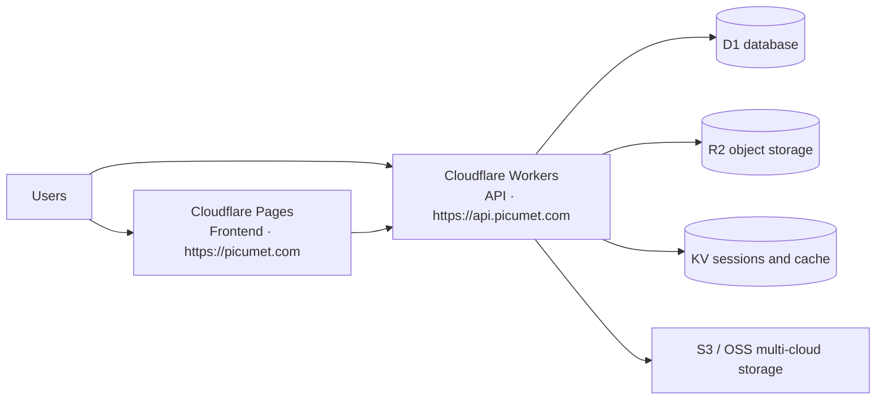

<div align="center">


# Deploy Picumet

**Multi-cloud object storage with fine-grained access control**

English | [中文](DEPLOYMENT_CN.md)

</div>

Picumet runs entirely on Cloudflare: the Workers runtime serves the API, Pages serves the frontend, and D1, KV, and R2 provide the data layer. This guide walks you through deploying the Workers API, applying database migrations, setting secrets, and publishing the frontend.

## Deployment architecture



The API and the frontend deploy separately. The frontend calls the API over HTTPS; the API stores metadata in D1, user-uploaded objects in R2 (or any S3-compatible provider), and short-lived data such as free-mode credentials and rate-limit counters in KV.

## Before you begin

You need the following:

- A Cloudflare account (free or paid).
- The Wrangler CLI. Install it with `npm install -g wrangler`, or call `bunx wrangler` through bun.
- bun 1.3.14 or later, to run the workspace scripts.
- A GitHub account (optional), for the Pages Git integration and CI.

Log in to Cloudflare:

```sh
wrangler login
```

The API source lives in `workers/` and the frontend in `frontend/`; both share types from `shared/`.

## Deploy the Workers API

### Create the Cloudflare resources

1. Create the D1 database.

   ```sh
   wrangler d1 create picumet-db
   ```

   Copy the `database_id` value from the output.

2. Create the KV namespaces.

   ```sh
   wrangler kv namespace create PICUMET_KV
   wrangler kv namespace create PICUMET_KV --preview
   ```

   Copy the `id` and `preview_id` values.

3. Create the R2 bucket.

   ```sh
   wrangler r2 bucket create picumet-storage
   ```

### Configure wrangler.toml

Replace the placeholder IDs in `workers/wrangler.toml` with the real resource IDs, and set `ENVIRONMENT` to `production`:

```toml
name = "picumet-api"
main = "src/index.ts"
compatibility_date = "2024-11-01"
compatibility_flags = ["nodejs_compat"]
account_id = "your_account_id"

[vars]
ENVIRONMENT = "production"
APP_BASE_URL = "https://picumet.com"
ALLOWED_ORIGINS = "https://picumet.com"

[[d1_databases]]
binding = "DB"
database_name = "picumet-db"
database_id = "your_d1_database_id"
migrations_dir = "migrations"

[[kv_namespaces]]
binding = "KV"
id = "your_kv_namespace_id"

[[r2_buckets]]
binding = "R2"
bucket_name = "picumet-storage"
```

| Binding | Purpose |
| :--- | :--- |
| `DB` | D1 relational database for metadata, quotas, shares, and logs. |
| `KV` | Session revocation, rate-limit counters, free-mode credentials, and the seed marker. |
| `R2` | Default object storage for uploaded files. |

To bind the API to `api.yourdomain.com`, add a `routes` block and point the DNS record at Cloudflare with the proxy enabled:

```toml
routes = [
  { pattern = "api.yourdomain.com/*", zone_name = "yourdomain.com" }
]
```

### Deploy and verify

1. Install dependencies and run a preflight build.

   ```sh
   cd workers
   bun install
   bun run build
   ```

   `bun run build` runs `wrangler deploy --dry-run --outdir=dist`; it bundles the worker without publishing it.

2. Deploy the worker.

   ```sh
   bun run deploy
   ```

   `bun run deploy` runs `wrangler deploy`.

3. Verify the health endpoints.

   ```sh
   curl -s https://api.yourdomain.com/api/public/health/live
   curl -s https://api.yourdomain.com/api/public/health/ready
   ```

   `/api/public/health/live` returns `{"service":"picumet-api","status":"ok"}`. `/api/public/health/ready` returns `200` with `"ready": true` after seeding and `503` before initialization. In production the API rejects business requests with `503 INITIALIZATION_REQUIRED` until the seed completes.

## Run database migrations

Apply migrations before you deploy the API so the schema stays in sync with the code. Migration files live in `workers/migrations/`; Wrangler applies them in filename order. Each file is idempotent and ships with a commented rollback script.

### Local

```sh
cd workers
bun run db:migrate:local
```

This command runs `wrangler d1 execute picumet-db --local --file=migrations/0001_initial.sql` against the local D1 database.

### Preview

Run the same migration against the preview D1 database before touching production:

```sh
bunx wrangler d1 execute picumet-db --preview --file=migrations/0001_initial.sql
```

### Production

Production migrations require human review. Do not apply them automatically from CI.

1. Review the target migration file in `workers/migrations/`.
2. Apply the migration to the remote database.

   ```sh
   bunx wrangler d1 execute picumet-db --remote --file=migrations/0002_add_parts_and_download_tokens.sql
   ```

3. Alternatively, apply all pending migrations in order.

   ```sh
   bunx wrangler d1 migrations apply picumet-db --remote
   ```

4. Confirm that the readiness endpoint returns `ready: true`.

   ```sh
   curl -s https://api.yourdomain.com/api/public/health/ready
   ```

## Set secrets

Store secrets with `wrangler secret put`; Workers encrypts each value and keeps it out of `wrangler.toml`. Generate strong random values first:

```sh
openssl rand -base64 32
bunx wrangler secret put JWT_SECRET
bunx wrangler secret put ENCRYPTION_KEY
```

### Set ADMIN_PASSWORD in production

Picumet ships no built-in default credentials. The first-run seed creates the initial administrator from `ADMIN_PASSWORD`; in production the API fails closed (returns `503`) when the administrator is missing. Set this secret before or right after the first deploy:

```sh
bunx wrangler secret put ADMIN_PASSWORD
```

Production password rules:

- At least 12 characters.
- Contains both letters and digits.
- No fixed default: generate a unique value per environment.

| Secret | Required | Purpose |
| :--- | :--- | :--- |
| `JWT_SECRET` | Yes | Signs JWT session tokens; use at least 32 random bytes. |
| `ENCRYPTION_KEY` | Yes | AES-GCM key for encrypting storage provider credentials at rest. |
| `ADMIN_PASSWORD` | Production | Initial administrator password; the API fails closed when it is missing. |
| `ADMIN_USERNAME` | No | Initial administrator username (defaults to `admin`). |
| `SMTP_HOST` / `SMTP_PORT` / `SMTP_USER` / `SMTP_PASS` / `SMTP_FROM` | No | Email delivery for verification and password reset. |
| `TURNSTILE_SECRET_KEY` | No | Cloudflare Turnstile verification. |

`ENVIRONMENT`, `APP_BASE_URL`, and `ALLOWED_ORIGINS` are plain vars in `wrangler.toml`, not secrets.

## Deploy the frontend

The frontend is a static Vite build. `bun run build` runs `tsc -b && vite build` and writes the output to `frontend/dist`.

Build it locally to verify:

```sh
cd frontend
bun install
bun run build
```

### Method 1: deploy with the Pages Git integration

1. Push the repository to GitHub.
2. In the Cloudflare dashboard, create a Pages project and connect the repository.
3. Configure the build:
   - Framework preset: **Vite**
   - Build command: `cd frontend && bun install && bun run build`
   - Build output directory: `frontend/dist`
   - Root directory: `/`
4. Set the environment variables:
   - `VITE_API_BASE_URL`: `https://api.yourdomain.com`
   - `VITE_TURNSTILE_SITE_KEY`: `your_site_key` (optional)
5. Click **Save and Deploy**.

Cloudflare rebuilds and deploys the site on every push to the production branch.

### Method 2: deploy from the command line

```sh
cd frontend
bun run build
bunx wrangler pages deploy dist --project-name=picumet
```

### Point a custom domain

| Type | Name | Content | Proxied |
| :--- | :--- | :--- | :--- |
| CNAME | `@` | `picumet.pages.dev` | Yes |
| CNAME | `api` | Workers-managed | Yes |

## CI/CD

`.github/workflows/ci.yml` runs on every push and pull request to `main`. It is a quality gate only: it never deploys. Deployment stays manual (`wrangler deploy`) or Cloudflare-side (the Pages Git integration).

The workflow runs with bun 1.3.14:

- **Workers**: `bun install --frozen-lockfile` → `bun run typecheck` → `bun run test`
- **Frontend**: `bun install --frozen-lockfile` → `bun run typecheck` → `bun run test` → `bun run test:coverage` → `bun run build`

Concurrent runs for the same branch cancel each other (`concurrency.cancel-in-progress`). The workflow has no deploy step and no Cloudflare credentials; add automatic deploys only after you have a tested rollback path.

## Environment variables and bindings

| Variable | Type | Required | Description |
| :--- | :--- | :--- | :--- |
| `ENVIRONMENT` | var | Yes | `development` or `production`; gates fail-closed seeding and rate limiting. |
| `APP_BASE_URL` | var | Yes | Frontend origin, used in email links and CORS. |
| `ALLOWED_ORIGINS` | var | Yes | Comma-separated CORS origins. |
| `JWT_SECRET` | secret | Yes | JWT signing key. |
| `ENCRYPTION_KEY` | secret | Yes | AES-GCM encryption key for provider credentials. |
| `ADMIN_PASSWORD` | secret | Production | Initial administrator password; at least 12 characters with letters and digits. |
| `ADMIN_USERNAME` | secret | No | Initial administrator username (defaults to `admin`). |
| `DEMO_PASSWORD` | secret | No | Demo user password (development only). |
| `SMTP_HOST`, `SMTP_PORT`, `SMTP_USER`, `SMTP_PASS`, `SMTP_FROM` | secret | No | Email delivery. |
| `TURNSTILE_SECRET_KEY` | secret | No | Turnstile verification. |

Bindings in `wrangler.toml`: `DB` (D1), `KV` (KV namespace), and `R2` (R2 bucket).

## Cost highlights

The free tier covers a small deployment:

- Workers: 100,000 requests/day
- Pages: unlimited builds and traffic
- D1: 5 GB storage + 5 million row reads/day
- KV: 100,000 reads/day + 1,000 writes/day
- R2: 10 GB storage/month + 1 million class-A operations/month

For a 1,000-user deployment with 100 GB of storage, budget roughly $21.50/month (Workers ~$10, D1 ~$5, R2 ~$6.50). Set usage alerts in the Cloudflare dashboard before you scale.

## Rollback and incident response

### Migrations fail

If a migration fails or produces bad data, do not patch production in place.

1. Stop the deploy and roll the API back to the previous version.

   ```sh
   wrangler rollback
   ```

2. Review the failed migration; most migrations carry a commented rollback script.
3. Repair the data and reapply the corrected migration.
4. Redeploy and verify the readiness endpoint.

### Quota drift

The scheduled task `reconcileQuotas` recomputes `used_storage` and `used_files` from `file_metadata` on a timer. To force a reconciliation immediately, run the same query manually:

```sql
UPDATE user_quotas
SET used_storage = COALESCE((SELECT SUM(size) FROM file_metadata WHERE owner_id = user_quotas.user_id), 0),
    used_files   = (SELECT COUNT(*) FROM file_metadata WHERE owner_id = user_quotas.user_id)
WHERE user_id = '<user_id>';
```

### Security incidents

1. Deploy the fix immediately (`wrangler deploy`).
2. Audit `access_logs` for the affected window.
3. Revoke sessions and API keys as needed, then notify affected users.

## What's next

- [README](../README.md)
- [System architecture](ARCHITECTURE.md)
- [API reference](API.md)
- [Frontend guide](UI.md)
- [Development guide](DEVELOPMENT.md)
- [Project progress](PROGRESS.md)
