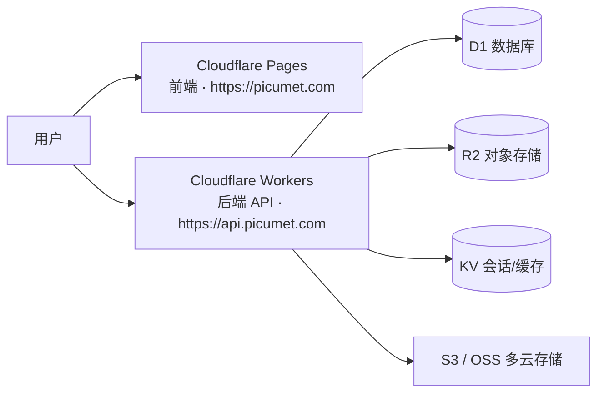

# Picumet 部署指南

> 唯一支持平台：Cloudflare Workers + Pages。
> 由 spec.md「部署方案」章节与 `workers/wrangler.toml`、`.github/workflows/ci.yml` 实际配置整理而成。

## 部署架构



## 前置要求

- Cloudflare 账户（免费或付费）
- GitHub 账户（代码托管 + CI）
- 域名（可选，可用 `.pages.dev` / `workers.dev`）

## 创建云资源

```bash
# 安装 Wrangler CLI
npm install -g wrangler

# 登录
wrangler login

# 创建 D1 数据库
wrangler d1 create picumet-db
# 输出: database_id: xxx-xxx-xxx

# 创建 KV 命名空间
wrangler kv:namespace create PICUMET_KV
# 输出: id: xxx
wrangler kv:namespace create PICUMET_KV --preview
# 输出: preview_id: xxx

# 创建 R2 存储桶
wrangler r2 bucket create picumet-storage
```

## wrangler.toml 配置

本地开发配置见 `workers/wrangler.toml`（本地 D1/KV/R2 绑定）。生产需替换为真实资源 ID：

```toml
name = "picumet-api"
main = "src/index.ts"
compatibility_date = "2024-11-01"
compatibility_flags = ["nodejs_compat"]
account_id = "your_account_id"

[vars]
ENVIRONMENT = "production"
APP_BASE_URL = "https://yourdomain.com"
ALLOWED_ORIGINS = "https://yourdomain.com"

# D1 数据库
[[d1_databases]]
binding = "DB"
database_name = "picumet-db"
database_id = "your_d1_database_id"
migrations_dir = "migrations"

# KV 存储
[[kv_namespaces]]
binding = "KV"
id = "your_kv_namespace_id"

# R2 存储桶
[[r2_buckets]]
binding = "R2"
bucket_name = "picumet-storage"
```

> 如需自定义路由 `api.yourdomain.com/*`，在 wrangler.toml 添加 `routes`（`zone_name` + `pattern`）并配置 DNS。

## 部署步骤

### 1. 初始化数据库

```bash
cd workers

# 生产环境
bunx wrangler d1 execute picumet-db --file=migrations/0001_initial.sql
# 后续迁移
bunx wrangler d1 execute picumet-db --file=migrations/0002_add_parts_and_download_tokens.sql
```

### 2. 设置 Secrets

```bash
# 生成强随机字符串（至少 32 字符）
openssl rand -base64 32

wrangler secret put JWT_SECRET        # 粘贴随机字符串
wrangler secret put ENCRYPTION_KEY    # 再生成一个
wrangler secret put SMTP_HOST         # 如 smtp.gmail.com
wrangler secret put SMTP_PORT         # 如 587
wrangler secret put SMTP_USER         # 邮箱
wrangler secret put SMTP_PASS         # 应用密码
wrangler secret put SMTP_FROM         # "Picumet" <noreply@yourdomain.com>

# 生产必需（审计 H-02）：初始管理员密码（≥12 位含字母数字；未配置则 fail-closed 不创建管理员）
wrangler secret put ADMIN_PASSWORD

# 可选
wrangler secret put TURNSTILE_SECRET_KEY
```

> **初始化顺序**：生产环境部署后先确认 `/api/public/health/ready` 返回 `ready: true`；若未就绪（未初始化），业务 API 返回 503，仅健康检查放行。

### 3. 部署 Workers API

```bash
cd workers
bun install
bun run build       # 预检（wrangler deploy --dry-run）
wrangler deploy
```

### 4. 部署前端到 Pages

**方法 1：Git 集成（推荐）**
1. 推送代码到 GitHub
2. Cloudflare Dashboard → Pages → Create project → 连接仓库
3. 构建配置：
   - Framework: Vite
   - Build command: `cd frontend && bun install && bun run build`
   - Build output: `frontend/dist`
   - Root directory: `/`
4. 环境变量：
   - `VITE_API_BASE_URL`: `https://api.yourdomain.com`
   - `VITE_TURNSTILE_SITE_KEY`: `your_site_key`（可选）
5. Deploy

**方法 2：命令行**
```bash
cd frontend
bun install
bun run build
bunx wrangler pages deploy dist --project-name=picumet
```

### 5. 配置域名

| 类型 | 名称 | 内容 | 代理 |
|---|---|---|---|
| CNAME | @ | picumet.pages.dev | ✅ |
| CNAME | api | （Workers 自动） | ✅ |

## CI（纯质量门禁，不自动部署）

> GitHub 不执行自动部署。CI 仅做类型检查 + 测试 + 覆盖率门禁 + 构建；部署统一用 `wrangler deploy`（本地/手动）或 Cloudflare 侧自动部署。

`.github/workflows/ci.yml`（bun 1.3.14）：
- **workers**: `bun install --frozen-lockfile` → `bun run typecheck` → `bun run test`
- **frontend**: `bun install --frozen-lockfile` → `bun run typecheck` → `bun run test` → `bun run test:coverage` → `bun run build`

**可选 GitHub Secrets**（如需 CI 手动部署）：`CLOUDFLARE_API_TOKEN`、`CLOUDFLARE_ACCOUNT_ID`。

## 环境变量清单

| 变量 | 必需 | 说明 |
|---|---|---|
| `JWT_SECRET` | ✅ | JWT 签名密钥 |
| `ENCRYPTION_KEY` | ✅ | 凭据 AES-GCM 加密密钥 |
| `ENVIRONMENT` | ✅ | `development` / `production` |
| `APP_BASE_URL` | ✅ | 前端地址（用于邮件链接、CORS） |
| `ALLOWED_ORIGINS` | ✅ | CORS 允许来源（逗号分隔） |
| `ADMIN_PASSWORD` | 生产必需 | 初始管理员密码（≥12 位含字母数字；未配置则 fail-closed 不创建管理员） |
| `ADMIN_USERNAME` | 可选 | 初始管理员用户名（默认 `admin`） |
| `SMTP_HOST/PORT/USER/PASS/FROM` | 可选 | 邮件发送（验证/重置密码） |
| `TURNSTILE_SECRET_KEY` | 可选 | Turnstile 验证码 |

> **部署健康检查**：`/api/public/health/live`（存活）与 `/api/public/health/ready`（就绪，返回 seed 状态，未就绪 503）。生产环境未完成初始化时业务 API 返回 503，仅健康检查与 `/api/public/*` 放行。

## 成本估算

**免费额度**：
- Workers: 100,000 请求/天
- Pages: 无限构建和流量
- D1: 5GB 存储 + 500 万行读取/天
- KV: 100,000 读/天 + 1,000 写/天
- R2: 10GB 存储/月 + 100 万 A 类操作/月

**付费成本**（假设 1000 用户、100GB 存储）：Workers ~$10/月 + D1 $5/月 + R2 ~$6.5/月 ≈ **$21.5/月**

## 应急与回滚

- **迁移失败**：立即停止部署 → 回滚迁移脚本 → 验证数据完整性 → 修复后重新部署
- **配额异常**：`system_settings` 设维护模式 → 运行配额对账 SQL（`reconcileQuotas` 定时任务自动执行）
- **权限绕过**：立即部署修复 → 审计 `access_logs` → 通知受影响用户

## 相关文档

- [系统架构](ARCHITECTURE.md)
- [API 设计](API.md)
- [页面设计](UI.md)
- [开发指南](DEVELOPMENT.md)
- [技术规格（完整版）](../spec.md)
