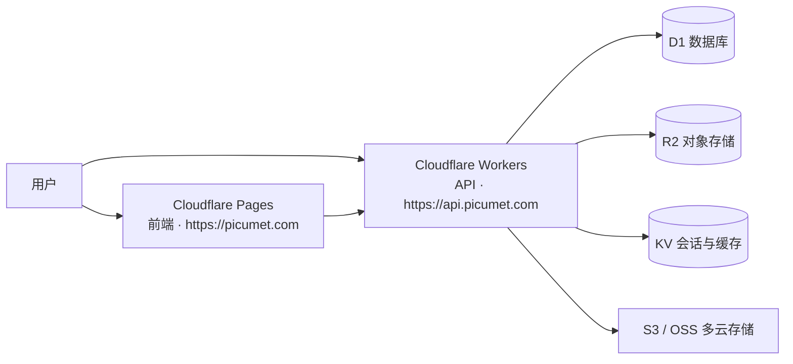

<div align="center">


# Picumet 部署指南

**多云对象存储管理平台**

[English](DEPLOYMENT.md) | 中文

</div>

Picumet 完全运行在 Cloudflare 上:Workers 承担后端 API,Pages 托管前端,D1、KV、R2 构成数据层。本指南介绍如何部署 Workers API、执行数据库迁移、配置密钥,以及发布前端。

## 部署架构



前端与后端分开部署。前端通过 HTTPS 调用 API;API 把元数据存进 D1,用户上传的对象放进 R2(也可以是任意 S3 兼容存储),KV 存放自由模式凭据、限流计数这类短生命周期的数据。

## 开始之前

需要准备:

- 一个 Cloudflare 账号(免费或付费均可)。
- Wrangler CLI。用 `npm install -g wrangler` 安装,或借助 bun 直接调用 `bunx wrangler`。
- bun 1.3.14 及以上,用于运行仓库内的脚本。
- (可选)GitHub 账号,用于 Pages 的 Git 集成与 CI。

登录 Cloudflare:

```sh
wrangler login
```

后端代码在 `workers/`,前端在 `frontend/`,两者共用 `shared/` 里的类型。

## 部署 Workers API

### 创建云资源

1. 创建 D1 数据库:

   ```sh
   wrangler d1 create picumet-db
   ```

   从输出中复制 `database_id`。

2. 创建 KV 命名空间:

   ```sh
   wrangler kv namespace create PICUMET_KV
   wrangler kv namespace create PICUMET_KV --preview
   ```

   复制 `id` 与 `preview_id`。

3. 创建 R2 存储桶:

   ```sh
   wrangler r2 bucket create picumet-storage
   ```

### 配置 wrangler.toml

把 `workers/wrangler.toml` 里的占位 ID 换成真实资源 ID,并把 `ENVIRONMENT` 改为 `production`:

```toml
name = "picumet-api"
main = "src/index.ts"
compatibility_date = "2024-11-01"
compatibility_flags = ["nodejs_compat"]
account_id = "你的账号 ID"

[vars]
ENVIRONMENT = "production"
APP_BASE_URL = "https://picumet.com"
ALLOWED_ORIGINS = "https://picumet.com"

[[d1_databases]]
binding = "DB"
database_name = "picumet-db"
database_id = "你的 D1 database_id"
migrations_dir = "migrations"

[[kv_namespaces]]
binding = "KV"
id = "你的 KV 命名空间 ID"

[[r2_buckets]]
binding = "R2"
bucket_name = "picumet-storage"
```

| 绑定 | 用途 |
| :--- | :--- |
| `DB` | D1 关系型数据库,存放元数据、配额、分享与日志。 |
| `KV` | 会话撤销、限流计数、自由模式凭据与 seed 标记。 |
| `R2` | 上传文件的默认对象存储。 |

把 API 绑到 `api.yourdomain.com` 时,加一段 `routes` 配置,并让 DNS 记录走 Cloudflare 代理:

```toml
routes = [
  { pattern = "api.yourdomain.com/*", zone_name = "yourdomain.com" }
]
```

### 部署并验证

1. 安装依赖,先跑一次预检构建:

   ```sh
   cd workers
   bun install
   bun run build
   ```

   `bun run build` 执行 `wrangler deploy --dry-run --outdir=dist`,只打包不上线。

2. 正式部署:

   ```sh
   bun run deploy
   ```

   `bun run deploy` 就是 `wrangler deploy`。

3. 验证健康检查:

   ```sh
   curl -s https://api.yourdomain.com/api/public/health/live
   curl -s https://api.yourdomain.com/api/public/health/ready
   ```

   `/api/public/health/live` 返回 `{"service":"picumet-api","status":"ok"}`;`/api/public/health/ready` 在 seed 完成后返回 `200` 且 `"ready": true`,初始化前返回 `503`。生产环境下,seed 未完成时业务 API 一律返回 `503 INITIALIZATION_REQUIRED`。

## 执行数据库迁移

迁移要在 API 上线之前执行,保证表结构与代码一致。迁移文件放在 `workers/migrations/`,按文件名顺序应用;每个文件幂等,并附带注释形式的回滚脚本。

### 本地

```sh
cd workers
bun run db:migrate:local
```

这条命令等价于 `wrangler d1 execute picumet-db --local --file=migrations/0001_initial.sql`,针对本地 D1 执行。

### 预发布

动生产库之前,先对预发布 D1 跑同一份迁移:

```sh
bunx wrangler d1 execute picumet-db --preview --file=migrations/0001_initial.sql
```

### 生产

生产迁移必须人工审核,不要让 CI 自动执行。

1. 先审阅 `workers/migrations/` 里要执行的迁移文件。
2. 对远端数据库执行迁移:

   ```sh
   bunx wrangler d1 execute picumet-db --remote --file=migrations/0002_add_parts_and_download_tokens.sql
   ```

3. 也可以按顺序应用全部待执行迁移:

   ```sh
   bunx wrangler d1 migrations apply picumet-db --remote
   ```

4. 确认就绪探针返回 `ready: true`:

   ```sh
   curl -s https://api.yourdomain.com/api/public/health/ready
   ```

## 配置密钥

密钥用 `wrangler secret put` 写入,Workers 会加密保存,不会出现在 `wrangler.toml` 里。先生成强随机值再逐个设置:

```sh
openssl rand -base64 32
bunx wrangler secret put JWT_SECRET
bunx wrangler secret put ENCRYPTION_KEY
```

### 生产必配:ADMIN_PASSWORD

Picumet 没有内置的默认账号密码。首次启动的 seed 用 `ADMIN_PASSWORD` 创建初始管理员;生产环境下管理员缺失时,API 会 fail-closed(统一返回 `503`)。该密钥要在首次部署前后配好:

```sh
bunx wrangler secret put ADMIN_PASSWORD
```

生产密码规则:

- 至少 12 位。
- 必须同时包含字母和数字。
- 没有固定默认值,每个环境生成独立的随机密码。

| 密钥 | 是否必需 | 用途 |
| :--- | :--- | :--- |
| `JWT_SECRET` | 必需 | 签名 JWT 会话令牌,至少 32 字节随机值。 |
| `ENCRYPTION_KEY` | 必需 | 对存储提供商凭据做 AES-GCM 静态加密的密钥。 |
| `ADMIN_PASSWORD` | 生产必需 | 初始管理员密码;缺失时 API fail-closed。 |
| `ADMIN_USERNAME` | 可选 | 初始管理员用户名,默认 `admin`。 |
| `SMTP_HOST` / `SMTP_PORT` / `SMTP_USER` / `SMTP_PASS` / `SMTP_FROM` | 可选 | 邮件发送,用于邮箱验证与密码重置。 |
| `TURNSTILE_SECRET_KEY` | 可选 | Cloudflare Turnstile 人机验证。 |

`ENVIRONMENT`、`APP_BASE_URL`、`ALLOWED_ORIGINS` 是 `wrangler.toml` 里的普通变量,不算密钥。

## 部署前端

前端是纯静态的 Vite 构建产物。`bun run build` 执行 `tsc -b && vite build`,输出到 `frontend/dist`。

先本地构建确认无误:

```sh
cd frontend
bun install
bun run build
```

### 方式一:Pages 的 Git 集成

1. 把仓库推送到 GitHub。
2. 在 Cloudflare 控制台新建 Pages 项目并关联该仓库。
3. 构建配置:
   - 框架预设:**Vite**
   - 构建命令:`cd frontend && bun install && bun run build`
   - 构建输出目录:`frontend/dist`
   - 根目录:`/`
4. 环境变量:
   - `VITE_API_BASE_URL`:`https://api.yourdomain.com`
   - `VITE_TURNSTILE_SITE_KEY`:`你的 site key`(可选)
5. 点击**保存并部署**。

之后每次推送到生产分支,Cloudflare 都会自动重新构建并发布。

### 方式二:命令行

```sh
cd frontend
bun run build
bunx wrangler pages deploy dist --project-name=picumet
```

### 绑定自定义域名

| 类型 | 名称 | 内容 | 代理 |
| :--- | :--- | :--- | :--- |
| CNAME | `@` | `picumet.pages.dev` | 开启 |
| CNAME | `api` | 由 Workers 管理 | 开启 |

## CI/CD

`.github/workflows/ci.yml` 在每次 push 或 PR 到 `main` 时运行,它只是质量门禁,**从不自动部署**。部署要么手动执行 `wrangler deploy`,要么走 Cloudflare 侧的 Pages Git 集成。

工作流使用 bun 1.3.14:

- **workers**:`bun install --frozen-lockfile` → `bun run typecheck` → `bun run test`
- **frontend**:`bun install --frozen-lockfile` → `bun run typecheck` → `bun run test` → `bun run test:coverage` → `bun run build`

同一分支上的并发运行会自动互相取消(`concurrency.cancel-in-progress`)。工作流里没有部署步骤,也没有 Cloudflare 凭据;有了经过验证的回滚方案之后,再考虑加入自动部署。

## 环境变量与绑定

| 变量 | 类型 | 是否必需 | 说明 |
| :--- | :--- | :--- | :--- |
| `ENVIRONMENT` | 变量 | 必需 | `development` 或 `production`,控制 fail-closed 的 seed 与限流。 |
| `rate_limit_enabled` | `system_settings` | 可选 | 关闭后不限制请求速率（生产环境默认启用）。 |
| `rate_limit_requests_per_minute` | `system_settings` | 可选 | 每 IP 每分钟请求数（默认 50）；已登录用户按 2 倍；登录/注册等认证接口固定 5 次/分钟；自由模式按会话 60、按用户 120 次/分钟。 |
| `max_concurrent_transfers` | `system_settings` | 可选 | 同时传输上限（默认 4，0 = 不限）；按用户（未登录按 IP）限制上传与下载网关的在途请求数，超限 429。 |
| `rate_limit_downloads_per_minute` | `system_settings` | 可选 | 下载限速（默认 120，0 = 不限）；按用户（未登录按 IP）限制每分钟下载类请求，超限 429。 |
| `direct_prefix` / `root_target` | `system_settings` | 可选 | **只作用于文件直链**：直链前缀（`''`/`/d`/`/download`/`/raw`）与 `/` 的语义（落地页/文件页/直链）。文件浏览页固定 `/files`。 |
| `APP_BASE_URL` | 变量 | 必需 | 前端地址,用于邮件链接与 CORS。 |
| `ALLOWED_ORIGINS` | 变量 | 必需 | CORS 允许来源,逗号分隔。 |
| `JWT_SECRET` | 密钥 | 必需 | JWT 签名密钥。 |
| `ENCRYPTION_KEY` | 密钥 | 必需 | 提供商凭据的 AES-GCM 加密密钥。 |
| `ADMIN_PASSWORD` | 密钥 | 生产必需 | 初始管理员密码,至少 12 位且含字母和数字。 |
| `ADMIN_USERNAME` | 密钥 | 可选 | 初始管理员用户名,默认 `admin`。 |
| `DEMO_PASSWORD` | 密钥 | 可选 | 演示用户密码,仅开发环境。 |
| `SMTP_HOST`、`SMTP_PORT`、`SMTP_USER`、`SMTP_PASS`、`SMTP_FROM` | 密钥 | 可选 | 邮件发送。 |
| `TURNSTILE_SECRET_KEY` | 密钥 | 可选 | Turnstile 人机验证。 |

`wrangler.toml` 里的绑定:`DB`(D1)、`KV`(KV 命名空间)、`R2`(R2 存储桶)。

## 成本要点

免费额度足以支撑小规模部署:

- Workers:每天 10 万次请求
- Pages:构建与流量不限
- D1:5GB 存储 + 每天 500 万行读取
- KV:每天 10 万次读取 + 1000 次写入
- R2:每月 10GB 存储 + 每月 100 万次 A 类操作

按 1000 用户、100GB 存储估算,月成本约 $21.5(Workers 约 $10、D1 约 $5、R2 约 $6.5)。扩容前先在 Cloudflare 控制台设置用量告警。

## 回滚与应急预案

### 迁移失败

如果迁移失败或写坏了数据,不要直接在线上修补。

1. 停止部署,把 API 回滚到上一个版本:

   ```sh
   wrangler rollback
   ```

2. 检查失败的迁移,大部分迁移文件末尾附有注释形式的回滚脚本。
3. 修复数据后重新执行修正过的迁移。
4. 重新部署并验证就绪探针。

### 配额漂移

定时任务 `reconcileQuotas` 会按 `file_metadata` 重新计算 `used_storage` 与 `used_files`。需要立刻对账时,手动执行同一段 SQL:

```sql
UPDATE user_quotas
SET used_storage = COALESCE((SELECT SUM(size) FROM file_metadata WHERE owner_id = user_quotas.user_id), 0),
    used_files   = (SELECT COUNT(*) FROM file_metadata WHERE owner_id = user_quotas.user_id)
WHERE user_id = '<user_id>';
```

### 安全事件

1. 立即部署修复版本(`wrangler deploy`)。
2. 审计受影响时间段的 `access_logs`。
3. 按需吊销会话与 API 密钥,并通知受影响的用户。

## 相关文档

- [项目说明](../README_CN.md)
- [系统架构](ARCHITECTURE_CN.md)
- [API 参考](API_CN.md)
- [前端指南](UI_CN.md)
- [开发指南](DEVELOPMENT_CN.md)
- [项目进度](PROGRESS.md)
