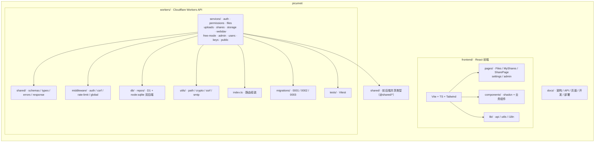

# Picumet 开发指南

> 本地开发、环境准备、测试、代码规范与常见坑点。
> 由 README「快速开始」、spec.md「开发路线图」与仓库实测整理而成。

## 环境要求

| 工具 | 版本 | 说明 |
|---|---|---|
| Node.js | ≥22 | 运行时 |
| bun | 1.3.14 | **统一包管理器**（`packageManager: bun@1.3.14`，勿用 npm） |
| wrangler | ≥4.0 | Cloudflare Workers 本地开发 |

```bash
# 安装 bun
curl -fsSL https://bun.sh/install | bash
```

## 目录结构



## 本地开发

### 1. 安装依赖

```bash
cd workers && bun install
cd ../frontend && bun install
```

### 2. 配置环境变量

```bash
cp workers/.dev.vars.example workers/.dev.vars
# 编辑 .dev.vars 填写 JWT_SECRET、ENCRYPTION_KEY 等
```

### 3. 初始化数据库

```bash
cd workers
bunx wrangler d1 execute picumet-db --local --file=migrations/0001_initial.sql
# 如有后续迁移：
bunx wrangler d1 execute picumet-db --local --file=migrations/0002_add_parts_and_download_tokens.sql
bunx wrangler d1 execute picumet-db --local --file=migrations/0003_mount_id_and_session_version.sql
```

> **注意**：迁移名称以 `NNNN_description.sql` 命名（如 `0001_initial.sql`）。

### 4. 启动开发服务器

```bash
# 终端 1: Workers API（端口 8787）
cd workers && bun run dev

# 终端 2: 前端（端口 5173，Vite 代理 /api/* → 8787）
cd frontend && bun run dev
```

访问：
- 前端：http://localhost:5173
- API：http://localhost:8787

### 内置账号（开发种子）

| 角色 | 用户名 | 密码 |
|---|---|---|
| 管理员 | `admin` | `admin123456` |
| 演示用户 | `demo` | `demo123456` |

> 种子数据由 `workers/src/seed.ts` 在首次启动（KV `seed:done` 未设置）时创建默认管理员、演示用户、R2 绑定 Provider + 根挂载、演示文件夹。
> - 开发环境默认管理员 `admin/admin123456`、演示用户 `demo/demo123456`（可用 `ADMIN_PASSWORD`/`DEMO_PASSWORD` 覆盖）。
> - **生产环境**必须通过 `ADMIN_PASSWORD` 注入强密码（≥12 位含字母数字），未配置则不创建管理员（fail-closed，业务 API 返回 503 直到初始化完成，仅 `/api/public/health/*` 放行）。

## 测试

### 后端（workers）

```bash
cd workers
bun run test            # Vitest 全套（122 项）
bun run typecheck       # tsc --noEmit
```

测试覆盖：权限真值表（57）、文件操作状态机、上传/分片/断点续传、配额、安全回归（free-mode/WebDAV/SSRF/加密/限流 fail-closed）、故障注入（D1 一致性）、API 集成、S3 预签名。

> 后端测试使用 `node:sqlite`（`tests/helpers.ts` 内存 D1/KV/R2 模拟），不依赖 workerd。

### 前端（frontend）

```bash
cd frontend
bun run test            # Vitest（7 项）
bun run test:coverage   # 覆盖率门禁（安全关键模块 ≥80%）
bun run typecheck       # tsc --noEmit
bun run build           # 构建
```

### CI

`.github/workflows/ci.yml` 在 push/PR 到 main 时执行：
- **workers**: bun install → typecheck → test
- **frontend**: bun install → typecheck → test → test:coverage → build

纯质量门禁，**不自动部署**。

## 代码规范

- TypeScript strict mode，禁止 `any`（除非注释说明），函数必须有返回类型
- 命名：文件名 kebab-case、组件 PascalCase、函数/变量 camelCase、常量 UPPER_SNAKE_CASE、类型/接口 PascalCase
- 导入顺序：外部库 → Cloudflare 绑定 → 项目内部 → 类型导入
- 提交规范：Conventional Commits（`<type>(<scope>): <subject>` + 多 `-m` 无序列表说明）
  - 示例：`feat(upload): add multipart upload support for large files` + `- Implement ...`

## 新增 API 的步骤

1. 在对应 `services/<domain>/handlers.ts` 添加路由（或新建服务目录）
2. 在 `services/<domain>/schemas.ts` 定义 Zod schema，handler 内 `safeParse`
3. 需要时在 `services/<domain>/types.ts` 导出类型
4. 更新 `src/index.ts` 路由组装（`app.route(...)`）
5. 更新 `docs/API.md` 端点一览与详细章节
6. 补充测试并运行 `bun run test` + `bun run typecheck`

## 新增数据库迁移

1. 新建 `workers/migrations/NNNN_description.sql`
2. 本地执行：`bunx wrangler d1 execute picumet-db --local --file=migrations/NNNN_*.sql`
3. 更新 `docs/ARCHITECTURE.md` 数据模型章节
4. 迁移治理：禁止在迁移中直接删除数据（先标记废弃）；加索引需含性能测试

## 常见坑点

### 权限系统

❌ 用 `startsWith` 判断路径边界（`/users/alice` 可访问 `/users/alice2`）
✅ 用 `isPathWithinBoundary`（路径段判断）

### 文件删除

❌ 先删对象存储再删元数据（元数据删除失败则对象丢失）
✅ 先删元数据（事务），对象异步清理（失败记 `orphan_objects` 对账）

### 配额更新

❌ 非原子读改写（`getQuota` → `updateQuota`）
✅ 数据库原子操作（`UPDATE ... SET used_storage = used_storage + ?`）

### 路径规范化

❌ 未规范化路径（`/users/../admin/secrets` 绕过权限）
✅ `normalizePath`（`'/' + path.split('/').filter(Boolean).join('/')`）

### 对象存储一致性（审计 H-5）

写对象后 DB 提交失败 → 释放预留 + 尽力删对象（失败记孤儿）；删除时对象清理失败也记孤儿。用 `FileRepo.createFileTx` 事务提交元数据 + 配额 + 日志。

### wrangler dev 热重载不可靠

改文件后建议重启 wrangler dev 进程（或 `rm -rf .wrangler` + 重跑迁移）加载干净构建。

## 相关文档

- [系统架构](ARCHITECTURE.md)
- [API 设计](API.md)
- [页面设计](UI.md)
- [部署指南](DEPLOYMENT.md)
- [技术规格（完整版）](../spec.md)
- [需求追踪矩阵](../requirements-matrix.md)
