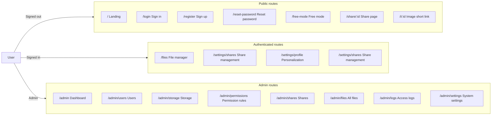

<div align="center">


# Picumet frontend guide

**Multi-cloud object storage with fine-grained access control**

English | [中文](UI_CN.md)

</div>

The Picumet frontend is a React single-page application that delivers the file manager, share pages, user settings, and admin console for a multi-cloud object storage platform. This guide documents the page structure, responsive layout, theming, accessibility, and interactions of the interface.

## Before you begin

- Node.js 22 or later with [bun](https://bun.sh/) 1.3 or later installed.
- A running backend. See [DEVELOPMENT.md](DEVELOPMENT.md) for setup instructions.
- Basic familiarity with React, TypeScript, and Tailwind CSS.

To start the development server:

1. Change into the `frontend/` directory.
2. Run `bun install` to install dependencies.
3. Run `bun run dev` to start Vite.

The development server serves the app at the URL that Vite prints, usually `http://localhost:5173`.

## Overview

The frontend lives in the `frontend/` directory and talks to the Workers API over HTTP. It uses these tools:

- React 18 with `react-router-dom` for routing.
- Vite for building and hot reload.
- TypeScript for type safety, with shared types imported from `shared/types.ts`.
- Tailwind CSS for styling.
- i18next for Chinese and English localization.
- TanStack Query for server state, caching, and mutations.

Every page loads lazily with `React.lazy` and `Suspense`, so the initial bundle stays small.

## Page routes

The router in `frontend/src/App.tsx` defines the routes below. Unauthenticated users who open a protected route land on `/login` with a `redirect` query parameter; after sign-in, the app sends them back. Admin routes check the signed-in user's role and show a permission message when the role is not `admin`.



### Page map

| Page | Path | Access | Component |
| :--- | :--- | :--- | :--- |
| Landing | `/` | Public | `Landing` |
| Sign in | `/login` | Public | `Login` |
| Sign up | `/register` | Public | `Register` |
| Reset password | `/reset-password` | Public | `ResetPassword` |
| Free mode | `/free-mode` | Public | `FreeMode` |
| Share page | `/share/:id` `/i/:id` | Public | `SharePage` |
| File manager | `/files` `/files/*` (fixed prefix) | Signed in | `Files` |
| Share management | `/settings/shares` | Signed in | `Shares` (settings sidebar, under Personalization) |
| Settings layout | `/settings/*` | Signed in | `SettingsLayout` |
| Personalization | `/settings/profile` | Signed in | `Personalization` (left: profile/email/password; right: right-click behavior/theme incl. background) |
| API keys | `/settings/api-keys` | Signed in | `ApiKeys` |
| Access rules | `/settings/access-rules` | Signed in | `AccessRules` |
| Admin layout | `/admin` | Admin | `AdminLayout` |
| Dashboard | `/admin` | Admin | `Dashboard` |
| Users | `/admin/users` | Admin | `Users` |
| Storage | `/admin/storage` | Admin | `Storage` |
| Mount points | `/admin/mounts` | Admin | Redirects to `/admin/storage?tab=mounts` |
| Permission rules | `/admin/permissions` | Admin | `Permissions` |
| Shares | `/admin/shares` | Admin | `Shares` |
| All files | `/admin/files` | Admin | `Files` |
| Access logs | `/admin/logs` | Admin | `Logs` |
| System settings | `/admin/settings` | Admin | `Settings` |

## Layout

### App shell

The `AppShell` component wraps the signed-in pages and provides the common chrome:

- A sticky top bar with the logo, the header title (clearable in settings to show the logo only — independent of the browser tab title), primary navigation, and a right cluster for the theme toggle, language switcher, and user menu.
- An announcement banner below the top bar.
- A centered content area with a maximum width of `1400px`.
- The shell is an `h-screen` flex column: the banner collapses when no announcement exists, `main` owns the only page scroll (`scrollbar-none`), and tables join the chain with `flex-1 min-h-0`, so a visible banner shrinks the table instead of pushing the pagination off-screen; scrollbars stay hidden or thin — native browser bars never appear.

```text
┌─────────────────────────────────────────────────────────────┐
│ [☰] [Logo] [Files] [Settings] [Admin] [◐] [中] [@]           │
├─────────────────────────────────────────────────────────────┤
│   Announcement banner                                       │
├─────────────────────────────────────────────────────────────┤
│                                                             │
│                    Main content area                        │
│                                                             │
└─────────────────────────────────────────────────────────────┘
```

On screens narrower than `768px`, the top bar hides the navigation and shows a hamburger button. The button opens a left-side `Drawer` with the same links.

### File manager workspace

The file manager (`/files`) arranges content into three regions:

```text
┌──────────────────────────────────────────────────────────────┐
│ [Search] [Sort ▾]             [↑ Upload] [+ New] [☑] [▦|☰|🌲]│
│ Breadcrumb                                                   │
├────────────┬──────────────────────────────────────┬──────────┤
│            │  File cards / rows / flat tree        │          │
│  Sidebar   │  ┌────┐ ┌────┐ ┌────┐ ┌────┐        │ Drawer   │
│  Folders   │  │ ▤  │ │ ▤  │ │ 🖼 │ │ 📄 │        │ overlay  │
│  Types     │  └────┘ └────┘ └────┘ └────┘        │          │
│  Favorites │                                        │          │
│            │  [Bulk actions bar · sticky bottom]   │          │
└────────────┴──────────────────────────────────────┴──────────┘
```

- **Toolbar row**: search and sort share one row with **Upload**, **New folder**, **Select** and batch-select, and the grid/list/tree view switcher; every control uses the same height. The sort menu filters by name and sorts by name, time, or size, ascending or descending.
- **Breadcrumb**: the breadcrumb sits on its own line above the content and hides in tree view. It measures its own width and collapses middle segments one at a time only when the row no longer fits, so a deep path keeps as many trailing segments as the width allows; the collapsed middle lives behind a **…** dropdown.
- **Tree view**: the content area switches to a flattened tree — chains of single-child folders merge into one row (`a/b/c/`), a click on the folder row expands it (the chevron works too), rows render only the visible window, and the current path auto-expands.
- **Content**: renders a responsive card grid, a list of rows, or the flat tree, per the view switcher.
- **Properties**: the panel opens as a right-side `Drawer` on every screen size; the overlay never reflows the grid.
- **Bulk actions bar**: sticks to the bottom of the viewport while you select any item.
- **Create a share**: the row menu's **Share** and the bulk bar's **Share** open the same `ShareDialog`; the selection may be one or more files, one or more folders, or a mix of both (up to 50). The dialog keeps the title, access password, expiry (preset / custom duration / specific deadline), access scope (everyone / signed-in users / specific users), max downloads, allow-preview and allow-download; after creation the same dialog shows the link, the QR code, and copy/open buttons.

### Share pages

**Public share page.** The route `/share/:id` renders the share, and `/i/:id` is the image short link (one image served directly). Password-protected shares show a password gate before the content loads. The header shows the title (share title → single-item file name → "Shared content" fallback chain), the creator, the expiry or "never expires", the view/download counters, and a password badge. **The body is an item list**: each row uses the same visual language as the files page (`FileIcon` + name + size + a trailing download button), and with several items the title reads "N items"; folder items open for browsing (breadcrumb "share root › subfolder" plus an up-level control, and empty folders show an empty state); image items render a large preview when their attributes allow it. **A single Share button** owns forwarding: clicking it expands a dropdown (portalled to body) whose entries are, in order, the locally generated QR code, `Copy link`, `Copy link (with password)` (appends `?password=` to the link), `View password` (reveals the plaintext and lets you copy it), and `Copy share text` — the text is `From <creator>'s <share name/file name/N items>` + `Link: …` + `Password: …` (the password line disappears when there is none). Opening a link that carries `?password=` auto-fills the field and submits one verification, going straight to the content. If the visitor has not entered the password on this page, `View password` tells them to check share management. Error states (revoked/expired/exhausted/login-only/missing) all use lucide icons (`Ban` / `Lock` / `FileQuestion`) in a centered card instead of emoji.

**Share list.** The settings sidebar's "Share management" (`/settings/shares`) lists the links you created and **only views and manages them — the creation entry point is gone** (sharing starts from the files page). A view toggle switches between a responsive card grid and a row list. Each card shows the file icon, title, size, and expiry plus **every setting of that share**: the status badge (`CheckCircle2` active / `Clock` expired / `Ban` revoked, with localized copy rather than the raw English enum), the access scope (everyone / signed-in / N named users), password protection (lock icon), the on/off state of preview and download, the view and download counters (with their limits), and the item count when one share holds several. Card settings are laid out in **three rows**: the first holds the access scope (everyone / signed-in users / named users · N), the second the `Allow preview` and `Allow download` switch states, the third `{{used}}/{{max}} views` and `{{used}}/{{max}} downloads` (an empty limit reads "unlimited"). Actions remain QR code, open, copy link, and revoke (revoke goes through `ConfirmDialog`), and the share menu also offers "Copy link (with password)", "View password", and "Copy share text". The list paginates with a configurable page size, 20 by default.

### Settings and admin pages

**Dashboard** (`/admin`) opens with four single-row stat cards (icon plus stacked label/value, secondary text on the right): the user summary (admin/user/guest counts), memory usage (a plain value when capacity is unset, otherwise with a full-width thin progress bar), the bucket count, and active mount points. The bottom half places the **bucket lane graph** on the left — one lane per storage bucket with mounts and folders as column nodes under it (one column per level, rounded connectors, base colour hue-rotated per level; hollow anchor = collapsed, solid = expanded, no white halo), folder rows with recursive file counts under an expanded mount (counts only, filtered to that bucket), buckets collapsible with mounts open by default, and multiple mounts open at once; a **standby badge** under a bucket that stores zero files for a mount jumps to and highlights that mount's primary bucket lane for 3 seconds — and **storage usage** (per-mount usage and file counts with capacity progress bars) and **recent activity** (the last 6 entries) on the right.

**All files** (`/admin/files`) carries **bucket / mount / hash** columns (filled by batched per-page `IN` queries, no N+1) and ships three views behind one toolbar: search and the filter toggle sit left, the list/mount/tree switcher sits right and stays visible in filter mode, the filter row opens below the search with mount, bucket, uploading user, visibility dropdowns plus a **hash substring** input (triggers use the same glass recipe as the search box), and clear/close controls end the row. The **mount view** walks bucket → mount → folder → file as column graph rows (one column per level, rounded corners, per-level colour; folders and mounts are hollow/solid anchors and files are leaf dots) and shows only the files a pooled mount stores in that bucket; the **tree view** renders the whole namespace as a flattened tree with the same server-side filters and a client-side name search that keeps ancestors. Banned rows render translucent across the whole row (no separate badge). Besides the per-row **properties** dialog (name, custom title, icon, color, visibility, guest visibility, access password, and the folder-only **"apply to children too"** switch — unchecked by default), each row has a **ban/unban** entry behind a confirmation; when the selection contains banned files the bulk bar narrows to **delete** only. On the user-side files page a banned file shows as a translucent ghost with the menu collapsed to delete only, while the server answers 429 for downloads and the other outlets.

The admin system settings page splits into cards (Site / Security / SMTP / Announcements), and sections inside a card always use dividers — no nested boxes (see the card-in-card principle). The Site card's identity fields lay out two rows of **title on the left, icon on the right**: header title (empty = logo only in the top bar, independent of the tab title) + header logo, and tab title (i.e. `document.title`) + favicon. It spells rate limiting out: next to the toggle it shows the per-IP request-per-minute input and the effective rules — signed-in users get ×2, the server pins auth endpoints such as sign-in and sign-up at 5 per minute, free mode allows 60 per session and 120 per user per minute; the same place also carries the **download rate limit** (default 120 per minute, 0 = unlimited, counting download-type requests only) and the **maximum concurrent transfers** (default 4, 0 = unlimited) that caps in-flight requests per user (per IP when signed out) on uploads and the download gateway and answers 429 beyond it. The **Announcements** card adds the display policy inline: a kind selector (banner/toast), a mode selector (always/daily/interval/until/duration — toasts add once), and conditional inputs (interval value with hour/day/week/month units, a `datetime-local` end time, duration with minute/hour/day units); every announcement row shows its policy summary, and each settings card title carries a lucide icon.

Admin "Users → Default user settings" shows a **default permission matrix** per role (five items — view/upload/update/delete/download; the adjacent "capabilities → can share" toggle controls sharing, so the two places no longer duplicate it): the built-in seeds are admin and user with everything checked and guest with downloads only, and saving takes effect for every member of that role immediately; a role can also show an **alias** (such as "Administrator"), and permission-rule subjects accept either the role name or that alias. The file properties panel gains a "Default user permissions" section that sets **guest visibility** (follow the role default / guests cannot see it / download only / view and download) and applies on save.

Admin "All files" marks the **visibility column** with a private/site/public three-state badge plus icon, and shows the review status for public files awaiting approval. The "Shares" table now carries creator, access scope, password protection, preview/download switches, view and download counters, expiry and status columns, and adds a **share settings (admin)** dialog: it edits status (active/revoked), expiry, max view/download counts, preview/download switches, access scope and named users, and can reset or clear the password, while showing the share items, creator and counters read-only.

The settings layout (`/settings/*`) shows a vertical nav with **Personalization**, **API keys**, and **Access rules**. The access-rules page lists rules the user authored (target file, effect, subject, permissions) and revokes them behind a confirmation dialog. The admin layout (`/admin`) uses two columns: a vertical nav on the left and the page content on the right. The nav stacks above the content on mobile. Admin pages include the dashboard (four compact stat cards, per-row storage usage, the active-mounts bucket lane graph, and the downloads/shares/logins **trend panel** with granularity and range filters plus a custom range; cards share the unified 16px vertical / 24px column rhythm), user management (the edit dialog carries role/status/capability checkboxes plus default storage path, storage cap and file count on a wide responsive layout; the toolbar "Default user settings" button sets per-role storage defaults with role create/delete, and saving overrides every user of that role), storage configuration (the provider dialog uses preset options — R2/AWS S3/Oracle/MinIO/custom — that only prefill fields, plus a mount path; the mount dialog splits into **"pool" and "buckets" tabs** (create and edit share one form): the **pool tab** holds mount path / name / provider / sort field and direction / priority / **total capacity cap** / the **five write strategies** (least used / round robin / directory-sticky hash / free-space weighted / fill-in-order) / **upload mode** (`free`, `user_space` forcing writes into `<mount>/<username>`, or `flat`, which disables folder creation) on the left, and the **buckets under this mount** on the right (name, type, primary/standby badge, hard cap, bucket matrix summary; clicking a row jumps to the bucket tab); the **buckets tab** follows the role-settings pattern with vertical bucket tabs on the left (greyed but still configurable when not pooled) and, on the right, that bucket's **bucket-level role matrix** (three rows × five actions plus a "not configured (falls back to mount/role default)" state; `share` stays out of the matrix), **capacity cap** (GB; a hard cap — placement requires `used + in-flight reservations + file size <= capacity`, otherwise the next candidate is tried and a 413 follows only when none fits), the **standby bucket** switch and the "include in pool" checkbox; the **total cap must not exceed the sum of bucket caps** (blocked client-side and answered with 400 by the API; uncapped buckets are excluded from the sum)), permission rules (the table has an "origin" column separating admin rules from user-authored ones), share management, all files, access logs, and system settings. The mount form's "automatic cross-bucket sync" switch is on the roadmap — only a Go-backend environment can enable it; the current Workers (Node) backend does not support that capability and renders it disabled; and mount points are directories — creating a mount immediately adds a folder of the same name to the parent directory listing (choosing rename or delete in the row menu shows a prompt to use storage configuration), changing a mount path migrates that folder row, and deleting a mount cleans it up. The API keys page (`/settings/api-keys`) manages gateway keys: the create dialog collects name, permissions, protocols and upload path, its success state shows per-protocol connection configs (WebDAV, S3, OpenList, custom API) behind tabs, and the table marks each key with a localized status badge (Active/Disabled).

### Public pages

The sign-in (`/login`), sign-up (`/register`), and reset-password (`/reset-password`) pages share a centered card layout. Sign-up collects username, password, email, and an optional invite code, and it can enforce Cloudflare Turnstile when the site enables it. After a successful sign-in, the app navigates to the `redirect` target, or to `/files` when no target exists. Opening `/login` with a live session (JWT cookie) skips the form and sends you straight to `/files` or the `redirect` target. The free-mode page (`/free-mode`) lets visitors connect their own object-storage bucket with temporary credentials; the form offers presets (R2, AWS S3, Oracle, MinIO, and more) that only prefill fields and stay editable, and the server stores the credentials AES-GCM encrypted in a short-lived session.

### Top bar components

| Component | Location | Purpose |
| :--- | :--- | :--- |
| `Logo` | Top-left | Brand mark; uses the site logo and header title from site settings (clear the title to show the logo only). The logo image keeps a fixed height with width following its own aspect ratio, so wide logos are never squeezed small and the title follows right after. |
| `ThemeToggle` | Top-right | Switches between light, dark, and system theme. |
| `LanguageSwitcher` | Top-right | Toggles Chinese and English. |
| `UserMenu` | Top-right | Shows the display name; links to settings and sign out. |
| `AnnouncementBanner` | Below top bar | Shows site announcements that admins publish, applies each announcement's display policy, and fires toast announcements; the strip carries no left color bar. |

## Responsive design

The interface uses three viewport ranges:

| Breakpoint | Width | Layout behavior |
| :--- | :--- | :--- |
| Mobile | Below `640px` | Sidebar and navigation collapse into drawers; the properties panel opens as a right drawer. |
| Tablet | `768px`–`1024px` | Navigation stays in the top bar; card grid shows 3–4 columns. |
| Desktop | `1024px` and above | The card grid follows the device's cards-per-row setting (4–8 on desktop, 2–4 on mobile). |

Design decisions:

- **Sidebar to drawer**: the primary navigation lives in the top bar on tablet and desktop. On mobile, the hamburger button opens a left drawer.
- **Properties**: the panel opens as a right-side `Drawer` on every screen size; the overlay covers the page, so opening it never reflows the grid or locks scrolling behind a hidden column.
- **Card grid**: the grid reads the `--files-cols` custom property — desktop uses `filesPerRow` (4–8, default 6), mobile uses `filesPerRowMobile` (2–4, default 3), and Personalization edits the current device's value.
- **Bulk actions bar**: a scan across widths from `350px` to `1080px` confirms the bar stays visible without overlapping content or causing horizontal scroll. Buttons show icons only on narrow screens and add labels from `1024px` upward.
- **Tables and badges**: secondary table columns hide below `sm` (`hidden sm:block`). Badges use `whitespace-nowrap` and a shrink-safe layout so rows stay aligned on narrow screens; permission-rule cards wrap the whole group instead of misaligning.

## Theming

The theme store in `frontend/src/stores/theme.ts` persists personalization in `localStorage` and applies CSS variables on `document.documentElement`.

### Theme mode

Users pick **light**, **dark**, or **system**. In system mode the app follows `prefers-color-scheme` and reacts to live changes. Dark mode toggles a `dark` class on the root element.

### Site identity assets (`stores/site.ts` + `services/public/site-asset.ts`)

- Admin-configured logos/favicons often point at image hosts that cannot be cached (a 302 to a tokenized URL whose final response is only `cache-control: private` with no max-age), so referencing them directly makes the browser re-download the whole image on every refresh (818 KB measured).
- The frontend maps configured http(s) URLs to `/api/public/site-asset/logo|favicon?u=…` (`siteAssetUrl` in `stores/site.ts`; relative paths stay as-is). The Worker only proxies the two URLs **currently configured** in `system_settings` (everything else 404s — no open proxy), runs them through `validateEndpoint` to refuse private ranges, caches them at the edge with `caches.default`, and answers with `public, max-age=604800` — the browser then serves later loads from its own cache.
- The public settings are also cached in localStorage (`picumet:site`): the title and favicon apply on the first paint, then reconcile with the API response.
- The brand lockup component `Logo` (AppShell / landing / sign-in / sign-up / reset password / public browse / share page / free mode) always receives `siteLogo` / `siteTitle` / `siteHeaderTitle`: a configured site logo replaces the mark, and the default Picumet icon is only the fallback. New brand slots must pass all three props.

### Accent color

Users pick an accent color from presets or with a color picker. The app converts the hex value to an HSL triple and writes it to the `--primary` and `--ring` CSS variables. Tailwind consumes these as `hsl(var(--primary))`. The app computes a foreground color with the YIQ formula, so text and icons stay readable on light or dark accents.

- **The default accent is `#D8632B`**. The preset constant `ACCENT_PRESETS` lives in `stores/theme.ts` and is shared by the personalization page and the landing page.
- In light mode, when the accent lacks 4.5:1 contrast against white text, it darkens step by step (down to 35% lightness) before the YIQ pass; dark mode never darkens.
- The landing page consumes the **raw** shade through `accentHsl()` (`stores/theme.ts`) — no darkening loop, since the landing almost never places body text on the primary; switching the accent recolors every landing accent surface (dots, bars, charts).

### Blur and background

- **Three blur levels**: the personalization **Blur effect** slider sets `blurLevel = 'off' | 'default' | 'frosted'` (default `default`), written to the `--glass-alpha` and `--glass-blur` CSS variables (small controls share the surface token — no separate control tier); `off` adds a `.no-blur` class on the root element and disables every backdrop filter (overlay, file-item frosting, menus) for solid surfaces.
- **Unified surfaces**: the following components share the same surface classes (`frontend/src/index.css` + `components/ui/`): the top bar, sidebar (file tree), dropdown menus, context menu, Select popovers, toasts, dialog bodies, file cards and rows, settings and admin panels, and skeletons. Never hardcode blur or opacity — consume `--glass-alpha` / `--glass-blur`. Small controls (Tabs rail, secondary/outline buttons, search boxes, unchecked checkboxes, ⋮ triggers, Switch tracks) use `.glass-control` + `--glass-alpha` — same color and translucency as the cards beside them.
- **Background image**: users upload an image up to `2MB` (JPG, PNG, or WebP) or leave no background. The image stores as a base64 data URL in `localStorage`. With a wallpaper the default tier raises opacity (dark 0.92 / light 0.82) to keep WCAG AA. A solid-color background option no longer exists.

### Tabs and sliding indicator

`frontend/src/components/ui/tabs.tsx` implements the shadcn default variant without external primitives:

- The tab list is a `bg-muted` pill container; the active trigger is a raised `bg-background` pill with a subtle shadow.
- A measured indicator (`useEffect` + `offsetLeft`/`offsetWidth`) slides behind the active trigger with a 300 ms `ease-out` transition. Because the measurement runs after paint, the indicator animates from the previous position in both directions.
- `TabsContent` fades in with the shared fade animation. Usage examples: the admin storage tab (providers/mounts) and the permissions editor (GUI/code).

The top navigation bar (`AppShell`) uses the same measured-indicator technique for its active item. A module-level variable caches its position, so the indicator survives AppShell remounts during route changes and keeps animating both left-to-right and right-to-left.

### File icons and folder display

| Setting | Options | Effect |
| :--- | :--- | :--- |
| File icon style | `iconify` or `emoji` | Switches icon rendering between Iconify glyphs and emoji. |
| Folder display | `icon` or `contents` | Shows a plain folder icon or a 2x2 preview of the folder's first four items. |
| Custom emoji | Per file | A per-file emoji set in the properties panel overrides the icon. |

## Design system rules (mandatory, split by frontend module)

> Distilled from past iterations and **verified against the current code** (the code is the source of truth; each section names its implementing files). Read before changing UI; update this section whenever the code changes.

### `stores/theme.ts` + `index.css` — glass morphism and theming

- Surfaces use `glass-surface` (cards/panels/sidebar/file items, `--card` base), `glass-surface-popover` (menus/popovers, `--popover` base) plus `glass-blur`; the dialog overlay uses `glass-overlay`. `blurLevel = 'off' | 'default' | 'frosted'` (default `default`) gates the intensity and writes to `--glass-alpha` / `--glass-blur`; `off` adds `.no-blur` on the root and disables every backdrop filter (overlay/file items/menus) for solid surfaces. Never hardcode blur or opacity.
- With a wallpaper (root `has-bg-image`) the default tier raises opacity (dark 0.92 / light 0.82) to keep WCAG AA.
- Accent: hex → HSL written to `--primary`/`--ring`, **no dark-mode lightness lift** (the design drops the black-as-default accent idea); light mode keeps an AA darkening loop when white button text is below 4.5:1 (floor 35% lightness); the foreground comes from YIQ.

### `components/ui/dropdown.tsx` + `select.tsx` — popup menus

- Dropdown, Select **must `createPortal` to `document.body`** and reuse `DROPDOWN_MENU_CLASS` / `DROPDOWN_ITEM_CLASS` (inline rendering sits inside backdrop-filter ancestors, which breaks the glass blur). The context menu (`pages/Files.tsx`) portals too (z-[100]).
- Menus stagger their items in on open (motion tier `all`): direct children of `.animate-dropdown` fade in sequentially — see "Entrance animation system" for the step and cap. Rendering items as container children is enough; no extra classes.
- Native `<select>` is forbidden; `Select` aligns its menu with the trigger width; dismissal = outside click / Escape / resize / scroll.
- **Viewport edge awareness**: the menu measures its actual size after rendering — when there is no room below and space above, it flips above the trigger, otherwise it clamps inside the viewport; horizontal clamping works the same way. `Select` forwards trigger styling through `triggerClassName` (the admin filter triggers reuse `SEARCH_INPUT_GLASS`).
- **Context menu**: `contextMenu()` stops propagation; while open, document-level `mousedown`/`contextmenu` listeners close it on any press outside the menu (including right-clicking another file to reposition it); inside the menu, `mousedown`/`onContextMenu`/`onClick` all `stopPropagation`.
- **Popover surface tier**: `.glass-surface-popover` alpha sits 0.12 below the card alpha (floor 0.5, `hsl(var(--popover) / max(0.5, calc(var(--glass-alpha) - 0.12)))`) — popovers usually float above white surfaces and must read as more translucent than cards for the glass to show; the `.no-blur` solid fill handles the off tier.
- **Menu item tokens**: Dropdown and Select items use the accent scale — hover `hover:bg-primary/10 hover:text-primary`, the current value `bg-primary/5` (`DropdownItem` takes a `selected` prop); danger items keep `text-destructive hover:bg-destructive/10`.

### `components/ui/toast.tsx` — toast (HeroUI v3 replica)

- Newest on top; collapsed rear layers peek 12px below with a 0.05-per-layer scale, their height clamped to the front card, content hidden, **no shadow on non-front layers**; only collapsed rear wrappers are `overflow-hidden` (front/expanded wrappers must stay visible: the -top-1 close button and shadows would be square-clipped otherwise); at most 3 visible.
- Cards size to content (RO measures offsetHeight — contentRect misses padding and clips); enter 350ms slide from above; exit 250ms: front slides up, non-front scales down 0.96 in place; default 4s auto-dismiss; hover expands the deck and pauses timers.
- Closing goes through `markLeaving` — never `remove()` directly (the deck would collapse instantly).
- Trigger via `toast('success'|'error'|'info', msg)`; success/failure operations must surface a toast — no silent success; a route change calls `clearAll()` (Toaster uses `useLocation` and must stay inside the Router).

### `components/ui/dialog.tsx` — dialogs

- Every modal/drawer shares the enter/exit animation state machine (`mounted/entered` + `EXIT_MS`); overlay darkening and blur animate together; scroll lock = `body overflow hidden` + `html { scrollbar-gutter: stable }` for zero layout shift; do not introduce another lock mechanism.
- Dialog bodies and drawer panels use `.glass-dialog` (**not** `glass-surface`): behind the body sits the `glass-overlay` (black 50% + half-strength blur), so reusing `--glass-alpha` directly lets the dimmed backdrop bleed through and grays the whole fill. `.glass-dialog` applies three compensations (see `index.css`):
  - `brightness(1.75)` restores the 50%-brightness backdrop to 87.5% — a full ×2 would turn the dialog into a bright island against the dimmed page;
  - blur radius ×0.92 subtracts the 1/2.5-strength blur the overlay already contributes (gaussian variances add), so the net blur matches file cards;
  - the fill alpha drops 0.12 below the tier value (floor 0.6 — the frosted tier stays identical to file cards): the dialog's backdrop is double-blurred low-contrast content, so text keeps more headroom than on wallpaper-mounted cards, and the default tier's 0.92 must open up to show any glass at all.
- Untitled dialogs skip the header strip (close button pinned to the top right) to avoid a dead band.
- Destructive actions must go through `ConfirmDialog` (HeroUI AlertDialog layout: icon + title row, description, right-aligned cancel + danger buttons, `max-w-sm`) plus a success/error toast; native `confirm()` is forbidden.


### `components/ui/drawer.tsx` — drawer

- Entrance follows the Dialog pattern exactly: a `mounted`/`entered` pair, a double `requestAnimationFrame` so the closed style paints first, then a CSS transition on `[opacity,transform]`; keyframe slide animations drop `backdrop-filter` mid-flight and flash the panel gray before the blur returns — never animate a glass panel with `translateX` keyframes.
- Exit fades out over 300 ms, then unmounts; Escape and the overlay click both close it, and the body scroll stays locked while mounted.
- Properties and the mobile menu open in this drawer at every screen size, so opening an overlay never reflows the grid behind it.

### Entrance animation system (`stores/theme.ts` data-motion + `components/ui/reveal.tsx`)

- **Motion tiers** (appearance setting "Animation level", written to `<html data-motion>`, §33): `off` disables every animation and transition (low-power devices, motion sensitivity); `default` keeps only functional animations (chart drawing, tab/dialog/drawer transitions, loading states) and turns decorative entrances off; `all` adds entrance animations (the default). CSS gates all of it centrally in `index.css` — components carry zero branches.
- **Entrance blur (landing-style, `all` tier)**: the `reveal-in` / `reveal-row-in` from-frames carry `filter: blur(var(--reveal-blur, 8px | 6px))` — from-only, so the end state falls back to the element's own filter (none normally, grayscale for banned rows); `.reveal` uses 8px, dense `.reveal-row` rows 6px. File cards, personalization, the dashboard, system settings and every other reveal consumer get it.
- **Menus get the same blur**: dropdown / context / Select menus stack `dropdown-blur-in` on the container in the `all` tier (blur 6px — a second animation, different properties, so they compose) while items inherit `reveal-row-in`'s from-blur; the context menu reuses `.animate-dropdown`, so no special handling is needed.
- **Reveal primitives**: `.reveal` (fade + 8px rise) and `.reveal-row` (fade only — translating table rows tears a gap between the header and the first row); `animation-fill-mode: both` keeps the first frame hidden but space-reserved, plays once on mount, and replays only when the route or a rebuilt container remounts. Per-item delays ride the `--reveal-delay` CSS variable (`revealDelay(index, layer, base)`), **never per-item JS timers**.
- **Two-layer rhythm**: blocks (cards/sections) step `REVEAL_STEP` (40ms); rows inside cards and table rows step `REVEAL_STEP_FINE` (25ms); in-card elements use `innerDelay(cardIndex, rowIndex)`, stacking the owning card's delay plus `REVEAL_INNER_BASE` (60ms) so the order reads card → header → fields. Delays cap at the tenth item (`REVEAL_MAX_INDEX`) so long lists never trail out.
- **Placement conventions**: page toolbar = block index 0, main cards start at 1; cards = `.reveal` + `revealDelay(i)`; the header row = `reveal-row` + `innerDelay(card, 0)`; data rows and form fields = `reveal-row` + `innerDelay(card, i + 1)`. Settings-style pages (personalization, system settings) fade their card fields in **row by row**; the dashboard usage rows and trend panel do the same.
- **Flat tree view**: `TreeView` rows carry `reveal-row` with absolute-index delays, effective only for ~700ms after mount (an internal settled gate) — rows newly mounted by scrolling or expanding never replay, so virtual scrolling stays ghost-free; switching views (the container's `key={view}`) re-runs the entrance.
- **Dropdown/Select layers**: in the `all` tier the direct children of `.animate-dropdown` fade in one by one (30ms base, 20ms step, capped at the twelfth item); the `default` tier has no matching rule so it shuts off automatically, and `off` / `prefers-reduced-motion` fall back to the global 0.01ms + zero-delay rules.
- **Business opacity vs the animation endpoint**: keyframes **carry only `from` — an explicit `to { opacity: 1 }` is forbidden**. A `fill-mode: both` animation outranks normal declarations in the cascade, so an explicit endpoint nails banned rows (`opacity-40`) and banned file cards (`opacity-40 grayscale`) at full opacity (a real regression in 2026-09, see AGENTS.md Common Pitfalls); the implicit endpoint resolves to the element's own computed value, leaving business opacity and grayscale untouched. The same trap applies to any property a keyframe overrides (filter/mask etc.).
- **Vertical rhythm**: card spacing is uniformly **16px** (`space-y-4` / `gap-4`) with **24px** column gaps on two-column layouts (`lg:gap-6`) — the dashboard and /admin/settings share this rhythm; copy it on new pages.
- Chart entrances (the trend lines' wipe reveal) belong to EvilCharts, not this primitive; when both run, chart drawing stays the chart layer's job.

### Card-in-card principle (cards and inner sections)

- **Avoid cards inside cards**: sections within a card always use **dividers** (`border-t pt-3`, like the SMTP card's test-email row; parallel segments use a `divide-y` container with `pt-4 first:pt-0` children, like the trend card's three charts), with a `text-sm font-medium` line under the divider when a section needs a title (like rate limiting).
- Never nest `rounded-md border p-3`-style boxes or sub-cards inside a `Card`: bordered boxes in glass cards add visual noise and share the same root cause as the historical "nested glass compounds into an opaque whiteboard" bug (see the `TableSkeleton` exception).
- Level semantics: a `Card` belongs to top-level page sections only; logical groups inside a card (the settings page's direct-link and rate-limit sections, each trend chart) are demoted to divider sections and never compete for the card look.

### `components/layout/AnnouncementBanner.tsx` — announcement banner

- The banner applies each announcement's display policy client-side: `always` / `daily` / `interval` / `until` / `duration`, with dismissal or display timestamps in `localStorage` (a legacy id array migrates to a timestamp map).
- `kind: 'toast'` announcements fire through the toast system (bold title + content, 8-second auto-dismiss) and record their display time; `kind: 'banner'` drops the left color bar — the level color moves into the full border and background tint.
### `index.css` `.item-surface` + `explorer.tsx` / `settings/Shares.tsx` — item three-state

- rest = glass surface + transparent border; hover = **darkening** (an 8% black `background-image` overlay, not a translucent fill — translucency shows the wallpaper through); selected (`.item-surface-selected` / lasso `.lasso-item-selected`) = glass base with a `primary/0.14` gradient + `primary/0.55` border. File cards/rows and share cards/rows share the same effect.

### `components/files/lasso.ts` + `pages/Files.tsx` — drag multi-select

- The drag surface is the AppShell **root container** (`rowRef.closest('main').parentElement`, listeners forwarded through `lassoRef`, bound once): the banner strip, side margins, the space below the content and the whole row all start drags; item hit-testing only matches `[data-file-id]`; `skipSelector` skips buttons/inputs/checkboxes/card bodies; `setPointerCapture` only after a 4px move; `onClickCapture` suppresses the post-drag click.
- The files page root gets a persistent `select-none` (added on mount, removed on unmount): a drag can trigger native text selection instantly, which cannot be undone afterwards.
- Selection checkboxes = `Checkbox` (checked `border-primary bg-primary`) + the `.lasso-item-dot` scale feedback; a blank click / directory change / new dialog clears the selection and the bulk bar; sorting is a single dropdown (`SORT_FIELDS`, asc/desc are Check items inside the menu).

### `components/files/FileTree.tsx` — file tree

- `currentPath` and its ancestors auto-expand; switching directories collapses other branches; empty folders never render the expanded form.
- Desktop `sticky top-20` + `h-[calc(100vh-6rem)]`, inner scroll `scrollbar-none`.


### `components/files/TreeView.tsx` — flat tree

- Rows come from `GET /api/files/tree` (files page) or `/api/admin/files/tree` (admin): folder rows carry their own full path in `path`, file rows carry the parent path — one predicate builds both trees.
- Flattening merges a folder whose only child is a folder into one row (`a/b/c/`), keyed by the chain terminal; virtual scrolling renders a fixed 32px window; a folder row click toggles expansion (the chevron does the same).
- The panel uses `glass-surface glass-blur` — the same material as the sidebar file tree, never `bg-muted`.

### `components/admin/BucketMountGraph.tsx` — bucket lane graph

- Column layout: one column per level (column width 22px, anchor centre of column n at x = 10 + 22n; row content left padding = centre + 12), levels being bucket 0 / mount 1 / folder 2 / file 3+.
- Anchors: bucket, mount and folder are hollow when collapsed (`border-2`) and solid when expanded, with no white ring, and a line never crosses a hollow circle (the parent column stops where the corner starts); leaves (files, dashboard count rows) use a 4px solid dot.
- Connectors: the corner is a fixed-height SVG whose start sits on the parent trunk centre with a vertical tangent (same width and axis as the trunk, but a lower z-layer — see `Line`), then a cubic curve eases out and meets the anchor's left edge horizontally: the vertical start hides beneath the trunk and only shows where it bends out of the trunk's side, so no seam is visible; the control points spread the bend (no quarter-circle stiffness). An ancestor column is drawn through the whole row whenever it still has a later sibling (a `pass` boolean array threaded through the recursion), so expanding a subtree never cuts the bucket trunk — vertical runs use `top-0 height:100%` / `calc(50% - 10px)` percentages, so row height follows content and font size.
- Colour: the bucket base colour is hue-rotated per level (level 0 = the bucket colour shown by its pill, level n = base + 34n°), keeping one family per bucket while levels stay distinguishable.
- Buckets collapse (default open), mounts open simultaneously (a `Set`), and the standby badge highlights the primary lane for 3 seconds; the mount view root keeps 16px padding (never flush with the card). Standby placeholder rows (amber hollow ring) **do connect to the bucket trunk** — the amber branch plus being non-expandable distinguishes them from real mount rows; only badge rows and the "no mounts" hint align to the level-1 content column without a connector. No "primary/standby bucket" legend at the card bottom (the colours are self-explanatory; the legend was dropped with the old colour scheme).

### `components/files/preview.tsx` — preview

- Dialog `w-[min(1400px,94vw)]`, media area `h-[min(72vh,780px)]`, responsive to the browser width.

### `pages/settings/Shares.tsx` — share management

- Compact cards; quick actions consolidated into the three-dot dropdown; list rows darken on hover like the files page; cards and rows share one set of "share settings badges".
- The creation entry point is gone (the update removed the `?create=` parameter and its creation dialog with it); sharing starts from the selection on the files page (see the file manager workspace section).

### `components/settings/BlurSlider.tsx` — discrete slider

- The native range is `appearance:none` fully transparent (kills the accent-color native rendering) and only handles drag/keyboard; the fill bar, stop dots, thumb and labels are self-drawn and aligned to the knob center; the fill's right edge aligns with the knob center; label/track clicks, drag snapping, arrow keys + `aria-valuetext`; the description follows the level. Reuse this pattern for new discrete settings.

### `components/ui/checkbox.tsx` — checkbox

- Checked `border-primary bg-primary` (accent-colored); unchecked `glass-control bg-card/[var(--glass-alpha,0.72)]` (the unified recipe absorbs the old hardcoded `/60 + backdrop-blur-sm`).

### Small-control glass (tabs / buttons / select / switches / search boxes / view switcher)

- `.glass-control` (`index.css`) carries only the backdrop blur (the same `--glass-blur` token + `saturate(1.5)`); each component consumes the fill alpha itself with Tailwind arbitrary alpha `bg-*/[var(--glass-alpha,0.72)]` — **shared with the big surfaces, no separate control tier**: default 0.92/0.82 (wallpaper) / 0.8/0.72 (none), frosted 0.6, off 1; controls match the color and translucency of the cards on their page, eliminating the gray mismatch (past bug: a dedicated control tier at 0.6/0.75 looked gray next to white cards); the off tier is doubly safe (alpha=1 turns the fill solid automatically + `.no-blur` kills the blur).
- Scope: the `TabsList` rail (`bg-card/[…]`; the active pill is a solid raised `bg-muted`), the `Button` **secondary/outline** variants, **Dropdown trigger buttons** (the file/share row ⋮ icon buttons and the files-page sort trigger — the menus they open are already glassed), **Switch** tracks (checked `bg-primary/[…]`, unchecked `bg-input/[…]`), **search boxes**, and the unchecked checkbox.
- **Filled buttons (default/destructive) are deliberately NOT glassed**: a translucent accent fill blends with the backdrop and makes active vs inactive/adjacent states impossible to tell apart — they stay solid `bg-primary` / `bg-destructive`; ghost/link are transparent and also excluded.
- **One search-box recipe spans the project**: `core.tsx` exports `SEARCH_INPUT_GLASS` (`glass-control + bg-card/[…]` with the dark variant — the `--card` base matches card white exactly), shared by the files page and the admin pages (Users/Files) — never write per-page backgrounds again (past inconsistency: the files page was solid `bg-background`, the admin pages transparent).
- The files-page **sort dropdown trigger** uses the same recipe as the Select trigger; the **view switcher** (grid/list, identical on the files and shares pages) container gets `glass-control bg-muted/[…]` so both states have a visible fill (the unselected side is no longer transparent), and the selected view uses `bg-primary/15 text-primary` (a light accent tint, not a glass surface).
- The **properties-panel access-rule row** (`PropertiesPanel`) stacks vertically: effect Select full width → target Select full width → user-ID Input (only in "specific user" mode) → add button full width. The narrow drawer must not squeeze them (past bug: the horizontal layout overflowed and clipped in the ≈250px drawer).
- **Code editor boxes are NOT glassed**: they follow the plain input style (`bg-transparent` + `dark:bg-input/30`) to match form inputs.

### Empty states (`EmptyState`)

- Every no-data hint uses `EmptyState` (icon circle + title + description); bare "no x" text is forbidden.
- Table empty states **keep the table header and card background**, rendering `EmptyState` inside a colSpan row in `<tbody>` (covered: access rules, API keys, users, admin files, shares, logs, permission rules; the shares/files pages use a full-block EmptyState).
- Embedded small empty states inside stat cards/lists use the `compact` variant (small icon circle + single-line title, e.g. the dashboard storage/activity cards).
- Empty-state copy is user-facing — no internal roles or mechanics (e.g. never surface "admin rules take priority" in the UI).

### Data table conventions (settings / admin)

- **Wrapper**: always a `Card` (glass surface, tier-gated) with **`py-0`** — the table's own `px-4 py-2` cell rhythm provides the padding; keeping the Card's default `py-5` leaves a blank strip above the header (past bug).
- **The loading branch lives inside `<tbody>`**: `{loading ? <tr><td colSpan={N}><TableSkeleton/></td></tr> : …}` so the header and card stay visible while loading; never replace the whole table with a skeleton.
- **Header sorting**: every data table supports header-click sorting via `SortableHeader` + `sortByKey` (covered: users, admin files, shares, logs, permission rules, storage providers/mounts, access rules, API keys).
- **Unified header form**: data tables use a **two-part structure** — the header `<table>` sits **outside** the scroll container (card glass, transparent fill) while the data `<tbody>` scrolls inside an `overflow-y-auto` container; row content sliding under the header reads as blurred through the card glass (Chromium's `backdrop-filter` does not sample content scrolled under `position: sticky` elements — the sticky frosted-header approach is proven dead, never bring it back). Header and rows share one grid-template constant (e.g. `ROW_GRID`) and the same `px-4 py-2` cell rhythm, with `[scrollbar-gutter:stable]` on both sides so columns line up cell for cell. The legacy constants `TABLE_HEAD_CLASS` / `TABLE_HEAD_SOLID` and `.glass-header` no longer exist — never revive them.
- **Wide tables scroll horizontally**: elastic columns such as name/path get `minmax(≥140px, Nfr)` floors — on narrow containers the grid overflows into horizontal scrolling instead of `minmax(0, ·)` collapsing a track to 0px and stacking content onto the neighbor; header rows are `whitespace-nowrap` (single line), and the body's `onScroll` translates the header by `translateX(-scrollLeft)` so columns stay aligned mid-scroll (covered: admin files, logs).
- **Header font weight**: every table header is **700** project-wide (th inherits it by default; `SortableHeader` no longer carries `font-medium`, and pages must not add `font-medium` to th either).

**Pinned headers**: two-part headers (files-page list, admin files, logs) sit at the top permanently with no stickiness involved; the remaining admin/settings tables scroll through the bounded height chain (cards use `flex-1 min-h-0` inside the `h-screen` shell, so a visible announcement banner shrinks the table instead of pushing the pagination off-screen) and their headers scroll with the content. Header styling concentrates in `components/ui/sortable-header.tsx` and each page's container — no inline scattering; header fills always come from the containing card (transparent).
- **Files list view header**: Name / Size / Modified, all sortable; the header sits above the rows container, so rows scroll beneath it and the header never moves.
- **Files page pagination**: both card and list views share the bottom `Pagination` component with server-side `limit` defaulting to **50 per page** (20/100 selectable); changing directory, search term or sorting resets to page 1.
- **Cards per row**: the appearance blob keeps separate per-device values — `filesPerRow` (desktop, default 6, tunable 4–8) and `filesPerRowMobile` (mobile, default 3, tunable 2–4); the Personalization slider (`FilesPerRowSlider`) edits the current device's value, and the grid applies `--files-cols` at every breakpoint.
- **OTP input**: the six cells use the same glass recipe as every other control (`glass-control bg-card/[var(--glass-alpha,0.72)]`, the search-box recipe: alpha follows `--glass-alpha`, blur follows `--glass-blur`, the off tier is opaque with blur disabled), digits centred, the component focuses no cell before the user types, and **the component ignores extra keystrokes once six digits land** (previously typing in the last cell acted as a paste and overwrote the whole value with the final two digits, which looked like the digits rotating to the first cell — fixed and covered by `input-otp.test.tsx`). In the password card the cells sit left and the send button is right-aligned.
- **Table heights**: admin/settings tables no longer use per-page `max-h-[calc(100vh-{margin})]` caps; they join the bounded height chain (`flex-1 min-h-0`), so every table — logs included — takes the height the viewport can spare after the toolbar and pagination.
- **Personalization layout**: theme (3 options, no per-option descriptions so the narrow columns never wrap) sits in a single three-column row, the password-change email code uses the six-cell `InputOTP` component, right-click behaviour (2 options) in one two-column row, and the background choice (none/image) in one two-column row; the cards-per-row slider reuses the blur slider's discrete-slider look (`.discrete-slider-*`: capsule track, gradient fill, tick dots, white round thumb, labels above, description below).
- **No more page titles** at the top-left of the settings and admin pages (the "Settings" / "Admin console" headings are gone; the sidebar nav and content remain).
- **Absolutely-positioned icons inside glass fills need `z-10` + `pointer-events-none`**: the search box magnifier painted before the glass-filled input gets sampled away by its backdrop-filter and disappears (past bug: invisible search icon).
- **Select triggers match plain inputs** (`bg-transparent` + `dark:bg-input/30`, no self-drawn fill): the glass comes from the containing surface (card/dialog/panel body). A self-drawn white fill turns into a flat white block on white surfaces (past bug: the language/preset selects looked solid on light cards). Fields standing directly on the page (the files-page search box) are the ones that use explicit `SEARCH_INPUT_GLASS`.

### Sliding selection indicator (`components/ui/indicator.ts` — shared by navbar/Tabs/sidebars)

- `useIndicator(ref, dep, { axis: 'x' | 'y', persistKey? })`: measures the `[data-active="true"]` element inside the container (x = offsetLeft/Width, y = offsetTop/Height); a MutationObserver (lazy loading, expand/collapse) plus resize re-measure automatically; returns `{ pos, size, ready }`.
- **persistKey (navbar only)**: AppShell remounts on every route change; the module-level cache lets the indicator slide out from the previous position instead of jumping. Cacheless consumers (Tabs/sidebars) settle synchronously.
- **Language-switch adaptation**: switching i18n languages updates text nodes in place (characterData); the observer must include `characterData: true` to catch width changes, and the navbar dep also includes `i18n.language` (past bug: the indicator kept its old width after a language switch).
- Consumers: the navbar `AppShell` (solid raised `bg-primary/10` bar), `TabsList` (raised `bg-muted shadow-sm ring-1` pill on a `bg-card` glass rail), and the file tree / admin sidebar / settings sidebar (`INDICATOR_CLASS`: a fixed `bg-primary/10` accent tint + `glass-control` tier-gated blur; **the tint never shifts with tier or backdrop**).
- Active items are uniformly marked `data-active="true"`; the selected text is `text-primary` (±font-medium) and the fill belongs to the indicator — **the Tabs trigger no longer carries its own `bg-background` fill** (past bug: the sliding pill and the trigger's static fill were two overlapping indicators, invisible at rest but exposed while sliding).
- Sidebar item icons get `shrink-0`: in a flex row, long description text squeezes the icon (past bug: a 20-char description crushed a 16px icon down to 11px); keep descriptions to one short sentence.
- **Geometry and hover tokens**: the sidebar indicator uses `inset-x-2`, which matches the link rows exactly (`inset-x-1` sat 4px narrower on each side); sidebar nav hover uses `hover:bg-primary/10 hover:text-primary`, so hover and active read as one accent scale — the same scale the dropdown menus use.

### `components/ui/skeleton.tsx` — skeletons

- Containers always use `glass-surface glass-blur` + rounded borders (tier-gated).
- **Exception — `TableSkeleton` rows are fully transparent with `border-b` separators**, mimicking real table rows; the glass comes from the enclosing card. Never stack `glass-surface` on skeleton rows embedded in a table: nested same-color glass composites into a near-opaque white board (three card/α layers ≈ 0.97 — past bug: table skeletons rendered the whole card solid white).
- The stripe primitive `Skeleton` uses neutral `bg-foreground/10` (adapts to light/dark themes), not solid `bg-accent`.

### `pages/settings/Personalization.tsx` — personalization

- `lg:grid-cols-2` layout: left column holds profile (avatar row with inline storage/file count progress bars on the right, no default-path field), email management and password; right column holds right-click behavior (own card) and theme (full-width accent row + icon/folder two-column row + blur slider + custom background placed after blur).
- Custom file icons accept three input forms: emoji, image URL, or SVG code (`FileIcon` auto-detects and renders accordingly; SVG rides in a `data:` URL inside `` so scripts never execute; failed images fall back to the default icon).

### Layout and scrollbars (AppShell / settings / admin pages / `index.css`)

- Settings/admin content uses `lg:grid-cols-2`; the admin system settings stack "system settings + announcements" in the left column with SMTP on the right.
- Settings/admin sidebars are sticky with inner scroll; inner scroll areas use `scrollbar-none`, visible scrollbars use `scrollbar-thin` (8px, rounded, muted). Both are plain CSS classes and **do not support `md:` style variants** (`md:scrollbar-none` silently does nothing — a past bug source).
- The admin/settings outlet columns join the bounded height chain (`h-full min-h-0` on the outlet plus `md:self-stretch`, with `items-start` on the row so the sidebar hugs its content); the shell's `h-screen` flex column makes the visible height exact, so table cards use `flex-1 min-h-0` instead of per-page viewport math and the announcement banner shrinks tables instead of pushing pagination off-screen. Scrollbars stay `scrollbar-none` (main, content wrappers) or `scrollbar-thin` (table bodies) — native bars never show.

### `pages/Landing.tsx` + `components/landing/` — the landing page's own visual system

- **The accent follows personalization (default `#D8632B`)**: `accentHsl()` derives `--primary` / `--primary-foreground` from the accent color and inlines them on the `.landing` root (the same variables in landing.css are only the fallback); switching the accent recolors every landing accent surface. **Blur tier / wallpaper / motion tier stay unconsumed**: the root paints a solid fill over the body wallpaper, uses **no `glass-*` classes** (the `.no-blur` rule cannot reach it), and follows only light/dark (`.dark`) and language (the root `lang` attribute drives `:lang(zh)` to tighten CJK tracking). `landing.css` ships in the lazy landing chunk.
- **Its own animation**: the `data-motion` tiers in `index.css` exempt the `.landing` subtree (`[data-motion='off'] :not(.landing, .landing *)`); the landing page honours only `prefers-reduced-motion`.
- **File layout**: `pages/Landing.tsx` only assembles (top bar + sections + footer); sections live in `sections.tsx` (hero / providers / workflow / pool / admin / details / integrations / security / edge / deploy / faq / cta); product mockups in `mockups.tsx`; SVG illustrations in `Thumb.tsx`; provider marks in `brands.tsx`; the sample QR in `share-qr.ts`; primitives and hooks in `primitives.tsx`.
- **The top bar holds** the logo (size 40), the GitHub icon, theme, language, **View docs** (immediately left of sign-in/open-files) and the sign-in/open-files button — **no in-page navigation**. Section ids remain (`#workflow` `#storage` `#admin` `#integrations` `#deploy` `#faq`). The hero's secondary button is also "View docs".
- **Docs and brand links**: View docs / the footer docs link / the deployment guide point at the CelPlume docs site (Chinese `https://celplume.hxcn.space/zh/picumet/`, English `https://celplume.hxcn.space/picumet/`, deployment page `dev/deployment/`; constant `docsUrl` in `primitives.tsx`). The footer copyright reads `© {year} 天空之翼 / CelPlume All Rights Reserved` with the brand name linked to `https://celplume.hxcn.space/`.
- **Show/hide in the top bar must use `lp-hide-sm`** (landing.css ships its own media query), **not** Tailwind's `hidden` / `max-sm:hidden` — landing.css loads after the utilities, so the `display` of `.lp-btn` / `.lp-icon-btn` overrides `hidden` (past bug: the docs button rendered twice).
- **Entrance and loops**: one IntersectionObserver for the whole page (`useRevealRoot`) marks `[data-reveal]` with `data-shown`; above-the-fold pieces use fixed-delay `.lp-rise` / `.lp-tilt-in`; looping demos (progress bars, bucket drops, globe rotation) run only while visible and stop at their end state under `useReducedMotion`.
- **Copy**: UI labels inside the mockups reuse existing app keys (`files.*` / `upload.*` / `share.*` / `admin.*` / `perm.*`) while sample data (file names, bucket names, paths, IPs) stays literal; landing-only copy lives under `landing.*` and must exist in both language packs.
- **Code blocks never scroll sideways**: commands wrap inside the block with `whitespace-pre-wrap break-words`, containers carry `min-w-0`; mock windows use `w-[min(980px,92vw)] max-md:w-full` so narrow viewports do not overflow.
- **Dark-mode legibility**: the mock window base `--lp-surface` sits one step above the page background; pool capacity bars use `bg-primary/25` + `border-t border-primary/50`.
- **Verification**: screenshot every screen across landscape + portrait, light/dark and zh/en, confirm `document.documentElement.scrollWidth <= clientWidth` (no horizontal scroll) and that no code block on the page is `overflow-x: auto/scroll`.

## Accessibility

The interface follows standard web accessibility practices:

- **Semantic structure**: pages use `header`, `nav`, `main`, and `footer` landmarks; forms use `<label>`, `<input>`, and `<button>`.
- **Labels**: every field has a visible label; icon-only buttons provide `aria-label`, such as the grid/list view toggle and the menu button.
- **Focus**: interactive elements receive a visible focus ring; the tab order follows the DOM order.
- **Contrast**: body text meets WCAG contrast guidance, and the YIQ-based accent foreground keeps interactive text readable.
- **Alt text**: meaningful images carry descriptive `alt`; the logo and decorative glyphs use `alt=""` or an aria label where appropriate.
- **Reduced motion**: interface animations are short and subtle; the bulk actions bar uses a small slide-in animation.

## Interaction

### Selecting files

Click a card or row to select one item. Hold **Ctrl**/**Cmd** or **Shift** while clicking to extend the selection. The **Select** toolbar button enters multi-select mode, where the menu offers **Select all**, **Invert selection**, and **Clear selection**. Checkboxes appear on every card while in multi-select mode or when you hover.

### Opening files

Double-click an item to open it:

- Folders navigate into their contents.
- Images, videos, audio, and code open in the preview modal.
- Other files start a download.

### Previewing files

The preview modal handles media types:

- **Images**: zoom from `50%` to `300%`, rotate by `90°`, and download the original. Controls stay pinned to the bottom, so the zoomed image cannot cover them.
- **Video and audio**: a native player with playback, seek, volume, and full-screen controls.
- **Code**: syntax highlighting with highlight.js; the app HTML-escapes the source before highlighting, so it never renders raw HTML or Markdown.
- **Password-protected files**: the modal asks for a password before loading the content.

### Context menus and hover actions

Right-click a file to select it and open the properties panel. Hovering a card or row reveals a checkbox and a three-dot menu at the top-right corner. The menu provides open, download, copy link, share, rename, move, set password, properties, and delete.

### Visibility and access rules

In the properties panel (`components/files/PropertiesPanel.tsx`) you can set a file's or folder's visibility to **private**, **users** (any signed-in user), or **public**. Going public requires the publish capability (`can_publish`), otherwise the item enters the admin review queue; setting it on a folder cascades to everything inside. Users holding the grant capability (`can_grant`) can also create per-file allow/deny rules for a specific user or all users (reads and downloads only) right in the properties panel; the settings "Access rules" page manages the rules they created.

### Uploading files

The upload dialog opens from the toolbar or an empty state. You can drag files onto the drop zone or select them with the file picker. The dialog shows the target folder and queues each file with a progress bar. Uploads run up to three at a time through a session-based flow: the app requests an upload session, sends the object either directly with a presigned URL or through the Worker proxy, then completes the session. Failed tasks show an error and a retry button.

### Dragging files

Drag files onto the upload dialog's drop zone to add them to the queue. You can also drag files between folders to move them; verification notes remain tracked in the progress document.

### Copying links

The copy-link flow handles single files and multi-select batches:

- **Single file**: copying a non-media file copies the direct link immediately. Copying an image or video opens the copy-link dialog.
- **Batch**: the bulk action bar copies all selected files; if the selection contains an image or video, the app opens the copy-link dialog.
- **Dialog**: shows the selected files as chips, a format picker with **Direct link**, **HTML code**, and **Markdown code**, and a **Signed link** switch. Signed links expire after one hour. The app joins the generated links with newlines and writes them to the clipboard.

### Folder previews

With folder display set to `contents`, each folder card shows a 2x2 grid of its first four items, ordered by the current sort. Folders and files show icons, images show thumbnails, and videos show a canvas-captured frame. An empty folder falls back to the folder icon.

### Video thumbnails

The card renders video thumbnails entirely in the browser. A hidden `<video>` element seeks to about `20%` of the duration, draws the frame to a `<canvas>`, and exports it as a JPEG data URL. If decoding or CORS fails, the card falls back to a file icon.

### Image previews

Image cards fetch a preview URL and render the image inline. The app caches the URL per file, and it remembers failed URLs, so the same broken URL does not cause repeated requests.

### Bulk actions

The bulk actions bar appears as soon as you select at least one item. It offers download, share (single selection only), copy link, move, rename (single selection only), delete, and properties (single selection only), plus a **Clear selection** button.

## Performance

- **Route-level lazy loading**: every page loads with `React.lazy` and `Suspense`, so the browser fetches page code only when the route opens.
- **Server state caching**: TanStack Query caches file listings and mutation state, which avoids redundant requests.
- **Image URL cache**: preview URLs resolve once per file and reuse from an in-memory map.
- **Client-side thumbnails**: video cards generate thumbnails locally with canvas, so they do not consume server bandwidth or storage.
- **Lazy-loaded images**: folder-preview thumbnails load with `loading="lazy"`.

## Checklist

Use this list when reviewing a UI change:

- [ ] Every interactive element has a visible focus indicator.
- [ ] Icon-only buttons have `aria-label` text.
- [ ] Meaningful images have descriptive `alt`; decorative images use `alt=""`.
- [ ] Forms label every field and use the correct input types.
- [ ] The layout reflows at `640px`, `768px`, and `1024px` without horizontal scroll.
- [ ] Hover-only actions also work with keyboard and touch input.
- [ ] The bulk actions bar stays visible from `350px` to `1080px`.
- [ ] New pages lazy-load through the router.
- [ ] Theme changes persist to `localStorage` and respect the system preference.

## What's next

- [Architecture guide](ARCHITECTURE.md) for backend services and shared types.
- [API reference](API.md) for the HTTP endpoints the UI calls.
- [Development guide](DEVELOPMENT.md) for local setup, tests, and conventions.
- [Deployment guide](DEPLOYMENT.md) for shipping to Cloudflare.
- [Progress report](PROGRESS.md) for the implementation status and roadmap.
- [Project overview](../README.md)
