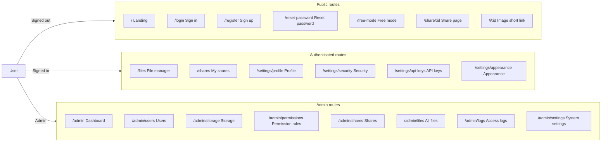

<div align="center">


# Picumet frontend guide

**Multi-cloud object storage with fine-grained access control**

English | [中文](UI_CN.md)

</div>

The Picumet frontend is a React single-page application that delivers the file manager, share pages, user settings, and admin console for a multi-cloud object storage platform. This guide documents the page structure, responsive layout, theming, accessibility, and interactions of the interface.

## Before you begin

- Node.js 22 or later with [bun](https://bun.sh/) 1.3 or later installed.
- A running backend. See [DEVELOPMENT.md](DEVELOPMENT.md) for setup instructions.
- Basic familiarity with React, TypeScript, and Tailwind CSS.

To start the development server:

1. Change into the `frontend/` directory.
2. Run `bun install` to install dependencies.
3. Run `bun run dev` to start Vite.

The development server serves the app at the URL that Vite prints, usually `http://localhost:5173`.

## Overview

The frontend lives in the `frontend/` directory and talks to the Workers API over HTTP. It uses these tools:

- React 18 with `react-router-dom` for routing.
- Vite for building and hot reload.
- TypeScript for type safety, with shared types imported from `shared/types.ts`.
- Tailwind CSS for styling.
- i18next for Chinese and English localization.
- TanStack Query for server state, caching, and mutations.

Every page loads lazily with `React.lazy` and `Suspense`, so the initial bundle stays small.

## Page routes

The router in `frontend/src/App.tsx` defines the routes below. Unauthenticated users who open a protected route land on `/login` with a `redirect` query parameter; after sign-in, the app sends them back. Admin routes check the signed-in user's role and show a permission message when the role is not `admin`.



### Page map

| Page | Path | Access | Component |
| :--- | :--- | :--- | :--- |
| Landing | `/` | Public | `Landing` |
| Sign in | `/login` | Public | `Login` |
| Sign up | `/register` | Public | `Register` |
| Reset password | `/reset-password` | Public | `ResetPassword` |
| Free mode | `/free-mode` | Public | `FreeMode` |
| Share page | `/share/:id` `/i/:id` | Public | `SharePage` |
| File manager | `/files` `/files/*` | Signed in | `Files` |
| My shares | `/shares` | Signed in | `MyShares` |
| Settings layout | `/settings/*` | Signed in | `SettingsLayout` |
| Profile | `/settings/profile` | Signed in | `Profile` |
| Security | `/settings/security` | Signed in | `Security` |
| API keys | `/settings/api-keys` | Signed in | `ApiKeys` |
| Access rules | `/settings/access-rules` | Signed in | `AccessRules` |
| Appearance | `/settings/appearance` | Signed in | `Appearance` |
| Admin layout | `/admin` | Admin | `AdminLayout` |
| Dashboard | `/admin` | Admin | `Dashboard` |
| Users | `/admin/users` | Admin | `Users` |
| Storage | `/admin/storage` | Admin | `Storage` |
| Mount points | `/admin/mounts` | Admin | Redirects to `/admin/storage?tab=mounts` |
| Permission rules | `/admin/permissions` | Admin | `Permissions` |
| Shares | `/admin/shares` | Admin | `Shares` |
| All files | `/admin/files` | Admin | `Files` |
| Access logs | `/admin/logs` | Admin | `Logs` |
| System settings | `/admin/settings` | Admin | `Settings` |

## Layout

### App shell

The `AppShell` component wraps the signed-in pages and provides the common chrome:

- A sticky top bar with the logo, site title, primary navigation, and a right cluster for the theme toggle, language switcher, and user menu.
- An announcement banner below the top bar.
- A centered content area with a maximum width of `1400px`.

```text
┌─────────────────────────────────────────────────────────────┐
│ [☰] [Logo] [Files] [Shares] [Settings] [Admin]  [◐] [中] [@]│
├─────────────────────────────────────────────────────────────┤
│   Announcement banner                                       │
├─────────────────────────────────────────────────────────────┤
│                                                             │
│                    Main content area                        │
│                                                             │
└─────────────────────────────────────────────────────────────┘
```

On screens narrower than `768px`, the top bar hides the navigation and shows a hamburger button. The button opens a left-side `Drawer` with the same links.

### File manager workspace

The file manager (`/files`) arranges content into three regions:

```text
┌──────────────────────────────────────────────────────────────┐
│ Breadcrumb                       [↑ Upload] [+ New] [☑] [▦] │
│ [Search] [Sort ▾] [Order]                                    │
├────────────┬──────────────────────────────────────┬──────────┤
│            │  File cards / file list              │          │
│  Sidebar   │  ┌────┐ ┌────┐ ┌────┐ ┌────┐        │ Props    │
│  Folders   │  │ ▤  │ │ ▤  │ │ 🖼 │ │ 📄 │        │ panel    │
│  Types     │  └────┘ └────┘ └────┘ └────┘        │          │
│  Favorites │                                        │          │
│            │  [Bulk actions bar · sticky bottom]   │          │
└────────────┴──────────────────────────────────────┴──────────┘
```

- **Breadcrumb**: shows the current folder path; each segment navigates to that folder.
- **Toolbar**: contains **Upload**, **New folder**, **Select** and batch-select, plus the grid/list view toggle.
- **Search and sort**: filter by name and sort by name, time, or size, ascending or descending.
- **Content**: renders a responsive card grid or a list of rows.
- **Properties panel**: opens on the right when you select a file or choose **Properties** from a menu.
- **Bulk actions bar**: sticks to the bottom of the viewport while you select any item.

### Share pages

**Public share page.** The route `/share/:id` renders one shared item, and `/i/:id` serves the image short link. Password-protected shares show a password gate before the content loads. After verification, the page shows the title, creator, size, expiry, and view-count badges, plus download, copy-link, and QR actions. The QR code renders locally with the `qrcode` library. The image short link renders the image directly, without the surrounding card.

**Share list.** The route `/shares` lists the links you created. A view toggle switches between a responsive card grid and a row list. Each card shows the file icon, title, status badge, size, expiry, view count, and download count, with quick actions for QR code, open, copy link, and revoke. The list paginates with a configurable page size, 20 by default.

### Settings and admin pages

The settings layout (`/settings/*`) shows a vertical nav with **Profile**, **Security**, **API keys**, **Access rules**, and **Appearance**. The access-rules page lists rules the user authored (target file, effect, subject, permissions) and revokes them behind a confirmation dialog. The admin layout (`/admin`) uses two columns: a vertical nav on the left and the page content on the right. The nav stacks above the content on mobile. Admin pages include the dashboard with stat cards, user management (the edit dialog carries capability checkboxes: publish/share/grant), storage configuration (the provider dialog uses preset options — R2/AWS S3/Oracle/MinIO/custom — that only prefill fields, plus a mount path), permission rules (the table has an "origin" column separating admin rules from user-authored ones), share management, all files (with visibility and review status columns to approve, reject, or override visibility), access logs, and system settings.

### Public pages

The sign-in (`/login`), sign-up (`/register`), and reset-password (`/reset-password`) pages share a centered card layout. Sign-up collects username, password, email, and an optional invite code, and it can enforce Cloudflare Turnstile when the site enables it. After a successful sign-in, the app navigates to the `redirect` target, or to `/files` when no target exists. The free-mode page (`/free-mode`) lets visitors connect their own object-storage bucket with temporary credentials; the form offers presets (R2, AWS S3, Oracle, MinIO, and more) that only prefill fields and stay editable, and the credentials are stored AES-GCM encrypted in a short-lived server session.

### Top bar components

| Component | Location | Purpose |
| :--- | :--- | :--- |
| `Logo` | Top-left | Brand mark; uses the site logo and title from site settings. |
| `ThemeToggle` | Top-right | Switches between light, dark, and system theme. |
| `LanguageSwitcher` | Top-right | Toggles Chinese and English. |
| `UserMenu` | Top-right | Shows the display name; links to settings and sign out. |
| `AnnouncementBanner` | Below top bar | Shows site announcements that admins publish. |

## Responsive design

The interface uses three viewport ranges:

| Breakpoint | Width | Layout behavior |
| :--- | :--- | :--- |
| Mobile | Below `640px` | Sidebar and navigation collapse into drawers; card grid shows 2 columns; the properties panel opens as a right drawer. |
| Tablet | `768px`–`1024px` | Navigation stays in the top bar; card grid shows 3–4 columns. |
| Desktop | `1024px` and above | Card grid shows 5 columns; the properties panel sticks to the right edge. |

Design decisions:

- **Sidebar to drawer**: the primary navigation lives in the top bar on tablet and desktop. On mobile, the hamburger button opens a left drawer.
- **Properties panel**: on `sm` and wider the panel renders as a fixed right column that stays visible while you scroll. On mobile it renders inside a right-side `Drawer`. A `matchMedia('(max-width: 639px)')` gate (`isMobile`) keeps the drawer open only on phones, so the hidden desktop column never locks page scrolling on larger screens.
- **Card grid**: the grid uses `grid-cols-2 sm:grid-cols-3 md:grid-cols-4 lg:grid-cols-5`, so columns grow with the viewport.
- **Bulk actions bar**: a scan across widths from `350px` to `1080px` confirms the bar stays visible without overlapping content or causing horizontal scroll. Buttons show icons only on narrow screens and add labels from `1024px` upward.
- **Tables and badges**: secondary table columns hide below `sm` (`hidden sm:block`). Badges use `whitespace-nowrap` and a shrink-safe layout so rows stay aligned on narrow screens; permission-rule cards wrap the whole group instead of misaligning.

## Theming

The theme store in `frontend/src/stores/theme.ts` persists appearance in `localStorage` and applies CSS variables on `document.documentElement`.

### Theme mode

Users pick **light**, **dark**, or **system**. In system mode the app follows `prefers-color-scheme` and reacts to live changes. Dark mode toggles a `dark` class on the root element.

### Accent color

Users pick an accent color from presets or with a color picker. The app converts the hex value to an HSL triple and writes it to the `--primary` and `--ring` CSS variables. Tailwind consumes these as `hsl(var(--primary))`. The app computes a foreground color with the YIQ formula, so text and icons stay readable on light or dark accents.

### Blur and background

- **Three blur levels**: the appearance settings' **Blur effect** slider sets `blurLevel = 'off' | 'default' | 'frosted'` (default `default`), written to the `--glass-alpha` and `--glass-blur` CSS variables; `off` adds a `.no-blur` class on the root element and disables every backdrop filter (overlay, file-item frosting, menus) for solid surfaces.
- **Unified surfaces**: the following components share the same surface classes (`frontend/src/index.css` + `components/ui/`): the top bar, sidebar (file tree), dropdown menus, context menu, Select popovers, toasts, dialog bodies, file cards and rows, settings and admin panels, and skeletons. Never hardcode blur or opacity — consume `--glass-alpha` / `--glass-blur`.
- **Background image**: users upload an image up to `2MB` (JPG, PNG, or WebP) or leave no background. The image stores as a base64 data URL in `localStorage`. With a wallpaper the default tier raises opacity (dark 0.92 / light 0.82) to keep WCAG AA. A solid-color background option no longer exists.

### Tabs and sliding indicator

`frontend/src/components/ui/tabs.tsx` implements the shadcn default variant without external primitives:

- The tab list is a `bg-muted` pill container; the active trigger is a raised `bg-background` pill with a subtle shadow.
- A measured indicator (`useEffect` + `offsetLeft`/`offsetWidth`) slides behind the active trigger with a 300 ms `ease-out` transition. Because the measurement runs after paint, the indicator animates from the previous position in both directions.
- `TabsContent` fades in with the shared fade animation. Usage examples: the admin storage tab (providers/mounts) and the permissions editor (GUI/code).

The top navigation bar (`AppShell`) uses the same measured-indicator technique for its active item. Its position is cached in a module-level variable, so the indicator survives AppShell remounts during route changes and keeps animating both left-to-right and right-to-left.

### File icons and folder display

| Setting | Options | Effect |
| :--- | :--- | :--- |
| File icon style | `iconify` or `emoji` | Switches icon rendering between Iconify glyphs and emoji. |
| Folder display | `icon` or `contents` | Shows a plain folder icon or a 2x2 preview of the folder's first four items. |
| Custom emoji | Per file | A per-file emoji set in the properties panel overrides the icon. |

## Design system rules (mandatory, split by frontend module)

> Distilled from past iterations and **verified against the current code** (the code is the source of truth; each section names its implementing files). Read before changing UI; update this section whenever the code changes.

### `stores/theme.ts` + `index.css` — glass morphism and theming

- Surfaces use `glass-surface` (cards/panels/sidebar/file items, `--card` base), `glass-surface-popover` (menus/popovers, `--popover` base) plus `glass-blur`; the dialog overlay uses `glass-overlay`. Intensity is gated by `blurLevel = 'off' | 'default' | 'frosted'` (default `default`), written to `--glass-alpha` / `--glass-blur`; `off` adds `.no-blur` on the root and disables every backdrop filter (overlay/file items/menus) for solid surfaces. Never hardcode blur or opacity.
- With a wallpaper (root `has-bg-image`) the default tier raises opacity (dark 0.92 / light 0.82) to keep WCAG AA.
- Accent: hex → HSL written to `--primary`/`--ring`, **no dark-mode lightness lift** (the black-as-default accent idea was abandoned); light mode keeps an AA darkening loop when white button text is below 4.5:1 (floor 35% lightness); the foreground comes from YIQ.

### `components/ui/dropdown.tsx` + `select.tsx` — popup menus

- Dropdown, Select **must `createPortal` to `document.body`** and reuse `DROPDOWN_MENU_CLASS` / `DROPDOWN_ITEM_CLASS` (inline rendering sits inside backdrop-filter ancestors, which breaks the glass blur). The context menu (`pages/Files.tsx`) portals too (z-[100]).
- Native `<select>` is forbidden; `Select` aligns its menu with the trigger width; dismissal = outside click / Escape / resize / scroll.

### `components/ui/toast.tsx` — toast (HeroUI v3 replica)

- Newest on top; collapsed rear layers peek 12px below with a 0.05-per-layer scale, their height clamped to the front card, content hidden, **no shadow on non-front layers**; only collapsed rear wrappers are `overflow-hidden` (front/expanded wrappers must stay visible: the -top-1 close button and shadows would be square-clipped otherwise); at most 3 visible.
- Cards size to content (RO measures offsetHeight — contentRect misses padding and clips); enter 350ms slide from above; exit 250ms: front slides up, non-front scales down 0.96 in place; default 4s auto-dismiss; hover expands the deck and pauses timers.
- Closing goes through `markLeaving` — never `remove()` directly (the deck would collapse instantly).
- Trigger via `toast('success'|'error'|'info', msg)`; success/failure operations must surface a toast — no silent success; a route change calls `clearAll()` (Toaster uses `useLocation` and must stay inside the Router).

### `components/ui/dialog.tsx` — dialogs

- Every modal/drawer shares the enter/exit animation state machine (`mounted/entered` + `EXIT_MS`); overlay darkening and blur animate together; scroll lock = `body overflow hidden` + `html { scrollbar-gutter: stable }` for zero layout shift; do not introduce another lock mechanism.
- Dialog bodies and drawer panels use `.glass-dialog` (**not** `glass-surface`): behind the body sits the `glass-overlay` (black 50% + half-strength blur), so reusing `--glass-alpha` directly lets the dimmed backdrop bleed through and grays the whole fill. `.glass-dialog` applies three compensations (see `index.css`):
  - `brightness(1.75)` restores the 50%-brightness backdrop to 87.5% — a full ×2 would turn the dialog into a bright island against the dimmed page;
  - blur radius ×0.92 subtracts the 1/2.5-strength blur the overlay already contributes (gaussian variances add), so the net blur matches file cards;
  - the fill alpha drops 0.12 below the tier value (floor 0.6 — the frosted tier stays identical to file cards): the dialog's backdrop is double-blurred low-contrast content, so text keeps more headroom than on wallpaper-mounted cards, and the default tier's 0.92 must open up to show any glass at all.
- Untitled dialogs skip the header strip (close button pinned to the top right) to avoid a dead band.
- Destructive actions must go through `ConfirmDialog` (HeroUI AlertDialog layout: icon + title row, description, right-aligned cancel + danger buttons, `max-w-sm`) plus a success/error toast; native `confirm()` is forbidden.

### `index.css` `.item-surface` + `explorer.tsx` / `MyShares.tsx` — item three-state

- rest = glass surface + transparent border; hover = **darkening** (an 8% black `background-image` overlay, not a translucent fill — translucency shows the wallpaper through); selected (`.item-surface-selected` / lasso `.lasso-item-selected`) = glass base with a `primary/0.14` gradient + `primary/0.55` border. File cards/rows and share cards/rows share the same effect.

### `components/files/lasso.ts` + `pages/Files.tsx` — drag multi-select

- The drag surface is the AppShell **root container** (`rowRef.closest('main').parentElement`, listeners forwarded through `lassoRef`, bound once): the banner strip, side margins, the space below the content and the whole row all start drags; item hit-testing only matches `[data-file-id]`; `skipSelector` skips buttons/inputs/checkboxes/card bodies; `setPointerCapture` only after a 4px move; `onClickCapture` suppresses the post-drag click.
- The files page root gets a persistent `select-none` (added on mount, removed on unmount): a drag can trigger native text selection instantly, which cannot be undone afterwards.
- Selection checkboxes = `Checkbox` (checked `border-primary bg-primary`) + the `.lasso-item-dot` scale feedback; a blank click / directory change / new dialog clears the selection and the bulk bar; sorting is a single dropdown (`SORT_FIELDS`, asc/desc are Check items inside the menu).

### `components/files/FileTree.tsx` — file tree

- `currentPath` and its ancestors auto-expand; switching directories collapses other branches; empty folders never render the expanded form.
- Desktop `sticky top-20` + `h-[calc(100vh-6rem)]`, inner scroll `scrollbar-none`.

### `components/files/preview.tsx` — preview

- Dialog `w-[min(1400px,94vw)]`, media area `h-[min(72vh,780px)]`, responsive to the browser width.

### `pages/MyShares.tsx` — shares

- Compact cards; quick actions consolidated into the three-dot dropdown; list rows darken on hover like the files page.

### `components/settings/BlurSlider.tsx` — discrete slider

- The native range is `appearance:none` fully transparent (kills the accent-color native rendering) and only handles drag/keyboard; the fill bar, stop dots, thumb and labels are self-drawn and aligned to the knob center; the fill's right edge aligns with the knob center; label/track clicks, drag snapping, arrow keys + `aria-valuetext`; the description follows the level. Reuse this pattern for new discrete settings.

### `components/ui/checkbox.tsx` — checkbox

- Checked `border-primary bg-primary` (accent-colored); unchecked `bg-background/60 backdrop-blur-sm`.

### `components/ui/skeleton.tsx` — skeletons

- Containers always use `glass-surface glass-blur` + rounded borders.

### `pages/settings/Appearance.tsx` — appearance

- The accent row spans the full width (preset swatches + a trailing rainbow "custom" that opens the native picker); file icon style and folder display share one two-column row; the blur slider row has no border.

### Layout and scrollbars (AppShell / settings / admin pages / `index.css`)

- Settings/admin content uses `lg:grid-cols-2`; the admin system settings stack "system settings + announcements" in the left column with SMTP on the right.
- Settings/admin sidebars are sticky with inner scroll; inner scroll areas use `scrollbar-none`, visible scrollbars use `scrollbar-thin` (8px, rounded, muted). Both are plain CSS classes and **do not support `md:` style variants** (`md:scrollbar-none` silently does nothing — a past bug source).
- The admin content column (`AdminLayout`'s `md:h-[calc(100vh-12rem)]`) uses `md:overflow-clip` + `md:[overflow-clip-margin:4px]`, **not** `overflow-hidden`: the Users/Files toolbar search boxes sit flush with the column's top and left/right edges (Files flush left, Users pushed right by `justify-between`), so their 3px focus rings paint into the clip region — the ring looks cut off on the top and one side. The clip margin grants 4px of paint room with zero layout shift; browsers without support degrade to plain clipping. Watch for the same truncation when adding flush focusable controls.

## Accessibility

The interface follows standard web accessibility practices:

- **Semantic structure**: pages use `header`, `nav`, `main`, and `footer` landmarks; forms use `<label>`, `<input>`, and `<button>`.
- **Labels**: every field has a visible label; icon-only buttons provide `aria-label`, such as the grid/list view toggle and the menu button.
- **Focus**: interactive elements receive a visible focus ring; the tab order follows the DOM order.
- **Contrast**: body text meets WCAG contrast guidance, and the YIQ-based accent foreground keeps interactive text readable.
- **Alt text**: meaningful images carry descriptive `alt`; the logo and decorative glyphs use `alt=""` or an aria label where appropriate.
- **Reduced motion**: interface animations are short and subtle; the bulk actions bar uses a small slide-in animation.

## Interaction

### Selecting files

Click a card or row to select one item. Hold **Ctrl**/**Cmd** or **Shift** while clicking to extend the selection. The **Select** toolbar button enters multi-select mode, where the menu offers **Select all**, **Invert selection**, and **Clear selection**. Checkboxes appear on every card while in multi-select mode or when you hover.

### Opening files

Double-click an item to open it:

- Folders navigate into their contents.
- Images, videos, audio, and code open in the preview modal.
- Other files start a download.

### Previewing files

The preview modal handles media types:

- **Images**: zoom from `50%` to `300%`, rotate by `90°`, and download the original. Controls stay pinned to the bottom, so the zoomed image cannot cover them.
- **Video and audio**: a native player with playback, seek, volume, and full-screen controls.
- **Code**: syntax highlighting with highlight.js; the app HTML-escapes the source before highlighting, so it never renders raw HTML or Markdown.
- **Password-protected files**: the modal asks for a password before loading the content.

### Context menus and hover actions

Right-click a file to select it and open the properties panel. Hovering a card or row reveals a checkbox and a three-dot menu at the top-right corner. The menu provides open, download, copy link, share, rename, move, set password, properties, and delete.

### Visibility and access rules

In the properties panel (`components/files/PropertiesPanel.tsx`) you can set a file's or folder's visibility to **private**, **users** (any signed-in user), or **public**. Going public requires the publish capability (`can_publish`), otherwise the item enters the admin review queue; setting it on a folder cascades to everything inside. Users holding the grant capability (`can_grant`) can also create per-file allow/deny rules for a specific user or all users (reads and downloads only) right in the properties panel; rules they created are managed on the settings "Access rules" page.

### Uploading files

The upload dialog opens from the toolbar or an empty state. You can drag files onto the drop zone or select them with the file picker. The dialog shows the target folder and queues each file with a progress bar. Uploads run up to three at a time through a session-based flow: the app requests an upload session, sends the object either directly with a presigned URL or through the Worker proxy, then completes the session. Failed tasks show an error and a retry button.

### Dragging files

Drag files onto the upload dialog's drop zone to add them to the queue. You can also drag files between folders to move them; verification notes remain tracked in the progress document.

### Copying links

The copy-link flow handles single files and multi-select batches:

- **Single file**: copying a non-media file copies the direct link immediately. Copying an image or video opens the copy-link dialog.
- **Batch**: the bulk action bar copies all selected files; if the selection contains an image or video, the app opens the copy-link dialog.
- **Dialog**: shows the selected files as chips, a format picker with **Direct link**, **HTML code**, and **Markdown code**, and a **Signed link** switch. Signed links expire after one hour. The app joins the generated links with newlines and writes them to the clipboard.

### Folder previews

With folder display set to `contents`, each folder card shows a 2x2 grid of its first four items, ordered by the current sort. Folders and files show icons, images show thumbnails, and videos show a canvas-captured frame. An empty folder falls back to the folder icon.

### Video thumbnails

The card renders video thumbnails entirely in the browser. A hidden `<video>` element seeks to about `20%` of the duration, draws the frame to a `<canvas>`, and exports it as a JPEG data URL. If decoding or CORS fails, the card falls back to a file icon.

### Image previews

Image cards fetch a preview URL and render the image inline. The app caches the URL per file, and it remembers failed URLs, so the same broken URL does not cause repeated requests.

### Bulk actions

The bulk actions bar appears as soon as you select at least one item. It offers download, share (single selection only), copy link, move, rename (single selection only), delete, and properties (single selection only), plus a **Clear selection** button.

## Performance

- **Route-level lazy loading**: every page loads with `React.lazy` and `Suspense`, so the browser fetches page code only when the route opens.
- **Server state caching**: TanStack Query caches file listings and mutation state, which avoids redundant requests.
- **Image URL cache**: preview URLs resolve once per file and reuse from an in-memory map.
- **Client-side thumbnails**: video cards generate thumbnails locally with canvas, so they do not consume server bandwidth or storage.
- **Lazy-loaded images**: folder-preview thumbnails load with `loading="lazy"`.

## Checklist

Use this list when reviewing a UI change:

- [ ] Every interactive element has a visible focus indicator.
- [ ] Icon-only buttons have `aria-label` text.
- [ ] Meaningful images have descriptive `alt`; decorative images use `alt=""`.
- [ ] Forms label every field and use the correct input types.
- [ ] The layout reflows at `640px`, `768px`, and `1024px` without horizontal scroll.
- [ ] Hover-only actions also work with keyboard and touch input.
- [ ] The bulk actions bar stays visible from `350px` to `1080px`.
- [ ] New pages lazy-load through the router.
- [ ] Theme changes persist to `localStorage` and respect the system preference.

## What's next

- [Architecture guide](ARCHITECTURE.md) for backend services and shared types.
- [API reference](API.md) for the HTTP endpoints the UI calls.
- [Development guide](DEVELOPMENT.md) for local setup, tests, and conventions.
- [Deployment guide](DEPLOYMENT.md) for shipping to Cloudflare.
- [Progress report](PROGRESS.md) for the implementation status and roadmap.
- [Project overview](../README.md)
