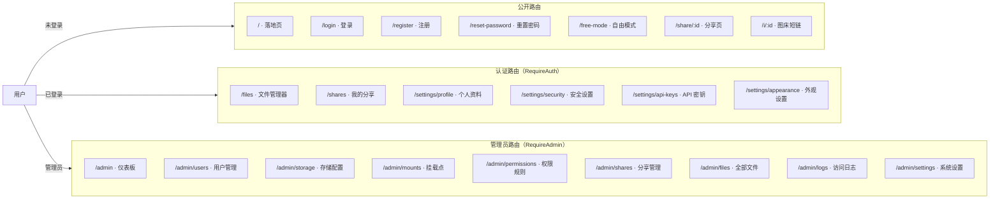

# Picumet 页面设计

> 由 spec.md「前端页面」章节与 `frontend/src/App.tsx`（实际路由）整合而成。

## 页面路由



## 页面清单

| 页面 | 路径 | 访问 | 组件 |
|---|---|---|---|
| 落地页 | `/` | 公开 | `Landing` |
| 登录 | `/login` | 公开 | `Login` |
| 注册 | `/register` | 公开 | `Register` |
| 重置密码 | `/reset-password` | 公开 | `ResetPassword` |
| 自由模式 | `/free-mode` | 公开 | `FreeMode` |
| 分享页 | `/share/:id` `/i/:id` | 公开 | `SharePage` |
| 文件管理器 | `/files` | 认证 | `Files` |
| 我的分享 | `/shares` | 认证 | `MyShares` |
| 设置（布局） | `/settings/*` | 认证 | `SettingsLayout` |
| 个人资料 | `/settings/profile` | 认证 | `Profile` |
| 安全设置 | `/settings/security` | 认证 | `Security` |
| API 密钥 | `/settings/api-keys` | 认证 | `ApiKeys` |
| 外观设置 | `/settings/appearance` | 认证 | `Appearance` |
| 管理后台（布局） | `/admin` | 管理员 | `AdminLayout` |
| 仪表板 | `/admin` | 管理员 | `Dashboard` |
| 用户管理 | `/admin/users` | 管理员 | `Users` |
| 存储配置 | `/admin/storage` | 管理员 | `Storage` |
| 挂载点管理 | `/admin/mounts` | 管理员 | `Mounts` |
| 权限规则 | `/admin/permissions` | 管理员 | `Permissions` |
| 分享管理 | `/admin/shares` | 管理员 | `Shares` |
| 全部文件 | `/admin/files` | 管理员 | `Files` |
| 访问日志 | `/admin/logs` | 管理员 | `Logs` |
| 系统设置 | `/admin/settings` | 管理员 | `Settings` |

---

## 1. 落地页

**路径**: `/` · **访问**: 公开

布局：
```
┌─────────────────────────────────────────┐
│ [Logo] Picumet      [功能] [定价] [登录]│
├─────────────────────────────────────────┤
│          Picumet                        │
│     多云对象存储管理平台                │
│   统一管理你的云端文件和图床            │
│     [开始使用 →] [GitHub]               │
├─────────────────────────────────────────┤
│  特性展示（2×3 卡片）                   │
│  🔐细粒度权限 · 📦多云支持 · 🚀边缘加速 │
│  🔗分享链接 · 🎨自定义外观 · 🌐国际化    │
├─────────────────────────────────────────┤
│  立即开始 · 免费开源，部署到 Cloudflare │
│  [查看文档] [开始部署]                  │
└─────────────────────────────────────────┘
```

**关键组件**: `HeroSection`、`FeatureGrid`、`CTASection`、`Footer`。

## 2. 登录 / 注册

**路径**: `/login` `/register` · **访问**: 公开

- 登录表单：用户名 + 密码 + 忘记密码链接
- 注册表单额外字段：邮箱、邀请码（可选）、Turnstile（可选）
- 未登录访问 `/files` → 重定向 `/login?redirect=/files`

**验收**:
- 正确凭据 → 设置 Cookie 并跳转 `redirect` 或 `/files`
- 注册 → 发送验证邮件（开发环境自动验证）

## 3. 文件管理器

**路径**: `/files` 或 `/files/*` · **访问**: 认证用户

桌面布局：
```
┌───────────────────────────────────────────────────────────┐
│ [Logo] [面包屑]                [搜索] [@用户] [⚙️]        │
├──────┬────────────────────────────────────────┬───────────┤
│      │ Toolbar [↑上传][+新建][视图▾][排序▾]   │ 属性面板  │
│ 📁   ├────────────────────────────────────────┤ 文件名    │
│ 全部 │  文件卡片网格                          │ 类型      │
│ 图片 │  ┌────┐ ┌────┐ ┌────┐ ┌────┐         │ 大小      │
│ 视频 │  │📁文档│ │📁视频│ │🖼️bg│ │📄readme│ │ 修改时间  │
│ 音乐 │  └────┘ └────┘ └────┘ └────┘         │ 颜色/封面 │
│ 文档 │                                         │ 密码/URL  │
│ 收藏 │                                         │ 位置      │
│ 分享 │                                         │ 手动[↑↓]  │
└──────┴────────────────────────────────────────┴───────────┘
```

移动端：侧边栏折叠为汉堡菜单（Drawer）、属性面板改底部 Sheet、卡片 2 列、工具栏浮动按钮。

**核心交互**:
- **选择**: 单击选中、Ctrl/Cmd+单击多选、Shift+单击范围、Ctrl/Cmd+A 全选
- **拖拽**: 拖到文件夹移动、拖到侧边栏移动、拖到上传区上传、拖拽排序（manual）
- **双击**: 文件夹进入、图片预览、视频/音频播放、其他下载
- **右键菜单**: 打开/下载/重命名/移动/复制链接/分享/设置密码/删除/属性
- **批量操作栏**: 已选 N 项 [移动] [删除] [取消选择]

**关键组件**: `FileExplorer`、`Sidebar`、`Toolbar`、`FileGrid`、`FileList`、`FileItem`、`PropertiesPanel`、`BulkActionsBar`、`ContextMenu`、`UploadDropzone`。

## 4. 上传弹窗

**触发**: 点击上传按钮 / 拖拽文件

- 拖拽区 + 选择文件/文件夹
- 目标路径选择器（默认 `/uploads/`）
- 并发上传（3 线程）
- 大文件自动分片（>100MB）
- 每个任务进度条 + 暂停/取消
- 已完成/失败分组列表
- 暂停全部/清空列表/完成

**关键组件**: `UploadModal`、`UploadDropzone`、`UploadQueue`、`UploadItem`、`PathSelector`。

## 5. 文件预览器

- **图片**: 缩放（滚轮/手势）、旋转 90°、左右切换同目录、下载原图
- **视频/音频**: 播放/暂停、进度拖动、音量、倍速（0.5x~2x）、画中画、全屏
- **代码**: 语法高亮（highlight.js 纯文本 + 预转义，安全）、行号、复制、下载；**不渲染 HTML/Markdown**

## 6. 分享页面

**路径**: `/share/:id` 或 `/i/:id` · **访问**: 公开

需要密码时：
```
┌─────────────────────────────────┐
│  [Logo] Picumet                 │
│    🔒 此分享需要密码            │
│    标题 / 分享者 / [密码] [查看]│
└─────────────────────────────────┘
```

验证成功后：
```
┌─────────────────────────────────────┐
│  📄 文件名                          │
│  大小 · 分享者 · 过期时间 · 访问次数 │
│  [浏览量 badge][访问上限 badge]     │
│   (文件预览：图片/视频/文本)        │
│  [⬇ 下载] [🔗 复制链接] [📱 二维码] │
└─────────────────────────────────────┘
```

**功能**: 密码验证、图片直出预览、下载、复制多格式链接、**本地二维码**（前端 `qrcode` 库生成 data URL）。

**验收**:
- 有密码分享 → 显示密码输入页
- 正确密码 → 显示预览 + 下载
- 已过期 → 显示"分享已过期"

## 7. 用户设置

**侧边栏**: 个人资料 / 安全设置 / API 密钥 / 外观设置

- **个人资料**: 头像、显示名称、邮箱（已验证标识）、默认路径、语言（中文/English）
- **安全设置**: 修改密码（旧密码 + 新密码）
- **API 密钥**: 列表（名称、keyId、协议、最后使用）+ 创建/撤销
  - 创建弹窗: 名称、协议（WebDAV/自定义 API）、上传路径模板、权限、IP 白名单、有效期
  - 成功显示: ⚠️ 密钥仅显示一次 + Key ID/Secret + WebDAV/API 配置 JSON 复制
- **外观设置**: 主题（浅色/深色/跟随系统）、强调色、模糊效果、自定义背景（图片/URL/纯色）——存 localStorage

## 8. 管理员后台

**导航**: 仪表板 / 用户管理 / 存储配置 / 挂载点管理 / 权限规则 / 分享管理 / 全部文件 / 访问日志 / 系统设置

- **仪表板**: 概览统计卡片（用户/文件/存储/请求）+ 存储使用 + 近期活动
- **用户管理**: 表格（角色 badge、状态 badge、配额）+ 编辑弹窗 + 分页
- **存储配置**: Provider 卡片列表（状态 badge、region、bucket）+ 创建/测试/编辑/删除
- **挂载点管理**: 挂载列表（mountPath、provider、sortBy badge、priority）+ 增删改
- **权限规则**: 规则卡片（路径、主体、权限 badges、allow/deny badge）+ 可视化创建/编辑
- **分享管理**: 全局分享列表 + 撤销
- **全部文件**: 文件列表 + 分页
- **访问日志**: 日志卡片（action badge、path、userId、IP、bytes、时间）
- **系统设置**: 分组表单（站点信息、注册/访客开关、Turnstile、限流）

## 9. 响应式设计

- **断点**: 桌面 ≥1024 / 平板 768~1024 / 手机 <768
- 侧边栏折叠为 Drawer、属性面板变 Sheet、卡片网格 2 列、表格列 `hidden md:block` 隐藏次要列
- Badge 组件 `whitespace-nowrap shrink-0`，权限规则卡片 `flex-wrap` 整组换行（窄屏不错位）

---

## 相关文档

- [系统架构](ARCHITECTURE.md)
- [API 设计](API.md)
- [开发指南](DEVELOPMENT.md)
- [部署指南](DEPLOYMENT.md)
- [技术规格（完整版）](../spec.md)
