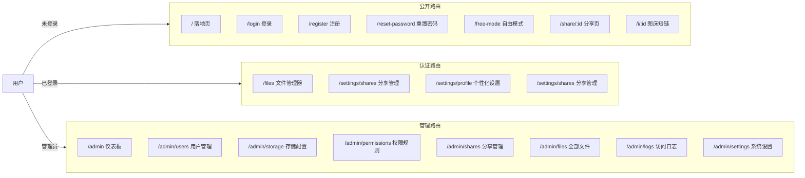

<div align="center">


# Picumet 前端指南

**多云对象存储管理平台**

[English](UI.md) | 中文

</div>

Picumet 的前端是一个 React 单页应用，负责文件管理器、分享页、用户设置和管理后台。这份文档说明页面的组织结构、响应式布局、主题、无障碍与交互方式。

## 开始之前

- 已安装 Node.js 22 或更高版本，并可用 [bun](https://bun.sh/) 1.3 或更高版本。
- 后端已在本机运行。环境搭建见 [开发指南](DEVELOPMENT_CN.md)。
- 对 React、TypeScript、Tailwind CSS 有基本了解。

启动开发服务器：

1. 进入 `frontend/` 目录。
2. 执行 `bun install` 安装依赖。
3. 执行 `bun run dev` 启动 Vite。

终端会打印本地地址，通常是 `http://localhost:5173`。

## 总览

前端代码位于 `frontend/` 目录，通过 HTTP 请求 Workers API。技术选型如下：

- React 18，路由使用 `react-router-dom`。
- Vite 负责构建和热更新。
- TypeScript 提供类型检查，共享类型来自 `shared/types.ts`。
- Tailwind CSS 负责样式。
- i18next 支持中文和英文。
- TanStack Query 管理服务端状态、缓存和变更。

所有页面都通过 `React.lazy` 和 `Suspense` 按路由懒加载，首屏包体积保持较小。

## 页面路由

`frontend/src/App.tsx` 定义了全部路由，如下表。未登录用户访问受保护页面时，会先跳到 `/login` 并带上 `redirect` 参数，登录成功后回到原页面。管理路由校验当前用户角色，非 `admin` 角色会看到权限提示。



### 页面清单

| 页面 | 路径 | 访问 | 组件 |
|---|---|---|---|
| 落地页 | `/` | 公开 | `Landing` |
| 登录 | `/login` | 公开 | `Login` |
| 注册 | `/register` | 公开 | `Register` |
| 重置密码 | `/reset-password` | 公开 | `ResetPassword` |
| 自由模式 | `/free-mode` | 公开 | `FreeMode` |
| 分享页 | `/share/:id` `/i/:id` | 公开 | `SharePage` |
| 文件管理器 | `/files` `/files/*`（固定前缀） | 登录 | `Files` |
| 分享管理 | `/settings/shares` | 登录 | `Shares`（设置侧栏，个性化设置之下） |
| 设置布局 | `/settings/*` | 登录 | `SettingsLayout` |
| 个性化设置 | `/settings/profile` | 登录 | `Personalization`（左列：个人资料/邮箱管理/修改密码；右列：右键单击行为/主题含自定义背景） |
| API 密钥 | `/settings/api-keys` | 登录 | `ApiKeys` |
| 访问规则 | `/settings/access-rules` | 登录 | `AccessRules` |
| 管理后台布局 | `/admin` | 管理员 | `AdminLayout` |
| 仪表板 | `/admin` | 管理员 | `Dashboard` |
| 用户管理 | `/admin/users` | 管理员 | `Users` |
| 存储配置 | `/admin/storage` | 管理员 | `Storage` |
| 挂载点 | `/admin/mounts` | 管理员 | 跳转到 `/admin/storage?tab=mounts` |
| 权限规则 | `/admin/permissions` | 管理员 | `Permissions` |
| 分享管理 | `/admin/shares` | 管理员 | `Shares` |
| 全部文件 | `/admin/files` | 管理员 | `Files` |
| 访问日志 | `/admin/logs` | 管理员 | `Logs` |
| 系统设置 | `/admin/settings` | 管理员 | `Settings` |

## 布局

### 应用外壳

`AppShell` 组件包裹登录后的页面，提供统一的页面骨架：

- 顶部栏固定在最上方，包含 Logo、站点标题、主导航，右侧依次是主题切换、语言切换和用户菜单。
- 顶部栏下方是公告横幅。
- 内容区居中，最大宽度 `1400px`。
- 外壳是 `h-screen` 弹性列：无公告时横幅整体折叠，`main` 是唯一的页面滚动区（`scrollbar-none`），表格以 `flex-1 min-h-0` 加入高度链——横幅出现时表格变矮而不是把分页挤出视口；滚动条只保留隐藏或细样式，原生浏览器滚动条不出场。

```text
┌─────────────────────────────────────────────────────────────┐
│ [☰] [Logo] [文件] [设置] [管理] [◐] [中] [@]              │
├─────────────────────────────────────────────────────────────┤
│   公告横幅                                                   │
├─────────────────────────────────────────────────────────────┤
│                                                             │
│                    主内容区                                  │
│                                                             │
└─────────────────────────────────────────────────────────────┘
```

屏幕宽度小于 `768px` 时，顶部栏隐藏导航，只留汉堡按钮，点击后从左侧滑出 `Drawer` 菜单，里面是同样的链接。

### 文件管理器工作区

文件管理器（`/files`）分三个区域：

```text
┌──────────────────────────────────────────────────────────────┐
│ [搜索] [排序 ▾]                 [↑ 上传] [+ 新建] [☑] [▦|☰|🌲]│
│ 面包屑                                                    │
├────────────┬──────────────────────────────────────┬──────────┤
│            │  文件卡片 / 列表 / 扁平树              │          │
│  侧边栏    │  ┌────┐ ┌────┐ ┌────┐ ┌────┐        │ 属性抽屉 │
│  文件夹    │  │ ▤  │ │ ▤  │ │ 🖼 │ │ 📄 │        │          │
│  类型      │  └────┘ └────┘ └────┘ └────┘        │          │
│  收藏      │                                        │          │
│            │  [批量操作栏 · 底部悬浮]              │          │
└────────────┴──────────────────────────────────────┴──────────┘
```

- **工具栏行**：搜索与排序和 **上传**、**新建文件夹**、**选择**/批量选择、卡片/列表/树视图切换器同处一行，全部控件等高。排序菜单按名称过滤，按名称/时间/大小排序，支持升序/降序。
- **面包屑**：独占内容上方一行，树视图下隐藏。它先实测自身宽度，只在整行放不下时逐个把最老的中段收进 **…** 下拉——深路径在宽度允许范围内保留尽可能多的末段。
- **树视图**：内容区切换为扁平树——单子目录链合并为一行（`a/b/c/`），点击文件夹行即可展开（小箭头同样可点），行只渲染可视窗口，当前路径自动展开。
- **内容区**：按视图切换渲染响应式卡片网格、列表行或扁平树。
- **属性**：面板在所有屏幕尺寸下都以右侧 `Drawer` 打开；覆盖层不重排网格。
- **批量操作栏**：只要选中了任意文件，就会悬浮在视口底部。
- **创建分享**：行内菜单「分享」与批量栏「分享」都打开同一个 `ShareDialog`；选择集可以是 1 个或多个文件、1 个或多个文件夹，或两者混合（上限 50）。弹窗内保留标题、访问密码、有效期（预设 / 自定义时长 / 指定截止时间）、访问权限（所有人 / 仅登录 / 指定用户）、最大下载次数、允许预览与允许下载；创建成功后在同一弹窗展示链接、二维码、复制与打开按钮。

### 分享页面

**公开分享页**：`/share/:id`，`/i/:id` 是图床短链（单图直出）。带密码的分享先显示密码门，验证通过后才加载内容。页面头部显示标题（分享标题 → 单项目文件名 → 「分享内容」的回退链）、分享者、过期时间或「永久有效」、访问/下载计数与密码徽章。**内容是项目列表**：每行用与文件页一致的视觉语言（`FileIcon` + 名称 + 大小 + 行尾下载按钮），多项目时标题显示「N 个项目」；文件夹项目可点进去浏览（面包屑「分享根目录 › 子目录」+ 返回上级，空目录显示空态）；图片项目在属性允许时用大图预览。**一个「分享」按钮**统管转发：点击展开下拉（Portal 到 body），菜单内依次是本地生成的二维码、`复制链接`、`复制链接（含密码）`（在链接后追加 `?password=`）、`查看密码`（点击显示明文并可复制）、`复制分享文案`——文案格式为 `来自<分享者>的<分享名/文件名/N 个项目>` + `链接：…` + `密码：…`（无密码时省略密码行）。带 `?password=` 的链接打开分享页会自动填入并提交一次验证，直接进入内容。访客若未在本页输入过密码，`查看密码` 会提示去分享管理查看。错误态（撤销/过期/次数用尽/仅登录可见/不存在）统一用 lucide 图标（`Ban` / `Lock` / `FileQuestion`）与居中卡片，不再使用 emoji。

**分享列表**：设置侧栏「分享管理」（`/settings/shares`）展示你创建的分享链接，**只做查看与管理，不再提供创建入口**（创建入口统一在文件页）。视图切换可以在响应式卡片网格和列表行之间切换。每张卡片显示文件图标、标题、大小、过期时间，以及**该分享的全部设置**：状态徽章（`CheckCircle2` 有效 / `Clock` 已过期 / `Ban` 已撤销，配中文文案，不再直接渲染英文枚举）、访问权限（所有人 / 仅登录 / 指定 N 人）、密码保护（锁图标）、允许预览与允许下载的开关状态、访问与下载计数（含上限）、项目数（多项目时）。卡片上的设置按**三行**排布：第一行访问权限（所有人可查看 / 仅登录用户 / 指定用户 · N），第二行 `允许预览` `允许下载` 的开关状态，第三行 `{{used}}/{{max}} 次访问` 与 `{{used}}/{{max}} 次下载`（上限为空显示「不限」）。操作仍是二维码、打开、复制链接、撤销（撤销走 `ConfirmDialog`），其中分享菜单同样提供「复制链接（含密码）」「查看密码」「复制分享文案」。列表带分页，每页条数可调，默认 20。

### 设置与管理页面

**仪表板**（`/admin`）顶部是四张单行统计卡（图标 + 标签/数值堆叠 + 右侧副文本）：用户综述（管理员/用户/访客计数）、内存占用（容量未设置时仅显示数值，有值时附全宽细进度条）、桶数量、活跃挂载点；底部左侧是**桶泳道图**——每个存储桶一条泳道，挂载点作为缩进节点挂在其下（空心圆点 = 折叠、实心圆点 = 展开、无白色外圈），展开的挂载点下方是顶层文件夹行与递归文件计数（只显示计数、按该桶过滤），桶可折叠（默认展开）、挂载点可同时展开多个；某桶在某挂载点上是零文件备用时显示**备用桶 badge**，点击后高亮该挂载点主桶泳道 3 秒；右侧仍是**存储使用**（每挂载点用量与文件数，带容量进度条）与**近期活动**（最近 6 条）。

**全部文件**（`/admin/files`）表格带**存储桶 / 挂载点 / 哈希值**三列（分页内批量 IN 查询补齐，无 N+1），三视图共用一条工具栏：搜索与筛选开关在左、列表/挂载点/树切换器在右且筛选模式下不消失，筛选行在搜索下方展开——挂载点、存储桶、上传用户、可见性四个下拉与**哈希值子串**输入框（触发器与搜索框同一玻璃配方），行尾是清空与关闭。**挂载点视图**按 桶 → 挂载点 → 文件夹 → 文件 逐级展开、每级一条引导线，拼好桶只列出该桶存储的文件；**树视图**把全命名空间渲染为扁平树，沿用同一套服务端筛选，另有按名搜索并保留祖先链。封禁行整行半透明呈现（无独立徽标）。行内「属性设置」弹窗（名称、自定义标题、图标、颜色、可见性、游客可见性、访问密码，文件夹另有**「同时应用到子项」**开关——默认不勾选）之外还有**封禁/解封**入口（二次确认）；选中集含封禁文件时批量栏收敛为仅「删除」。用户侧文件页里被封禁的文件呈半透明幽灵态、菜单收敛为仅可删除，下载等出口由服务端 429 兜底。

管理端「系统设置」页按卡片分区（站点 / 安全 / SMTP / 公告），限流说明写清生效规则：开关旁直接给出每 IP 每分钟请求数（输入框）与生效规则说明——已登录用户按 2 倍、登录/注册等认证接口 5 次/分钟、自由模式按会话 60 / 按用户 120 次/分钟；同一处还有**下载限速**（默认 120 次/分钟，0 = 不限，只统计下载类请求）与**同时传输上限**（默认 4，0 = 不限），按用户（未登录按 IP）限制上传与下载网关的在途请求数，超限返回 429。「公告」卡内联显示时长策略：类型选择（横幅/弹窗）、模式选择（总是/当日/按间隔/到指定时间/指定时长，弹窗另有单次）与条件输入（间隔数值 + 小时/天/周/月单位、`datetime-local` 截止时间、时长 + 分钟/小时/天单位）；每条公告行显示策略摘要，设置各卡标题带 lucide 图标。

管理端「用户管理 → 默认用户设置」按角色展示**默认权限矩阵**（查看/上传/修改/删除/下载五项；分享由相邻的「能力位 → 可分享」控制，两处不再重复）：内置角色种子为 admin 与 user 全选、guest 仅「下载」，保存后立即对该角色全部成员生效；角色还可设置显示**别名**（如「管理员」），权限规则的主体既可用角色名也可用别名。文件属性面板新增「用户权限默认设置」一节，用于设置**游客可见性**（跟随角色默认 / 游客不可见 / 仅可下载 / 可查看并下载），保存即生效。

「全部文件」的**可见性列**用私密/站内/公开三态徽章 + 图标表示，公开待审核另显审核态；「分享管理」表格补齐创建者、访问权限、密码保护、预览/下载开关、访问与下载计数、过期与状态列，并新增**分享设置（管理员）**弹窗：可改状态（有效/撤销）、有效期、最大访问/下载次数、预览/下载开关、访问权限与指定用户、重置或清除密码，只读展示分享项目、创建者与计数。

设置布局（`/settings/*`）左侧是纵向导航，包含个性化设置、API 密钥、访问规则。访问规则页列出用户以自己身份创建的规则（作用对象、效果、目标、权限），支持二次确认后撤销。管理后台（`/admin`）是两栏结构，左侧纵向导航、右侧内容区，手机上导航堆在内容上方。管理页面包括仪表板、用户管理（编辑弹窗含角色/状态/能力位勾选与默认存储位置/存储上限/文件数量，宽屏响应式；工具栏「默认用户设置」按角色设置默认存储与限额，支持新建/删除角色，保存后覆盖该角色下全部用户）、存储配置（提供商对话框用预设下拉，R2/AWS S3/Oracle/MinIO/自定义，只预填字段，另带挂载路径；挂载点表单含**存储容量** `capacityBytes`，留空表示不限）、权限规则（表格带“来源”列区分管理员规则与用户自建规则）、分享管理、全部文件、访问日志和系统设置。挂载点表单的「自动跨桶同步」开关属计划项——仅 Go 后端环境可勾选，当前 Workers（Node）后端不支持该能力，界面按禁用态呈现；挂载点即目录——新建挂载点后父目录列表里立即出现同名文件夹（行内菜单选改名/删除会弹出提示，去存储配置里操作），改挂载路径会迁移该目录行、删除挂载点会清理它。API 密钥页（`/settings/api-keys`）管理网关密钥：创建弹窗收名称、权限、协议与上传路径，成功态按 Tab 展示各协议接入配置（WebDAV、S3、OpenList、自定义 API），列表用本地化状态徽章（启用/已停用）标记每把密钥

### 公开页面

登录（`/login`）、注册（`/register`）、重置密码（`/reset-password`）共用居中的卡片布局。注册需要用户名、密码、邮箱和可选的邀请码，站点开启后还要通过 Cloudflare Turnstile。登录成功后，应用跳转到 `redirect` 指向的页面，没有时就进入 `/files`。已持有有效会话（JWT Cookie）时打开 `/login` 会跳过表单，直接进入 `/files`（或 `redirect` 目标）。自由模式页（`/free-mode`）允许访客用临时凭据连接自己的对象存储桶，表单提供 R2、AWS S3、Oracle、MinIO 等预设（只预填字段，全部保持可编辑），凭据 AES-GCM 加密后短期保存在服务端会话。

### 顶栏组件

| 组件 | 位置 | 作用 |
|---|---|---|
| `Logo` | 左上 | 品牌标识，使用站点设置里的 Logo 和标题。 |
| `ThemeToggle` | 右上 | 在浅色、深色、跟随系统之间切换。 |
| `LanguageSwitcher` | 右上 | 切换中文和英文。 |
| `UserMenu` | 右上 | 显示显示名，提供设置和退出登录入口。 |
| `AnnouncementBanner` | 顶栏下方 | 展示管理员发布的站点公告，按公告的显示策略渲染并触发临时弹窗；横幅无左侧色条。 |

## 响应式设计

界面分三个宽度区间：

| 断点 | 宽度 | 布局表现 |
|---|---|---|
| 手机 | 小于 `640px` | 导航收进抽屉，属性面板变为右侧抽屉。 |
| 平板 | `768px`–`1024px` | 导航留在顶栏，卡片 3–4 列。 |
| 桌面 | `1024px` 及以上 | 卡片列数取该设备的每行卡片数设置（桌面 4–8、手机 2–4）。 |

设计要点：

- **侧边栏转抽屉**：平板和桌面的主导航在顶栏，手机上改用汉堡按钮打开左侧抽屉。
- **属性**：面板在所有屏幕尺寸下都以右侧 `Drawer` 打开；覆盖层盖住页面，打开属性既不重排网格，也不会被隐藏列锁住滚动。
- **卡片网格**：网格读 `--files-cols` 自定义属性——桌面用 `filesPerRow`（4–8，默认 6），手机用 `filesPerRowMobile`（2–4，默认 3），个性化设置里改的就是当前设备的值。
- **批量操作栏**：在 `350px` 到 `1080px` 的宽度范围内扫描验证过，始终可见，不会与内容重叠，也不会产生横向滚动。窄屏只显示图标，`1024px` 起补上文字标签。
- **表格和徽章**：次要表格列在 `sm` 以下隐藏（`hidden sm:block`）。徽章用 `whitespace-nowrap`，权限规则卡片整组换行，窄屏不会错位。

## 主题

主题 store 位于 `frontend/src/stores/theme.ts`，个性化设置写入 `localStorage`，并同步成 `document.documentElement` 上的 CSS 变量。

### 主题模式

用户可以选择 **浅色**、**深色** 或 **跟随系统**。跟随系统时，应用读取 `prefers-color-scheme`，并响应系统实时切换。深色模式在根元素上加 `dark` 类。

### 强调色

用户从预设或取色器里选强调色。应用把十六进制值转成 HSL 三元组，写到 `--primary` 和 `--ring` 变量，Tailwind 以 `hsl(var(--primary))` 消费。再用 YIQ 公式算出前景色，浅色或深色强调色下文字和图标都保持可读。

### 模糊与背景

- **模糊三档**：个性化设置的「模糊效果」滑块控制 `blurLevel = 'off' | 'default' | 'frosted'`（默认 default），写入 `--glass-alpha` 与 `--glass-blur` 两个 CSS 变量（小型控件与大表面共用，无独立 token）；`off` 时根元素加 `.no-blur`，全站 backdrop-filter（含遮罩、文件项磨砂底、菜单）失效为实底。
- **统一表面**：以下组件共享同一套表面类（`frontend/src/index.css` + `components/ui/`）：导航栏、侧栏（文件树）、下拉菜单、右键菜单、Select 弹层、Toast、弹窗窗体、文件卡片与列表、设置和管理面板、骨架屏。禁止硬编码模糊/透明度，一律消费 `--glass-alpha` / `--glass-blur`。小型控件（Tabs 轨道、secondary/outline 按钮、搜索框、复选框未选态、⋮ 触发钮、Switch 轨道）走 `.glass-control` + `--glass-alpha`，与卡片同色同透。
- **背景图片**：用户可上传不超过 `2MB` 的图片（JPG/PNG/WebP）或不用背景，图片以 base64 data URL 存于 `localStorage`；有壁纸时 default 档自动提高不透明度（深 0.92 / 浅 0.82）保证 WCAG AA。纯色背景选项已移除。

### Tabs 与滑动指示器

`frontend/src/components/ui/tabs.tsx` 无外部依赖实现 shadcn 默认变体：

- 选项卡列表为 `bg-muted` 药丸容器，激活项为凸起的 `bg-background` 药丸并带轻微阴影。
- 指示器在 `useEffect` 中测量激活项（`offsetLeft`/`offsetWidth`）后，以 300ms `ease-out` 滑到目标位置；由于测量发生在绘制之后，指示器会从上一位置向两个方向平滑过渡。
- `TabsContent` 使用共享淡入动画。使用示例：管理端存储（提供商/挂载）、权限编辑器（GUI/代码）。

顶栏导航（`AppShell`）采用同款测量指示器；其位置缓存在模块级变量中，路由切换时 AppShell 重挂载也不会让指示器跳回原点，左右两个方向都能平滑动画。
- **背景图片**：用户可以上传不超过 `2MB` 的图片（JPG、PNG、WebP），也可以不设置背景。图片以 base64 存在 `localStorage`。纯色背景选项已经移除。

### 文件图标与文件夹显示

| 设置 | 选项 | 效果 |
|---|---|---|
| 文件图标风格 | `iconify` 或 `emoji` | 切换 Iconify 图标和 emoji 两种渲染。 |
| 文件夹显示 | `icon` 或 `contents` | 显示普通文件夹图标，或前 4 项的 2×2 预览网格。 |
| 自定义 emoji | 按文件设置 | 属性面板里给单个文件设置的 emoji 会覆盖默认图标。 |

## 设计系统规则（强制，按前端模块拆分）

> 从历史迭代沉淀、**逐条对照现有代码核实**（以代码为准，每节标注实现文件）。改 UI 前必读；改代码必须同步改本节。

### `stores/theme.ts` + `index.css` — 玻璃拟态与主题

- 表面统一 `glass-surface`（卡片/面板/侧栏/文件项，--card 底）、`glass-surface-popover`（菜单/弹层，--popover 底）+ `glass-blur`；遮罩 `glass-overlay`。强度由 `blurLevel = 'off' | 'default' | 'frosted'`（默认 default）写入 `--glass-alpha` / `--glass-blur`；`off` 时根元素加 `.no-blur`，全站 backdrop-filter（含遮罩/文件项/菜单）失效为实底。禁止硬编码模糊/透明度。
- 壁纸（根元素 `has-bg-image`）时 default 档自动提高不透明度（深 0.92 / 浅 0.82）保 WCAG AA。
- 强调色：accent → HSL 写 `--primary`/`--ring`，**不做深色提亮补偿**（黑色默认方案已放弃）；浅色模式白色文字 <4.5:1 时压暗循环（最低 35%）；前景由 YIQ 决定。

### `components/ui/dropdown.tsx` + `select.tsx` — 弹出菜单

- Dropdown、Select **必须 `createPortal` 到 `document.body`** 并复用 `DROPDOWN_MENU_CLASS` / `DROPDOWN_ITEM_CLASS`（内联渲染会被 backdrop-filter 祖先破坏模糊）。右键菜单（`pages/Files.tsx`）同样 Portal（z-[100]）。
- 禁止原生 `<select>`；`Select` 菜单与触发器等宽对齐；关闭时机 = 点击外部 / Escape / resize / 滚动。
- **视口边缘感知**：菜单渲染后实测尺寸——底部放不下且上方有空间时翻转到触发器上方，否则在视口内夹紧；水平方向同样夹紧。`Select` 通过 `triggerClassName` 透传触发器样式（管理端筛选触发器复用 `SEARCH_INPUT_GLASS`）。
- **右键菜单**：`contextMenu()` 阻止冒泡；打开期间 document 级 `mousedown`/`contextmenu` 监听——菜单外任意按下（含右键其他文件重新定位）即关闭；菜单内部 `mousedown/onContextMenu/onClick` 三重 `stopPropagation`。
- **弹层表面分层**：`.glass-surface-popover` 透明度比卡片低 0.12（下限 0.5，`hsl(var(--popover) / max(0.5, calc(var(--glass-alpha) - 0.12)))`）——弹层常悬于白色表面之上，需比卡片更透才能读出玻璃感；`off` 档由 `.no-blur` 实底覆盖。

### `components/ui/toast.tsx` — Toast（HeroUI v3 复刻）

- 最新在最上层；折叠态后方层下移 12px 露上沿 + 0.05 逐层缩小、高度压为最前层、内容隐藏、**非最前层无投影**；仅折叠态后方层 `overflow-hidden`（最前层/展开层必须 visible：关闭按钮 -top-1 与投影会被直角裁切）；最多可见 3 层。
- 卡片高度内容自适应（RO 量 offsetHeight，勿用 contentRect——漏内边距会裁切）；进入 350ms 上方滑入；退出 250ms：最前层上滑、非最前层原地缩退 0.96；默认 4s；悬停展开全部并暂停倒计时。
- 关闭走 `markLeaving` 退场，禁止直接 `remove()`（堆叠瞬间塌缩）。
- `toast('success'|'error'|'info', msg)` 统一触发；成功/失败必须反馈，禁止静默成功；路由切换 `clearAll()` 逐条退场（Toaster 用 `useLocation`，必须在 Router 内）。

### `components/ui/dialog.tsx` — 对话框

- 全部弹窗/抽屉共用进出动画状态机（`mounted/entered` + `EXIT_MS`），遮罩压暗与模糊同步过渡；锁滚动 = `body overflow hidden` + `html { scrollbar-gutter: stable }`，开合零位移。
- 窗体/抽屉面板用 `.glass-dialog`（**不是** `glass-surface`）：窗体身后垫着 `glass-overlay`（黑 50% + 半强度模糊），直接沿用 `--glass-alpha` 会透出被压暗的背景而整体发灰。`.glass-dialog` 做三项补偿（见 `index.css`）：
  - `brightness(1.75)` 把 50% 亮度的背景补回 87.5%——全补（×2）会让弹窗成为比周围压暗页面更亮的发光岛；
  - blur 半径 ×0.92 扣除遮罩已贡献的 1/2.5 强度模糊（高斯方差可加），净模糊与文件卡片一致；
  - 填充透明度在档位基础上让 0.12（下限 0.6，frosted 档与文件卡片严格同值）：弹窗背后是双重模糊的低对比内容，文本可读性余量比直接贴壁纸的卡片大，default 档 0.92 的实底观感必须放开才有玻璃感。
- 无标题弹窗不渲染头部条（X 绝对定位右上角），避免空带。
- 破坏性操作必须走 `ConfirmDialog`（HeroUI AlertDialog 排版：图标+标题一行、描述、Footer 右对齐取消+危险钮，`max-w-sm`）+ success/error toast；禁止原生 `confirm()`。


### `components/ui/drawer.tsx` — 抽屉

- 入场与 Dialog 完全同款：`mounted`/`entered` 双状态 + 双 `requestAnimationFrame`（先绘制关闭样式再切入终态）+ `[opacity,transform]` 过渡；keyframes 位移动画会在飞行途中丢掉 `backdrop-filter`，面板先灰后出模糊——玻璃面板绝不用 `translateX` keyframes。
- 退出淡出 300 ms 后卸载；Escape 与遮罩点击都关闭，挂载期间锁定页面滚动。
- 属性面板与手机菜单在所有屏幕尺寸都走这个抽屉，打开覆盖层从不重排其后的网格。

### `components/layout/AnnouncementBanner.tsx` — 公告横幅

- 横幅在客户端按公告的显示策略渲染：`always` / `daily` / `interval` / `until` / `duration`，关闭或展示时间戳存 `localStorage`（旧版 id 数组自动迁移为时间戳映射）。
- `kind: 'toast'` 公告经 toast 系统弹出（加粗标题 + 正文，8 秒自动关闭）并记录展示时间；`kind: 'banner'` 去掉左侧色条——等级色转入整圈边框与背景着色。
### `index.css` `.item-surface` + `explorer.tsx` / `MyShares.tsx` — 文件项三态

- rest = 玻璃表面 + 透明边框；hover = **压暗**（黑色 8% `background-image` 叠加，非半透明填充——半透明透壁纸）；selected（`.item-surface-selected` / 框选 `.lasso-item-selected`）= 玻璃底叠加 `primary/0.14` + `primary/0.55` 边框。文件页卡片/列表与分享页卡片/列表同一效果。

### `components/files/lasso.ts` + `pages/Files.tsx` — 拖拽多选

- 拖拽面 = AppShell **根容器**（`rowRef.closest('main').parentElement`，监听器经 `lassoRef` 转发、effect 只绑一次）：公告横幅条、页面四周留白、内容下方空白、整行内部全部可起拖；条目命中只认 `[data-file-id]`；`skipSelector` 跳过按钮/输入/复选框/卡片本体；移动超 4px 才 `setPointerCapture`；`onClickCapture` 抑制拖后 click。
- 文件页根容器常驻 `select-none`（挂载即加、卸载移除）：拖拽起手即可能触发原生文本选择，无法事后阻止，必须整页禁选。
- 选择复选框 = `Checkbox`（选中 `border-primary bg-primary`）+ `.lasso-item-dot` 缩放；点击空白/切换目录/开启弹窗即清空选择并收起批量栏；排序为单一下拉（`SORT_FIELDS`，升降序是菜单内 Check 项）。

### `components/files/FileTree.tsx` — 文件树

- `currentPath` 及祖先自动展开、切目录收起其它分支；空文件夹不呈现展开形态。
- 桌面 `sticky top-20` + `h-[calc(100vh-6rem)]` 固定，内滚 `scrollbar-none`。


### `components/files/TreeView.tsx` — 扁平树

- 行数据来自 `GET /api/files/tree`（文件页）或 `/api/admin/files/tree`（管理端）：文件夹行的 `path` 是自身全路径，文件行的 `path` 是父目录——一条谓词同时建两棵树。
- 扁平化把「唯一子级是文件夹」的文件夹合并为一行（`a/b/c/`），以链终端为键；虚拟滚动只渲染 32px 窗口；点击文件夹行切换展开（小箭头同样可点）。
- 面板用 `glass-surface glass-blur`——与侧栏文件树同材质，绝不用 `bg-muted`。

### `components/admin/BucketMountGraph.tsx` — 桶泳道图

- 泳道坐标：level-0 干线圆点 x=6，level-1 挂载点圆点 x=28，中间 10px 分叉连接线；圆点折叠为空心、展开为实心，无白色外圈。
- 每级一条引导线：干线段止于最后一个挂载点圆心，level-1 线从圆点下方起（空心圆内不穿线），文件夹行按深度各得一条 `border-l` 引导线。
- 桶可折叠（默认展开）、挂载点同时展开（`Set`），备用桶 badge 高亮主桶泳道 3 秒。

### `components/files/preview.tsx` — 预览

- 弹窗 `w-[min(1400px,94vw)]`、媒体区 `h-[min(72vh,780px)]`，随浏览器宽度自适应。

### `pages/settings/Shares.tsx` — 分享管理

- 卡片紧凑排版；快速操作整合三点下拉；列表行 hover 与文件页同一压暗效果；卡片与列表共用一套「分享设置徽章组」。
- 创建分享入口已移除（`?create=` 参数与创建弹窗一并删除）；入口在文件页的选择集上（见下一节）。

### `components/settings/BlurSlider.tsx` — 离散档位滑块

- 原生 range `appearance:none` 全透明（消除 accent-color 原生渲染），仅承担拖拽/键盘；填充条/刻度点/滑块/标签自绘且与圆心对齐；填充最右对齐滑块圆心；点击标签/轨道/拖拽吸附/方向键 + `aria-valuetext`；档位描述随选中变化。新增离散档位设置复用此模式。

### `components/ui/checkbox.tsx` — 复选框

- 选中 `border-primary bg-primary`（符合强调色）；未选中 `glass-control bg-card/[var(--glass-alpha,0.72)]`（原硬编码 `/60 + backdrop-blur-sm` 已并入统一配方）。

### 小型控件玻璃（tabs / buttons / select / switches / 搜索框 / 视图切换器）

- `.glass-control`（`index.css`）只含 backdrop blur（同一 `--glass-blur` token + `saturate(1.5)`），底色透明度由各组件用 Tailwind 任意透明度 `bg-*/[var(--glass-alpha,0.72)]` 消费——**与大表面共用同一 token，无控件独立档**：default 0.92/0.82（有壁纸）/0.8/0.72（无壁纸）、frosted 0.6、off 1；控件与所在页面的卡片同色同透，杜绝灰色割裂（历史 bug：控件独立 0.6/0.75 档在白卡片旁发灰）。off 档双保险（alpha=1 自动实底 + `.no-blur` 关停 blur）。
- 适用范围：`TabsList` 轨道（`bg-card/[…]`，active 滑块为 `bg-muted` 实底凸起）、`Button` 的 **secondary/outline** 变体、**Dropdown 触发钮**（文件/分享行的 ⋮ 图标钮、文件页排序钮——点开的菜单本身已有玻璃面）、**Switch** 轨道（checked `bg-primary/[…]`、unchecked `bg-input/[…]`）、**搜索框**、复选框未选态。
- **填色按钮（default/destructive）明确不做模糊**：半透明主色底随背景混色，活动与不可用/相邻状态无法区分——保持实底 `bg-primary` / `bg-destructive`；ghost/link 透明也不参与。
- **搜索框项目级统一**：`core.tsx` 导出 `SEARCH_INPUT_GLASS`（`glass-control + bg-card/[…]` 含 dark 变体——底色用 `--card` 与卡片精确同色），文件页与管理后台（Users/Files）共用——禁止各自写 bg（历史不一致：文件页实底 `bg-background`、管理页透明）。
- 文件页**排序下拉触发钮**与 Select 触发器同配方；**视图切换器**（卡片/列表，文件页与分享页同款）：容器 `glass-control bg-muted/[…]`（选中/未选中都有可见底色，未选中不再是透明），选中项 `bg-primary/15 text-primary`（强调色淡化，非玻璃面）。
- **属性面板访问规则行**（`PropertiesPanel`）：纵向四行——效果 Select 全宽 → 目标 Select 全宽 → 用户 ID Input（仅「指定用户」时）→ 添加按钮全宽。窄抽屉不挤压（历史 bug：横向排布在 ≈250px 抽屉里溢出截断）。
- **代码编辑框不做玻璃**：跟随普通文本框样式（`bg-transparent` + `dark:bg-input/30`），与表单输入观感一致。

### 空状态（`EmptyState`）

- 全站空数据提示统一 `EmptyState`（圆形图标底 + 标题 + 描述），禁止裸文本「暂无 xx」。
- 表格空态：**保留表头与卡片背景**，空态渲染在 `<tbody>` 的 colSpan 行内（已覆盖：访问规则、API 密钥、用户、全部文件、分享、日志、权限规则；分享页/文件页列表用整块 EmptyState）。
- 统计卡/列表内嵌小空态用 `compact` 档（小图标圈 + 单行标题，如仪表盘存储/活动卡）。
- 空态文案面向用户，不写内部角色/机制（如「管理员规则优先级」这类字样不出现在用户界面）。

### 数据表格规范（设置 / 管理）

- **包裹容器**：一律 `Card`（玻璃面，三档门控）+ **`py-0`**——表格自身的 `px-4 py-2` 单元格节奏提供内边距，保留 Card 默认 `py-5` 会在表头上方留一条空白（历史 bug）。
- **loading 分支在表体内**：`<tbody>` 内 `{loading ? <tr><td colSpan={N}><TableSkeleton/></td></tr> : …}`，保证 loading 时表头与卡片可见；不要用骨架替换整张表。
- **表头排序**：所有数据表支持表头点击排序——`SortableHeader` + `sortByKey`（已覆盖：用户、全部文件、分享、日志、权限规则、存储提供商/挂载、访问规则、API 密钥）。
- **表头形态统一**：文件页列表视图表头与列表行使用同一常量同一几何（`item-surface` 玻璃配方，实测两侧同为 `font-size 14px`、`padding 8px 16px`、`border-radius 0`、`position sticky`），列表行内边距 `px-4` 与表头列对齐；后台/设置原生表表头**透明无底色**（短表格不 sticky，长表格的粘性由页面结构承担）。历史常量 `TABLE_HEAD_CLASS` / `TABLE_HEAD_SOLID` 与 `.glass-header` 已删除，禁止复活。
- **表头字重**：全站表头文字一律 **700**（th 默认继承；`SortableHeader` 不再自带 `font-medium`，各页面也不得在 th 上另加 `font-medium`）。

**粘性表头**：所有数据表（后台用户/全部文件/分享/日志/权限/存储提供商与挂载、设置的分享/API 密钥/访问规则）的表头在内容滚动时保持贴顶，实现随页面形态而定：文件页列表表头与行同款 `item-surface` 并 sticky；后台/设置各表用**有界高度链**承载粘性（卡片 `flex-1 min-h-0` 落在 `h-screen` 外壳内，公告横幅出现时表格变矮而非把分页挤出视口）；短表格（ providers、权限规则）不强制 sticky。粘性样式集中在 `components/ui/sortable-header.tsx` 与各页容器，禁止内联散写；不再使用独立的 `.glass-header` 低透明度配方（已删），表头底色一律与所在卡片/行同源。
- **文件页列表视图**也有表头：名称/大小/修改时间三列可点击排序，表头位于行容器上方——行在其下滚动，表头纹丝不动。
- **文件页分页**：卡片与列表两种视图共用底部分页组件（`Pagination`），服务端分页 `limit` 默认 **50 条/页**，可切 20/100；换目录、改搜索词或排序后自动回到第 1 页。
- **卡片每行数量**：外观配置按设备分值存两份——`filesPerRow`（桌面，默认 6，可调 4–8）与 `filesPerRowMobile`（手机，默认 3，可调 2–4）；「个性化设置」的滑块（`FilesPerRowSlider`）改的就是当前设备的值，网格在所有断点读 `--files-cols`。
- **OTP 六格输入**：`InputOTP` 单元格与项目其它控件同一玻璃配方（`glass-control bg-card/[var(--glass-alpha,0.72)]`，即搜索框那套：透明度随 `--glass-alpha`、模糊随 `--glass-blur`，off 档实底并关停模糊），数字居中对齐；**未输入时不激活任何单元格**（不再默认高亮首格）；**填满六位后继续输入被忽略**（此前末格再输入会被当成粘贴、整体被覆盖成最后两位，表现为数字“轮转”到首格——已修，`input-otp.test.tsx` 回归覆盖）；改密时验证码在左、`发送验证码` 按钮右对齐（不与格子相连）。
- **表格高度**：后台/设置表格不再各自写 `max-h-[calc(100vh-{余量})]` 上限，统一走有界高度链（`flex-1 min-h-0`）——日志页在内，所有表格吃工具栏与分页之外剩下的全部高度。
- **个性化设置版式**：主题三选一一行三列（选项不带描述文案，避免窄列折行）、右键单击行为两选一一一行两列、自定义背景（无/图片）一行两列；改密的邮箱验证码用 `InputOTP` 六位分格输入；「每行卡片数」滑块与「模糊效果」滑块共用同一套离散滑块外观（`.discrete-slider-*`：胶囊轨道 + 渐入强调色填充 + 刻度点 + 白色圆形滑块 + 顶部标签 + 底部描述）。
- **设置与管理页不再显示左上角大标题**（「设置」/「管理控制台」已移除，仅保留左侧导航与页面内容）。
- **玻璃内绝对定位图标必须 `z-10` + `pointer-events-none`**：搜索框的放大镜画在玻璃填充 input 之前会被其 backdrop-filter 采样消失（历史 bug：搜索图标不可见）。
- **Select 触发器同普通文本框**（`bg-transparent` + `dark:bg-input/30`，无自绘填充）：玻璃感来自所在容器（卡片/弹窗/面板本体），自身叠白底会在白色表面上变成死白块（历史 bug：语言/预设下拉在浅色卡片上像实底）。独立贴在页面上的字段（文件页搜索框）才用 `SEARCH_INPUT_GLASS` 显式玻璃。

### 滑动选中指示器（`components/ui/indicator.ts` — navbar/Tabs/侧边栏共用适配器）

- `useIndicator(ref, dep, { axis: 'x' | 'y', persistKey? })`：测量容器内 `[data-active="true"]` 元素几何（x=offsetLeft/Width，y=offsetTop/Height），MutationObserver（懒加载/展开收起）+ resize 自动重测；返回 `{ pos, size, ready }`。
- **persistKey（navbar 专用）**：AppShell 每次换页重挂载，模块级缓存让指示器从旧位置平滑滑出而非跳变；无缓存方（Tabs/侧边栏）同步就位。
- **语言切换适配**：i18n 换语言是文本节点原地更新（characterData），observer 必须含 `characterData: true` 才能捕获宽度变化；navbar 的 dep 额外含 `i18n.language`（历史 bug：切语言后指示器保持旧宽度）。
- 接入方：navbar `AppShell`（`bg-primary/10` 实底凸起条）、`TabsList`（`bg-muted shadow-sm ring-1` 凸起滑块，轨道为 `bg-card` 玻璃）、文件树/管理侧栏/设置侧栏（`INDICATOR_CLASS`：`bg-primary/10` 强调色淡化 + `glass-control` 随档位模糊；**颜色固定不随档位/背景漂移**）。
- 活跃项标记统一为 `data-active="true"`；选中项文字 `text-primary`（±font-medium），底色交给指示器——**Tabs trigger 不再自带 `bg-background` 底**（历史 bug：滑动色块与 trigger 静态底两枚指示器重叠，静止时不可见、滑动时穿帮）。
- 侧栏项图标加 `shrink-0`：flex 行内长描述文本会把图标压缩（历史 bug：20 字描述把 16px 图标压到 11px）；描述文案保持一句话内。
- **几何与 hover token**：侧栏指示器用 `inset-x-2`，与链接行完全同宽（`inset-x-1` 曾左右各窄 4px）；侧栏导航 hover 用 `hover:bg-primary/10 hover:text-primary`，悬停与激活读作同一套强调色——和下拉菜单同一套刻度。

### `components/ui/skeleton.tsx` — 骨架屏

- 容器一律 `glass-surface glass-blur` + 圆角边框（三档门控）。
- **例外——`TableSkeleton` 行条完全透明 + `border-b` 分隔**，模仿真实表格行；玻璃由所在卡片承担。禁止给表体内嵌的骨架行再叠 `glass-surface`：同色玻璃嵌套会复合成近不透明白板（三层 card/α 叠加 ≈0.97，历史 bug：表格骨架整卡发白）。
- 条纹基元 `Skeleton` 用中性 `bg-foreground/10`（亮暗主题自适应），不用实心 `bg-accent`。

### `pages/settings/Personalization.tsx` — 个性化设置

- `lg:grid-cols-2` 两列：左列个人资料（头像行右侧内联存储空间/文件数量双进度条，无默认路径字段）、邮箱管理、修改密码；右列右键单击行为（独立卡）、主题（强调色整行 + 文件图标/文件夹显示两列 + 模糊滑块 + 自定义背景置于模糊之后）。
- 文件自定义图标三态：属性面板可输入 Emoji、图片 URL 或 SVG 代码（`FileIcon` 按 URL/SVG/emoji 自动判别渲染，SVG 经 `data:` URL 由 `` 承载防止脚本执行，图片 404 回退默认图标）。

### 布局与滚动条（AppShell / 设置 / 管理页 / `index.css`）

- 设置/管理内容 `lg:grid-cols-2`；admin 系统设置左列堆叠"系统设置+公告"、右列 SMTP。
- 设置/管理侧栏 sticky + 内滚；内滚区域 `scrollbar-none`，可见滚动条用 `scrollbar-thin`（8px 圆角 muted）。两者是普通 CSS 类，**不支持 `md:` 变体前缀**（写 `md:scrollbar-none` 无效，历史 bug 来源）。
- 后台/设置内容列接入有界高度链（出口 `h-full min-h-0` + `md:self-stretch`，行 `items-start` 让侧栏贴内容高）；外壳 `h-screen` 弹性列给出精确可视高度，表格卡因此改用 `flex-1 min-h-0` 而不再各写视口算式，公告横幅出现时表格变矮而非把分页挤出视口。滚动条保持 `scrollbar-none`（main、内容包裹层）或 `scrollbar-thin`（表体）——原生滚动条不出现。

### 验收纪律

UI 改动完成标准 = 无头浏览器逐界面截图自检 + claude-vision-skill 复核（先自查、后 vision）；对比度遵循 WCAG AA（正文 4.5:1）。
推送前必须本地跑完 CI 等价检查（frontend：`typecheck` / `test` / `test:coverage` / `build`；workers：`typecheck` / `test`）并全绿——裸 `vitest run` 不含覆盖率门禁（80/40/60/80，聚焦 `escape.ts` + `Register.tsx`）。

## 无障碍

界面遵循常规 Web 无障碍实践：

- **语义结构**：页面使用 `header`、`nav`、`main`、`footer` 等地标，表单使用 `<label>`、`<input>`、`<button>`。
- **标签**：每个输入项都有可见标签；纯图标按钮带 `aria-label`，例如视图切换和汉堡菜单。
- **焦点**：可交互元素有可见的焦点环，Tab 顺序与 DOM 顺序一致。
- **对比度**：正文对比度满足 WCAG 要求，YIQ 算法算出的强调色前景保证交互文字可读。
- **替代文本**：有意义的图片带描述性 `alt`，Logo 和装饰性图形用 `alt=""` 或合适的 aria 标签。
- **动效克制**：界面动画短且轻，批量操作栏只有一个小幅滑入动画。

## 交互

### 选择文件

单击卡片或行选中一个文件。按住 **Ctrl**/**Cmd** 或 **Shift** 再点，可以扩展选择范围。工具栏的 **选择** 按钮进入多选模式，菜单里提供 **全选**、**反选**、**清空选择**。多选模式或悬停时，每个卡片都会显示复选框。

### 打开文件

双击项目打开：

- 文件夹进入其内部。
- 图片、视频、音频、代码在预览弹窗里打开。
- 其他文件直接下载。

### 预览文件

预览弹窗按类型处理内容：

- **图片**：支持 `50%`–`300%` 缩放、`90°` 旋转，可下载原图。控件固定在底部，放大后不会被图片盖住。
- **视频和音频**：使用原生播放器，支持播放、拖动进度、音量、全屏。
- **代码**：用 highlight.js 高亮。应用先对源码做 HTML 转义再高亮，不会渲染原始 HTML 或 Markdown。
- **密码保护的文件**：弹窗先要求输入密码，再加载内容。

### 右键菜单与悬停操作

右键点击文件，会先选中它，再打开属性面板。悬停卡片或行时，左上角出现复选框，右上角出现三点菜单。菜单提供打开、下载、复制链接、分享、重命名、移动、设置密码、属性、删除。

### 可见性与访问规则

属性面板（`components/files/PropertiesPanel.tsx`）里可以把文件或文件夹的可见性设为 **私密**、**站内用户可见** 或 **公开**。公开需要账号具备发布能力（`can_publish`），否则进入管理员审核队列；对文件夹设置会级联到内部全部条目。具备授权能力（`can_grant`）的用户还可以在属性面板里为单个文件创建针对特定用户或全体用户的允许/拒绝规则（只支持读取和下载）；已创建的规则在设置的「访问规则」页集中管理。

### 上传文件

上传弹窗从工具栏或空状态打开。可以把文件拖进拖拽区，或用文件选择器选择。弹窗显示目标文件夹，每个文件带进度条排队上传。上传走会话式流程，最多同时 3 个：先请求上传会话，再用预签名地址直传或走 Worker 代理，最后完成会话。失败的任务显示错误和重试按钮。

### 拖拽

把文件拖到上传弹窗的拖拽区，可以加入上传队列。文件夹之间也可以拖拽移动，验证记录见进度文档。

### 复制链接

复制链接区分单个文件和批量选择：

- **单个文件**：复制非媒体文件时直接复制直链。复制图片或视频会打开复制链接弹窗。
- **批量**：批量操作栏可以一次复制所有选中文件；如果选择里含图片或视频，应用会打开复制链接弹窗。
- **弹窗**：顶部显示所选文件的 chips，下面是 **直链**、**HTML 代码**、**Markdown 代码** 三种格式的单选，外加 **签名链接** 开关。签名链接一小时后过期。应用把生成的链接用换行拼起来写入剪贴板。

### 文件夹内部预览

文件夹显示设为 `contents` 时，文件夹卡片显示 2×2 的预览网格，取当前排序下的前 4 项。文件夹和普通文件显示图标，图片显示缩略图，视频显示 canvas 抽帧的画面。空文件夹回退到文件夹图标。

### 视频缩略图

视频卡片在浏览器里直接生成缩略图。隐藏的 `<video>` 元素跳到约 `20%` 处，把当前帧画到 `<canvas>`，导出成 JPEG data URL。解码或跨域失败时，回退到文件图标。

### 图片自动预览

图片卡片会拉取预览地址，在卡片里直接渲染图片。地址按文件缓存，加载失败的地址也会记下来，同一个坏地址不会反复请求。

### 批量操作

只要选中一项或多项，底部就会出现批量操作栏。操作包括下载、分享（仅单选）、复制链接、移动、重命名（仅单选）、删除、属性（仅单选），另有 **取消选择** 按钮。

## 性能

- **路由懒加载**：每个页面都走 `React.lazy` 和 `Suspense`，浏览器只在路由打开时才下载对应页面代码。
- **服务端状态缓存**：TanStack Query 缓存文件列表和变更状态，避免重复请求。
- **图片地址缓存**：预览地址按文件只解析一次，后续复用内存里的映射。
- **客户端缩略图**：视频卡片用 canvas 在本地生成缩略图，不占用服务端带宽和存储。
- **懒加载图片**：文件夹预览的缩略图带 `loading="lazy"`。

## 检查清单

改动 UI 时逐项核对：

- [ ] 每个可交互元素都有可见的焦点指示。
- [ ] 纯图标按钮都有 `aria-label`。
- [ ] 有意义的图片带描述性 `alt`，装饰图片用 `alt=""`。
- [ ] 表单每个字段都有标签，输入类型正确。
- [ ] 布局在 `640px`、`768px`、`1024px` 三个断点正常重排，无横向滚动。
- [ ] 只靠悬停的交互，用键盘和触屏也能完成。
- [ ] 批量操作栏在 `350px`–`1080px` 范围内始终可见。
- [ ] 新页面通过路由懒加载。
- [ ] 主题设置写入 `localStorage`，并尊重系统偏好。

## 下一步

- [系统架构](ARCHITECTURE_CN.md)：后端服务与共享类型。
- [API 参考](API_CN.md)：界面调用的 HTTP 接口。
- [开发指南](DEVELOPMENT_CN.md)：本地环境、测试与规范。
- [部署指南](DEPLOYMENT_CN.md)：发布到 Cloudflare。
- [进度报告](PROGRESS.md)：实现状态与路线图。
- [项目概览](../README_CN.md)
