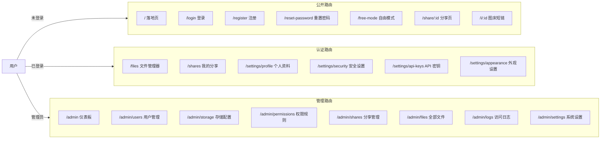

<div align="center">


# Picumet 前端指南

**多云对象存储管理平台**

[English](UI.md) | 中文

</div>

Picumet 的前端是一个 React 单页应用，负责文件管理器、分享页、用户设置和管理后台。这份文档说明页面的组织结构、响应式布局、主题、无障碍与交互方式。

## 开始之前

- 已安装 Node.js 22 或更高版本，并可用 [bun](https://bun.sh/) 1.3 或更高版本。
- 后端已在本机运行。环境搭建见 [开发指南](DEVELOPMENT_CN.md)。
- 对 React、TypeScript、Tailwind CSS 有基本了解。

启动开发服务器：

1. 进入 `frontend/` 目录。
2. 执行 `bun install` 安装依赖。
3. 执行 `bun run dev` 启动 Vite。

终端会打印本地地址，通常是 `http://localhost:5173`。

## 总览

前端代码位于 `frontend/` 目录，通过 HTTP 请求 Workers API。技术选型如下：

- React 18，路由使用 `react-router-dom`。
- Vite 负责构建和热更新。
- TypeScript 提供类型检查，共享类型来自 `shared/types.ts`。
- Tailwind CSS 负责样式。
- i18next 支持中文和英文。
- TanStack Query 管理服务端状态、缓存和变更。

所有页面都通过 `React.lazy` 和 `Suspense` 按路由懒加载，首屏包体积保持较小。

## 页面路由

`frontend/src/App.tsx` 定义了全部路由，如下表。未登录用户访问受保护页面时，会先跳到 `/login` 并带上 `redirect` 参数，登录成功后回到原页面。管理路由校验当前用户角色，非 `admin` 角色会看到权限提示。



### 页面清单

| 页面 | 路径 | 访问 | 组件 |
|---|---|---|---|
| 落地页 | `/` | 公开 | `Landing` |
| 登录 | `/login` | 公开 | `Login` |
| 注册 | `/register` | 公开 | `Register` |
| 重置密码 | `/reset-password` | 公开 | `ResetPassword` |
| 自由模式 | `/free-mode` | 公开 | `FreeMode` |
| 分享页 | `/share/:id` `/i/:id` | 公开 | `SharePage` |
| 文件管理器 | `/files` `/files/*` | 登录 | `Files` |
| 我的分享 | `/shares` | 登录 | `MyShares` |
| 设置布局 | `/settings/*` | 登录 | `SettingsLayout` |
| 个人资料 | `/settings/profile` | 登录 | `Profile` |
| 安全设置 | `/settings/security` | 登录 | `Security` |
| API 密钥 | `/settings/api-keys` | 登录 | `ApiKeys` |
| 外观设置 | `/settings/appearance` | 登录 | `Appearance` |
| 管理后台布局 | `/admin` | 管理员 | `AdminLayout` |
| 仪表板 | `/admin` | 管理员 | `Dashboard` |
| 用户管理 | `/admin/users` | 管理员 | `Users` |
| 存储配置 | `/admin/storage` | 管理员 | `Storage` |
| 挂载点 | `/admin/mounts` | 管理员 | 跳转到 `/admin/storage?tab=mounts` |
| 权限规则 | `/admin/permissions` | 管理员 | `Permissions` |
| 分享管理 | `/admin/shares` | 管理员 | `Shares` |
| 全部文件 | `/admin/files` | 管理员 | `Files` |
| 访问日志 | `/admin/logs` | 管理员 | `Logs` |
| 系统设置 | `/admin/settings` | 管理员 | `Settings` |

## 布局

### 应用外壳

`AppShell` 组件包裹登录后的页面，提供统一的页面骨架：

- 顶部栏固定在最上方，包含 Logo、站点标题、主导航，右侧依次是主题切换、语言切换和用户菜单。
- 顶部栏下方是公告横幅。
- 内容区居中，最大宽度 `1400px`。

```text
┌─────────────────────────────────────────────────────────────┐
│ [☰] [Logo] [文件] [分享] [设置] [管理]  [◐] [中] [@]       │
├─────────────────────────────────────────────────────────────┤
│   公告横幅                                                   │
├─────────────────────────────────────────────────────────────┤
│                                                             │
│                    主内容区                                  │
│                                                             │
└─────────────────────────────────────────────────────────────┘
```

屏幕宽度小于 `768px` 时，顶部栏隐藏导航，只留汉堡按钮，点击后从左侧滑出 `Drawer` 菜单，里面是同样的链接。

### 文件管理器工作区

文件管理器（`/files`）分三个区域：

```text
┌──────────────────────────────────────────────────────────────┐
│ 面包屑                          [↑ 上传] [+ 新建] [☑] [▦]   │
│ [搜索] [排序 ▾] [方向]                                       │
├────────────┬──────────────────────────────────────┬──────────┤
│            │  文件卡片 / 文件列表                  │          │
│  侧边栏    │  ┌────┐ ┌────┐ ┌────┐ ┌────┐        │ 属性面板 │
│  文件夹    │  │ ▤  │ │ ▤  │ │ 🖼 │ │ 📄 │        │          │
│  类型      │  └────┘ └────┘ └────┘ └────┘        │          │
│  收藏      │                                        │          │
│            │  [批量操作栏 · 底部悬浮]              │          │
└────────────┴──────────────────────────────────────┴──────────┘
```

- **面包屑**：显示当前文件夹路径，点任意一段可跳转。
- **工具栏**：包含 **上传**、**新建文件夹**、**选择** 与批量选择，以及卡片/列表视图切换。
- **搜索与排序**：按名称过滤，可按名称、时间、大小排序，支持升序/降序。
- **内容区**：渲染响应式卡片网格或列表行。
- **属性面板**：选中文件或从菜单选择 **属性** 后，面板出现在右侧。
- **批量操作栏**：只要选中了任意文件，就会悬浮在视口底部。

### 分享页面

**公开分享页**：`/share/:id` 展示单个分享内容，`/i/:id` 是图床短链。带密码的分享先显示密码门，验证通过后才加载内容。验证后页面显示标题、分享者、大小、过期时间和浏览徽章，以及下载、复制链接、二维码操作。二维码用 `qrcode` 库在前端本地生成。图床短链直接渲染图片，不带分享卡片。

**分享列表**：`/shares` 展示你创建的分享链接。视图切换可以在响应式卡片网格和列表行之间切换。每张卡片显示文件图标、标题、状态徽章、大小、过期时间、查看次数和下载次数，并提供二维码、打开、复制链接、撤销等快捷操作。列表带分页，每页条数可调，默认 20。

### 设置与管理页面

设置布局（`/settings/*`）左侧是纵向导航，包含个人资料、安全设置、API 密钥、外观设置。管理后台（`/admin`）是两栏结构，左侧纵向导航、右侧内容区，手机上导航堆在内容上方。管理页面包括带统计卡片的仪表板、用户管理、存储配置、权限规则、分享管理、全部文件、访问日志和系统设置。

### 公开页面

登录（`/login`）、注册（`/register`）、重置密码（`/reset-password`）共用居中的卡片布局。注册需要用户名、密码、邮箱和可选的邀请码，站点开启后还要通过 Cloudflare Turnstile。登录成功后，应用跳转到 `redirect` 指向的页面，没有时就进入 `/files`。自由模式页（`/free-mode`）允许访客用临时凭据连接自己的 R2、S3 或 Oracle 存储桶，凭据只在服务器内存里保存一个会话。

### 顶栏组件

| 组件 | 位置 | 作用 |
|---|---|---|
| `Logo` | 左上 | 品牌标识，使用站点设置里的 Logo 和标题。 |
| `ThemeToggle` | 右上 | 在浅色、深色、跟随系统之间切换。 |
| `LanguageSwitcher` | 右上 | 切换中文和英文。 |
| `UserMenu` | 右上 | 显示显示名，提供设置和退出登录入口。 |
| `AnnouncementBanner` | 顶栏下方 | 展示管理员发布的站点公告。 |

## 响应式设计

界面分三个宽度区间：

| 断点 | 宽度 | 布局表现 |
|---|---|---|
| 手机 | 小于 `640px` | 导航收进抽屉，卡片 2 列，属性面板变为右侧抽屉。 |
| 平板 | `768px`–`1024px` | 导航留在顶栏，卡片 3–4 列。 |
| 桌面 | `1024px` 及以上 | 卡片 5 列，属性面板固定在右侧。 |

设计要点：

- **侧边栏转抽屉**：平板和桌面的主导航在顶栏，手机上改用汉堡按钮打开左侧抽屉。
- **属性面板**：`sm` 及以上宽度时，属性面板是右侧固定列，滚动时一直可见。手机上它放进右侧 `Drawer`。用 `matchMedia('(max-width: 639px)')` 生成 `isMobile` 门控，只让抽屉在真手机上打开，桌面隐藏列不会锁住页面滚动。
- **卡片网格**：使用 `grid-cols-2 sm:grid-cols-3 md:grid-cols-4 lg:grid-cols-5`，列数随视口增大。
- **批量操作栏**：在 `350px` 到 `1080px` 的宽度范围内扫描验证过，始终可见，不会与内容重叠，也不会产生横向滚动。窄屏只显示图标，`1024px` 起补上文字标签。
- **表格和徽章**：次要表格列在 `sm` 以下隐藏（`hidden sm:block`）。徽章用 `whitespace-nowrap`，权限规则卡片整组换行，窄屏不会错位。

## 主题

主题 store 位于 `frontend/src/stores/theme.ts`，外观设置写入 `localStorage`，并同步成 `document.documentElement` 上的 CSS 变量。

### 主题模式

用户可以选择 **浅色**、**深色** 或 **跟随系统**。跟随系统时，应用读取 `prefers-color-scheme`，并响应系统实时切换。深色模式在根元素上加 `dark` 类。

### 强调色

用户从预设或取色器里选强调色。应用把十六进制值转成 HSL 三元组，写到 `--primary` 和 `--ring` 变量，Tailwind 以 `hsl(var(--primary))` 消费。再用 YIQ 公式算出前景色，浅色或深色强调色下文字和图标都保持可读。

### 模糊与背景

- **模糊**：**启用模糊** 开关控制 `--enable-blur`，弹窗、下拉菜单和顶栏据此决定是否加 `backdrop-filter`。
- **背景图片**：用户可以上传不超过 `2MB` 的图片（JPG、PNG、WebP），也可以不设置背景。图片以 base64 存在 `localStorage`。纯色背景选项已经移除。

### 文件图标与文件夹显示

| 设置 | 选项 | 效果 |
|---|---|---|
| 文件图标风格 | `iconify` 或 `emoji` | 切换 Iconify 图标和 emoji 两种渲染。 |
| 文件夹显示 | `icon` 或 `contents` | 显示普通文件夹图标，或前 4 项的 2×2 预览网格。 |
| 自定义 emoji | 按文件设置 | 属性面板里给单个文件设置的 emoji 会覆盖默认图标。 |

## 无障碍

界面遵循常规 Web 无障碍实践：

- **语义结构**：页面使用 `header`、`nav`、`main`、`footer` 等地标，表单使用 `<label>`、`<input>`、`<button>`。
- **标签**：每个输入项都有可见标签；纯图标按钮带 `aria-label`，例如视图切换和汉堡菜单。
- **焦点**：可交互元素有可见的焦点环，Tab 顺序与 DOM 顺序一致。
- **对比度**：正文对比度满足 WCAG 要求，YIQ 算法算出的强调色前景保证交互文字可读。
- **替代文本**：有意义的图片带描述性 `alt`，Logo 和装饰性图形用 `alt=""` 或合适的 aria 标签。
- **动效克制**：界面动画短且轻，批量操作栏只有一个小幅滑入动画。

## 交互

### 选择文件

单击卡片或行选中一个文件。按住 **Ctrl**/**Cmd** 或 **Shift** 再点，可以扩展选择范围。工具栏的 **选择** 按钮进入多选模式，菜单里提供 **全选**、**反选**、**清空选择**。多选模式或悬停时，每个卡片都会显示复选框。

### 打开文件

双击项目打开：

- 文件夹进入其内部。
- 图片、视频、音频、代码在预览弹窗里打开。
- 其他文件直接下载。

### 预览文件

预览弹窗按类型处理内容：

- **图片**：支持 `50%`–`300%` 缩放、`90°` 旋转，可下载原图。控件固定在底部，放大后不会被图片盖住。
- **视频和音频**：使用原生播放器，支持播放、拖动进度、音量、全屏。
- **代码**：用 highlight.js 高亮。应用先对源码做 HTML 转义再高亮，不会渲染原始 HTML 或 Markdown。
- **密码保护的文件**：弹窗先要求输入密码，再加载内容。

### 右键菜单与悬停操作

右键点击文件，会先选中它，再打开属性面板。悬停卡片或行时，左上角出现复选框，右上角出现三点菜单。菜单提供打开、下载、复制链接、分享、重命名、移动、设置密码、属性、删除。

### 上传文件

上传弹窗从工具栏或空状态打开。可以把文件拖进拖拽区，或用文件选择器选择。弹窗显示目标文件夹，每个文件带进度条排队上传。上传走会话式流程，最多同时 3 个：先请求上传会话，再用预签名地址直传或走 Worker 代理，最后完成会话。失败的任务显示错误和重试按钮。

### 拖拽

把文件拖到上传弹窗的拖拽区，可以加入上传队列。文件夹之间也可以拖拽移动，验证记录见进度文档。

### 复制链接

复制链接区分单个文件和批量选择：

- **单个文件**：复制非媒体文件时直接复制直链。复制图片或视频会打开复制链接弹窗。
- **批量**：批量操作栏可以一次复制所有选中文件；如果选择里含图片或视频，应用会打开复制链接弹窗。
- **弹窗**：顶部显示所选文件的 chips，下面是 **直链**、**HTML 代码**、**Markdown 代码** 三种格式的单选，外加 **签名链接** 开关。签名链接一小时后过期。应用把生成的链接用换行拼起来写入剪贴板。

### 文件夹内部预览

文件夹显示设为 `contents` 时，文件夹卡片显示 2×2 的预览网格，取当前排序下的前 4 项。文件夹和普通文件显示图标，图片显示缩略图，视频显示 canvas 抽帧的画面。空文件夹回退到文件夹图标。

### 视频缩略图

视频卡片在浏览器里直接生成缩略图。隐藏的 `<video>` 元素跳到约 `20%` 处，把当前帧画到 `<canvas>`，导出成 JPEG data URL。解码或跨域失败时，回退到文件图标。

### 图片自动预览

图片卡片会拉取预览地址，在卡片里直接渲染图片。地址按文件缓存，加载失败的地址也会记下来，同一个坏地址不会反复请求。

### 批量操作

只要选中一项或多项，底部就会出现批量操作栏。操作包括下载、分享（仅单选）、复制链接、移动、重命名（仅单选）、删除、属性（仅单选），另有 **取消选择** 按钮。

## 性能

- **路由懒加载**：每个页面都走 `React.lazy` 和 `Suspense`，浏览器只在路由打开时才下载对应页面代码。
- **服务端状态缓存**：TanStack Query 缓存文件列表和变更状态，避免重复请求。
- **图片地址缓存**：预览地址按文件只解析一次，后续复用内存里的映射。
- **客户端缩略图**：视频卡片用 canvas 在本地生成缩略图，不占用服务端带宽和存储。
- **懒加载图片**：文件夹预览的缩略图带 `loading="lazy"`。

## 检查清单

改动 UI 时逐项核对：

- [ ] 每个可交互元素都有可见的焦点指示。
- [ ] 纯图标按钮都有 `aria-label`。
- [ ] 有意义的图片带描述性 `alt`，装饰图片用 `alt=""`。
- [ ] 表单每个字段都有标签，输入类型正确。
- [ ] 布局在 `640px`、`768px`、`1024px` 三个断点正常重排，无横向滚动。
- [ ] 只靠悬停的交互，用键盘和触屏也能完成。
- [ ] 批量操作栏在 `350px`–`1080px` 范围内始终可见。
- [ ] 新页面通过路由懒加载。
- [ ] 主题设置写入 `localStorage`，并尊重系统偏好。

## 下一步

- [系统架构](ARCHITECTURE_CN.md)：后端服务与共享类型。
- [API 参考](API_CN.md)：界面调用的 HTTP 接口。
- [开发指南](DEVELOPMENT_CN.md)：本地环境、测试与规范。
- [部署指南](DEPLOYMENT_CN.md)：发布到 Cloudflare。
- [进度报告](PROGRESS.md)：实现状态与路线图。
- [项目概览](../README_CN.md)
